# GVA 项目社区平台管理系统开发


## 01、项目说明

我们要开发社区项目。这个项目分两期，

第一期：社区后台admin的开发

第二期：社区web端的开发

web网站的后台，用于管理整个站点的数据控制。所以必须要开发一个后台出来。为什么？不可能开发一个平台总是用假数据，肯定需要有一个后台去添加和维护这些数据，或者统计你平台和系统的运营信息。


## 02、后台技术架构选择

- 单体架构
  - gin/template/mysql/redis + vue/jquery
- 前后后端分离架构
  - 后端 gin/gorm/mysql  + redis
  - 后端：beego/inris 
  - 前端：vue2/vue3
  - 面临的问题：自研还是使用第三方。

90%中小型企业都选择第三方开源项目来进行迭代和开发业务，这些项目中比如：go 比较典型，在java中若依。这些系统有有好处就它已经把一些基本的项目架构和技术功能已经确定好了。组织解构也已经搭建好了。并且一些基本功能模块也已经开发完毕了,比如：

- 登录
- 管理员添加
- 权限模块
- 权限拦截
- 动态路由
- 缓存配置
- 自动构建
- 等等都已经完毕了

未来你只需要在这个基础进行你业务迭代和开发即可。可以节约你很多的开发时候和成本。


## 为什么选择GVA

官网：https://www.gin-vue-admin.com/guide/introduce/project.html

GIN-VUE-ADMIN：是一款基于GIN+VUE+ElementUI开发的全栈基础开发平台。GIN-VUE-ADMIN是一个基于vue和gin开发的全栈前后端分离的开发基础平台，拥有jwt鉴权，动态路由，动态菜单，casbin鉴权，表单生成器，代码生成器等功能，提供了多种示例文件，让大家把更多时间专注在业务开发上。

- Gin文档：https://gin-gonic.com/zh-cn/docs/

- gorm数据操作：https://gorm.io/
- 数据：myql >=5.7+ mysql8+ 
- Vue3 文档：https://cn.vuejs.org/
- Vue-router: https://router.vuejs.org/zh/guide/essentials/nested-routes.html
- Pinia: https://pinia.vuejs.org/zh/
- ElementUI文档：https://element-plus.gitee.io
- Redis 缓存：https://redis.io/
- Git版本控制: https://git-scm.com/


## GVA现有开发的模块

- 插件中心 NEW :基于 Gva自己的一套设计风格，独创 go的插件中心，现已支持 ：微信支付、登录等，K8s相关操作 ，第三方登录 等等插件
- 权限管理：基于jwt和casbin实现的权限管理
- 文件上传下载：实现基于七牛云的文件上传操作（为了方便大家测试，我公开了自己的七牛测试号的各种重要token，恳请大家不要乱传东西）
- 用户管理：系统管理员分配用户角色和角色权限。
- 角色管理：创建权限控制的主要对象，可以给角色分配不同api权限和菜单权限。
- 菜单管理：实现用户动态菜单配置，实现不同角色不同菜单。
- api管理：不同用户可调用的api接口的权限不同。
- 配置管理：配置文件可前台修改（测试环境不开放此功能）。
- 富文本编辑器：MarkDown编辑器功能嵌入。
- 条件搜索：增加条件搜索示例。
- restful示例：可以参考用户管理模块中的示例API。


## 那我们开发者要做什么呢？

- 提供运行环境
- 安装和下载gva
- 运行gva
- 开发研究gva开发流程和步骤
- 添加用户
- 添加管理员
- 添加角色
- 给角色授权
- 添加菜单
- 分配路由
- 定义业务
- 开始添加你真正意义的模块，比如：社区问答，课程，数据管理等等开始放入gva项目中。
- ==自动构建（通过数据库表自动生成对应的模块）==


## 我们可以从框架中学习到什么知识呢？ 

- 登录流程+验证码
- JWT接口的安全性
- 权限的开发
- 权限控制（vue指令）
- 国际化处理
- 路由管理（动态路由）
- 学会elementplus调用
- 尝试学会自定定义组件
- gin的路由管理（路由组）
- gin的中间的处理(权限拦截和token拦截)
- redis的处理
- 配置yaml或properties解析
- 日志的保存和zap
- 统计和分析
- 发布和部署项目


## GVA的准备工作

- **go环境的安装**
  - 版本：1.19.2
- **先安装mysql8.x**  
  - https://dev.mysql.com/downloads/mysql/
  - 如果不明白查看官网关于MYSQL是的课程：https://www.kuangstudy.com/course/cplay/1498123423423423461
- **MYSQL 数据库的图形化界面工具**
  - navicat161_premium_cs_x64.exe
  - syslog
- **Redis的安装**
  - Linux版本：https://github.com/redis/redis/archive/7.0.11.tar.gz
  - Windows版本：Redis-x64-5.0.14.1.msi
    - windiow版本的下载：https://github.com/tporadowski/redis/tags
- **redis的桌面应用程序：**
  - redis-desktop-manager-0.8.8.384
- **nodejs的安装**
  - https://nodejs.org/download/release/latest-v16.x/
- **git安装**
  - https://git-scm.com/
  - 如果没有任何基础可以查看平台关于git的课程：https://www.kuangstudy.com/course/cplay/1498123423423423457
  - 或者安装图形化界面工具：TortoiseGit-2.13.0.1-64bit.msi


## 数据库的仓库创建

使用navicat工具把数据库创建好：ksd_social_db


# GVA项目代码下载和安装—-后端server

- GitHub地址:

  ```sh
  git clone https://github.com/flipped-aurora/gin-vue-admin
  ```

  或者使用小乌龟git clone都可以或者使用zip下载也ok.

  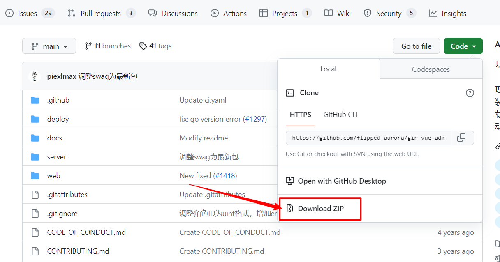

  使用工具golang下载：

  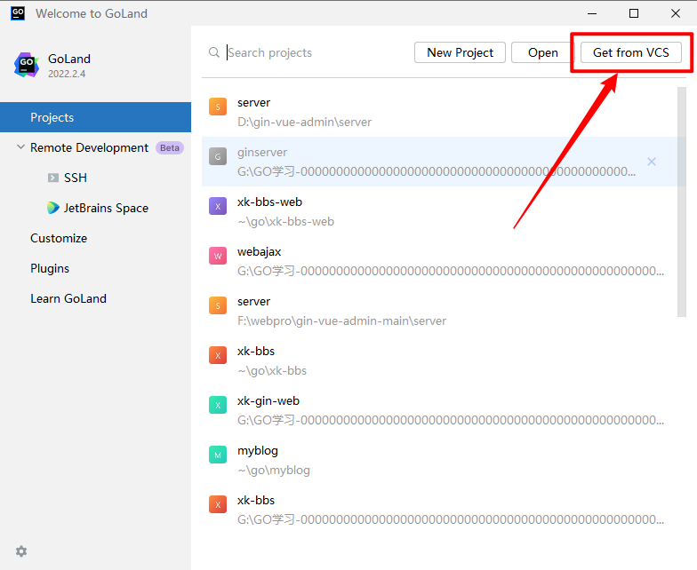

  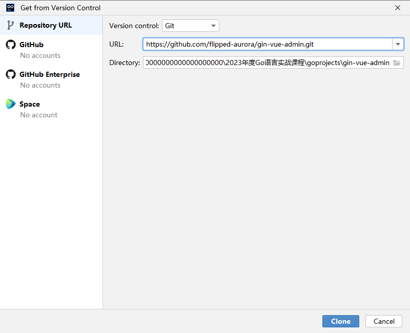

- 在线测试地址:http://demo.gin-vue-admin.com/

- 用户名：admin

- 密码：123456

### 步骤1：解压gin-vue-admin-main.zip

### 步骤2：Goland打开server文件夹

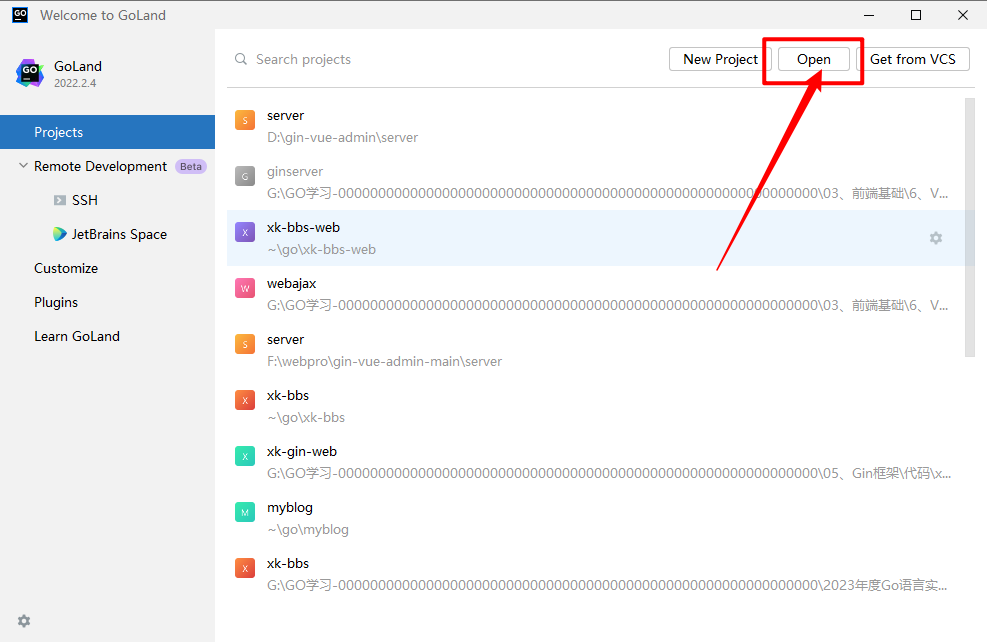

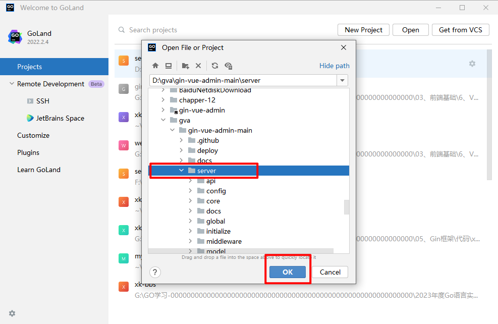

开始配置go模块的代理。

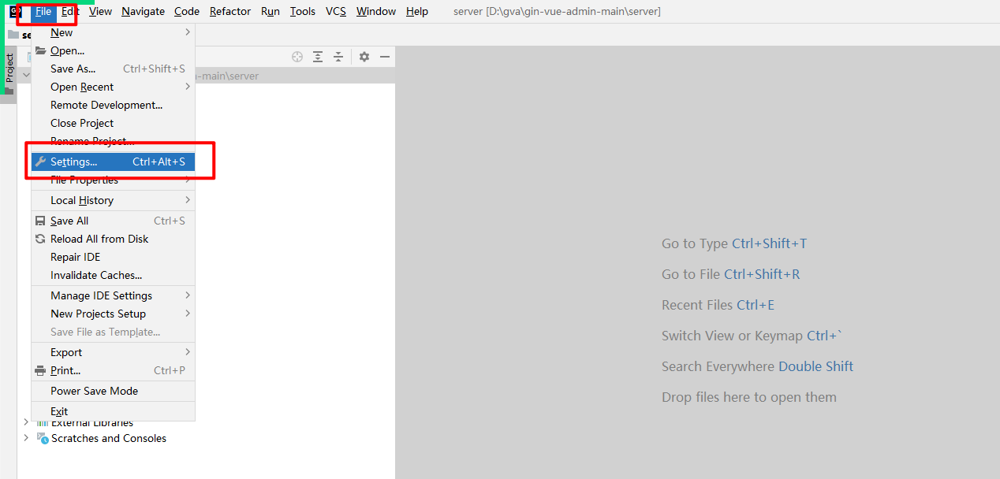

代理配置成：GOPROXY=https://goproxy.io,direct

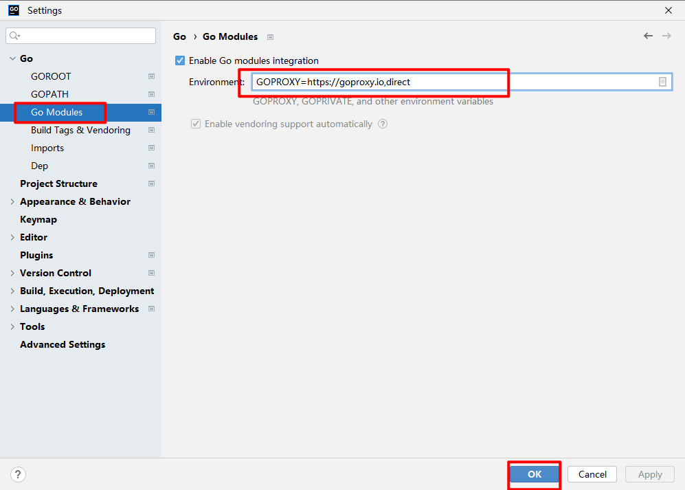


### 步骤3：启动server项目

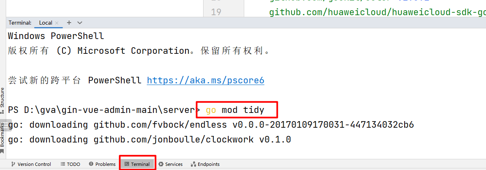

```sh
go mod tidy
```

把go的模块，清理一下，看看还有哪些没有下载或者没有同步。就全部进行重新下载和同步一次。

然后开始启动项目，找到项目下的main.go文件开始运行和启动即可：

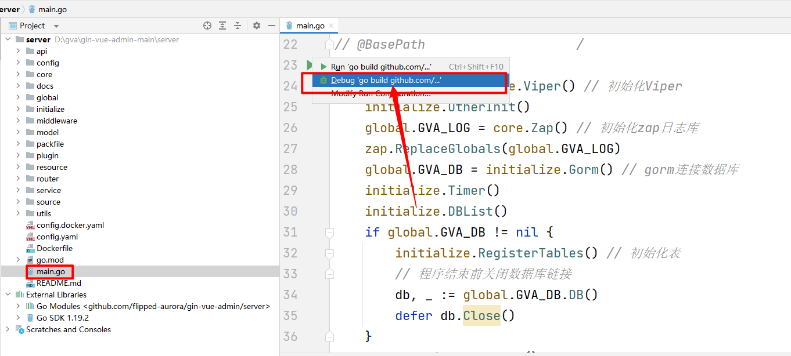

在main.go得代码可以看到，如果你第一次运行和安装go可以尝试执行如下得命令：

```go
go:generate go env -w GO111MODULE=on
go:generate go env -w GOPROXY=https://goproxy.cn,direct
go:generate go mod tidy
go:generate go mod download
```


# GVA项目代码下载和安装—-前端web

##  安装nodejs

[Node.js (nodejs.org)](https://nodejs.org/zh-cn/)

## 使用 `vscode` 打开 `web` 项目

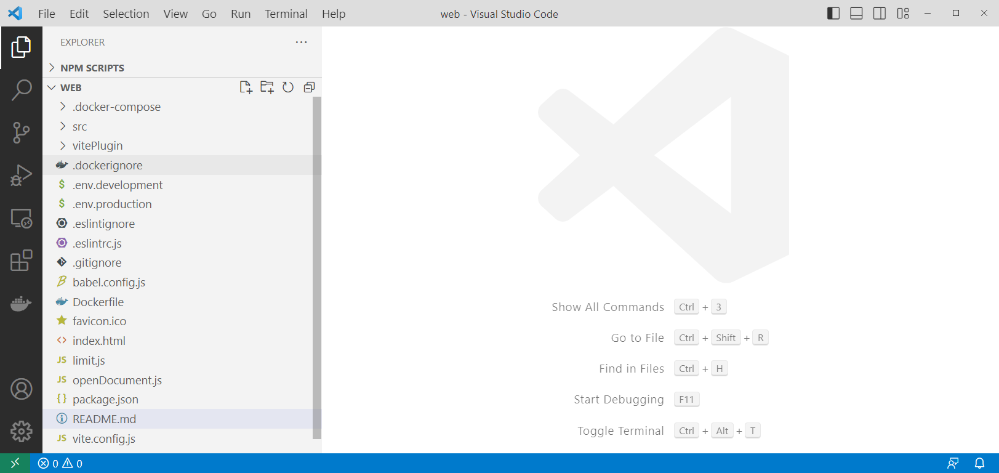

## 使用pnpm来下载和管理

先在全局安全pnpm。如下：

```
npm install -g pnpm
```

然后在项目web命令下执行：

```sh
pnpm install
```

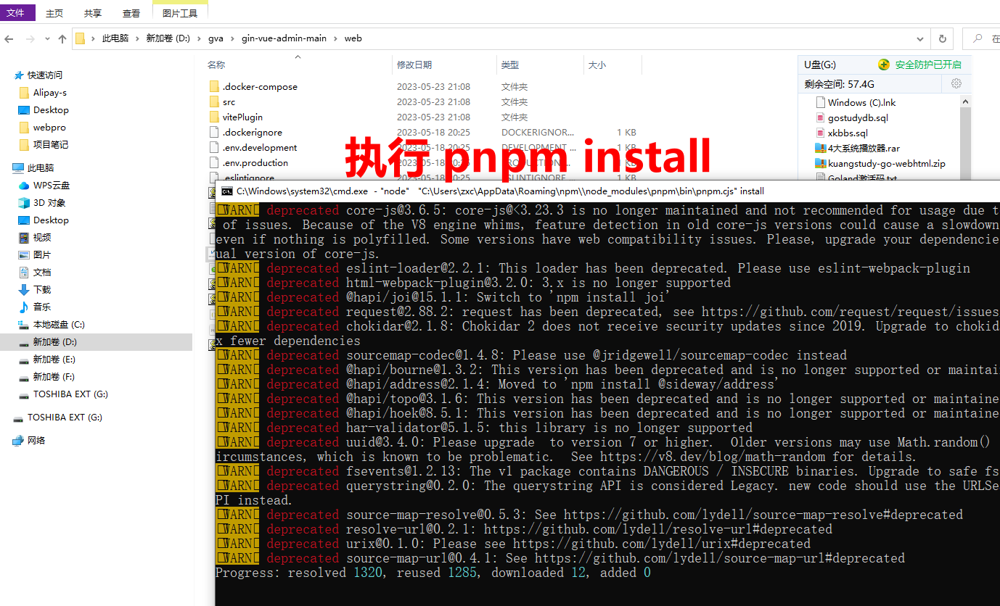

## 使用pnpm或者npm来启动

```sh
npm run serve
pnpm run serve
```

不要纠结pnpm启动失败得问题，失败了就直接使用`npm run serve`来启动即可。


# GVA开始安装数据库和脚本

- 保证ginserver是启动状态
- web也是正确启动状态
- 然后访问： http://localhost:8080

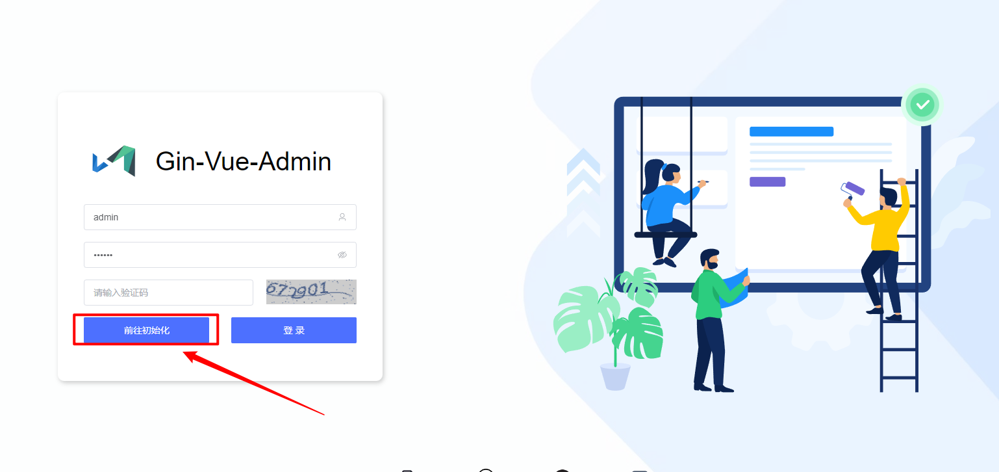

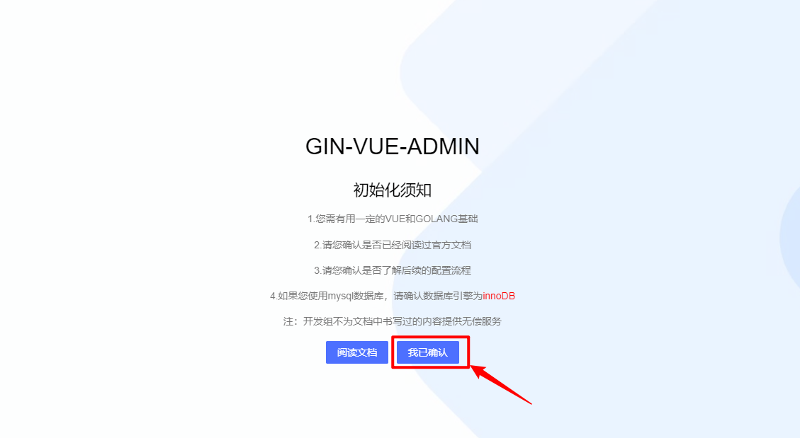

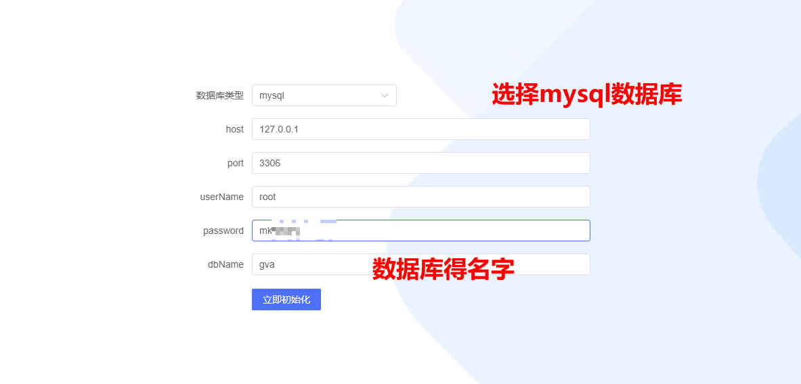

这里点击立即初始化，会把对应得数据库gva创建好，并且把对应得数据库表也会创建好。同时也会把项目中得 `config.yaml`文件中关于mysql得配置也会自动配置好。如下：

```yaml
mysql:
  path: 127.0.0.1
  port: "3306"
  config: charset=utf8mb4&parseTime=True&loc=Local
  db-name: ksd-social-db
  username: root
  password: mkxiaoer
  prefix: ""
  singular: false
  engine: ""
  max-idle-conns: 10
  max-open-conns: 100
  log-mode: error
  log-zap: false
```

然后把go server服务重启即可。然后开始体验gva吧！！

然后输入：http://localhost:8080，然后输入账号和密码如下：

- 用户名：admin
- 密码：123456

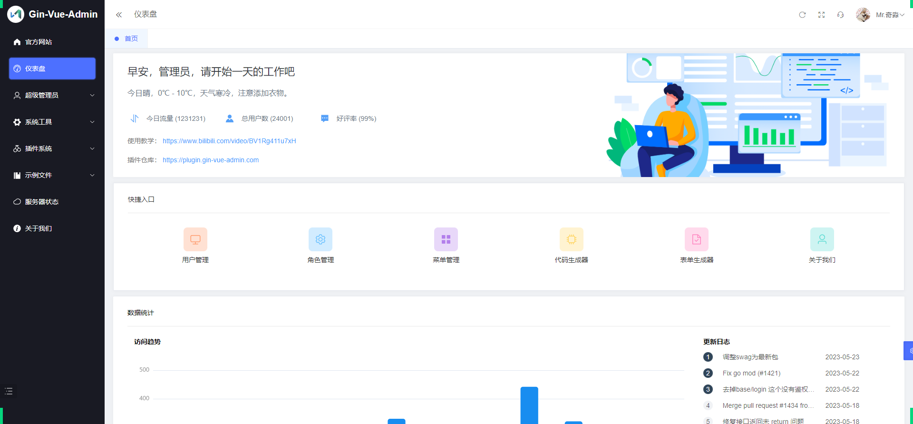

恭喜安装完毕


