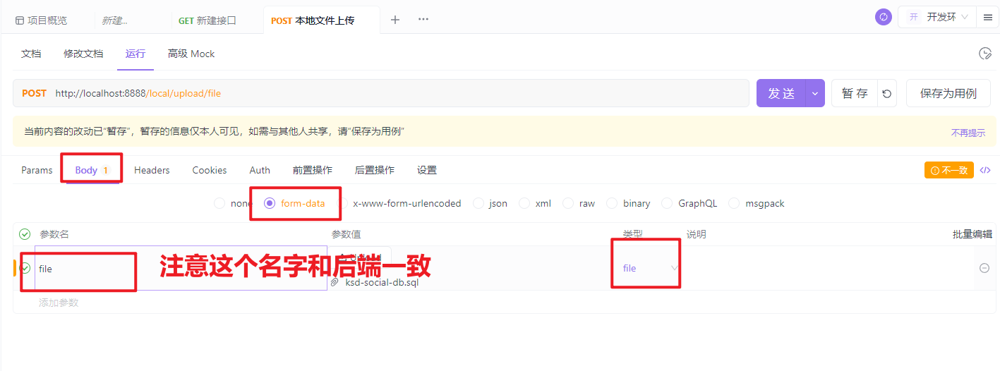

# 01、GVA关于菜单不加载的问题

就是因为**动画不允许出现平级标签**的原因，解决方案：

1：要么把动画transition删除掉

```vue
<!-- 此路由可作为父类路由通用路由页面使用 如需自定义父类路由页面 请参考 @/view/superAdmin/index.vue -->
<template>
    <div>
      <router-view v-slot="{ Component }">
          <keep-alive :include="routerStore.keepAliveRouters">
            <component :is="Component" />
          </keep-alive>
      </router-view>
    </div>
  </template>
  
  <script>
  export default {
    name: 'RouterHolder'
  }
  </script>
  
  <script setup>
  import { useRouterStore } from '@/pinia/modules/router'
  const routerStore = useRouterStore()
  </script>
  
```

2:  使用大的标签包裹起来

```vue
<template>
    <div>
        <el-table :data="pageInfo.resultList" style="width: 100%">
            <el-table-column label="ID" prop="id" align="center" width="80"></el-table-column>
            <el-table-column label="分类名称" prop="title" align="center"></el-table-column>
            <el-table-column label="状态" width="100">
                <template #default="scope">
                <span v-if="scope.row.status == 1" style="color:green">已发布</span>
                <span v-if="scope.row.status == 0" style="color:red">未发布</span>
                </template>
            </el-table-column>
            <el-table-column label="排序">
                <template #default="scope">
                <el-input v-model="scope.row.sorted"></el-input>
                </template>
            </el-table-column>
            <el-table-column label="操作">
                <template #default="scope">
                <el-button size="small" @click="handleEdit(scope.$index, scope.row)">编辑</el-button>
                <el-button size="small" type="danger" @click="handleDelete(scope.$index, scope.row)">删除</el-button>
                </template>
            </el-table-column>
            </el-table>
            <div class="pagination" style="display:flex;justify-content: center;">
                <el-pagination :current-page="pageInfo.page" :page-size="pageInfo.pageSize" :page-sizes="[10, 20, 30, 50, 80, 100]"
                    layout="total, sizes, prev, pager, next, jumper" :total="pageInfo.total"
                    @size-change="handleSizeChange" @current-change="handleCurrentChange" />
            </div>
    </div>
  </template>
  
  <script setup>
  import { loadData } from '@/api/bbs.js'
  import { onMounted, reactive } from 'vue';
  
  // 1: 设置请求分页的参数
  const pageInfo = reactive({
    page: 1,
    pageSize: 10,
    total: 0,
    resultList: [],
    keyword: ""
  })
  
  // 2: 数据加载
  const handleLoadData = () => {
    loadData(pageInfo).then(res => {
      pageInfo.total = res.data.total;
      pageInfo.resultList = res.data.list;
    })
  }
  
  // 点击分页改变
  const handleCurrentChange = (pageNum) => {
    pageInfo.page = pageNum;
    handleLoadData();
  }
  
  // 点击每页显示多少条改变
  const handleSizeChange = (pageSize) => {
    pageInfo.pageSize = pageSize;
    handleLoadData();
  }
  
  // 3: 生命周期初始化数据加载
  onMounted(() => {
    handleLoadData();
  })
  </script>
```

# 02、关于添加子菜单，编辑菜单提示ID不存在的问题

gva所有的mode继承了global.GVA_MODEL ，这里定义的id是大写的。如下：

```go
package global

import (
	"time"

	"gorm.io/gorm"
)

type GVA_MODEL struct {
	ID        uint           `gorm:"primarykey;comment:主键ID"` // 主键ID
	CreatedAt time.Time      `gorm:"type:datetime(0);comment:创建时间" json:"createdAt"`
	UpdatedAt time.Time      `gorm:"type:datetime(0);comment:更新时间" json:"updatedAt"`
	DeletedAt gorm.DeletedAt `gorm:"index;comment:删除时间" json:"-"` // 删除时间
}

```

这里ID不要轻易的覆盖和重写form标签，因为gva已经开发的模块都使用大写ID作为参数，所以你不能够去更改gvamodel中任何配置，否则就会提示报错。

未来如果你自己二次开发的逻辑，如果不想使用他的规则，并且你就是希望你的id是小写，怎么处理

- 新建一个newmodel来继承

  ```go
  package global
  
  import (
  	"time"
  
  	"gorm.io/gorm"
  )
  
  type GVA_NEWMODEL struct {
  	ID        uint           `gorm:"primarykey;comment:主键ID" json:"id" form:"id"`
  	CreatedAt time.Time      `gorm:"type:datetime(0);comment:创建时间" json:"createdAt"`
  	UpdatedAt time.Time      `gorm:"type:datetime(0);comment:更新时间" json:"updatedAt"`
  	DeletedAt gorm.DeletedAt `gorm:"index;comment:删除时间" json:"-"` // 删除时间
  }
  
  ```

  ```go
  package bbs
  
  import "github.com/flipped-aurora/gin-vue-admin/server/global"
  
  type BbsCategory struct {
  	global.GVA_NEWMODEL
  	Title       string `gorm:"size:100;not null;default:'';comment:分类名称" json:"title"`
  	Description string `gorm:"size:400;not null;default:'';comment:描述" json:"description"`
  	Parent_id   uint   `gorm:"not null;default:0;comment:父ID" json:"parentId"`
  	Sorted      int8   `gorm:"not null;default:1;comment:排序" json:"sorted"`
  	Status      int8   `gorm:"size:1;not null;default:1;comment:0 未发布 1 发布" json:"status"`
  	IsDelete    int8   `gorm:"size:1;not null;default:0;comment:0 未删除 1 删除" json:"isDelete"`
  }
  
  func (BbsCategory) TableName() string {
  	return "xk_bbs_category"
  }
  
  ```

- 不要继承

  ```go
  package bbs
  
  import "github.com/flipped-aurora/gin-vue-admin/server/global"
  
  type BbsCategory struct {
  	ID        uint           `gorm:"primarykey;comment:主键ID" json:"id" form:"id"`
  	CreatedAt time.Time      `gorm:"type:datetime(0);comment:创建时间" json:"createdAt"`
  	UpdatedAt time.Time      `gorm:"type:datetime(0);comment:更新时间" json:"updatedAt"`
  	DeletedAt gorm.DeletedAt `gorm:"index;comment:删除时间" json:"-"` // 删除时间
  	Title       string `gorm:"size:100;not null;default:'';comment:分类名称" json:"title"`
  	Description string `gorm:"size:400;not null;default:'';comment:描述" json:"description"`
  	Parent_id   uint   `gorm:"not null;default:0;comment:父ID" json:"parentId"`
  	Sorted      int8   `gorm:"not null;default:1;comment:排序" json:"sorted"`
  	Status      int8   `gorm:"size:1;not null;default:1;comment:0 未发布 1 发布" json:"status"`
  	IsDelete    int8   `gorm:"size:1;not null;default:0;comment:0 未删除 1 删除" json:"isDelete"`
  }
  
  func (BbsCategory) TableName() string {
  	return "xk_bbs_category"
  }
  
  ```

  


# 03、前端开发流程

- 定义接口

  ```js
  import service from '@/utils/request'
  
  // @Tags BbsCategoryApi
  // @Summary 
  // @Security ApiKeyAuth
  // @accept application/json
  // @Produce application/json
  // @Param data body bbs.BBSCategory true "/bbscategory/page"
  // @Success 200 {string} string "{"success":true,"data":{},"msg":"获取成功"}"
  // @Router /bbscategory/page [post]
  export const loadBbsCategoryData = (data) => {
    return service({
      url: '/bbscategory/page',
      method: 'post',
      data
    })
  }
  
  // 保存帖子分类
  export const saveBbsCategory = (data) => {
    return service({
      url: '/bbscategory/save',
      method: 'post',
      data
    })
  }
  
  // 根据id删除分类
  export const delBbsCategory = (id) => {
    return service({
      url: `/bbscategory/delete/${id}`,
      method: 'delete',
    })
  }
  
  // 编辑帖子分类
  export const updateBbsCategory = (data) => {
    return service({
      url: '/bbscategory/update',
      method: 'post',
      data
    })
  }
  ```

- 在指定模块导入接口

  ```js
  import { loadBbsCategoryData, saveBbsCategory, updateBbsCategory, delBbsCategory } from '@/api/bbs.js'
  ```

- 调用接口

  ```js
  // 交换关闭
  const handleDelete = async (index, row) => {
    const result = await ElMessageBox.confirm('你确定要抛弃我吗？', '提示', { confirmButtonText: '残忍删除', cancelButtonText: '容我想想', type: 'warning', })
    if (result === 'confirm') {
      const res = await delBbsCategory(row.id)
      console.log('res',res)
    }
  }
  
  ```

- 查看接口的返回数据

  

  ```
  ```

  


# 04、 如果你想查看一个模块中所有的东西

```js
import * as elplus from 'element-plus'
import * as vueobj from 'vue'
```

也可以得出一个结论

```js
import {} form 'module' 
```

内部的定义都是：export const xxx = {}|函数||js一切的数据类型

如果是

```js
import Ksd from 'module'
```

说明在这个modle中调用的是这个模块中的export default xxxx


# 05、你觉得开发项目最难的是什么？

- 1：清晰的目标 2~3个
- 2：做项目，准备简历（看面试题）


# Navicat 制造假数据的快捷方式

**制造一些模拟的假数据**

选中一条数据，注意主键不要复制，把剩下的列都ctrl c复制一下，再在最后一条数据按方向键的向下的键，再ctrl v，就把刚刚复制的一条数据给复制出来了（当然也是可以一次复制多条数据的，注意主键也是不要复制的）。

# 06、实现帖子列表

## 关于参数注入的问题

如果在开发中一旦发小参数没有按照既定的要求注入到结构体的话，这个时候就一定要看请求方式什么？如果是post请求、

前端—post—json{id:1,pageSize:10,page:1}———————————-

**后端参数注入方法：ShouldBindJSON** 

前提是 post 请求 + json 参数 (不支持 get 请求 + json 参数)

- post + json: 传递过来json参数，post请求的 

  - {page:1,pageSize:10,keyword:""}

- gin/beego —context—-c.Request.Body

  - [1,2,3,2,33,4,5,55,55,33]

- json库方法 json.NewDecoder(r)—-Decoder对象

  - 注入到后端的pageInfo

    ```go
    type PageInfo struct {
       Page     int    `json:"page" form:"page"`         // 页码
       PageSize int    `json:"pageSize" form:"pageSize"` // 每页大小
       Keyword  string `json:"keyword" form:"keyword"`   //关键字
    }
    ```

- Decoder.Decode(pageInfo)

  - 底层就是通过反射找到所有结构体的属性，通过属性找到json标签，查看名字是否和json key一致，如果一致就直接把value赋值给属性

- 结束。


**后端参数注入方法：ShouldBindQuery**

- ​    post + query  ?id=1&name=1

  ```js
  export const loadBbsData = (data) => {
    return service({
      url: `/bbs/page?page=${data.page}&pageSize=${data.pageSize}&keyword=${data.keyword}`,
      method: 'post'
    })
  }
  ```

- get + query ?id=1&name=1

  ```js
  export const loadBbsData = (data) => {
    return service({
      url: `/bbs/page?page=${data.page}&pageSize=${data.pageSize}&keyword=${data.keyword}`,
      method: 'get'
    })
  }
  ```

# 07、分类菜单的处理

## 01、场景

在后台管理系统中，会存在这种所谓的层级结构，一般：分类，评论、权限、菜单等都会存在这类的业务。就以分类和权限为例来进行分析和讲解。一般这种层级结构分为：

- 二级比较多

- 多级（无限极）

知识点：递归 + Tree组件或者表格Tree组件


## 02、如何设计分类表


如果我们要去有多级分类的情况，一般表的规则是什么？

- 家用家电（一级分类）
  - 电视 （二级分类）
    - 格力 （三级分类）
    - 美的 （三级分类）
  - 空调 （二级分类）
- 电脑办公（一级分类）
- 工业品 （一级分类）
- 机票 （一级分类）
  - 南方航空 （二级分类）

**如何去设计这个分类呢?**

**==如果未来你的分类表的分类能确认确实可以使用多表。如果不能确认不建议是多表，而是使用单表==。**


### 二级表的设计


### 三级结构


如果有四级，五级，。。。。。怎么办，难道一致不停的新建子表吗？显然是不合理的，我们应该思考的放在一个表中，如下：


### 什么不是所有的分类表都应该设计成这样，还有别的方式吗？

如果未来你的数据量非常的大。那么建议你把主的数据先拆分出来。然后子表中自己去形成父子结构

- 主表
- 子表

如果你数据量没没有影响你的体验和性能，那么就可以使用一张表。但是如果影响到了你可以考虑拆分。什么业务会用这种方式：网盘 — 

- 目录 & 文件

- 评论 & 回复（本身都是评论）

  现先加载评论，提供更多回复的按钮。用户如果需要点击更多回复，再异步加载出来即可，数据库的压力就少了。


## 分类管理查询的难点

- 递归
- 如何子的数据放在每个父元素的下面

**如何把数据变成如下结果：**

- 家用家电（一级分类）————————————1 
  - 电视 （二级分类）
    - 格力 （三级分类）
    - 美的 （三级分类）
  - 空调 （二级分类）
- 电脑办公（一级分类）————————————1
- 工业品 （一级分类）—————————————1
- 机票 （一级分类）——————————————1
  - 南方航空 （二级分类）


```sql
[
- 家用家电（一级分类）————————————{id:1,name:"家用家电",parentId:0,childrens:[
      - 电视 （二级分类）-----—{id:4,name:"电视",parentId:1,childrens:[]}
      - 空调 （二级分类）------—{id:5,name:"空调",parentId:1}
  ]    
}
 
- 电脑办公（一级分类）————————————1 {id:2,name:"电脑办公"}
- 工业品 （一级分类）—————————————1 {id:3,name:"工业品"}
  - 南方航空 （二级分类）
```


# 08、关于项目中的分类查询是否合理呢？

```sql

// 查询视频的分类信息
func (xkcategory *XkVideoCategoryService) FindCategories() (categories []video.XkVideoCategory, err error) {
	err = global.GVA_DB.Where("status = 1 and is_delete = 0 and parent_id = 0").Find(&categories).Error
	var nodes []video.XkVideoCategory
	if categories != nil && len(categories) > 0 {
		for _, category := range categories {
			childrens, _ := xkcategory.findCategoresChildren(category.ID)
			if childrens != nil {
				category.Children = childrens
			}
			nodes = append(nodes, category)
		}
	}
	return nodes, err
}

// 查询视频的分类信息
func (xkcategory *XkVideoCategoryService) findCategoresChildren(parentId uint) (categories []*video.XkVideoCategory, err error) {
	err = global.GVA_DB.Where("status = 1 and is_delete = 0 and parent_id = ?", parentId).Find(&categories).Error
	return categories, err
}

```

通过上面代码的遍历和和绑定关系，确实数据结构已经能满足的前端控件的要求。但是是否合理呢？答案是不合理。但是你不能说他不是一种解决方案，如果数据量不是特别大的情况下，可以考虑用上面的方案。但是如果数据量大可以考虑使用缓存redis进行处理。但是就算你就用缓存中间件也面临一个问题。循环在查询这个是不可取的。

**上面出现问题和优化点的地方就是在于：根据父id去查询子分类的遍历查询造成扥性能隐患。**

上面其实数据可能不大，可能就是个几千条数据，用遍历去查询确实没有必要，那么我们可以直接把表的数据全部查询出来。但是查询出来就面临着一个问题。你如何通过程序代码自己去组装他们的关系。这个很重要的


# 09、关于页面中状态的处理和管理如何完成


1：关于更新全列得问题

- save会存在更新全列得问题。

  ```
  1: 查询一次
  2：然后把需要进行更新覆盖
  3：然后在调用save方法
  ```

router

```go

```

service

```go

// 更新文字分类
func (cbbs *BbsCategoryService) UpdateBbsCategory(bbsCategory *bbs.BbsCategory) (err error) {
	err = global.GVA_DB.Model(bbsCategory).Save(bbsCategory).Error
	return err
}
```


2:  量身定制会更好

- 不依赖save方法，而是依赖update方法

```js
// 修改状态，后端 service 对应的方法
func (cbbs *BbsCategoryService) UpdateBbsCategoryStatus(bbsCategory *bbs.BbsCategory) (err error) {
	err = global.GVA_DB.Model(bbsCategory).Where("id=?", bbsCategory.ID).Update("status", bbsCategory.Status).Error
	return err
}

// 前端 vue 页面中对应的接口
const handleChangeStatus = async (row, field) => {
  var params = { id: row.id, field }
  if (field === "status") params.status = row.status
  if (field === "is_delete") params.status = row.isDelete
  await updateBbsCategory(params)
  // console.log(params) // 看一下上面的 params 结果是什么很重要的哦
  Ksd.success("状态修改成功!!!")
}
```

但是上面会存在一个问题，为啥在参数得定义过程，大型项目会定义一个req、后续还会定义一个vo。特别是写接口都必须是参数个数和返回个数。比如写查询接口：如果我们参数接受用model。返回也用model。没有错误，但是不合理为什么。因为你给接口得调用者造成困扰。

比如上面更新其实我们只需要更新status，其它得列是不需要更新。但是你暴露一个接口如下：

```go
global.GVA_NEWMODEL
Title       string `gorm:"size:100;not null;default:'';comment:分类名称" form:"title" json:"title"`
Description string `gorm:"size:400;not null;default:'';comment:描述" form:"description" json:"description"`
Parent_id   uint   `gorm:"not null;default:0;comment:父ID" form:"parentId" json:"parentId"`
Sorted      int    `gorm:"not null;default:1;comment:排序" form:"sorted" json:"sorted"`
Status      int8   `gorm:"size:1;not null;default:1;comment:0 未发布 1 发布" form:"status" json:"status"`
IsDelete    int8   `gorm:"size:1;not null;default:0;comment:0 未删除 1 删除" form:"isDelete
```

定义参数接收者

```go
package req

type BbsCategoryStatusReq struct {
	ID     uint `json:"id"`
    Status int8 `json:"status";comment:'1发布 0未发布'`
}

```

这样接口调用者就不会产生任何得歧义。


# 10、富文本编辑的集成–组件化


1： 安装

```js
pnpm install @wangeditor/editor
pnpm install @wangeditor/editor-for-vue@next --save
```

2: 模板

```vue
<template>
    <div style="border: 1px solid #ccc">
      <Toolbar
        style="border-bottom: 1px solid #ccc"
        :editor="editorRef"
        :defaultConfig="toolbarConfig"
        :mode="mode"
      />
      <Editor
        style="height: 500px; overflow-y: hidden;"
        v-model="valueHtml"
        :defaultConfig="editorConfig"
        :mode="mode"
        @onCreated="handleCreated"
      />
    </div>
</template>
```

3: js部分

```js
<script setup>
import '@wangeditor/editor/dist/css/style.css' // 引入 css
import { onBeforeUnmount, ref, shallowRef, onMounted } from 'vue'
import { Editor, Toolbar } from '@wangeditor/editor-for-vue'
// 编辑器实例，必须用 shallowRef
const editorRef = shallowRef()
// 内容 HTML
const valueHtml = ref('<p>hello</p>')

// 模拟 ajax 异步获取内容
onMounted(() => {
    setTimeout(() => {
        valueHtml.value = '<p>模拟 Ajax 异步设置内容</p>'
    }, 1500)
})

const toolbarConfig = {}
const editorConfig = { placeholder: '请输入内容...' }

const handleCreated = (editor) => {
  editorRef.value = editor // 记录 editor 实例，重要！
}

</script>    
```

完整代码

```vue
<template>
<div style="border: 1px solid #ccc">
    <Toolbar
        style="border-bottom: 1px solid #ccc"
        :editor="editorRef"
        :defaultConfig="toolbarConfig"
        :mode="mode"
    />
    <Editor
        style="height: 500px; overflow-y: hidden;"
        :defaultConfig="editorConfig"
        :mode="mode"
        @onChange="handleChange"
        @onCreated="handleCreated"
    />
</div>
</template>

<script setup>
import '@wangeditor/editor/dist/css/style.css' // 引入 css
import {shallowRef } from 'vue'
import { Editor, Toolbar } from '@wangeditor/editor-for-vue'
// 编辑器实例，必须用 shallowRef
const editorRef = shallowRef()
const toolbarConfig = {}
const editorConfig = { placeholder: '请输入内容...' }

// 自定义v-model属性的时候处理
defineProps("[modelValue]")
const emits = defineEmits(["update:modelValue"])
const handleChange = (editor) => {
    emits("update:modelValue",editor.getHtml())
}


const handleCreated = (editor) => {
    editorRef.value = editor // 记录 editor 实例，重要！
}

</script>    
```

使用

```vue
<ksd-editor v-model="video.content"></ksd-editor>
```


# 11、文件上传

- 本地上传
- nginx图片服务器
- oss — 腾讯云 、阿里云
- obs—华为云
- minio
- 断点续传（大文件上传）–
  - 分片


### GVA已经支持了文件上传

```go
package example

import (
	v1 "github.com/flipped-aurora/gin-vue-admin/server/api/v1"
	"github.com/gin-gonic/gin"
)

type FileUploadAndDownloadRouter struct{}

func (e *FileUploadAndDownloadRouter) InitFileUploadAndDownloadRouter(Router *gin.RouterGroup) {
	fileUploadAndDownloadRouter := Router.Group("fileUploadAndDownload")
	exaFileUploadAndDownloadApi := v1.ApiGroupApp.ExampleApiGroup.FileUploadAndDownloadApi
	{
		fileUploadAndDownloadRouter.POST("upload", exaFileUploadAndDownloadApi.UploadFile)                                 // 上传文件
		fileUploadAndDownloadRouter.POST("getFileList", exaFileUploadAndDownloadApi.GetFileList)                           // 获取上传文件列表
		fileUploadAndDownloadRouter.POST("deleteFile", exaFileUploadAndDownloadApi.DeleteFile)                             // 删除指定文件
		fileUploadAndDownloadRouter.POST("editFileName", exaFileUploadAndDownloadApi.EditFileName)                         // 编辑文件名或者备注
		fileUploadAndDownloadRouter.POST("breakpointContinue", exaFileUploadAndDownloadApi.BreakpointContinue)             // 断点续传
		fileUploadAndDownloadRouter.GET("findFile", exaFileUploadAndDownloadApi.FindFile)                                  // 查询当前文件成功的切片
		fileUploadAndDownloadRouter.POST("breakpointContinueFinish", exaFileUploadAndDownloadApi.BreakpointContinueFinish) // 切片传输完成
		fileUploadAndDownloadRouter.POST("removeChunk", exaFileUploadAndDownloadApi.RemoveChunk)                           // 删除切片
	}
}

```


## 认识一下文件上传


- 临时目录的作用就是为了：缓冲，保证上传的文件信息一定在成功且有效的才会复制到真是的目录中。避免用户上传失败或者突然之间断开等问题。
- ==前端控制：file文件框中的name=“file”非常的重要。一般都写:file  但是如果未来有一天又些控件更改了你要知道怎么去处理==。


## 本地上传

其实原理很简单：就是将用户电脑的文件上传到服务器目录中的过程。

参考代码：https://gin-gonic.com/zh-cn/docs/examples/upload-file/single-file/

```go
func main() {
	router := gin.Default()
	// 为 multipart forms 设置较低的内存限制 (默认是 32 MiB)
	router.MaxMultipartMemory = 8 << 20  // 8 MiB
	router.POST("/upload", func(c *gin.Context) {
		// 单文件
		file, _ := c.FormFile("file")
		log.Println(file.Filename)

		dst := "./" + file.Filename
		// 上传文件至指定的完整文件路径
		c.SaveUploadedFile(file, dst)

		c.String(http.StatusOK, fmt.Sprintf("'%s' uploaded!", file.Filename))
	})
	router.Run(":8080")
}
```

具体实现：

1：路由处理的方法（直接上路由处理不定义service接口了）

```go
package upload

import (
	"fmt"
	"github.com/gin-gonic/gin"
	"log"
	"net/http"
)

type LocalUploadApi struct{}

func (receiver *LocalUploadApi) UploadFile(c *gin.Context) {
	// 单文件
	file, _ := c.FormFile("file")
	log.Println(file.Filename)

	dst := "./" + file.Filename
	// 上传文件至指定的完整文件路径
	c.SaveUploadedFile(file, dst)

	c.String(http.StatusOK, fmt.Sprintf("'%s' uploaded!", file.Filename))
}

```

2: 定义路由

并初始化路由

```go
package upload

import (
	v1 "github.com/flipped-aurora/gin-vue-admin/server/api/v1"
	"github.com/gin-gonic/gin"
)

type LocalUploadRouter struct{}

func (e *LocalUploadRouter) InitLocalUploadRouter(Router *gin.RouterGroup) {

	localUploadApi := v1.ApiGroupApp.LocalUploadGroup.LocalUploadApi
	// 这个路由多了一个对对post，put请求的中间件处理，而这个中间件做了一些对post和put的参数的处理和一些公共信息的处理
	xkBbsCustomerRouterWithoutRecord := Router.Group("local") //.Use(middleware.OperationRecord())
	{
		// 保存
		xkBbsCustomerRouterWithoutRecord.POST("upload/file", localUploadApi.UploadFile)
	}
}
```

3：定义api接口

```go
package upload

import (
	"github.com/flipped-aurora/gin-vue-admin/server/global"
	"github.com/flipped-aurora/gin-vue-admin/server/model/common/response"
	"github.com/flipped-aurora/gin-vue-admin/server/utils"
	"github.com/gin-gonic/gin"
	"log"
	"os"
	"path"
	"strings"
	"time"
)

type LocalUploadApi struct{}

func (receiver *LocalUploadApi) UploadFile(c *gin.Context) {
	// 获取文件上传传递过来的参数
	dir := c.PostForm("dir")
	//xxx := c.PostForm("xxxx")
	// 单文件
	file, _ := c.FormFile("file") // 这里的 name: file 得和前端上传文件组件的命名是一样的哦
	// 读取文件后缀
	ext := path.Ext(file.Filename)
	// 读取文件名并加密
	name := strings.TrimSuffix(file.Filename, ext)
	name = utils.MD5V([]byte(name))
	format := time.Now().Format("20060102150405")
	// 拼接新文件名
	filename := name + "_" + format + ext

	log.Println("文件上传以后得名字是：", filename)
	ymspath := time.Now().Format("2006/01/02")
	var relativePath string
	if dir != "" {
		relativePath = global.GVA_CONFIG.Local.Path + "/" + dir + "/" + ymspath
	} else {
		relativePath = global.GVA_CONFIG.Local.Path + "/" + ymspath
	}
	// 拼接路径和文件名
	filepath := relativePath + "/" + filename
	// 创建父目录
	err := os.MkdirAll(relativePath, os.ModeDir)
	if err != nil {
		response.FailWithMessage("文件创建目录失败", c)
		return
	}
	// 上传文件至指定的完整文件路径
	c.SaveUploadedFile(file, filepath)
	// 定义一个map方法
	m := map[string]any{}
	m["url"] = filepath
	m["fullpath"] = global.GVA_CONFIG.Local.Fileserver + filepath
	m["size"] = file.Size
	m["filename"] = file.Filename
	m["newfilename"] = filename
	m["ext"] = ext

	response.OkWithDetailed(m, "上传成功", c)
}
```

注意上面接口的写法：relativePath添加文件层级，global.GVA_CONFIG.Local.Fileserver添加存储服务地址

在config.yaml文件中添加了一下fileserver的设置：

```go
local:
    fileserver: http://localhost:8888/
    path: uploads/file
    store-path: uploads/file
```

并在config/oss_load.go文件中设置相应的Fileserver字段：

```go
package config

type Local struct {
	Path       string `mapstructure:"path" json:"path" yaml:"path"`                   // 本地文件访问路径
	StorePath  string `mapstructure:"store-path" json:"store-path" yaml:"store-path"` // 本地文件存储路径
	Fileserver string `mapstructure:"fileserver" json:"fileserver" yaml:"fileserver"` // 存储文件的服务地址
}
```


4: 然后 apifox 测试




但是这里会存在几个问题。

- 文件的唯一性

因为如果你上传直接使用文件本身的名字，肯定会存在冲突。因为A用户上传一个a.txt。难道B用户就没a.txt 。如果后面上传的就会签名上传相同文件名给覆盖。就造成文件的紊乱。

- 文件如何访问

上面使用的 apifox 测试，服务端返回的文件存储服务地址为：

http://localhost:8888/uploads/file/2024/03/03/8b0a44048f58988b486bdd0d245b22a8_20240303103903.ico

所以我们是可以直接拿着上面放回来的地址在浏览器上搜索的，也是可以得到对应的文件资源的。


### 完成前端如何对接文件上传的开发工作和封装


- 文件的分布是存储的问题（搭建文件服务器）


## OSS文件上传


## MINIO文件上传处理


# 12、关于GORM中日期中关于创建时间和更新时间问题

在项目开发中，经常会遇到创建和时间和更新时间维护问题。所以很多时候为来避免程序开发人员去代码维护所有采取很多解决方案，其中这些方案中中包括：一种数据维护，一种gorm框架来维护。最笨得方式：代码维护


## 01、代码维护

- 在保存得时候，设置保存时间createTime
- 在更新得时候，设置更新时间即可 updateTime

比如结构体如下：

```go

type XkVideoCategory struct {
	ID           uint      `gorm:"primarykey;comment:主键ID" json:"id" form:"id"`
	CategoryName string    `json:"categoryName" gorm:"not null;default:'';comment:分类名称"`
	Description  string    `json:"description" gorm:"not null;default:'';comment:分类描述"`
	CreateTime   time.Time `gorm:"type:datetime(0);comment:创建时间" json:"createTime"`
	UpdateTime   time.Time `gorm:"type:datetime(0);comment:更新时间" json:"updateTime"`
	ParentId     uint      `json:"parentId" gorm:"not null;default:0;comment:分类的主ID"`
	Status       int8      `json:"status" gorm:"not null;default:1;comment:0 未发布 1 发布"`
	Sorted       int32     `json:"sorted" gorm:"not null;default:1;comment:0 排序"`
	IsDelete     int8      `json:"isDelete" gorm:"not null;default:0;comment:0 未删除 1 删除"`
	// 忽略该字段，- 表示无读写，-:migration 表示无迁移权限，-:all 表示无读写迁移权限
	Children []*XkVideoCategory `gorm:"-" json:"children"`
	TopObj   *XkVideoCategory   `gorm:"-" json:"-"`
}
```

保存得时候设置创建时间和更新时间

```go
// @author: feige
// @function: CreateXkVideoCategory
// @description: 创建文章
// @param: e video.XkVideoCategory
// @return: err error
func (xkcategory *XkVideoCategoryService) CreateXkVideoCategory(xkVideoCategory *video.XkVideoCategory) (err error) {
	// 增加创建时间
	xkVideoCategory.CreateTime = time.Now()
	xkVideoCategory.UpdateTime = time.Now() // 只是为了补数据，默认其实null
	// 1： 获取数据的连接对象 如果执行成功err是nil，如果失败就把失败告诉
	err = global.GVA_DB.Create(xkVideoCategory).Error
	return err
}

```

所有得更新都必须执行updateTime

```go

//@author: feige
//@function: UpdateXkVideoCategory
//@description: 更新文章
//@param: e *model.ExaCustomer
//@return: err error

func (xkcategory *XkVideoCategoryService) UpdateXkVideoCategory(xkVideoCategory *video.XkVideoCategory) (err error) {
	// 修改更新时间
	xkVideoCategory.UpdateTime = time.Now()
	err = global.GVA_DB.Model(xkVideoCategory).Updates(xkVideoCategory).Error
	return err
}

```

这样就可以解决了创建时间和更新时间得问题。==但是往往在开发中很多得开发者，就算你又经验得开发者也会出现丢三落四得情况，经常忘记在更新或者做添加得时候去指定创建时间和更新时间。这样就造成一些麻烦和琐碎得事情。==


## 02、数据库方案

创建时间：


更新时间：


这样你的go的结构体要发生变化如下：

```go
package video

import (
	"time"
)

type XkVideoCategory struct {
	ID           uint      `gorm:"primarykey;comment:主键ID" json:"id" form:"id"`
	CategoryName string    `json:"categoryName" gorm:"not null;default:'';comment:分类名称"`
	Description  string    `json:"description" gorm:"not null;default:'';comment:分类描述"`
	CreateTime   time.Time `gorm:"type:timestamp;comment:创建时间;not null;default:CURRENT_TIMESTAMP" json:"createTime"`
	UpdateTime   time.Time `gorm:"type:timestamp;comment:更新时间;not null;default:CURRENT_TIMESTAMP ON UPDATE CURRENT_TIMESTAMP" json:"updateTime"`
	ParentId     uint      `json:"parentId" gorm:"not null;default:0;comment:分类的主ID"`
	Status       int8      `json:"status" gorm:"not null;default:1;comment:0 未发布 1 发布"`
	Sorted       int32     `json:"sorted" gorm:"not null;default:1;comment:0 排序"`
	IsDelete     int8      `json:"isDelete" gorm:"not null;default:0;comment:0 未删除 1 删除"`
	// 忽略该字段，- 表示无读写，-:migration 表示无迁移权限，-:all 表示无读写迁移权限
	Children []*XkVideoCategory `gorm:"-" json:"children"`
	TopObj   *XkVideoCategory   `gorm:"-" json:"-"`
}

func (XkVideoCategory) TableName() string {
	return "xk_video_category"
}

```

或者

```go
package video

import (
	"time"
)

type XkVideoCategory struct {
	ID           uint      `gorm:"primarykey;comment:主键ID" json:"id" form:"id"`
	CategoryName string    `json:"categoryName" gorm:"not null;default:'';comment:分类名称"`
	Description  string    `json:"description" gorm:"not null;default:'';comment:分类描述"`
	CreateTime   time.Time `gorm:"type:datetime;comment:创建时间;not null;default:CURRENT_TIMESTAMP" json:"createTime"`
	UpdateTime   time.Time `gorm:"type:datetime;comment:更新时间;not null;default:CURRENT_TIMESTAMP ON UPDATE CURRENT_TIMESTAMP" json:"updateTime"`
	ParentId     uint      `json:"parentId" gorm:"not null;default:0;comment:分类的主ID"`
	Status       int8      `json:"status" gorm:"not null;default:1;comment:0 未发布 1 发布"`
	Sorted       int32     `json:"sorted" gorm:"not null;default:1;comment:0 排序"`
	IsDelete     int8      `json:"isDelete" gorm:"not null;default:0;comment:0 未删除 1 删除"`
	// 忽略该字段，- 表示无读写，-:migration 表示无迁移权限，-:all 表示无读写迁移权限
	Children []*XkVideoCategory `gorm:"-" json:"children"`
	TopObj   *XkVideoCategory   `gorm:"-" json:"-"`
}

func (XkVideoCategory) TableName() string {
	return "xk_video_category"
}

```

只不过前端在做更新和添加的时候，记住传递的参数中不能包含：createTime和updateTime的字段信息。

```js
//formData.value.createTime = null;
//formData.value.updateTime = null;

delete formData.value.createTime
delete formData.value.updateTime
```

你记住如果你指定创建时间和更新时间的具体值去做update和insert，那么数据库的机制就无效了。

或者使用在创建和更新的时候剔除创建时间或者更新时间的列。

```go

// @author: feige
// @function: CreateXkVideoCategory
// @description: 创建文章
// @param: e video.XkVideoCategory
// @return: err error
func (xkcategory *XkVideoCategoryService) CreateXkVideoCategory(xkVideoCategory *video.XkVideoCategory) (err error) {
	// 1： 获取数据的连接对象 如果执行成功err是nil，如果失败就把失败告诉
	err = global.GVA_DB.Omit("create_time").Create(xkVideoCategory).Error
	return err
}

//@author: feige
//@function: UpdateXkVideoCategory
//@description: 更新文章
//@param: e *model.ExaCustomer
//@return: err error

func (xkcategory *XkVideoCategoryService) UpdateXkVideoCategory(xkVideoCategory *video.XkVideoCategory) (err error) {
	err = global.GVA_DB.Omit("update_time").Model(xkVideoCategory).Updates(xkVideoCategory).Error
	return err
}

```

## 03、gorm框架来维持

关于创建时间和更新时间的追踪：https://gorm.io/zh_CN/docs/models.html

- GORM 约定使用 `CreatedAt`、`UpdatedAt` 追踪创建/更新时间。如果您定义了这种字段，GORM 在创建、更新时会自动填充 [当前时间](https://gorm.io/zh_CN/docs/gorm_config.html#now_func)  ==这种就约定成俗得方式。==

- 要使用不同名称的字段，您可以配置 `autoCreateTime`、`autoUpdateTime` 标签。==为了迎合名字不一样得情况==


```go
package video

import (
	"time"
)

type XkVideoCategory struct {
	ID           uint      `gorm:"primarykey;comment:主键ID" json:"id" form:"id"`
	CategoryName string    `json:"categoryName" gorm:"not null;default:'';comment:分类名称"`
	Description  string    `json:"description" gorm:"not null;default:'';comment:分类描述"`
	CreateTime   time.Time `gorm:"type:datetime;autoCreateTime;comment:创建时间;not null;" json:"createTime"`
	UpdateTime   time.Time `gorm:"type:datetime;autoUpdateTime;comment:更新时间;not null;" json:"updateTime"`
	ParentId     uint      `json:"parentId" gorm:"not null;default:0;comment:分类的主ID"`
	Status       int8      `json:"status" gorm:"not null;default:1;comment:0 未发布 1 发布"`
	Sorted       int32     `json:"sorted" gorm:"not null;default:1;comment:0 排序"`
	IsDelete     int8      `json:"isDelete" gorm:"not null;default:0;comment:0 未删除 1 删除"`
	// 忽略该字段，- 表示无读写，-:migration 表示无迁移权限，-:all 表示无读写迁移权限
	Children []*XkVideoCategory `gorm:"-" json:"children"`
	TopObj   *XkVideoCategory   `gorm:"-" json:"-"`
}

func (XkVideoCategory) TableName() string {
	return "xk_video_category"
}

```


# 13、关于GORM中逻辑删除问题如何更改

为什么在公司得核心基础数据表中，我们数据都是做逻辑删除（==软删除==）（修改状态，比如：isdelete=0 未删除1 删除）。不是物理删除(==真删除了==) 。

1： 什么样表不用软删除呢： 比如：中间表 ，评论，或者不重要数据库

2： 什么表用软删除：比如：用户表，订单表，帖子，视频基础数据表，不建议直接删除，因为可能造成整个业务出现很多问题。

### 为什么基础表不用软删除？

- 保护数据，防止误删，可以快速得恢复回来，但是同时增加查询条件追随。
- 防止索引重建。未来基础数据表是会建设索引得，索引会根据在新增，修改，删除都会牵涉索引得重载。100W 建设索引。表锁
- DBA

### 如何完成软删除呢？

- 时间方案
  - deletedAt  = now()
- 状态方案
  - is_delete = 0 未删除 1 删除

#### 手动方案

执行删除得时候使用update来完成

````sql
update category set deleted_at = now(),status =1 ,update_time=now() where id =1
update category set is_delete = 1, status =1 ,update_time=now() where id =1
````

#### grom框架方案 — 时间方案

软删除：https://gorm.io/zh_CN/docs/delete.html

你只要有一个列指定类型是：`gorm.DeletedAt` 那么你在执行Delete删除的时候，会自动变成Update语句，默认情况下是：时间方案

```go
package video

import (
	"gorm.io/gorm"
	"time"
)

type XkVideoCategory struct {
	ID           uint           `gorm:"primarykey;comment:主键ID" json:"id" form:"id"`
	CategoryName string         `json:"categoryName" gorm:"not null;default:'';comment:分类名称"`
	Description  string         `json:"description" gorm:"not null;default:'';comment:分类描述"`
	CreateTime   time.Time      `gorm:"type:datetime;autoCreateTime;comment:创建时间;not null;" json:"createTime"`
	UpdateTime   time.Time      `gorm:"type:datetime;autoUpdateTime;comment:更新时间;not null;" json:"updateTime"`
	ParentId     uint           `json:"parentId" gorm:"not null;default:0;comment:分类的主ID"`
	Status       int8           `json:"status" gorm:"not null;default:1;comment: 0 未发布 1 发布"`
	Sorted       int32          `json:"sorted" gorm:"not null;default:1;comment:排序"`
	DeleteTime   gorm.DeletedAt `json:"delete_at" gorm:"comment:删除状态"`
	// 忽略该字段，- 表示无读写，-:migration 表示无迁移权限，-:all 表示无读写迁移权限
	Children []*XkVideoCategory `gorm:"-" json:"children"`
	TopObj   *XkVideoCategory   `gorm:"-" json:"-"`
}

func (XkVideoCategory) TableName() string {
	return "xk_video_category"
}

```

删除service

```go
// @description: 根据ID删除帖子
// @param: e model.DeleteXkVideoCategoryById
// @return: err error
func (xkcategory *XkVideoCategoryService) DeleteXkVideoCategoryById(id uint) (err error) {
	var xkVideoCategory video.XkVideoCategory
	err = global.GVA_DB.Where("id = ?", id).Delete(&xkVideoCategory).Error
	return err
}
```

你执行删除的时候就会把delete_time设置为：当前时间。 执行的SQL语句是一个update语句如下：

```sql
UPDATE `xk_video_category` SET `delete_time`='2023-06-15 21:20:45.944' WHERE 
id = 1 AND `xk_video_category`.`delete_time` IS NULL
```

同时你会发现查询的时候，也会自动把delete_time is null当做条件增加上去。代表：把未删除的进行查询出来，删除全部过滤掉。

```sql
 SELECT * FROM `xk_video_category` WHERE `xk_video_category`.`delete_time` IS 
NULL ORDER BY sorted asc

```

但是很多时候，很多开发者并不喜欢用时间，而是喜欢用数字，比如：is_delete = 0 未删除，1已删除，这种方案：状态方案 


#### grom框架方案 — 状态方案

但是很多时候，很多开发者并不喜欢用时间，而是喜欢用数字，比如：is_delete = 0 未删除，1已删除，这种方案：状态方案 

**使用 `1` / `0` 作为 删除标志**

1: 安装软删除的状态插件

```go
go get gorm.io/plugin/soft_delete
```

2: 然后在设定软件删除的状态类型

```go
package video

import (
	"gorm.io/plugin/soft_delete"
	"time"
)

type XkVideoCategory struct {
	ID           uint                  `gorm:"primarykey;comment:主键ID" json:"id" form:"id"`
	CategoryName string                `json:"categoryName" gorm:"not null;default:'';comment:分类名称"`
	Description  string                `json:"description" gorm:"not null;default:'';comment:分类描述"`
	CreateTime   time.Time             `gorm:"type:datetime;autoCreateTime;comment:创建时间;not null;" json:"createTime"`
	UpdateTime   time.Time             `gorm:"type:datetime;autoUpdateTime;comment:更新时间;not null;" json:"updateTime"`
	ParentId     uint                  `json:"parentId" gorm:"not null;default:0;comment:分类的主ID"`
	Status       int8                  `json:"status" gorm:"not null;default:1;comment: 0 未发布 1 发布"`
	Sorted       int32                 `json:"sorted" gorm:"not null;default:1;comment:排序"`
	IsDelete     soft_delete.DeletedAt `gorm:"softDelete:flag;default:0;not null;comment:0未删除 1已删除"`
	// 忽略该字段，- 表示无读写，-:migration 表示无迁移权限，-:all 表示无读写迁移权限
	Children []*XkVideoCategory `gorm:"-" json:"children"`
	TopObj   *XkVideoCategory   `gorm:"-" json:"-"`
}

func (XkVideoCategory) TableName() string {
	return "xk_video_category"
}

```

#### gorm 软件删除切换或者不过滤

**查找被软删除的记录**

你可以使用`Unscoped`来查询到被软删除的记录

```sql
db.Unscoped().Where("age = 20").Find(&users)
// SELECT * FROM users WHERE age = 20;
```

**永久删除**

你可以使用 `Unscoped`来永久删除匹配的记录

```sql
db.Unscoped().Delete(&order)
// DELETE FROM orders WHERE id=10;
```


# 14、二级分类的处理和视频添加的处理

D:\golang-project\golang-project\src\gin-vue-admin-readme\part13-GVA项目实战关于视频的添加和处理和二级分类添加\GVA项目实战关于视频的添加和处理和二级分类添加.md


# 15、报表统计和分析

- echarts

## 01、快速入门

参考：https://echarts.apache.org/handbook/zh/basics/import/

### 01、安装

```properties
npm install echarts --save
或者
pnpm install echarts --save
或者
yarn add  echarts --save
```

### 引入 ECharts


```js
import * as echarts from 'echarts';

// 基于准备好的dom，初始化echarts实例
var myChart = echarts.init(document.getElementById('main'));
// 绘制图表
myChart.setOption({
  title: {
    text: 'ECharts 入门示例'
  },
  tooltip: {},
  xAxis: {
    data: ['衬衫', '羊毛衫', '雪纺衫', '裤子', '高跟鞋', '袜子']
  },
  yAxis: {},
  series: [
    {
      name: '销量',
      type: 'bar',
      data: [5, 20, 36, 10, 10, 20]
    }
  ]
});
```

## 统计当年2023年每个月用户的注册统计和分析

- 统计当年2023年每个月用户的注册统计和分析
- 查询每个月的用户信息有那些


## 统计平台男和女的占比情况


# 16、导出EXCEL


# 17、 动态路由


# 18、JWT拦截中间件

