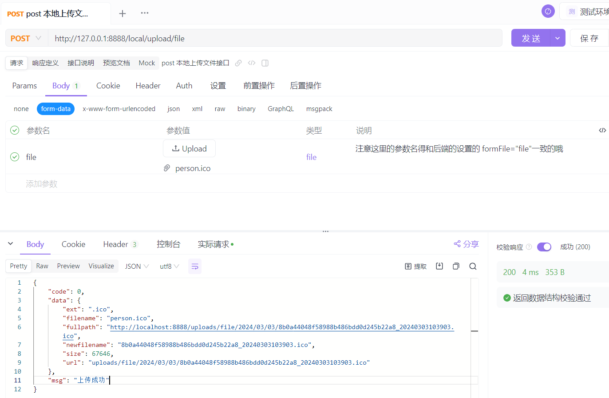

## 1. 后端的处理

### 1：本地上传

其实原理很简单：就是将用户电脑的文件上传到服务器目录中的过程。

参考代码：https://gin-gonic.com/zh-cn/docs/examples/upload-file/single-file/

```go
func main() {
	router := gin.Default()
	// 为 multipart forms 设置较低的内存限制 (默认是 32 MiB)
	router.MaxMultipartMemory = 8 << 20  // 8 MiB
	router.POST("/upload", func(c *gin.Context) {
		// 单文件
		file, _ := c.FormFile("file")
		log.Println(file.Filename)

		dst := "./" + file.Filename
		// 上传文件至指定的完整文件路径
		c.SaveUploadedFile(file, dst)

		c.String(http.StatusOK, fmt.Sprintf("'%s' uploaded!", file.Filename))
	})
	router.Run(":8080")
}
```

上面是官方给出的文件上传的示例代码，我们下面是一个gva框架，把上面的整体过程给分开了而已。


### 2：定义路由

直接定义路由，不像之前的需要先定义service访问数据库的gorm访问数据库的接口，因为我们这次的是文件上传，不需要访问数据库，数据是从前端传给服务器的。

并初始化路由。

```go
package upload

import (
	v1 "github.com/flipped-aurora/gin-vue-admin/server/api/v1"
	"github.com/gin-gonic/gin"
)

type LocalUploadRouter struct{}

func (e *LocalUploadRouter) InitLocalUploadRouter(Router *gin.RouterGroup) {

	localUploadApi := v1.ApiGroupApp.LocalUploadGroup.LocalUploadApi
	// 这个路由多了一个对对post，put请求的中间件处理，而这个中间件做了一些对post和put的参数的处理和一些公共信息的处理
	xkBbsCustomerRouterWithoutRecord := Router.Group("local") //.Use(middleware.OperationRecord())
	{
		// 保存
		xkBbsCustomerRouterWithoutRecord.POST("upload/file", localUploadApi.UploadFile)
	}
}
```


### 3：定义api接口

```go
package upload

import (
	"github.com/flipped-aurora/gin-vue-admin/server/global"
	"github.com/flipped-aurora/gin-vue-admin/server/model/common/response"
	"github.com/flipped-aurora/gin-vue-admin/server/utils"
	"github.com/gin-gonic/gin"
	"log"
	"os"
	"path"
	"strings"
	"time"
)

type LocalUploadApi struct{}

func (receiver *LocalUploadApi) UploadFile(c *gin.Context) {
	// 获取文件上传传递过来的参数
	dir := c.PostForm("dir")
	//xxx := c.PostForm("xxxx")
	// 单文件
	file, _ := c.FormFile("file") // 这里的 name: file 得和前端上传文件组件的命名是一样的哦
	// 读取文件后缀
	ext := path.Ext(file.Filename)
	// 读取文件名并加密
	name := strings.TrimSuffix(file.Filename, ext)
	name = utils.MD5V([]byte(name))
	format := time.Now().Format("20060102150405")
	// 拼接新文件名
	filename := name + "_" + format + ext

	log.Println("文件上传以后得名字是：", filename)
	ymspath := time.Now().Format("2006/01/02")
	var relativePath string
	if dir != "" {
		relativePath = global.GVA_CONFIG.Local.Path + "/" + dir + "/" + ymspath
	} else {
		relativePath = global.GVA_CONFIG.Local.Path + "/" + ymspath
	}
	// 拼接路径和文件名
	filepath := relativePath + "/" + filename
	// 创建父目录
	err := os.MkdirAll(relativePath, os.ModeDir)
	if err != nil {
		response.FailWithMessage("文件创建目录失败", c)
		return
	}
	// 上传文件至指定的完整文件路径
	c.SaveUploadedFile(file, filepath)
	// 定义一个map方法
	m := map[string]any{}
	m["url"] = filepath
	m["fullpath"] = global.GVA_CONFIG.Local.Fileserver + filepath
	m["size"] = file.Size
	m["filename"] = file.Filename
	m["newfilename"] = filename
	m["ext"] = ext

	response.OkWithDetailed(m, "上传成功", c)
}
```

注意上面接口的写法：dir为前端传递过来的数据，指定存储文件的路径、relativePath添加文件层级、global.GVA_CONFIG.Local.Fileserver添加存储服务地址。


dir数据为前端传递过来的，前端需要进行设置的哦。


在config.yaml文件中添加了一下fileserver的设置：

```go
local:
    fileserver: http://localhost:8888/
    path: uploads/file
    store-path: uploads/file
```

并在config/oss_load.go文件中设置相应的Fileserver字段：

```go
package config

type Local struct {
	Path       string `mapstructure:"path" json:"path" yaml:"path"`                   // 本地文件访问路径
	StorePath  string `mapstructure:"store-path" json:"store-path" yaml:"store-path"` // 本地文件存储路径
	Fileserver string `mapstructure:"fileserver" json:"fileserver" yaml:"fileserver"` // 存储文件的服务地址
}
```


### 4：然后 apifox 测试

注意下面的 file，得和上面 api 接口的 file 是一致的哦:

```go
type LocalUploadApi struct{}

func (receiver *LocalUploadApi) UploadFile(c *gin.Context) {
	// 获取文件上传传递过来的参数
	dir := c.PostForm("dir")
	//xxx := c.PostForm("xxxx")
	// 单文件
	file, _ := c.FormFile("file") // 这里的 name: file 得和前端上传文件组件的命名是一样的哦
```

并且和前端的文件上传组件的name的设置是一致的哦：:name="uploadOptions.name", uploadOptions.name: "file"

```vue
<template>
  <div class="imguload-box">
    <div class="imgbox" v-if="serverData.fullpath && props.showimg">
      
    </div>
    <el-upload :method="uploadOptions.method" :name="uploadOptions.name" :accept="uploadOptions.accept"
      :data="uploadOptions.data" :show-file-list="false" :action="uploadOptions.action"
      :on-progress="uploadOptions.handleUploadProgress" :on-success="uploadOptions.handleUploadSuccess"
      :on-error="uploadOptions.handleUploadError" :headers="uploadOptions.headers">
      <slot></slot>
    </el-upload>
  </div>
</template>
```




但是这里会存在几个问题。

- 文件的唯一性

因为如果你上传直接使用文件本身的名字，肯定会存在冲突。因为A用户上传一个a.txt。难道B用户就没a.txt 。如果后面上传的就会签名上传相同文件名给覆盖。就造成文件的紊乱。

- 文件如何访问

上面使用的 apifox 测试，服务端返回的文件存储服务地址为：

http://localhost:8888/uploads/file/2024/03/03/8b0a44048f58988b486bdd0d245b22a8_20240303103903.ico

所以我们是可以直接拿着上面放回来的地址在浏览器上搜索的，也是可以得到对应的文件资源的。


## 2. 前端的处理

看上一节的内容可以看到，我们是使用的组件封装，所以我们把上面文件组件封装了一下，父组件直接使用即可：

```vue
      <el-form-item label="课程封面" prop="description">
        <el-input v-model="video.img" readonly placeholder="封面" />
        
          <div class="imgbox-up">
            <span><el-icon>
                <Plus />
              </el-icon></span>
            <span class="info">必须jpg/png格式，大小 &lt;= 500KB</span>
          </div>
        </img-upload>
      </el-form-item>

      <el-form-item label="课程封面" prop="description">
        <el-input v-model="video.thumail" readonly placeholder="封面" />
        
          <el-button>选择文件</el-button>
        </img-upload>
      </el-form-item>

      <el-form-item label="课程封面" prop="description">
        <el-input v-model="video.cover" readonly placeholder="封面" />
        
          <div class="imgbox-up">
            <span><el-icon>
                <Plus />
              </el-icon></span>
            <span class="info">必须jpg/png格式，大小 &lt;= 500KB</span>
          </div>
        </img-upload>
      </el-form-item>
```

### 文件上传组件代码：

注意下面代码的写法

```vue
<template>
  <div class="imguload-box">
    <div class="imgbox" v-if="serverData.fullpath && props.showimg">
      
    </div>
    <el-upload :method="uploadOptions.method" :name="uploadOptions.name" :accept="uploadOptions.accept"
      :data="uploadOptions.data" :show-file-list="false" :action="uploadOptions.action"
      :on-progress="uploadOptions.handleUploadProgress" :on-success="uploadOptions.handleUploadSuccess"
      :on-error="uploadOptions.handleUploadError" :headers="uploadOptions.headers">
      <slot></slot>
    </el-upload>
  </div>
</template>

<script setup>
import { reactive, ref } from 'vue'
const apiPath = ref(import.meta.env.VITE_BASE_API)
// 定义组件的v-model用于吧组件中的数据传递给调用者
const props = defineProps({
  modelValue: {
    type: [Object, String]
  },
  dir: {
    type: String,
    default: "default"
  },
  showimg: {
    type: Boolean,
    default: true
  }
})
const emits = defineEmits(["update:modelValue"])
// 图片预览的数据
const serverData = ref({})
// 文件上传的地址
const uploadOptions = reactive({
  action: apiPath.value + "/local/upload/file",
  name: "file",
  method: "post",
  accept: 'image/png, image/jpeg',
  // 文件上传使用
  headers: {},
  // 文件上传给服务去的参数
  data: { "dir": props.dir },
  // 监听文件上传的进度
  handleUploadProgress(evt, file) {
    console.log("文件上传的进度是：", evt)
  },
  // 监听文件上传的错误
  handleUploadError(err, file) {
    console.log("上传失败的原因是：", err)
  },
  // 监听文件上传的成功
  handleUploadSuccess(res, file) {
    console.log("上传成功返回的数据是：", res)
    serverData.value = res.data
    emits("update:modelValue", res.data.fullpath)
  }
})

</script>

<style lang="scss" scoped>
.imgbox {
  width: 200px;
  height: 140px;
  background: #fafafa;
  border: 1px solid #eee;
  margin-top: 10px;
  display: flex;
  margin-right: 10px;

  img {
    width: 100%;
    object-fit: contain;
  }
}
</style>
```

