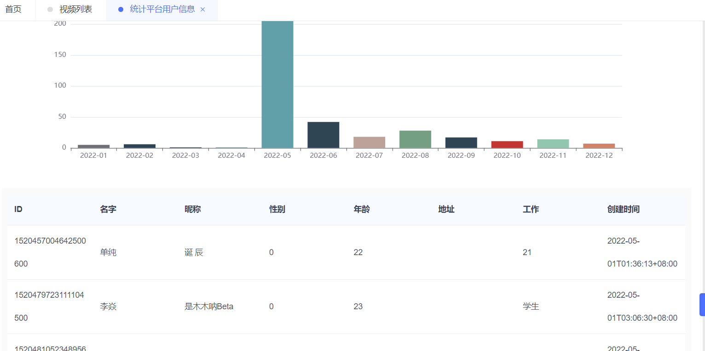

## 统计报表的分析和处理(统计平台用户注册信息)

要求实现达到下面的功能：

1. 获取后端用户注册数据用柱形图展示。
2. 点击对应的柱形，下面会有一个el-table分页展示详细的用户注册数据。




### 1. 前端部分

#### @/view/state/user.vue  

统计平台用户信息的展示页面，其中的各个模块都是划分为一个组件独立出去了

```vue
<template>
   <reg-stat></reg-stat>
   <!-- <user-stat></user-stat>
   <user-map></user-map>
   <china-map></china-map> -->
</template>

<script setup>
import RegStat from '@/view/state/components/RegStat.vue'
// import UserStat from '@/view/state/components/UserStat.vue'
// import UserMap from '@/view/state/components/UserMap.vue'
// import ChinaMap from '@/view/state/components/ChinaMap.vue'

</script>
```

#### @/view/state/components/RegStat.vue

平台用户注册数据组件

```vue
<template>
    <el-card shadow="always" :body-style="{ padding: '20px' }">
        <template #header>
            <div>
                <span>统计学相伴2023年度每个月的用户注册量</span>
                <select v-model="selectYear" @change="handleChangeYear">
                    <option value="">--请选择年份--</option>
                    <option value="2021">2021</option>
                    <option value="2022">2022</option>
                </select>
            </div>
        </template>

        <div id="main" style="width: 100%;height: 400px;"></div>

        <!-- 点击图上的柱形，如果有数据的话就会展示显示在表格上的哦 -->
        <div v-if="userInfoDatas && userInfoDatas.length > 0" style="padding:10px;background:#fafafa;">
            <!-- 信息展示 -->
            <el-table v-loading="loading" :data="userInfoDatas" style="width: 100%">
                <el-table-column label="ID" prop="id"></el-table-column>
                <el-table-column label="名字" prop="username"></el-table-column>
                <el-table-column label="昵称" prop="nickname"></el-table-column>
                <el-table-column label="性别" prop="sex"></el-table-column>
                <el-table-column label="年龄" prop="age"></el-table-column>
                <el-table-column label="地址" prop="address"></el-table-column>
                <el-table-column label="工作" prop="job"></el-table-column>
                <el-table-column label="创建时间" prop="createTime"></el-table-column>
            </el-table>
            <!-- 数据分页 -->
            <div class="pagination" style="display:flex; justify-content: center;">
                <el-pagination :current-page="pageInfo.page" :page-size="pageInfo.pageSize"
                    :page-sizes="[10, 20, 30, 50, 80, 100]" layout="total, sizes, prev, pager, next, jumper"
                    :total="pageInfo.total" @size-change="handleSizeChange" @current-change="handleCurrentChange" />
            </div>
        </div>
    </el-card>
</template>

<script setup>
import * as echarts from 'echarts';
import { onMounted, ref, reactive } from 'vue';
import { userRegState, findUserRegState } from '@/api/stateapi.js'

// （分页查询）接收用户的响应式数据
const userInfoDatas = ref([])
const pageInfo = reactive({
    page: 1,
    pageSize: 10,
    total: 0,
    ym: ""
})
const handleLoadUser = async () => {
    // pageInfo.ym = ym // 得在用户点击柱形的时候赋值的, 再执行 findUserRegState

    const res = await findUserRegState(pageInfo)
    // console.log('res', res)
    userInfoDatas.value = res.data.list
    pageInfo.page = res.data.page
    pageInfo.pageSize = res.data.pageSize
    pageInfo.total = res.data.total
}

// 点击每页查询
const handleCurrentChange = (page) => {
    pageInfo.page = page;
    handleLoadUser();
}
// 改变pageSize查询
const handleSizeChange = (pageSize) => {
    pageInfo.pageSize = pageSize;
    pageInfo.page = 0;
    pageInfo.pageSize = 10;
    handleLoadUser();
}

// 年份选择的响应式数据定义             
const selectYear = ref(new Date().getFullYear())
// 改变年份查询统计信息
const handleChangeYear = () => {
    // userInfoDatas.value = [];
    // 加载统计报表信息
    handleLoadCharts();
}

// 缩放窗口的时候，展示内容的组件的大小会随之改变（响应式），所以定义 myChart 变量为一个 let 类型的变量
let myChart = null
// 初始化统计报表
const handleLoadCharts = async () => {
    const year = selectYear.value
    const res = await userRegState(year) // 统计平台用户每年的注册量
    // 上面的函数执行步骤得先执行完上面的 userRegState('2022') 查询完对应的数据，这里我们才能拿到对应的 res.data 不然就是 undefined (不用 async await 的话就用 then 嵌套)
    // console.log('res', res.data)
    const regStateArr = res.data

    // 转换成map数据解构---把二维---一维
    var params = {};
    if (regStateArr && regStateArr.length > 0) {
        regStateArr.forEach(c => {
            params[c.ym] = c.cnum; // c.ym 对应的用户注册数量 c.cnum
        })
    }

    // 可见上面的 params 是一个 map 的 [key, value] 键值对的数据结构。
    // 对应的 key 就是 c.ym ------> xdata 横坐标的数据, 对应的 value 就是 c.cunm -----> 纵坐标的数据
    // 1. 每个月
    var xdata = [];
    // 2. 每个月对应的数据 
    var ydata = [];
    const color = [
        '#c23531',
        '#2f4554',
        '#61a0a8',
        '#d48265',
        '#91c7ae',
        '#749f83',
        '#ca8622',
        '#bda29a',
        '#6e7074',
        '#546570',
        '#c4ccd3'
    ]
    for (let i = 1; i <= 12; i++) {
        var key = year + "-" + (i < 10 ? ("0" + i) : i); // 月份得是两位数
        xdata.push(key);
        ydata.push({
            value: params[key] || 0,
            itemStyle: {
                color: color[Math.floor(Math.random() * color.length)] // 随机显示一个颜色
            }
        });
    }

    // 基于准备好的dom，初始化echarts实例
    if (myChart) {
        myChart.dispose();
    }

    // 基于准备好的dom，初始化echarts实例
    myChart = echarts.init(document.getElementById('main'));
    // 绘制图表
    myChart.setOption({
        tooltip: {},
        xAxis: {
            data: xdata
        },
        yAxis: {},
        series: [
            {
                name: '注册量',
                type: 'bar',
                data: ydata
            }
        ]
    });

    // 点击获取行为
    myChart.on('click', (params) => {
        // 获取当前点击的柱形的name和索引
        //var dataIndex = params.dataIndex;
        var ym = params.name; // 下面的横坐标的值: year-month
        // 执行查询
        pageInfo.ym = ym
        handleLoadUser();
    });
}

onMounted(() => {
    // 初始化统计报表
    handleLoadCharts()

    // handleLoadUser() // 看一下分页查询是否有问题。注意 pageInfo.ym 的赋值

    // 缩放窗口的时候，展示内容的组件的大小会随之改变（响应式）
    window.addEventListener('resize', function () {
        myChart.resize();
    });
})

</script>
```

#### @/api/stateapi.js  

所需要的请求获取获取数据库数据的函数

```js
import service from '@/utils/request'

// @Summary 统计平台用户每年的注册量
export const userRegState = (year) => {
  return service({
    url: '/state/user/reg?year=' + year,
    method: 'get'
  })
}

// @Summary 统计平台用户每年的注册量-明细
export const findUserRegState = (data) => {
  return service({
    url: "/state/user/detail",
    method: "post",
    data,
  });
};
```


### 2.后端部分(一般优先写，在用apifox测试，再写前端)

注意下面的各个文件是否有 enter.go 文件的存在哦。

#### 定义路由

gin-vue-admin\server\router\state\xk_user_state.go

```go
package state

import (
	v1 "github.com/flipped-aurora/gin-vue-admin/server/api/v1"
	"github.com/gin-gonic/gin"
)

type UserStateRouter struct{}

func (e *UserStateRouter) InitUserStateRouter(Router *gin.RouterGroup) {
	xkVideoCategoryApi := v1.ApiGroupApp.UserStateGroup.UserStateApi

	// 这个路由多了一个对put和post请求的中间件处理，而这个中间件做了一些对post和put的参数的处理和一些公共信息的处理
	xkVideoCategoryCustomerRouterWithoutRecord := Router.Group("state") // 上面的一行代码街上了中间件的处理，这里我们是不加上的，因为加上了可能是会有问题的
	{
		// 查询某年度的平台用户注册量
		xkVideoCategoryCustomerRouterWithoutRecord.GET("/user/reg", xkVideoCategoryApi.UserRegState)
		// 查询某年度的平台用户注册量 --- 明细信息
		xkVideoCategoryCustomerRouterWithoutRecord.POST("/user/detail", xkVideoCategoryApi.FindUserRegStateDetail)
	}
}
```

#### 定义api接口

gin-vue-admin\server\api\v1\state\xk_user_state.go

```go
package state

import (
	"github.com/flipped-aurora/gin-vue-admin/server/model/common/response"
	"github.com/flipped-aurora/gin-vue-admin/server/model/state/request"
	"github.com/gin-gonic/gin"
)

type UserStateApi struct{}

/*
**
统计某年度用户注册量量信息
*/
func (userStateApi *UserStateApi) UserRegState(ctx *gin.Context) {
	// 获取查询的年份
	year := ctx.Query("year")
	// 开始执行
	states, err := userStatService.UserRegStateData(year)
	if err != nil {
		response.FailWithMessage(err.Error(), ctx)
		return
	}
	response.OkWithData(states, ctx)
}

/*
**
统计某年度用户注册量量信息-明细信息
*/
func (userStateApi *UserStateApi) FindUserRegStateDetail(ctx *gin.Context) {
	// 创建一个分页对象
	var pageInfo request.UserStatePageInfo
	// 把前端json的参数传入给PageInfo
	err := ctx.ShouldBindJSON(&pageInfo)
	if err != nil {
		response.FailWithMessage(err.Error(), ctx)
		return
	}
	// 开始执行
	list, total, err := userStatService.FindUserRegStateDetail(pageInfo)
	if err != nil {
		response.FailWithMessage(err.Error(), ctx)
		return
	}
	response.OkWithData(response.PageResult{
		List:     list,
		Total:    total,
		Page:     pageInfo.Page,
		PageSize: pageInfo.PageSize,
	}, ctx)
}
```

#### 定义service接口

可见我们在gorm中是可以直接使用sql语句的。

gin-vue-admin\server\service\state\xk_user_state.go

```go
package state

import (
	"github.com/flipped-aurora/gin-vue-admin/server/global"
	"github.com/flipped-aurora/gin-vue-admin/server/model/state/request"
	"time"
)

type UserStateService struct{}

type UserRegState struct {
	Cyear  string `json:"cyear"`
	Cmonth string `json:"cmonth"`
	Ym     string `json:"ym"`
	Cnum   int    `json:"cnum"`
}

type UserRegInfo struct {
	Id         uint      `json:"id"`
	Username   string    `json:"username"`
	Nickname   string    `json:"nickname"`
	Age        int       `json:"age"`
	Sex        int       `json:"sex"`
	Address    string    `json:"address"`
	Job        string    `json:"job"`
	CreateTime time.Time `json:"createTime"`
}

// @author: feige
// 查询某年度的平台用户注册量
func (userService *UserStateService) UserRegStateData(year string) (userRegStates *[]UserRegState, err error) {
	sql := "SELECT DATE_FORMAT(create_time,'%Y') as Cyear,DATE_FORMAT(create_time,'%m') as Cmonth,DATE_FORMAT(create_time,'%Y-%m') as Ym,count(1) as Cnum FROM xk_user  WHERE DATE_FORMAT(create_time,'%Y') = ? GROUP BY DATE_FORMAT(create_time,'%Y-%m')"
	err = global.GVA_DB.Raw(sql, year).Scan(&userRegStates).Error
	return
}

// 查询某年度的平台用户注册量对应的----明细信息
func (userService *UserStateService) FindUserRegStateDetail(result request.UserStatePageInfo) (list interface{}, total int64, err error) {
	offset := (result.Page - 1) * result.PageSize
	limit := result.PageSize

	db := global.GVA_DB
	// 执行查询---count
	countSql := "SELECT count(1) FROM xk_user  WHERE DATE_FORMAT(create_time,'%Y-%m') = ?"
	err = db.Raw(countSql, result.Ym).Scan(&total).Error
	// 执行查询-具体查询
	var userRegInfos []UserRegInfo
	sql := "SELECT id,username,age,nickname,sex,address,job,create_time FROM xk_user  WHERE DATE_FORMAT(create_time,'%Y-%m') = ? limit ?,?"
	err = db.Raw(sql, result.Ym, offset, limit).Scan(&userRegInfos).Error
	// 查询返回
	if err != nil {
		return nil, 0, err
	} else {
		return userRegInfos, total, err
	}
}
```

