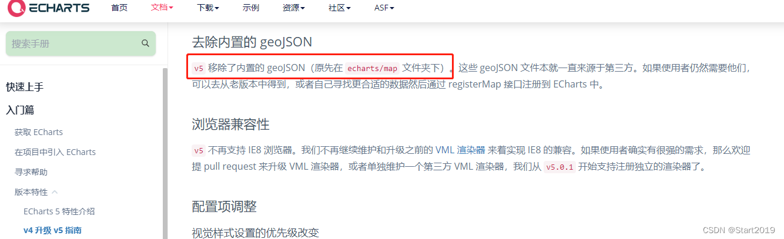
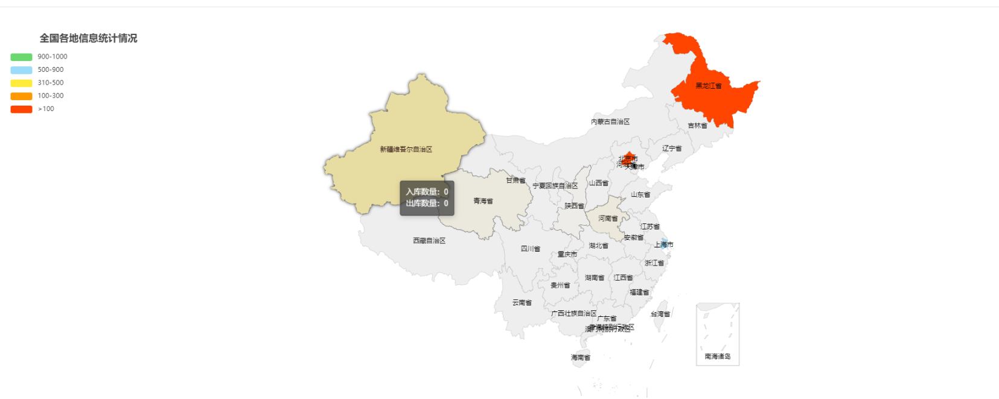
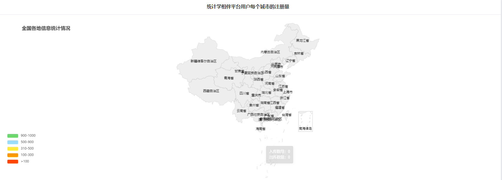

# 百度地图融合处理实现相关统计


## 01、百度地图官网

- https://lbsyun.baidu.com/
  - 注册：获取一个ak的码
- https://echarts.apache.org/zh/index.html
  - 主要做数据的统计和分析，融合地图，只不过你要用地图话就必须融合百度地图

## 参考文章

- https://blog.csdn.net/Start2019/article/details/129709962

原因是：echarts5 没有map ,但是echarts4 有map. 

vue 项目通过 npm install echarts --save 安装的是最新版，在echarts5以后的版本中移除了map地图。



这个geojson是什么，其实就是中国地图每一块的坐标数据。





## 02、具体实现

### 1： 自定义echart.js+定制

参考官网：https://echarts.apache.org/handbook/zh/basics/import

因为官方安装echarts模块，默认情况下只支持pie,bar,line大概三、四种，为什么这样做：因为如果把全部的统计报表都打js或者module那么是非常大的，而且很多时候在开发中pie,bar,line已经能满足90%的需求拉。所以为拉减少体积:echarts也是一种模块化开发。插件机制，把需要的进行下载安装合并即可。只不过对应html端是非常友好的就可以按需加载生成js。这个按需生成地址在：

地址：https://echarts.apache.org/zh/download.html

### 2: 使用vue项目的来定义如下：

```js
// 引入 echarts 核心模块，核心模块提供了 echarts 使用必须要的接口。
import * as echarts from "echarts/core";
 
/** 引入柱状图and折线图图表，图表后缀都为 Chart  */
import { BarChart, LineChart,PieChart,MapChart,TreeChart,FunnelChart } from "echarts/charts";
 
// 引入提示框，标题，直角坐标系，数据集，内置数据转换器组件，组件后缀都为 Component
import {
  TitleComponent,
  TooltipComponent,
  GridComponent,
  ToolboxComponent,
  DatasetComponent,
  TransformComponent,
  LegendComponent,
  GeoComponent,
  VisualMapComponent
} from "echarts/components";
 
// 标签自动布局，全局过渡动画等特性
import { LabelLayout, UniversalTransition } from "echarts/features";
 
// 引入 Canvas 渲染器，注意引入 CanvasRenderer 或者 SVGRenderer 是必须的一步
import { CanvasRenderer } from "echarts/renderers";
 
// 注册必须的组件
echarts.use([
  TitleComponent,
  TooltipComponent,
  GridComponent,
  DatasetComponent,
  TransformComponent,
  LegendComponent,
  GeoComponent,
  VisualMapComponent,
  ToolboxComponent,


  BarChart,
  LabelLayout,
  UniversalTransition,
  CanvasRenderer,
  LineChart,
  TreeChart,
  FunnelChart,
  PieChart,
  MapChart
]);
 
// 导出
export default echarts;
```

### 03、完整代码如下

```js
<template>
    <el-card shadow="always" :body-style="{ padding: '20px' }">
        <template #header>
            <div class="header">
                <span>统计学相伴平台用户每个城市的注册量</span>
            </div>
        </template>
        <div id="chinaMap" style="width: 100%;height: 600px;"></div>
    </el-card>
</template>

<script setup>
import { onMounted } from 'vue'
import echarts from '@/utils/echarts.js'
import china from '@/utils/china.json'

const handleLoadMap = () => {
    echarts.registerMap('china', china); //注册地图数据
    const mychart = echarts.init(document.getElementById("chinaMap"));

    const option = {
        //浮动提示框
        title: { text: '全国各地信息统计情况', left: "4%", top: "3%" },
        tooltip: {
            backgroundColor: "rgba(50,50,50,0.7)",
            textStyle: { color: "#fff" },
            formatter(params, ticket, callback) {
                // params.data 就是series配置项中的data数据遍历
                let value = 0, rukuNum = 0, chukuNum = 0;
                if (params.data) {
                    value = params.data.value;
                    rukuNum = params.data.rukuNum;
                    chukuNum = params.data.chukuNum;
                }
                let html = `<div>入库数量：${rukuNum}</div>
                    <div>出库数量：${chukuNum}</div>`
                return html;
            }
        },
        visualMap: {
            type: "piecewise",
            min: 0,
            max: 5000,
            itemWidth: 40,
            bottom: 60, left: 20,
            pieces: [ // 自定义『分段式视觉映射组件（visualMapPiecewise）』的每一段的范围，以及每一段的文字，以及每一段的特别的样式
                { gt: 900, lt: 1000, label: '900-1000', color: '#6ad86e' }, // (900, 1000]
                { gt: 500, lt: 900, label: '500-900', color: '#9adcfa' }, // (500, 900]
                { gt: 310, lt: 500, label: '310-500', color: '#ffeb3b' }, // (310, 500]
                { gt: 100, lt: 300, label: '100-300', color: '#ff9800' }, // (200, 300]
                { gt: 0, lt: 100, label: '>100', color: 'orangered' } // (10, 200]
            ]
        },
        geo: {
            map: "china",
            zoom: 1.2,
            label: { show: true },
            itemStyle: {
                borderColor: 'rgba(0, 0, 0, 0.2)',
                // areaColor: '#8DBFEB',  //地图的背景色
                emphasis: { // 高亮状态下的多边形和标签样式
                    shadowBlur: 20,
                    shadowColor: 'rgba(0, 0, 0, 0.5)'
                }
            }
        },
        series: [
            {
                name: "", type: "map", geoIndex: 0, label: { show: true }, data: [
                    { "name": "北京", "value": 42, "rukuNum": 42, "chukuNum": 8 },
                    { "name": "上海", "value": 688, "rukuNum": 688, "chukuNum": 299 },
                    { "name": "黑龙江", "value": 7, "rukuNum": 7, "chukuNum": 0 }
                ]
            }
        ]
    }

    mychart.setOption(option);
    window.addEventListener("resize", function () { mychart.resize(); });

}

// 生命周期加载地图
onMounted(() => {
    handleLoadMap();
})
</script>

<style scoped lang="scss">
.header {
    text-align: center;
    font-size: 18px;
    font-weight: bold;
}
</style>
```



注意如果：你发现你城市数据在地图上没有标亮，也没显示具体数据，那么说明你的城市的省份name和china.json的省份name可能不一致。

```js
        series: [
            {
                name: "", type: "map", geoIndex: 0, label: { show: true }, data: [
                    { "name": "北京市", "value": 42, "rukuNum": 42, "chukuNum": 8 },
                    { "name": "上海市", "value": 688, "rukuNum": 688, "chukuNum": 299 },
                    { "name": "黑龙江省", "value": 7, "rukuNum": 7, "chukuNum": 0 }
                ]
            }
        ]
```


## 03、参数的配置的获取和查看

查看options:https://echarts.apache.org/zh/option.html#options


