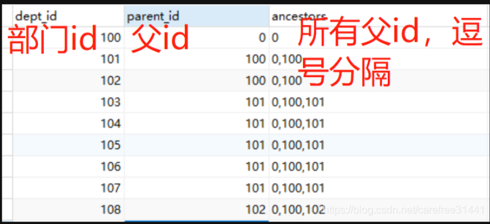
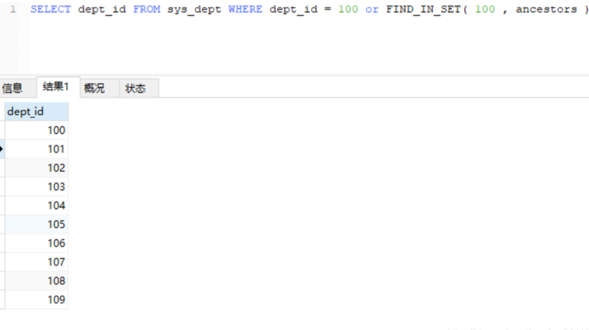

# 实现课程的章节管理


## 04、多分类添加

1: 把数据库中的所以的categorypid和categorycid修改成数据库修改成varchar,长度根据公司的的需求来订。代码修改成string

2： 然后在页面层面开始组合成1,2,3格式来存储到数据库对应的字段中即可

设置级联框的选中问题， https://element-plus.gitee.io/zh-CN/component/cascader.html#cascaderpanel-exposes


3： 接下来使用find_in_set来完成搜索和处理

4： 如何回填数据呢？

[1],[1,2]


## 05、多分类的搜索


## 06、关于封装use的添加刷新问题


## 06、什么情况下会使用中间件表

- 解答几个学生的问题
- find_in_set
- user组件
- 章节的处理 


## 07、什么情况下使用find_in_set进行处理

| id   | title | isnew | ihot | ispush |
| ---- | ----- | ----- | ---- | ------ |
| 1    | java  | 1     | 1    | 1      |
| 2    | go    | 1     | 0    | 0      |
| 3    | js    | 0     | 1    | 1      |

用find_in_set的转变

isnew=1 ishost =2 ispush =3

| id   | title                  | flag  |
| ---- | ---------------------- | ----- |
| 1    | java是基础和boot是关系 | 1,2,3 |
| 2    | go                     | 1,0,0 |
| 3    | js                     | 0,2,3 |
| 4    | php                    | 0,0,0 |
|      |                        |       |


### 1、官方涵义（MySQL手册中语法说明）

FIND_IN_SET(str,strlist) ：  str 要查询的字符串，strlist  需查询的字段，参数以”,”分隔，形式如 (1,2,6,8,10,22)；该函数的作用是查询字段(strlist)中是否包含(str)的结果，返回结果为null或记录。

假如字符串str在由N个子链组成的字符串列表strlist 中，则返回值的范围在 1 到 N 之间。 一个字符串列表就是一个由一些被 ',' 符号分开的子链组成的字符串。如果第一个参数是一个常数字符串，而第二个是type SET列，则FIND_IN_SET() 函数被优化，使用比特计算。 如果str不在strlist 或strlist 为空字符串，则返回值为 0 。如任意一个参数为NULL，则返回值为 NULL。这个函数在第一个参数包含一个逗号( , )时将无法正常运行

```sql
SELECT FIND_IN_SET('b', 'a,b,c,d');
// 结果：2
// 因为 b 在strlist集合中2的位置, a是位置1
 
select FIND_IN_SET('1', '1');
// 结果：1 
// 这时候的strlist集合有点特殊，只有一个字符串
 
select FIND_IN_SET('2', '1，2'); 
// 结果：2
 
select FIND_IN_SET('6', '1'); 
// 结果：0 strlist中不存在str，所以返回0。
```

综上： FIND_IN_SET函数中，若前一个字符串包含在后一个字符串集合中，返回大于0的数，该数为前一个字符串在后一个字符串中的位置。


### 2、find_in_set() 和 in 的区别

新建测试表，增加几条测试数据。

```sql
CREATE TABLE `test` (
  `ID` int(11) NOT NULL,
  `LIST` varchar(255) DEFAULT NULL,
  PRIMARY KEY (`ID`)
) ENGINE=InnoDB DEFAULT CHARSET=utf8;
 
-- ----------------------------
-- Records of test
-- ----------------------------
INSERT INTO `test` VALUES ('1', 'AA,BB,CC');
INSERT INTO `test` VALUES ('2', 'AA,BB');
INSERT INTO `test` VALUES ('3', 'AA');
```

find_in_set()和in的查询比较

```sql
-- IN查询字段条件
SELECT id,list,'字段条件' AS 'IN字段' from TEST WHERE list in ('AA');
 
-- IN查询常量条件-条件为真
SELECT id,list,'条件为真' AS 'IN常量条件为真' from TEST WHERE 'AA' in ('AA','BB');
 
-- IN查询常量条件-条件为假
SELECT id,list,'条件为假' AS 'IN常量条件为假'  from TEST WHERE 'AA' in ('BB','CC');
 
-- FIND_IN_SET字段条件
SELECT id,list,'字段条件' AS 'FIND_IN_SET字段' from TEST WHERE FIND_IN_SET('AA', list);
 
-- FIND_IN_SET常量条件为真
SELECT id,list,'条件为真' AS 'FIND_IN_SET常量条件为真' from TEST WHERE FIND_IN_SET('AA', 'AA,BB,CC');
 
-- FIND_IN_SET常量条件为假
SELECT id,list,'条件为假' AS 'FIND_IN_SET常量条件为假' from TEST WHERE FIND_IN_SET('AA', 'BB,CC');
```


区别：

1、in后面只能跟常量， find_in_set()函数可以使用常量或字段。

2、in是完全匹配，find_in_set()函数是精确匹配，字段值以英文”,”分隔。

另：like是广泛的模糊匹配，字符串中没有分隔符，Find_IN_SET 是精确匹配，字段值以英文”,”分隔，Find_IN_SET查询的结果要小于like查询的结果。


### 3、应用场景

## 1、文章表type字段查询

文章表里面有个type字段，它存储的是文章类型，有 1头条、2推荐、3热点、4图文等等 。现在有篇文章他既是头条，又是热点，还是图文，type中以 1,3,4 的格式存储。那我们如何用sql查找所有type中有4的图文类型的文章呢？

```sql
select * from article where FIND_IN_SET('4',type)
```

##  2、部门树查询，匹配当前节点及所有子节点



### 2.2 匹配部门id或父id为100的数据

```cobol
SELECT dept_id FROM sys_dept WHERE dept_id = 100 or FIND_IN_SET( 100 , ancestors ) 
```


