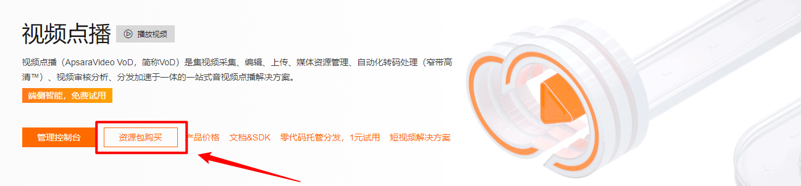
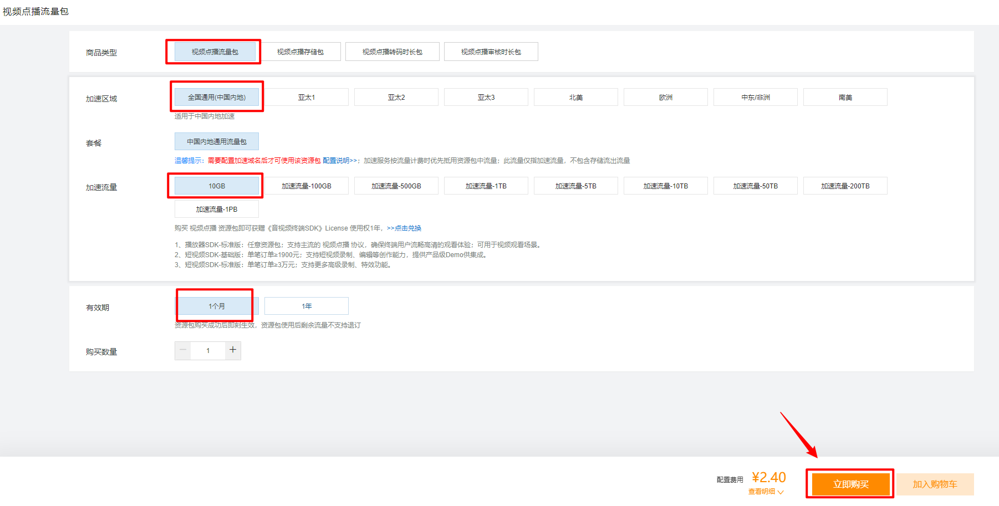
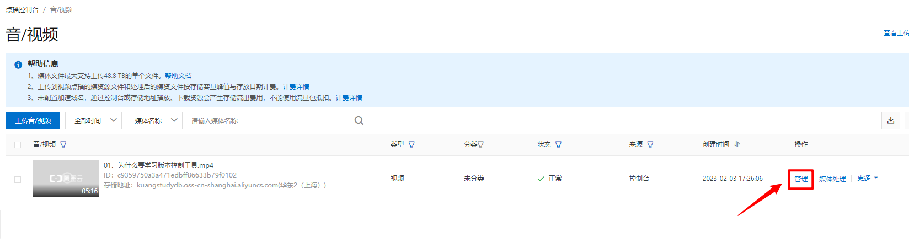

# 阿里云视频点播对接文档 

## 01、如何认识视频点播

视频点播（ApsaraVideo VoD，简称VoD）是集视频采集、编辑、上传、媒体资源管理、自动化转码处理（窄带高清™）、视频审核分析、分发加速于一体的一站式音视频点播解决方案。


## 02、如何申请阿里云的视频点播服务

1：注册阿里云账号: https://www.aliyun.com/product/vod

2：视频点播地址：https://www.aliyun.com/product/vod

3：购买视频点播资源包，在购买前最好自己先多了解一下规则





先购买一个最便宜的把玩和对接一下。弄清楚规则在续费也不迟。

**4：上传一个本地视频开始进行测试**


**5：视频管理，查看视频信息**




或者复制播放地址都可以。

**6：使用官方播放器开始进行播放处理**


播放肯定会提示，需要获取一个播放凭据。对接文档：https://help.aliyun.com/document_detail/436556.html


## 03、Go整合视频点播服务

**1：使用go下载视频点播组件和模块**

API控制台对接：https://next.api.aliyun.com/api/vod/2017-03-21/GetVideoPlayAuth

下载模块：

```go
go get github.com/alibabacloud-go/vod-20170321/v3
```

凭据生成文件

```go
package vod

import (
	openapi "github.com/alibabacloud-go/darabonba-openapi/v2/client"
	util "github.com/alibabacloud-go/tea-utils/v2/service"
	"github.com/alibabacloud-go/tea/tea"
	vod20170321 "github.com/alibabacloud-go/vod-20170321/v3/client"
)

/**
 * 使用AK&SK初始化账号Client
 * @param accessKeyId
 * @param accessKeySecret
 * @return Client
 * @throws Exception
 */
func CreateClient(accessKeyId *string, accessKeySecret *string) (_result *vod20170321.Client, _err error) {
	config := &openapi.Config{
		// 必填，您的 AccessKey ID
		AccessKeyId: accessKeyId,
		// 必填，您的 AccessKey Secret
		AccessKeySecret: accessKeySecret,
	}
	// 访问的域名
	config.Endpoint = tea.String("vod.cn-shanghai.aliyuncs.com")
	_result = &vod20170321.Client{}
	_result, _err = vod20170321.NewClient(config)
	return _result, _err
}

func GetPlayAuth(vid string) (string, error) {
	// 工程代码泄露可能会导致AccessKey泄露，并威胁账号下所有资源的安全性。以下代码示例仅供参考，建议使用更安全的 STS 方式，
	//更多鉴权访问方式请参见：https://help.aliyun.com/document_detail/378661.html
	client, _err := CreateClient(tea.String("LTAI5tPYT3YGu5ptPDYUKbET"), tea.String("h3pI7mVFo8HOQ2sCjvgkWvf3GQXszy"))
	if _err != nil {
		return "", _err
	}

	getVideoPlayAuthRequest := &vod20170321.GetVideoPlayAuthRequest{
		VideoId: tea.String(vid),
	}
	runtime := &util.RuntimeOptions{}
	// 复制代码运行请自行打印 API 的返回值
	result, _err := client.GetVideoPlayAuthWithOptions(getVideoPlayAuthRequest, runtime)
	if _err != nil {
		return "", _err
	}

	toMap := util.ToMap(result)
	m := util.ToMap(toMap["body"])
	s := m["PlayAuth"].(string)
	return s, nil
}
```


**2：使用vue异步获取凭据播放信息，完成播放功能。**

web播放器的对接 ： https://help.aliyun.com/document_detail/125572.htm?spm=a2c4g.11186623.0.0.131d6025YXKX4u#task-1997027

**3：开始编写课程的播放页面**

```html
<!DOCTYPE html>
<html lang="en">
<head>
    <meta charset="UTF-8">
    <meta http-equiv="X-UA-Compatible" content="IE=edge">
    <meta name="viewport" content="width=device-width, initial-scale=1.0">
    <title>首页-学相伴</title>
    <link rel="stylesheet" href="/css/app.css">
    <link rel="stylesheet" href="/fonts/iconfont.css">
    <script src="/js/vue/vue.min.js"></script>
    <script src="/js/axios/axios.min.js"></script>
    <script src="/js/commons/common.js"></script>
    <link rel="stylesheet" href="https://g.alicdn.com/de/prismplayer/2.13.2/skins/default/aliplayer-min.css" />
    <script type="text/javascript" src="https://g.alicdn.com/de/prismplayer/2.13.2/aliplayer-min.js"></script>
    <style>
        .button.primary.green {
            background:#30b553;
            border: 2px solid #30b553;
            color:#fff!important;
        }
        .itembox{
            border:1px solid #eee;
            padding:10px;
            cursor: pointer;
            margin-top: 10px;
            display: flex;
            justify-content: space-between;
            align-items: center;
        }
        .itembox.active,.itembox:hover{
            border:1px solid #03b97c;
        }

        #J_prismPlayer{width: 100%;height: 680px;text-align: center;position: relative}
        #J_prismPlayer .isbuybox{color:#fff;position: absolute;top:240px;font-weight: bold;font-size:24px;right:0;left:0;text-align: center}
    </style>
</head>
<body class="nav-video">
<div id="app">
    <div class="main-header-box" id="loginapp" data-v-47be33e3="">
        <header class="main-header main-header unauthorized visible" data-v-47be33e3="">
            <div class="container">
                <a href="/" class="logo">
                    
                    
                </a>
                <nav role="navigation" class="main-nav">
                    <ul class="nav-list">
                        <li class="main-nav-list">
                            <ul class="phone-hide">
                                <li class="nav-item link-item nav-video active">
                                    <a href="/video">
                                        <span class="text"> 视频 </span>
                                    </a>
                                </li>
                                <li class="nav-item link-item nav-bbs active">
                                    <a href="/bbs">
                                        <span class="text"> 社区 </span>
                                    </a>
                                </li>
                                <li class="nav-item link-item nav-question active">
                                    <a href="/questions">
                                        <span class="text"> 问答 </span>
                                    </a>
                                </li>
                                <li class="nav-item link-item nav-about active">
                                    <a href="/about">关于我们</a></a>
                                </li>
                            </ul>
                        </li>
                        <ul class="right-side-nav">
                            <li class="search-add">
                                <ul class="search-add-ul">
                                    <li class="nav-item auth"  v-if="!isLogin">
                                        <a href="/login" class="login-button">登录</a>
                                        <a href="/reg" class="login-button">注册</a>
                                    </li>
                                    <li class="nav-item auth" v-else>
                                        <a href="/uhome" class="mr-3" title="点击进入个人中心">
                                            
                                            <span class="pr tp2">{{user.nickname}}</span>
                                        </a>
                                        <a href="javascript:void(0);" @click="handleLogout">退出</a>
                                    </li>
                                </ul>
                            </li>
                        </ul>
                        <div id="pug-msg-dropdownbox" x-placement="bottom-start"
                             class="dropdown-menu pug-dropdown-menu pull-right animate__animated animate__flipInX "
                             style="position: absolute; top: 60px; right: 0px; will-change: transform;max-width: 520px;">
                            <div class="drp_menu_headr bg-warning">
                                <h4>
                                    <span class="pug-sysmsg-count">0</span> 消息
                                </h4>
                            </div>
                            <div class="ground-list ground-hover-list" style="overflow: auto;max-height: 80vh;"></div>
                        </div>
                    </ul>
                </nav>
            </div>
        </header>
    </div>
    <input type="hidden" value="1498123423423423244" ref="videoId">
    <div class="page-main" style="margin-top: 50px;">
        <div class="post-show" style="--plyr-range-fill-background:#0058F8;">
            <div class="post-show-media">
                <div class="prism-player" id="J_prismPlayer"></div>
            </div>
            <div class="post-show-header">
                <div class="section pack">
                    <div class="title">浏览数：{{video.viewCount}} <span class="statistics" >创建时间：{{video.createTime}}</span></div>
                </div>
                <div class="content">
                    <div class="action" style="position: relative;top:7px;" >
                        <div class="node-complete-action">
                            <button class="button basic">
                                <i class="app-icon" style="color: rgb(0, 0, 0); font-size: 24px; width: 24px;">task_alt</i>
                            </button>
                        </div>
                    </div>
                    <h1 class="text">{{video.title}}</h1>
                </div>
                <div class="section series">
                    <p>{{video.description}}</p>
                </div>
                <div>
                    <ul>

                        <template v-if="video.categoryId == 2 || isbuy">
                            <li class="itembox" :class="[index==sindex?'active':'']" @click="handleChangeVideo(index)" v-for="(vv,index) in videoArr">
                                <span>{{vv.title}}</span>
                                <span>{{vv.videotime}}</span>
                            </li>
                        </template>
                        <template v-else>
                            <li class="itembox" :class="[index==sindex?'active':'']" @click="handleBuyOpen(index)" v-for="(vv,index) in videoArr">
                                <span>{{vv.title}}</span>
                                <span>{{vv.videotime}}</span>
                            </li>
                        </template>
                    </ul>
                </div>
            </div>
        </div>
    </div>
</div>
<script>
    var vue = new Vue({
        el:"#app",
        data:{
            isLogin:false,
            isbuy:0,
            video:{
                title:"Go语言的发展史",
                viewCount:100,
                createTime:"2022-12-12 23:12:15",
                description:"描述：Go语言的发展史"
            },
            videoArr:[],
            message:""
        }
    })
</script>
</body>
</html>
```

**4：配置页面对应的路由**

```go
package video

import (
	"fmt"
	beego "github.com/beego/beego/v2/server/web"
)

// 下载和安装了：go get github.com/satori/go.uuid

type VideoController struct {
	beego.Controller
}

// 文件上传的路由地址
func (ctrl *VideoController) VideoDetail() {
	ID := ctrl.Ctx.Input.Param(":id")
	fmt.Println("查看的视频IDS：", ID)
	ctrl.TplName = "video.html"
}

```

配置对应页面路由，在项目工程目录下的 routers/router.go中配置如下：

```go
// 视频点播
beego.CtrlGet("/video/detail/:id", (*video.VideoController).VideoDetail)
```

启动服务即可。访问http://localhost:8080/video/detail/1

**5：开始引入阿里云点播的播放器**

```html
<link rel="stylesheet" href="https://g.alicdn.com/de/prismplayer/2.13.2/skins/default/aliplayer-min.css" />
<script type="text/javascript" src="https://g.alicdn.com/de/prismplayer/2.13.2/aliplayer-min.js"></script>
```

播放器渲染部分

```html
<div id="app">
    <div class="prism-player" id="J_prismPlayer"></div>
</div>
```

js部分

```js

var vue = new Vue({
    el:"#app",
    data:{
        isLogin:false,
        isbuy:0,
        video:{
            title:"Go语言的发展史",
            viewCount:100,
            createTime:"2022-12-12 23:12:15",
            description:"描述：Go语言的发展史",
            videoList:[{

            }]
        },
        videoArr:[],
        message:"",
        player:null// 视频播放器对象,未来可以控制视频的播放，暂停，时长，状态等等
    },
    mounted(){
        // 视频播放器初始化
        this.getVideoPlayAuth("4ad88050a3c971edbfce6723b78e0102",);
    },

    methods:{
        initPlayer(vid,playauth){
            var that = this;
            that.player = new Aliplayer({
                id: "J_prismPlayer",
                autoplay: true,
                width:"100%",
                height:"680",
                vid,
                playauth,
                cover:''
            });
        },

        // 获取视频播放凭据
        async getVideoPlayAuth(vid){
            const response = await axios.post("/video/getplayauth/"+vid);
            console.log("response",response)
            // 判断一下视频播放器是否初始化成功
            if(!this.player){
                alert(1)
                // 初始化播放器，同时获取视频对应的播放凭据
                this.initPlayer(vid,response.data.data);
            }else{
                // 点击播放下一个视频，不需要在把播放器重新初始化
                this.player.replayByVidAndPlayAuth(vid,response.data.data);
            }
        }
    }
})
```

 播放器的文档：

https://help.aliyun.com/document_detail/125570.htm?spm=a2c4g.11186623.0.0.39214aa3WkfNW2#task-1997027

## 04、如何完成视频点播服务的封装和细节

监听播放结束，播放下一个

```html
<!DOCTYPE html>
<html lang="en">
<head>
    <meta charset="UTF-8">
    <meta http-equiv="X-UA-Compatible" content="IE=edge">
    <meta name="viewport" content="width=device-width, initial-scale=1.0">
    <title>首页-学相伴</title>
    <link rel="stylesheet" href="/css/app.css">
    <link rel="stylesheet" href="/fonts/iconfont.css">
    <script src="/js/vue/vue.min.js"></script>
    <script src="/js/axios/axios.min.js"></script>
    <link rel="stylesheet" href="https://g.alicdn.com/de/prismplayer/2.15.2/skins/default/aliplayer-min.css" />
    <script type="text/javascript" src="https://g.alicdn.com/de/prismplayer/2.15.2/aliplayer-min.js"></script>
    <style>
        .button.primary.green {
            background:#30b553;
            border: 2px solid #30b553;
            color:#fff!important;
        }
        .itembox{
            border:1px solid #eee;
            padding:10px;
            cursor: pointer;
            margin-top: 10px;
            display: flex;
            justify-content: space-between;
            align-items: center;
        }
        .itembox.active,.itembox:hover{
            border:1px solid #03b97c;
        }

        #J_prismPlayer{width: 100%;height: 680px;text-align: center;position: relative}
        #J_prismPlayer .isbuybox{color:#fff;position: absolute;top:240px;font-weight: bold;font-size:24px;right:0;left:0;text-align: center}
    </style>
</head>
<body class="nav-video">
<div id="app">
    <div class="main-header-box" id="loginapp" data-v-47be33e3="">
        <header class="main-header main-header unauthorized visible" data-v-47be33e3="">
            <div class="container">
                <a href="/" class="logo">
                    
                    
                </a>
                <nav role="navigation" class="main-nav">
                    <ul class="nav-list">
                        <li class="main-nav-list">
                            <ul class="phone-hide">
                                <li class="nav-item link-item nav-video active">
                                    <a href="/video">
                                        <span class="text"> 视频 </span>
                                    </a>
                                </li>
                                <li class="nav-item link-item nav-bbs active">
                                    <a href="/bbs">
                                        <span class="text"> 社区 </span>
                                    </a>
                                </li>
                                <li class="nav-item link-item nav-question active">
                                    <a href="/questions">
                                        <span class="text"> 问答 </span>
                                    </a>
                                </li>
                                <li class="nav-item link-item nav-about active">
                                    <a href="/about">关于我们</a></a>
                                </li>
                            </ul>
                        </li>
                        <ul class="right-side-nav">
                            <li class="search-add">
                                <ul class="search-add-ul">
                                    <li class="nav-item auth"  v-if="!isLogin">
                                        <a href="/login" class="login-button">登录</a>
                                        <a href="/reg" class="login-button">注册</a>
                                    </li>
                                    <li class="nav-item auth" v-else>
                                        <a href="/uhome" class="mr-3" title="点击进入个人中心">
                                            
                                            <span class="pr tp2">{{user.nickname}}</span>
                                        </a>
                                        <a href="javascript:void(0);" @click="handleLogout">退出</a>
                                    </li>
                                </ul>
                            </li>
                        </ul>
                        <div id="pug-msg-dropdownbox" x-placement="bottom-start"
                             class="dropdown-menu pug-dropdown-menu pull-right animate__animated animate__flipInX "
                             style="position: absolute; top: 60px; right: 0px; will-change: transform;max-width: 520px;">
                            <div class="drp_menu_headr bg-warning">
                                <h4>
                                    <span class="pug-sysmsg-count">0</span> 消息
                                </h4>
                            </div>
                            <div class="ground-list ground-hover-list" style="overflow: auto;max-height: 80vh;"></div>
                        </div>
                    </ul>
                </nav>
            </div>
        </header>
    </div>
    <input type="hidden" value="1498123423423423244" ref="videoId">
    <div class="page-main" style="margin-top: 50px;">
        <div class="post-show" style="--plyr-range-fill-background:#0058F8;">
            <div class="post-show-media">
                <div class="prism-player" id="J_prismPlayer"></div>
            </div>
            <div class="post-show-header">
                <div class="section pack">
                    <div class="title">浏览数：{{video.viewCount}} <span class="statistics" >创建时间：{{video.createTime}}</span></div>
                </div>
                <div class="content">
                    <div class="action" style="position: relative;top:7px;" >
                        <div class="node-complete-action">
                            <button class="button basic">
                                <i class="app-icon" style="color: rgb(0, 0, 0); font-size: 24px; width: 24px;">task_alt</i>
                            </button>
                        </div>
                    </div>
                    <h1 class="text">{{video.title}}</h1>
                </div>
                <div class="section series">
                    <p>{{video.description}}</p>
                </div>
                <div>
                    <ul>
                        <li class="itembox" :class="[index==sindex?'active':'']" @click="handlePlayNext(index)" v-for="(vv,index) in video.videoList">
                            <span>{{vv.title}}</span>
                            <span>{{vv.videotime}}</span>
                        </li>
                    </ul>
                </div>
            </div>
        </div>
    </div>
</div>
<script>
    var vue = new Vue({
        el:"#app",
        data:{
            isLogin:false,
            isbuy:0,
            sindex:0,
            video:{
                title:"Go语言的发展史",
                viewCount:100,
                createTime:"2022-12-12 23:12:15",
                description:"描述：Go语言的发展史",
                videoList:[{
                    title:"为什么要学习版本控制工具.mp4",
                    cover:"https://www.kuangstudy.com/assert/course/c1/17.jpg",
                    vid:"43e7cef0a3a571ed8f240674a2ce0102",
                    videotime:"12:12"
                },{
                    title:"Git是什么.mp4",
                    cover:"https://www.kuangstudy.com/assert/course/c1/17.jpg",
                    videotime:"12:12",
                    vid:"4adbb4a0a3c971ed835f6732a78f0102"
                },{
                    title:"Git和Svn的区别.mp4",
                    cover:"https://www.kuangstudy.com/assert/course/c1/17.jpg",
                    videotime:"12:12",
                    vid:"4ad88050a3c971edbfce6723b78e0102"
                }]
            },
            videoArr:[],
            message:"",
            player:null// 视频播放器对象,未来可以控制视频的播放，暂停，时长，状态等等
        },
        mounted(){
            // 视频播放器初始化
            var vid = this.video.videoList[0].vid
            this.getVideoPlayAuth(vid);
        },

        methods:{
            initPlayer(vid,playauth){
                var that = this;
                that.player = new Aliplayer({
                    id: "J_prismPlayer",
                    autoplay: true,
                    width:"100%",
                    height:"680",
                    vid,
                    playauth,
                    cover:''
                });
            },

            handlePlayNext(index){
              if(this.sindex == index){
                return;
              }
              this.sindex = index;
              var vid = this.video.videoList[index].vid;
              this.getVideoPlayAuth(vid);
            },

            // 获取视频播放凭据
            async getVideoPlayAuth(vid){
                const response = await axios.post("/video/getplayauth/"+vid);
                // 判断一下视频播放器是否初始化成功
                if(!this.player){
                    // 初始化播放器，同时获取视频对应的播放凭据
                    this.initPlayer(vid,response.data.data);
                }else{
                    // 点击播放下一个视频，不需要在把播放器重新初始化
                    this.player.replayByVidAndPlayAuth(vid,response.data.data);
                }
            }
        }
    })
</script>
</body>
</html>
```

监听播放中，获取播放时间

```html
 var vue = new Vue({
        el:"#app",
        data:{
            isLogin:false,
            isbuy:0,
            sindex:0,
            video:{
                title:"Go语言的发展史",
                viewCount:100,
                createTime:"2022-12-12 23:12:15",
                description:"描述：Go语言的发展史",
                videoList:[{
                    title:"为什么要学习版本控制工具.mp4",
                    cover:"https://www.kuangstudy.com/assert/course/c1/17.jpg",
                    vid:"43e7cef0a3a571ed8f240674a2ce0102",
                    videotime:"12:12"
                },{
                    title:"Git是什么.mp4",
                    cover:"https://www.kuangstudy.com/assert/course/c1/18.jpg",
                    videotime:"12:12",
                    vid:"4adbb4a0a3c971ed835f6732a78f0102"
                },{
                    title:"Git和Svn的区别.mp4",
                    cover:"https://www.kuangstudy.com/assert/course/c1/19.jpg",
                    videotime:"12:12",
                    vid:"4ad88050a3c971edbfce6723b78e0102"
                }]
            },
            videoArr:[],
            message:"",
            index:0,
            player:null// 视频播放器对象,未来可以控制视频的播放，暂停，时长，状态等等
        },
        mounted(){
            // 视频播放器初始化
            var vid = this.video.videoList[0].vid
            var cover = this.video.videoList[0].cover
            this.getVideoPlayAuth(vid,cover);
        },

        methods:{
            initPlayer(vid,playauth,cover){
                var that = this;
                that.player = new Aliplayer({
                    id: "J_prismPlayer",
                    autoplay: true,
                    width:"100%",
                    height:"680",
                    vid,
                    playauth,
                    cover
                });

                that.player.on('ready',function(e) {
                    console.log("播放器初始化完毕.....")
                });

                that.player.on('play',function(e) {
                    console.log("视频由暂停恢复为播放时触发。。.....")
                });

                that.player.on('pause',function(e) {
                    console.log("视频暂停时触发。.....")
                });

                that.player.on('timeupdate',function(e) {
                    console.log("播放中，会触发多次。.....")
                    console.log(that.player.getCurrentTime())
                    console.log(that.player.getDuration())
                });

                that.player.on('ended',function(e) {
                    console.log("当前视频播放完毕时触发。.....")
                    // 播放下一个
                    that.index++;
                    that.handlePlayNext(that.index);
                });

                that.player.on('error',function(e) {
                    console.log("错误事件。。.....")
                });


            },

            handlePlayNext(index){
              if(this.sindex == index){
                return;
              }
              this.sindex = index;
              var vid = this.video.videoList[index].vid;
              this.getVideoPlayAuth(vid);
            },

            // 获取视频播放凭据
            async getVideoPlayAuth(vid,cover){
                const response = await axios.post("/video/getplayauth/"+vid);
                // 判断一下视频播放器是否初始化成功
                if(!this.player){
                    // 初始化播放器，同时获取视频对应的播放凭据
                    this.initPlayer(vid,response.data.data,cover);
                }else{
                    // 点击播放下一个视频，不需要在把播放器重新初始化
                    this.player.replayByVidAndPlayAuth(vid,response.data.data);
                }
            }
        }
    })
```


## 05、 官方参考文档

- https://help.aliyun.com/document_detail/125572.htm?spm=a2c4g.11186623.0.0.131d6025YXKX4u#task-1997027
- https://next.api.aliyun.com/api/vod/2017-03-21/GetVideoPlayAuth?lang=GO&params=%7B%22VideoId%22%3A%2243e7cef0a3a571ed8f240674a2ce0102%22%7D&tab=DEMO&accounttraceid=9b6c2cd259554f9982d14529388e127bycde&sdkStyle=dara