# Gin 系列课程学习和探索


## 01、认识Gin

### Gin是什么?

- **Gin：Go 语言编写的 Web 框架，以更好的性能实现类似 Martini 框架的 API。**
- Gin是一个golang的net/http库封装的web微框架，封装比较优雅，API友好，源码注释比较明确。具有快速灵活，容错方便等特点。

### 同类框架对比分析

- **Beego：开源的高性能 Go 语言 Web 框架。**

- beego是一个快速开发Go应用的http框架，go 语言方面技术大牛。beego可以用来快速开发API、Web、后端服务等各种应用，是一个RESTFul的框架，主要设计灵感来源于tornado、sinatra、flask这三个框架，但是结合了Go本身的一些特性(interface、struct继承等)而设计的一个框架。

- **Iris：全宇宙最快的 Go 语言 Web 框架。完备 MVC 支持，未来尽在掌握。**

  Iris是一个快速,简单但功能齐全的和非常有效的web框架。提供了一个优美的表现力和容易使用你的下一个网站或API的基础。

### 小结

- gin是一个web框架
- gin是封装了net/http库，底层的核心逻辑还是net/http


## 02、我们为什么要学习web框架

作为初学者很多时候，在学习一个框架的时候，一定要搞清楚我们为什么要学习它，这个非常的重要。

随着互联网技术的发展，在早期我们大部分情况下，编写的都是静态网页html。如果有100篇文章就要编写一百篇与之对应的静态网页。这样是非常痛苦的。于是乎开始有了动态网页，动态网页必须要结合服务器端的技术，比如：Go、Java等。有了这些服务端语言的加持这样就可以完成一个静态网页到动态网页的转化。如下图：

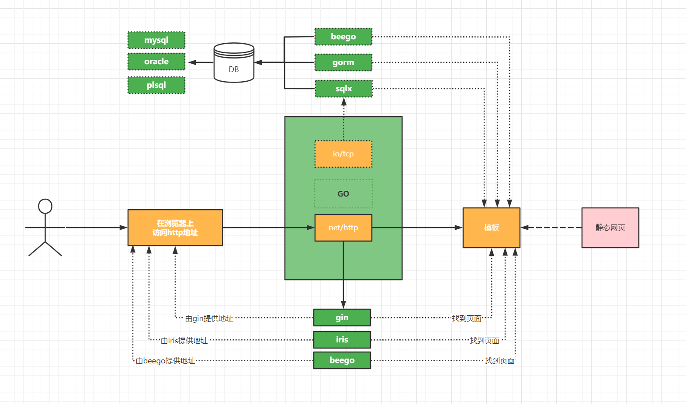

- 如果假设我们这里选择的是：gin和gorm。
- 用户在浏览器访问地址，这个地址其实是服务器提供。用于寻址一样。先找到服务器在哪里，我要访问服务器的什么
- 如果根据ip找到地址以后，通过port找到服务器的服务，原来你是一个go的web服务。就开始进入到程序中把对应的逻辑去执行(这个部分未来是我们使用gin定义路由的对应的要执行的事情)
- 在执行的逻辑中，我们肯定会调用gorm把数据库存储起来的数据，查询出来。
- 把查询出来的数据，和你定义好的模板开始用对应的模板语法进行渲染和碰撞。
- 最后就呈现出来了，一个完整的静态网页。
- 这也就是经典的：B/S架构。B代表的是Broswer浏览器，S代表的是：Server是服务端也就是我们学习的GO


## 03、环境的准备和搭建

### 文档和go环境

- Gin 官方文档地址：https://gin-gonic.com/zh-cn/docs/

- 版本的要求：最低版本要求：1.18x ，强烈推荐：1.19x

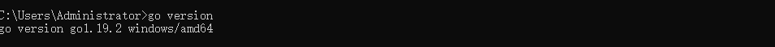

- 我这里是1.19.2这个版本。希望保持一致。

### 项目搭建过程

**1：创建xk-gin工程**

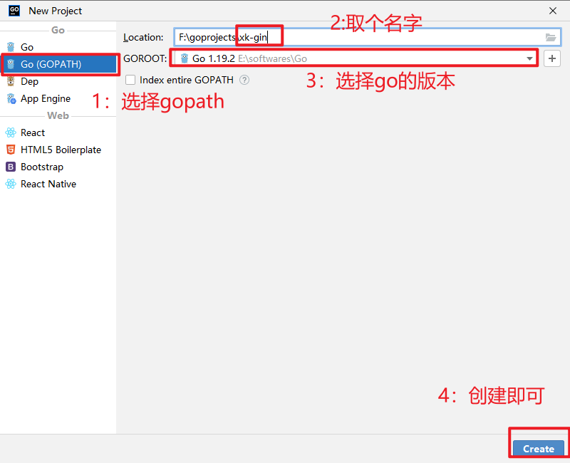

**2：创建项目的mod文件**

这个文件的作用就是：可以用来记录你未来安装的模块。方便进行统一管理。

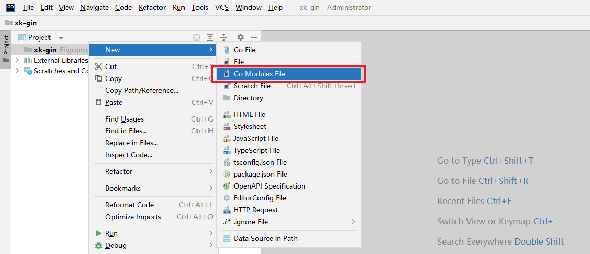

创建好以后如下：

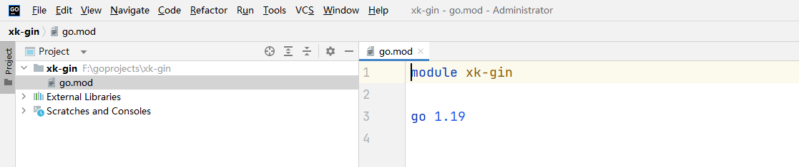

**3：配置项目的环境**

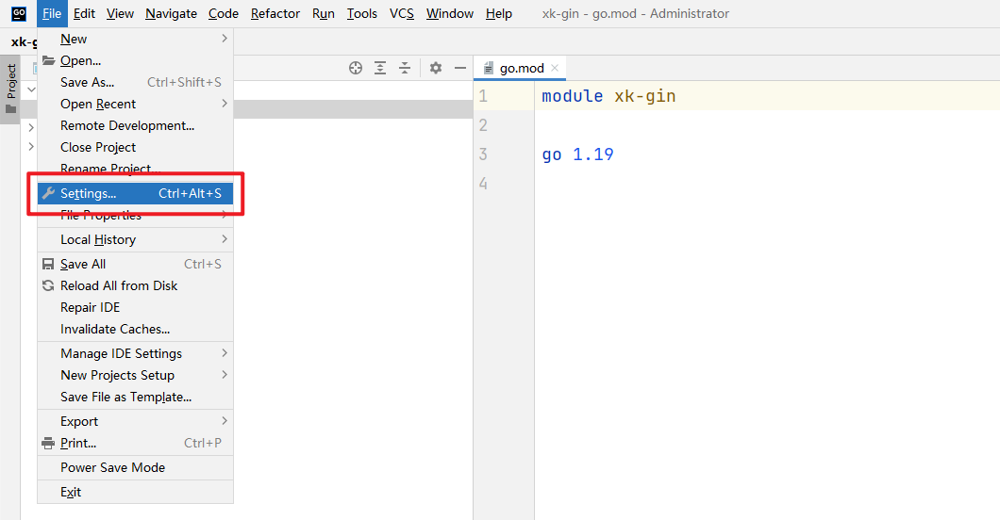

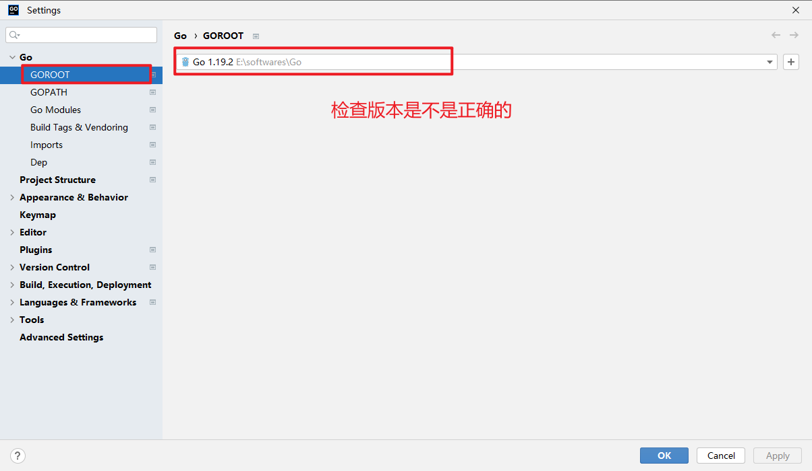

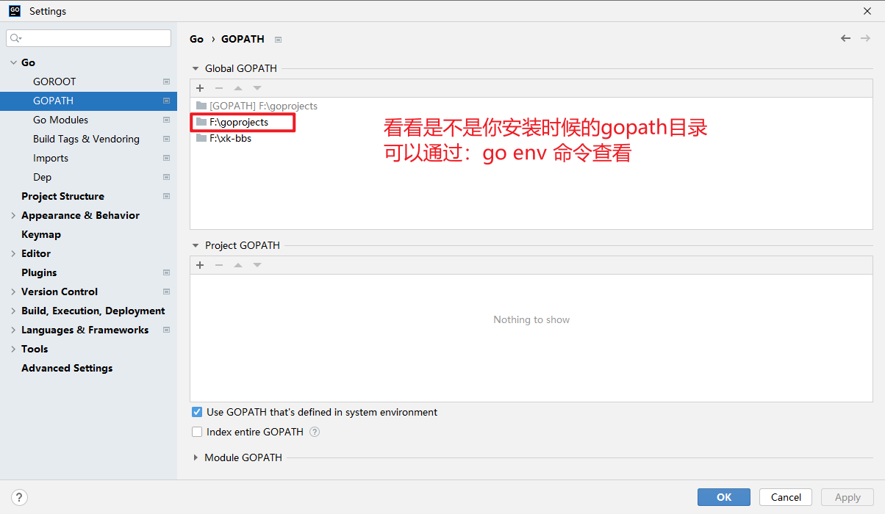

复制`GOPROXY=https://goproxy.cn,direct` 放入到Enironment中如下：

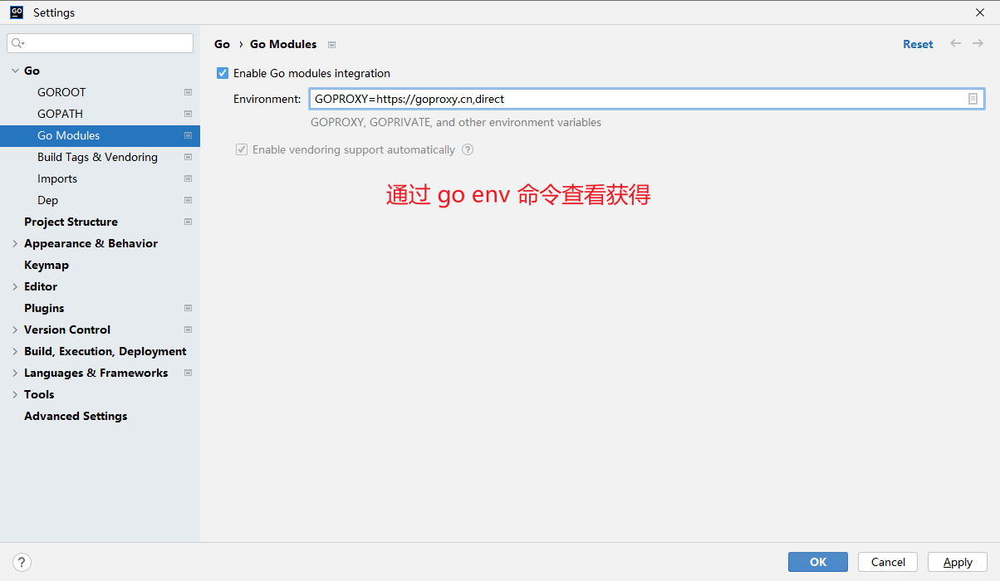

一切准备就绪，接下来开始安装gin


## 04、Gin安装使用

Gin 官方文档地址：https://gin-gonic.com/zh-cn/docs/

### 安装gin

```go
go get -u github.com/gin-gonic/gin
```


检查是否安装成功

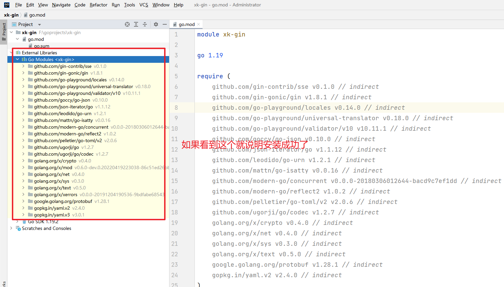


### 编写Helloworld程序


**HelloWorld.go**

```go
package main

import (
   "github.com/gin-gonic/gin"
)

func main() {
   // 创建gin服务
   ginServer := gin.Default()
   // localhost:8080/hello
   // 处理请求的函数 *gin.Context
   ginServer.GET("/hello", func(c *gin.Context) {
      // c.JSON：返回JSON格式的数据
      // gin.H : 参数 key value
      c.JSON(200, gin.H{"message": "Hello world!"})
   })
   // 启动HTTP服务,可以修改端口
   ginServer.Run(":8088")
}
```

### 启动，访问测试

修改 

```go
package main

import (
   "github.com/gin-gonic/gin"
   "github.com/thinkerou/favicon" // 需要导包
)

func main() {
   ginServer := gin.Default()
    
   // 可以通过favicon修改网站的favicon.ico
   ginServer.Use(favicon.New("./favicon.ico")) // 运行目录下的favicon.ico
    
   ginServer.GET("/hello", func(c *gin.Context) {
      c.JSON(200, gin.H{"message": "Hello world!"})
   })
   ginServer.Run(":8088")
}
```

重启浏览器，再访问测试


## 05、RESTful API

 **RESTful:用URL定位资源、**用HTTP动词（GET、POST、PUT、DELETE)描述操作**。只要记住这句话也就不难理解了。

  **RESTful API就是REST风格的API，即rest是一种架构风格，跟编程语言无关，跟平台无关，采用HTTP做传输协议**。

简单来说，REST的含义就是客户端与Web服务器之间进行交互的时候，使用HTTP协议中的4个请求方法代表不同的动作。

- `GET`用来获取资源
- `POST`用来新建资源
- `PUT`用来更新资源
- `DELETE`用来删除资源。

只要API程序遵循了REST风格，那就可以称其为RESTful API。目前在前后端分离的架构中，前后端基本都是通过RESTful API来进行交互。

> 以前的写法

```go
get 	/user
post	/create_user
post	/update_user
post    /delete_user
```

> Restful 的写法

```go
get		/user
post	/user
put		/user
delete	/user
```

Gin框架支持开发RESTful API的开发。

```go
ginServer.GET("/user", func(c *gin.Context) {
   c.JSON(200, gin.H{
      "message": "GET",
   })
})

ginServer.POST("/user", func(c *gin.Context) {
   c.JSON(200, gin.H{
      "message": "POST",
   })
})

ginServer.PUT("/user", func(c *gin.Context) {
   c.JSON(200, gin.H{
      "message": "PUT",
   })
})

ginServer.DELETE("/user", func(c *gin.Context) {
   c.JSON(200, gin.H{
      "message": "DELETE",
   })
})
```

我们的浏览器只能够测试get请求，其他的我们需要通过一些辅助工具来测试，这里我们推荐使用 ApiPost 工具。

下载地址：https://www.apipost.cn/

打开工具：

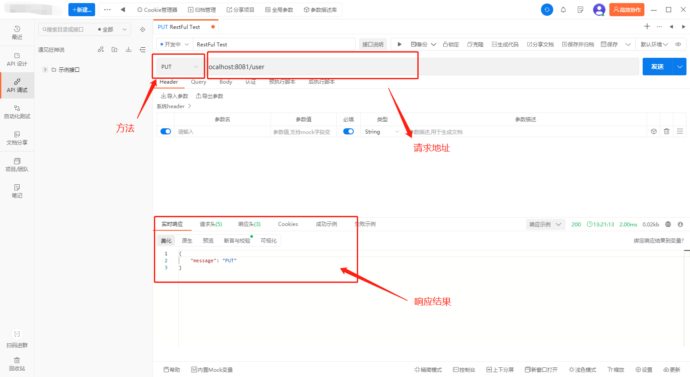

然后测试，就可以得到我们想要的结果了


## 06、响应页面

文件结构：

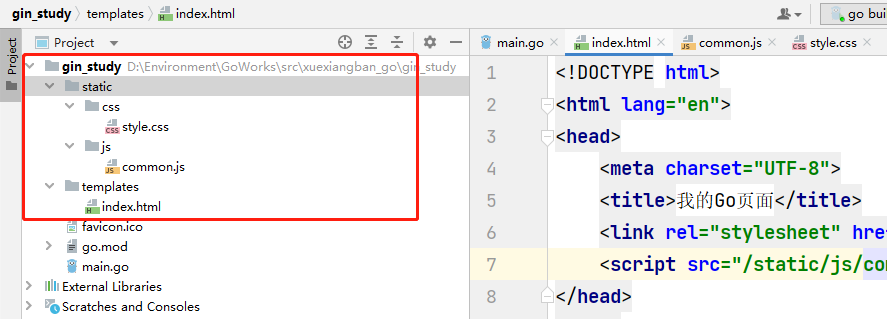

1、我们首先定义一个存放模板文件的`templates`文件夹，编写一个index.html

```html
<!DOCTYPE html>
<html lang="en">
<head>
    <meta charset="UTF-8">
    <title>我的Go页面</title>
    <link rel="stylesheet" href="/static/css/style.css">
    <script src="/static/js/common.js"></script>
</head>
<body>

<h1>感谢大家选择学相伴Go语言全栈课</h1>


获取传入的数据：
{{.msg}}

</body>
</html>
```

2、让程序进行页面渲染和加载

```go
// Gin框架中使用LoadHTMLGlob()或者LoadHTMLFiles()方法进行HTML模板渲染。
//ginServer.LoadHTMLFiles("templates/index.html")
ginServer.LoadHTMLGlob("templates/*")
```

3、通过请求来响应页面

```go
// 返回页面
ginServer.GET("/index", func(c *gin.Context) {
    // c.html(状态码，页面地址，向页面传输的数据)
   c.HTML(http.StatusOK, "index.html", gin.H{
      "msg": "这是后台传输的数据",
   })
})
```

4、启动测试

5、编写css和js文件，测试效果，发现无效

```css
body{
    background: aqua;
}
```

```js
alert(1)
```

6、我们需要让go语言能够渲染到我们的静态文件

```go
// 当我们渲染的HTML文件中引用了静态文件时
// 我们只需要按照以下方式在渲染页面前调用gin.Static方法即可。
ginServer.Static("/static", "./static")
```

7、再次启动测试

## 07、响应JSON

**1：返回普通数据类型**

```go
package main

import (
	"github.com/gin-gonic/gin"
)

func main() {
	// 创建gin服务
	ginServer := gin.Default()
	// localhost:8080/hello
	// 处理请求的函数 *gin.Context
	ginServer.GET("/hello", func(c *gin.Context) {
		// c.JSON：返回JSON格式的数据
		// gin.H : 参数 key value
		c.JSON(200, "success")
	})
	// 启动HTTP服务,可以修改端口
	ginServer.Run(":8088")
}

```

**2：返回结构体**

```go
package main

import (
	"github.com/gin-gonic/gin"
)

func main() {
	// 创建gin服务
	ginServer := gin.Default()
	// localhost:8080/hello
	// 处理请求的函数 *gin.Context
	
	ginServer.GET("/hello", func(c *gin.Context) {
		// c.JSON：返回JSON格式的数据
		// gin.H : 参数 key value
		type User struct {
			Username string `json:"username"`
			Password string `json:"password"`
		}
		user := User{"飞哥", "123456"}
		c.JSON(200, user)
	})
	// 启动HTTP服务,可以修改端口
	ginServer.Run(":8088")
}

```

**3：返回map**

```go
package main

import (
	"github.com/gin-gonic/gin"
)

func main() {
	// 创建gin服务
	ginServer := gin.Default()
	// localhost:8080/hello
	// 处理请求的函数 *gin.Context

	ginServer.GET("/hello", func(c *gin.Context) {
		// c.JSON：返回JSON格式的数据
		// gin.H : 参数 key value
		type User struct {
			Username string `json:"username"`
			Password string `json:"password"`
		}

		m := map[string]any{}
		m["username"] = "飞哥"
		m["age"] = 20

		c.JSON(200, m)
	})
	// 启动HTTP服务,可以修改端口
	ginServer.Run(":8088")
}

```

**4：返回切片结构体**

```go
package main

import (
	"github.com/gin-gonic/gin"
)

func main() {
	// 创建gin服务
	ginServer := gin.Default()
	// localhost:8080/hello
	// 处理请求的函数 *gin.Context

	ginServer.GET("/hello", func(c *gin.Context) {
		// c.JSON：返回JSON格式的数据
		// gin.H : 参数 key value
		type User struct {
			Username string `json:"username"`
			Password string `json:"password"`
		}

		users := make([]User, 2)
		users[0] = User{"飞哥", "123456"}
		users[1] = User{"飞哥", "123456"}

		c.JSON(200, users)
	})
	// 启动HTTP服务,可以修改端口
	ginServer.Run(":8088")
}

```


## 08、获取请求参数

### querystring 获取url中？携带的k=v参数与值

```go
// 编写请求
// http://localhost:8088/user/info?userid=2&username=kuangshen
ginServer.GET("/user/info", func(c *gin.Context) {
   // Query 返回取到的值
   // GetQuery 取到值返回(值, true),否则(值, false)
   userid := c.Query("userid")
   username, ok := c.GetQuery("username")
   if !ok {
      username = "username查询失败"
   }
   //返回json数据
   c.JSON(http.StatusOK, gin.H{
      "userid":   userid,
      "username": username,
   })
})
```

### 接收restful风格的参数

请求的参数通过URL路径传递，例如：`/user/info/1/kuangshen`。 获取请求URL路径中的参数的方式如下。

```go
// 编写请求
// http://localhost:8088/user/info/1/kuangshen
ginServer.GET("/user/info/:userid/:username", func(c *gin.Context) {

   // 通过 param 获取参数
   userid := c.Param("userid")
   username := c.Param("username")

   //返回json数据
   c.JSON(http.StatusOK, gin.H{
      "userid":   userid,
      "username": username,
   })
})
```


### 接收 表单 提交的数据

当前端请求的数据通过form表单提交时，例如向`/user/add`发送一个POST请求，获取请求数据的方式如下：

在index中编写 form 表单：

```html
<form action="/user/add" method="post">
    <p>username:<input type="text" name="username"/></p>
    <p>password:<input type="text" name="password"/></p>
    <button type="submit">提交</button>
</form>
```

后台去接收请求并输出：

```go
// 编写请求
ginServer.POST("/user/add", func(c *gin.Context) {
   // 使用c.PostForm接收表单参数
   username := c.PostForm("username")
   password := c.PostForm("password")
   c.JSON(http.StatusOK, gin.H{
      "msg":      "ok",
      "username": username,
      "password": password,
   })
})
```

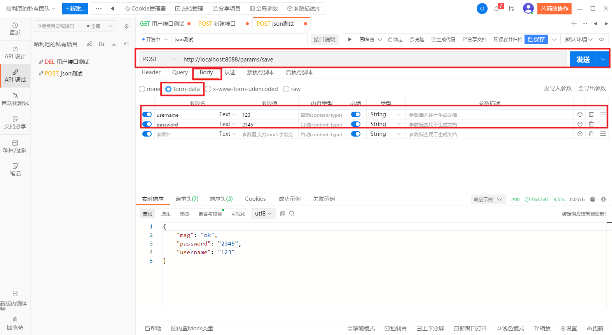

### 获取json参数

当前端请求的数据通过JSON提交时，例如向`/json`发送一个POST请求，则获取请求参数的方式如下：

```go
// 编写请求
ginServer.POST("/json", func(c *gin.Context) {
   // GetRawData : 从c.Request.Body读取请求数据, 返回 []byte
   b, _ := c.GetRawData()
   // 定义map或结构体接收
   var m map[string]interface{}
   // 包装为json数据
   _ = json.Unmarshal(b, &m)

   c.JSON(http.StatusOK, m)
})
```

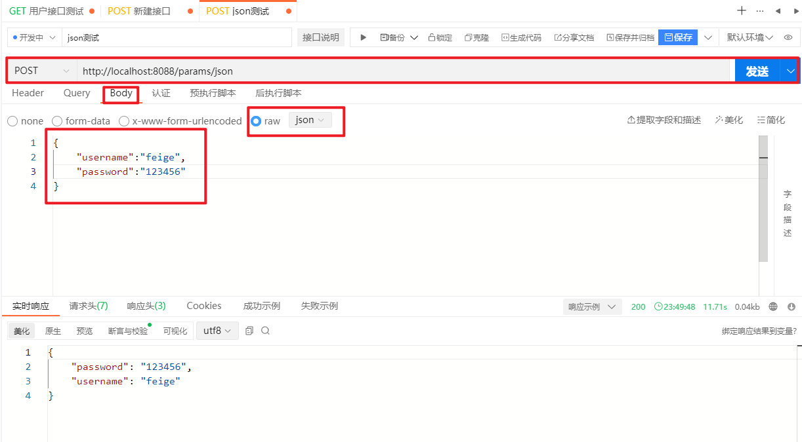


## 09、路由讲解

### 重定向

http重定向：

```go
ginServer.GET("/test", func(c *gin.Context) {
   c.Redirect(http.StatusMovedPermanently, "https://www.kuangstudy.com/")
})
```

### 路由重定向：

```go
// 指定重定向的URL
ginServer.GET("/test", func(c *gin.Context) {
   c.Request.URL.Path = "/test2"
   ginServer.HandleContext(c)
})

ginServer.GET("/test2", func(c *gin.Context) {
   c.JSON(http.StatusOK, gin.H{"msg": "test2的msg"})
})
```

### 404 页面

没有匹配到路由的请求都返回`views/404.html`页面。

```go
ginServer.NoRoute(func(c *gin.Context) {
   c.HTML(http.StatusNotFound, "404.html", nil)
})
```

### 路由组

我们可以将拥有共同URL前缀的路由划分为一个路由组。习惯性一对`{}`包裹同组的路由，这只是为了看着清晰，你用不用`{}`包裹功能上没什么区别。==也可以多重嵌套，用Group方法==

```go
package controllers

import "github.com/gin-gonic/gin"

func UserGroup(ginServer *gin.Engine) {
	userGroup := ginServer.Group("/course")
	{
		userGroup.GET("/index", func(c *gin.Context) { c.JSON(200, gin.H{"page": "user-index"}) })
		userGroup.GET("/login", func(c *gin.Context) { c.JSON(200, gin.H{"page": "user-login"}) })
		userGroup.POST("/logout", func(c *gin.Context) { c.JSON(200, gin.H{"page": "user-logout"}) })
	}
}

```

原理就是构造一个路由地址的前缀树。


## 10、中间件

Gin框架允许开发者在处理请求的过程中，加入用户自己的 HandlerFunc 函数。

它适合处理一些公共的业务逻辑，比如登录认证、权限校验、数据分页、记录日志、耗时统计等。

也就是我们这里说的中间件。

必须是一个`gin.HandlerFunc`类型。

**自定义**

1、定义一个我们自己的 HandlerFunc

```go
func myHandler() gin.HandlerFunc {
   return func(c *gin.Context) {
      // 可以通过c.Set在请求上下文中设置值，后续的处理函数能够取到该值
      c.Set("userSession", "userid-1")
      //c.Next() // 放行，默认就会放行
      c.Abort() // 拦截,到这里就不会往下执行请求了
      fmt.Println("HandlerFunc-info")
   }
}
```

2、注册全局路由，所有的请求都会经过这里来处理

```go
// 注册 全局的 HandlerFunc
ginServer.Use(myHandler())

// 学习
ginServer.GET("/test", func(c *gin.Context) {
    // 从上下文取值
    name := c.MustGet("userSession").(string)
    log.Println(name)
    c.JSON(http.StatusOK, gin.H{
        "name2": name,
    })
})
```

4、为某个路由单独注册

```go
ginServer.GET("/test", myHandler(), func(c *gin.Context) {
    // 从上下文取值
    name := c.MustGet("userSession").(string)
    log.Println(name)
    c.JSON(http.StatusOK, gin.H{
        "name": name,
    })
})
```

5、为路由组注册中间件

```go
shopGroup := r.Group("/shop", myHandler())
{
    shopGroup.GET("/index", func(c *gin.Context) {...})
    ...
}
```


**gin默认中间件**

`gin.Default()`默认使用了`Logger`和`Recovery`中间件，其中：

- `Logger`中间件将日志写入`gin.DefaultWriter`，即使配置了`GIN_MODE=release`。
- `Recovery`中间件会recover任何`panic`。如果有panic的话，会写入500响应码。

如果不想使用上面两个默认的中间件，可以使用`gin.New()`新建一个没有任何默认中间件的路由。


## 11、seesion

### session的基本原理

http协议是无状态的，就是说你在请求服务器同时，张三也在请求服务器，这时候服务器是不知道哪个请求是你，哪个请求张三（除非你们携带了一些识别字段，不过这属于业务层内容，不在讨论范围，我们单说http协议）。

- 为了让服务器知道哪个请求时你的，哪个是张三的。这时候就有了session。

- session和cookie是不分家的。我们每次说到session，其实默认就是要使用cookie了。

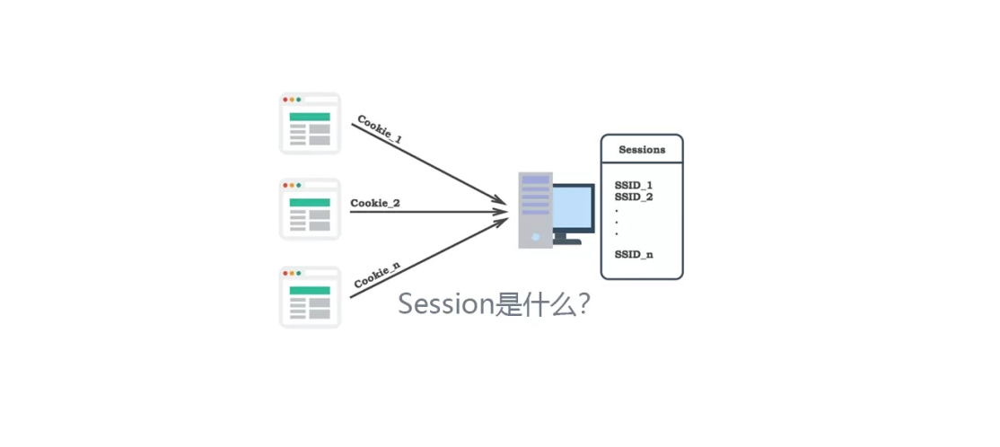


- 1: 我们的请求在默认情况下是无状态的，所谓的无状态就是指，gin定义一个路由地址，在浏览器访问以后，也就是
  发起一个request，到response的过程，整个过程结束后，并不会在服务器端存储数据。这样就会造成一个问题，
  无法解决各路由请求之间数据的共享问题。
- 2：如何解决这个问题呢？其实也就是session
- 3：session是一种服务器端的存储技术，其实在底层就是一个全局的map[string][any]对象。它可以把一些需要各个
  路由间共享的数据进行存储在内存中，直到服务器关闭或者超时才会清除。
- 4：有了session，为什么还有有sessionId呢？因为要区分是那个业务的数据，因为底层是map，所以大部分情况下都会
  用sessionId作为key.
- 5：有了session，为啥还要cookie技术呢，cookie是一种客户端的存储技术，在创建session的时候，每次都会把这个
  sessionId写入到客户端浏览器的cookie中，后续给未来的每个路由请求都携带这个sessionId, 到服务端的map种去匹配
  对应自己的数据信息。
- 6：从而达到数据的共享。

**我们举例说明一下什么是session：**

> 你要去逛超时，刚进门来到服务台时你是没有开储物柜的钥匙的。当你交钱了，服务台就给你一把储物柜的钥匙，这时储物柜就和你的钥匙绑定了。你去买东西，你一直会把钥匙带在身上。这时候你不管什么时候去服务台，只要你拿着钥匙，就会认识你，你拿着钥匙可以随便的到储物柜中拿取自己的东西。你要离开时，把钥匙归还服务台就可以了。
>
> 在程序里是怎么实现上面的过程的呢?
> 服务器就是服务台，储物柜就是session仓库，钥匙就是我们的凭证。携带钥匙其实就是cookie传输。

**场景**

第一次登录，服务器给客户端颁发一个唯一的sessionId, 并通过http的响应头返回。客户端（浏览器）发现返回的数据中有cookie数据就把这个cookie数据存放到内存。下次再发送http请求时，把内存中的cookie数据再塞到http请求头中，一并发给服务器，服务器在解析请求时，发现请求头中有cookie，就开始识别cookie中的sessionId，拿到sessionId，我们就知道这个请求时由哪个客户端发送来的了。

### gin配置session

gin框架在处理session时有专门的中间件，我们可以直接使用。

中间件： `github.com/gin-contrib/sessions` ，

```sh
go get github.com/gin-contrib/sessions
```

**使用sessions 中间件注意要点：**

> 1. session 仓库其实就是一个 map[interface]interface 对象，所有 session可以存储任意数据
> 2. session 使用的编解码器是自带的gob，所以存储类似： struct、map 这些对象时需要先注册对象，不然会报错 `gob: type not registered for...`
> 3. session 存储引擎支持： cookie、内存、mongodb、redis、postgres、memstore、memcached 以及 gorm 支持的各类数据库（mysql、sqlite）
> 4. session 在创建时有一个配置项，可以配置session过期时间、cookie、domain、secure、path等参数
> 5. **调用 session 方法： Set()、 Delete()、 Clear()、方法后，必须调用一次 Save() 方法。否则session数据不会更新**

```go
package main

import (
	"encoding/gob"
	"github.com/gin-contrib/sessions"
	"github.com/gin-contrib/sessions/cookie"
	"github.com/gin-gonic/gin"
	"net/http"
)

type User struct {
	Username string `json:"username"`
	Password string `json:"password"`
}

func main() {
	// 创建gin服务
	ginServer := gin.Default()
	// 创建cookie存储
	store := cookie.NewStore([]byte("secret"))
	//路由上加入session中间件
	ginServer.Use(sessions.Sessions("mysession", store))
	// 当我们渲染的HTML文件中引用了静态文件时
	// 我们只需要按照以下方式在渲染页面前调用gin.Static方法即可。
	ginServer.Static("/static", "./static")
	// Gin框架中使用LoadHTMLGlob()或者LoadHTMLFiles()方法进行HTML模板渲染。
	//ginServer.LoadHTMLFiles("templates/index.html")
	ginServer.LoadHTMLGlob("templates/*")
	// 我们首先要把数据类型注册进来，小伙伴们一定不要忘记注册进来。
	gob.Register(User{})
	// localhost:8080/hello
	// 处理请求的函数 *gin.Context

	ginServer.GET("/hello", func(c *gin.Context) {
		// c.JSON：返回JSON格式的数据
		// gin.H : 参数 key value
		user := User{"hanyun", "123456"}
		session := sessions.Default(c)
		//把结构体存入session中
		session.Set("user", user)
		session.Save()

		c.JSON(200, user)
	})

	// 返回页面
	ginServer.GET("/index", func(c *gin.Context) {
		// c.html(状态码，页面地址，向页面传输的数据)
		c.HTML(http.StatusOK, "index.html", gin.H{
			"msg": "这是后台传输的数据",
		})
	})

	ginServer.GET("/user", func(c *gin.Context) {
		session := sessions.Default(c)
		user := session.Get("user")
		c.JSON(http.StatusOK, user)
	})

	// 启动HTTP服务,可以修改端口
	ginServer.Run(":8088")
}

```


## 12、**跨域**

### 01、什么是跨域

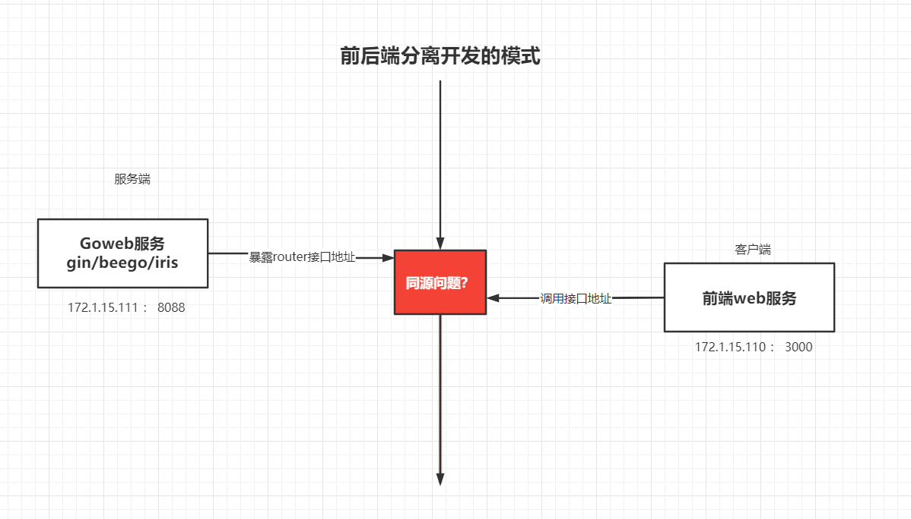

要了解什么是跨域，我们先说一下同源的概念。同源，是指协议、域名、端口都相同。  

**==例如：[http://192.168.0.1:8080](http://192.168.0.1:8080/)与[https://192.168.3.1:8080](https://192.168.3.1:8080/)不是同源，因为协议不同，第一个冒号前面的为协议，中间的为域名，第二个冒号后面的为端口，只要满足有一处不同，则就不是同源。==**

跨域是浏览器加载了与当前域名、协议、端口不同另一站点下的资源，这与各大支持JavaScript的浏览器的同源策略是违背的。所谓[**同源策略**](https://baike.baidu.com/item/同源策略)，它是由Netscape提出的一个著名的安全策略。现在所有支持JavaScript 的浏览器都会使用这个策略。所谓同源是指，域名，协议，端口相同。

**比如说，下面的几个域名是同源的：**

http://example.com/
http://example.com:80/
http://example.com/path/file
它们都具有相同的协议、相同的域名、相同的端口(不指定端口默认80)。

**而下面几个域名是不同源的：**

http://example.com/
http://example.com:8080/
http://www.example.com/
https://example.com:80/
https://example.com/
http://example.org/

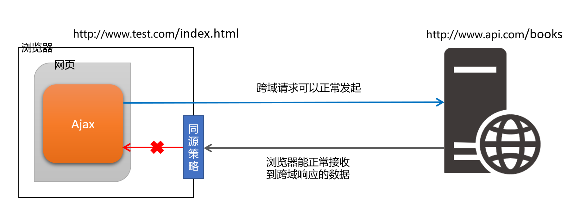

- 总之一句话，只要触发了不同源的情况，而且你是浏览器的方式请求接口地址，就会引发跨域问题。
- 同源：同源，是指协议、域名、端口都相同。  
- 不同源：只要任何一个协议、域名、端口都不相同。  就会引发跨域。


### 02、跨域会发生什么问题？

 为了安全起见，浏览器设置了[同源策略](https://so.csdn.net/so/search?q=同源策略&spm=1001.2101.3001.7020)，当页面执行脚本的时候，浏览器会检查访问的资源是否同源，如果不是，就会报错。如下：

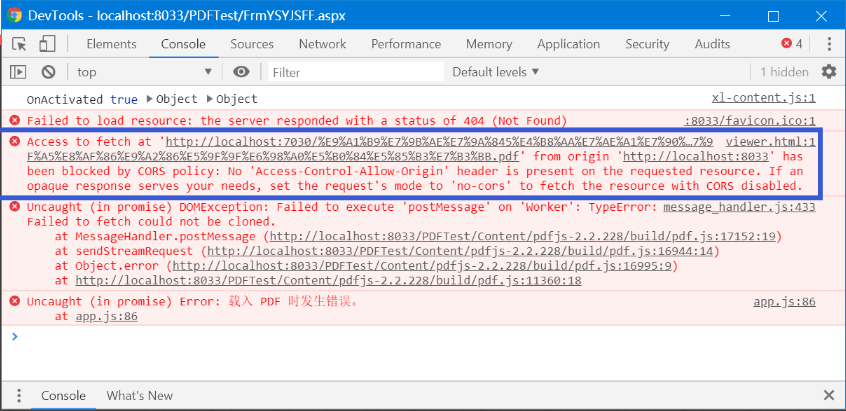


**1：准备工作**

导入vue/axios.js文件

**2：准备接口**

```go
func User(ginServer *gin.Engine) {
	// post -- 添加
	ginServer.POST("/user", func(context *gin.Context) {
		context.JSON(200, gin.H{"message": "POST"})
	})
}
```

**3：编写异步请求代码**

```js
<script src="/static/js/vue.js"></script>
<script src="/static/js/axios.min.js"></script>
<script>
    var vue = new Vue({
        el:"#app",
        data:{},
        created(){
            this.loadData();
        },
        methods:{
            loadData(){
                axios.post("http://localhost:8089/user").then(res=>{
                    console.log("res",res)
                })
            }
        }
    })
</script>
```

4: 启动8088和8089两个服务，查看跨域问题。


### 03、gin解决跨域

```go

func Cors() gin.HandlerFunc {
	return func(c *gin.Context) {
		method := c.Request.Method
		// 注意这一行，不能配置为通配符“*”号 比如未来写域名或者你想授权的域名都可以
		//c.Header("Access-Control-Allow-Origin", "http://localhost:8088")
		c.Header("Access-Control-Allow-Origin", "*")
		// 响应头表示是否可以将对请求的响应暴露给页面。返回true则可以，其他值均不可以。
		c.Header("Access-Control-Allow-Credentials", "true")
		// 表示此次请求中可以使用那些header字段
		c.Header("Access-Control-Allow-Headers", "Access-Control-Allow-Headers,Cookie, Content-Length,Origin,cache-control,X-Requested-With, Content-Type, Accept, Authorization, Token, Timestamp, UserId") // 我们自定义的header字段都需要在这里声明
		// 表示此次请求中可以使用那些请求方法 GET/POST(多个使用逗号隔开)
		c.Header("Access-Control-Allow-Methods", "POST, GET, OPTIONS,DELETE,PUT")
		// 放行所有OPTIONS方法
		if method == "OPTIONS" {
			//c.AbortWithStatus(http.StatusNoContent)
			c.AbortWithStatus(http.StatusOK)
		}
		// 处理请求
		c.Next()
	}
}
```

全局注册

```go
// 注册中间件---全局注册
ginServer.Use(Cors())
```

局部注册

```go
package controllers

import (
	"github.com/gin-gonic/gin"
	"xk-gin-web/filters"
)

func User(ginServer *gin.Engine) {

	// get --查询
	ginServer.GET("/user", filters.Cors(), func(context *gin.Context) {
		context.JSON(200, gin.H{"message": "Get"})
	})

	// post -- 添加
	ginServer.POST("/user", filters.Cors(), func(context *gin.Context) {
		context.JSON(200, gin.H{"message": "POST"})
	})

	// del -- 删除
	ginServer.DELETE("/user", filters.Cors(), func(context *gin.Context) {
		context.JSON(200, gin.H{"message": "Get"})
	})

	// put --- 修改
	ginServer.PUT("/user", filters.Cors(), func(context *gin.Context) {
		context.JSON(200, gin.H{"message": "Get"})
	})
}

```


## 13、小结


