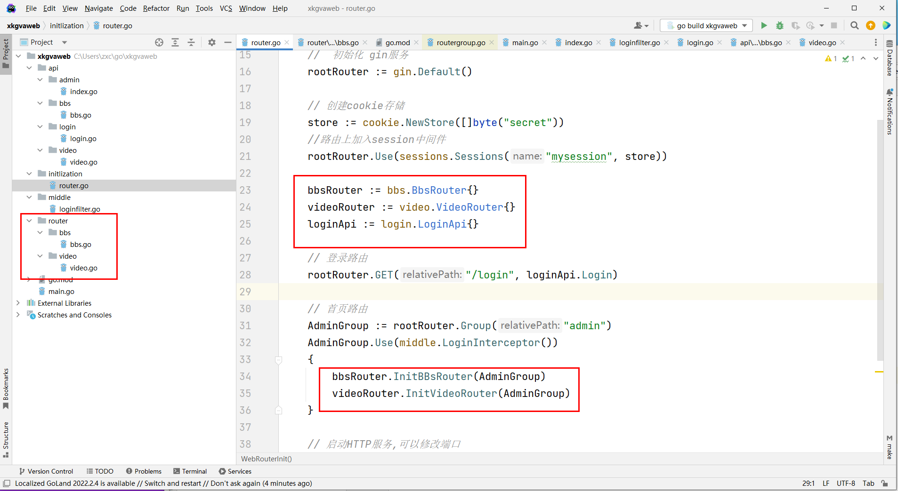

# GVA项目架构分析


## 分析gva

GVA ： gin vue admin 使用gin作为web服务，使用vue作为前端服务，来构建一个admin管理后台系统。

GIN-VUE-ADMIN是一个基于vue和gin开发的全栈前后端分离的开发基础平台，拥有jwt鉴权，动态路由，动态菜单，casbin鉴权，表单生成器，代码生成器等功能，提供了多种示例文件，让大家把更多时间专注在业务开发上。

## 追根溯源 - GO

- 认识go — 安装环境–go 

  - 人—      java/go –操作系统编译文件—0101010101—-然后写入go的进程进行隔离——go.exe

- 认识数据类型 (数字，字符串，浮点，布尔类型，数组，切片) go.exe

  - 数据类型其实就用一种二进制的一种具象化体现。  var  a int = 11111477 ==gobian=111100010101010
  - 我爱你–我-AF141——101025245555
  - 底层的数据类型其实就一个。数字 0 1
  - 那么为什么语音要弄出这么多具体的数据类型？就是考虑内存分配的问题。
  - var a int  = 100;  int—-
  - var a bool = true; 

- if/else/elseif / for/for range

- 函数 func  / 匿名函数 

  - func — 是一种包的范畴

- 数组

- 切片和map

- 指针和结构体

  - 方法 func —引用的范畴 （起到了约束的作用，也是一封装的思想）

- 面相对象编程

- 错误和异常

- io (文件上传)

- 反射

- 泛型（还没完全流行和推广）

- http编程

  


## web框架 GIN

安装gin的组件

```go
go get -u github.com/gin-gonic/gin
```

定义go的初始化

```go
package main

import (
	"fmt"
	"github.com/gin-gonic/gin"
)

func main() {
	//  初始化 gin服务
	rootRouter := gin.Default()
	// 启动HTTP服务,可以修改端口
    // rootRouter.Run(:8088) 这一行可以等价于下面的两行，但是注意写法上8088前面有一个:所以推荐使用下面的写法（官方也是下面的写法哦）
	address := fmt.Sprintf(":%d", 8088)
	rootRouter.Run(address)
}

```

### 路由

```go
// 配置路由
rootRouter.GET("/index", func(context *gin.Context) {
    context.JSON(http.StatusOK, "我是gin")
})

```

http://localhost:8088/index

### 路由组

```go
// 配置路由组
publicGroup := rootRouter.Group("/bbs")
{
    publicGroup.GET("/index", func(context *gin.Context) {
        context.JSON(http.StatusOK, "我是BBS的首页")
    })
    publicGroup.GET("/get/:id", func(context *gin.Context) {
        param := context.Param("id")
        context.JSON(http.StatusOK, "我是BBS的名字,参数:"+param)
    })
}
```

http://localhost:8088/bbs/index

http://localhost:8088/bbs/get/100


### 路由中间件

拦截器思维。

```go
package middle

import (
	"github.com/gin-contrib/sessions"
	"github.com/gin-gonic/gin"
	"net/http"
)

func LoginInterceptor() gin.HandlerFunc {
	return func(c *gin.Context) {
		// 获取会话
		session := sessions.Default(c)
		// 获取登录用户信息
		user := session.Get("user")
		//  如果用户没有登录，直接重定向返回登录
		if user == nil {
			c.Redirect(http.StatusMovedPermanently, "/login")
			c.Abort() // 拦截,到这里就不会往下执行请求了
		}
		// 取出会话信息
		username := user.(string)
		// 把session用户信息，放入到context文中，个后续路由进行使用
		// 好处就是：router中方法不需要再次获取session在来拿会话中的信息
		c.Set("username", username)
		c.Next() // 放行，默认就会放行
	}
}

```

中间件注册

```go
package main

import (
	"fmt"
	"github.com/gin-contrib/sessions"
	"github.com/gin-contrib/sessions/cookie"
	"github.com/gin-gonic/gin"
	"net/http"
	"xkgvaweb/middle"
)

func main() {
	//  初始化 gin服务
	rootRouter := gin.Default()

	// 创建cookie存储
	store := cookie.NewStore([]byte("secret"))
	//路由上加入session中间件
	rootRouter.Use(sessions.Sessions("mysession", store))

	// 配置路由
	rootRouter.GET("/login", func(c *gin.Context) {
		// session ---- 是一种所有请求之间的数据共享机制，为什么会出现session，是因为http请求是一种无状态。
		// 什么叫无状态：就是指，用户在浏览器输入方位地址的时候，地址请求到服务区，到响应服务，并不会存储任何数据在客户端或者服务端，
		// 也是就：一次request---response就意味着内存消亡，也就以为整个过程请求和响应过程结束。
		// 但是往往在开发中，我们可能要存存储一些信息，让各个请求之间进行共享。所有就出现了session会话机制
		// session会话机制其实是一种服务端存储技术，底层原理是一个map
		// 比如：我登录的时候，要把用户信息存储session中，然后给 map[key]any =
		// key = sdf365454klsdflsd --sessionid

		// 初始化session对象
		session := sessions.Default(c)
		// 存放用户信息到session
		session.Set("user", "feige") //map[sessionid] == map[user][feige]
		// 记住一定调用save方法，否则内存不会写入进去
		session.Save()
		c.JSON(http.StatusOK, "我是gin")
	})

	// 配置路由 /index--header---2
	//rootRouter.Use(middle.LoginInterceptor()).GET("/admin/index", func(c *gin.Context) {
	rootRouter.GET("/admin/index", middle.LoginInterceptor(), func(c *gin.Context) {
		// 获取会话
		session := sessions.Default(c)
		// 获取登录用户信息
		user := session.Get("user")
		username := user.(string)
		c.JSON(http.StatusOK, "我是gin"+username)
	})

	// 配置路由组
	publicGroup := rootRouter.Group("/admin/bbs").Use(middle.LoginInterceptor())
	{
		publicGroup.GET("/index", func(c *gin.Context) {
			username, _ := c.Get("username")
			// 可以获取到login放入session的数据
			c.JSON(http.StatusOK, "我是BBS的首页 ： "+username.(string))
		})

		publicGroup.GET("/get/:id", func(c *gin.Context) {
			username, _ := c.Get("username")
			// 可以获取到login放入session的数据
			param := c.Param("id")
			c.JSON(http.StatusOK, "我是BBS的名字,参数:"+param+"  ： "+username.(string))
		})
	}

	// 启动HTTP服务,可以修改端口
	address := fmt.Sprintf(":%d", 8088)
	rootRouter.Run(address)
}

```


##  封装Gin的路由

```go
package initlization

import (
	"fmt"
	"github.com/gin-contrib/sessions"
	"github.com/gin-contrib/sessions/cookie"
	"github.com/gin-gonic/gin"
	"xkgvaweb/api/login"
	"xkgvaweb/middle"
	"xkgvaweb/router/bbs"
	"xkgvaweb/router/video"
)

func WebRouterInit() {
	//  初始化 gin服务
	rootRouter := gin.Default()

	// 创建cookie存储
	store := cookie.NewStore([]byte("secret"))
	//路由上加入session中间件
	rootRouter.Use(sessions.Sessions("mysession", store))

	bbsRouter := bbs.BbsRouter{}
	videoRouter := video.VideoRouter{}
	loginApi := login.LoginApi{}

	// 登录路由
	rootRouter.GET("/login", loginApi.Login)

	// 首页路由
	AdminGroup := rootRouter.Group("admin")
	AdminGroup.Use(middle.LoginInterceptor())
	{
		bbsRouter.InitBBsRouter(AdminGroup)
		videoRouter.InitVideoRouter(AdminGroup)
	}
	
	// 启动HTTP服务,可以修改端口
	address := fmt.Sprintf(":%d", 8088)
	rootRouter.Run(address)
}

```

细节查看如下：




## 如何分析代码和方法执行

```go
initlization.WebRouterInit()
```

go里面，执行方法有两种：

- 包.函数 
- 引用.方法 

何谓函数：func test(){}  ,如果被结构体所约束的函数称之为方法。比如：

```go

type AdminApi struct {
}

// 登录处理的逻辑
func (e *AdminApi) Index(c *gin.Context) {
	// 获取会话
	session := sessions.Default(c)
	// 获取登录用户信息
	user := session.Get("user")
	username := user.(string)
	c.JSON(http.StatusOK, "我是gin"+username)
}

```

方法的执行的调用：必须是结构体的引用（对象）

工具性：函数，业务性的：结构体方法


