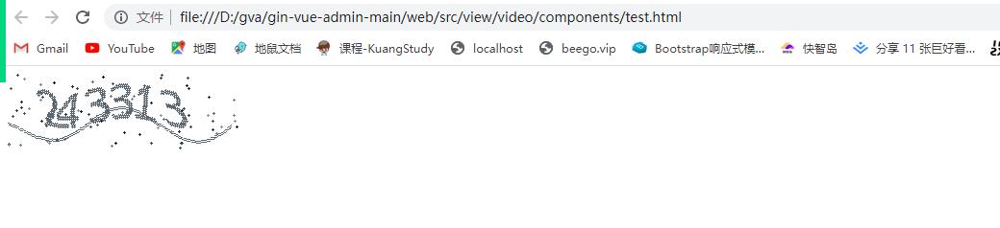
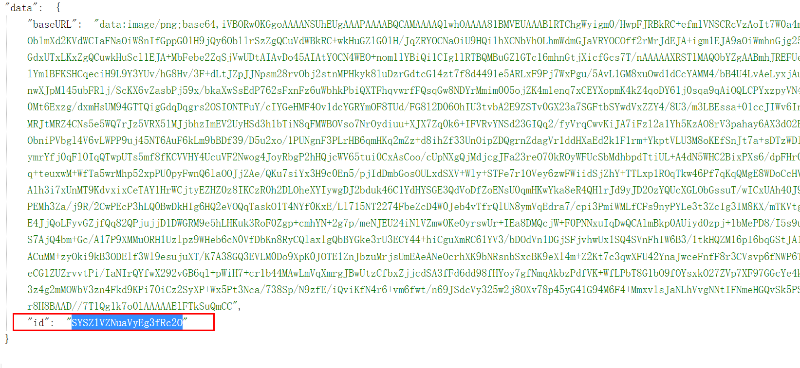
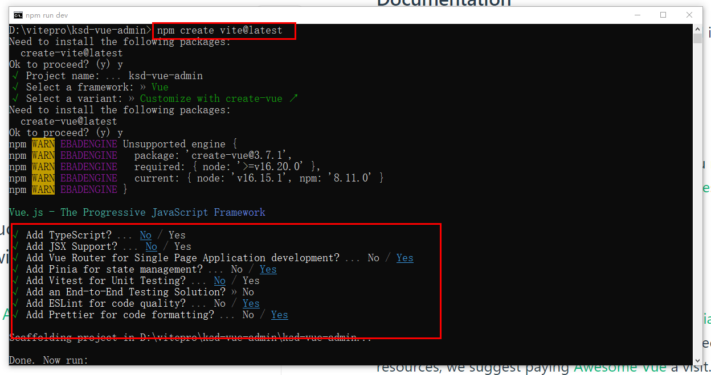
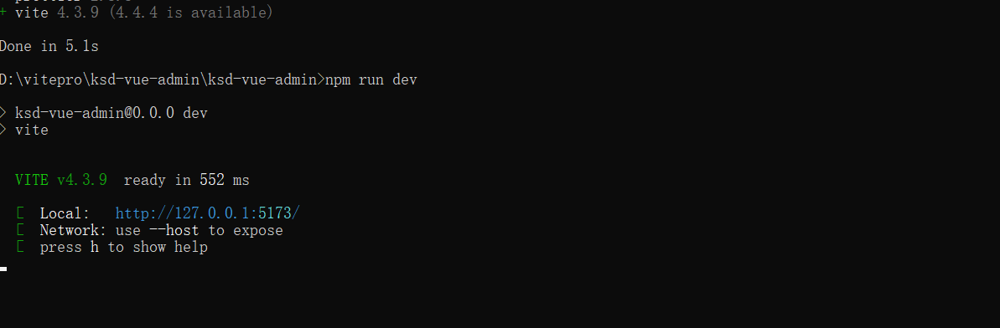
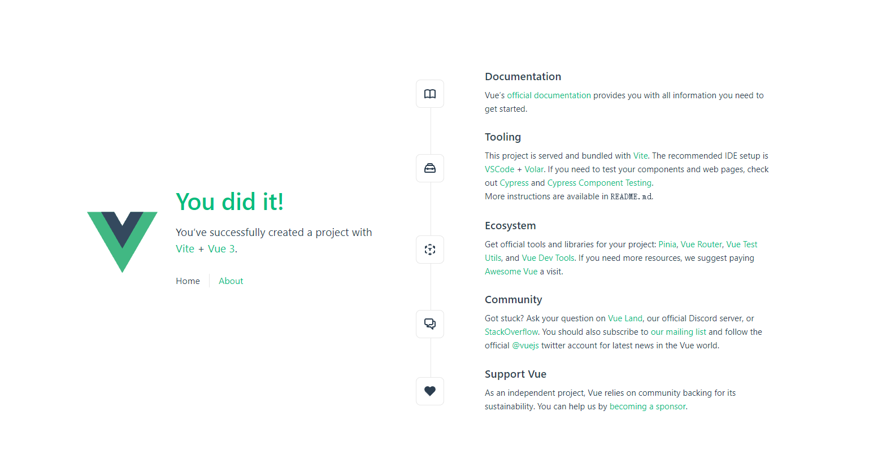
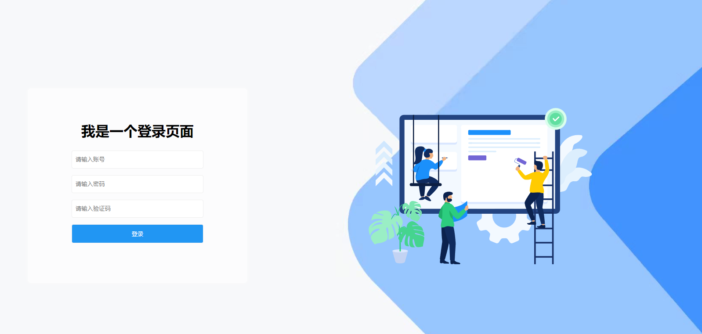
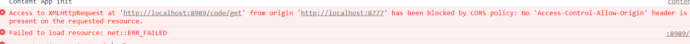

# 实现GORM框架的可配置性


## 01、可配置的数据库处理

1： 在yaml配置数据库信息

```yaml
# 数据库配置
# "root:mkxiaoer@tcp(127.0.0.1:3306)/ksd-social-db?charset=utf8&parseTime=True&loc=Local", // DSN data source name
database:
  mysql:
    host: 127.0.0.1
    port: 3306
    dbname: ksd-social-db
    username: root
    password: mkxiaoer
    config: charset=utf8&parseTime=True&loc=Local


```

2: 定义yaml的解析结构体

```go
package parse

//database:--------------------------------struct
//	mysql: --------------------------------struct
//		host: 127.0.0.1 -------------------field
//		port: 3306 -------------------field
//		dbname: ksd-social-db -------------------field
//		username: root -------------------field
//		password: mkxiaoer -------------------field
//		config: charset=utf8&parseTime=True&loc=Local -------------------field

type Database struct {
	Mysql Mysql `mapstructure:"mysql" json:"mysql" yaml:"mysql"`
}

type Mysql struct {
	Host     string `mapstructure:"host" json:"host" yaml:"host"`
	Port     string `mapstructure:"port" json:"port" yaml:"port"`
	Username string `mapstructure:"username" json:"username" yaml:"username"`
	Dbname   string `mapstructure:"dbname" json:"dbname" yaml:"dbname"`
	Password string `mapstructure:"password" json:"password" yaml:"password"`
	Config   string `mapstructure:"config" json:"config" yaml:"config"`
}

func (m *Mysql) Dsn() string {
	return m.Username + ":" + m.Password + "@tcp(" + m.Host + ":" + m.Port + ")/" + m.Dbname + "?" + m.Config
}

```

3: 在Config.go进行定义

```go
package parse

// 配置接下入口
type Config struct {
	Database Database `mapstructure:"database" json:"database" yaml:"database"`
}

```

因为commons包下的InitViper() 方法是把Config进行映射和绑定的。也就是说commons.Config其实就是整个YAML文件本身。里面定义属性（大部分都是结构体），其实也代表是某些业务配置的第一级、

## 02、使用自己的框架来实现登录接口 

1:  定义一个登录路由处理方法

```go
package login

import (
	"github.com/gin-gonic/gin"
	"net/http"
)

// 登录业务
type LoginApi struct{}

// 登录的接口处理
func (api *LoginApi) ToLogined(c *gin.Context) {
	c.JSON(http.StatusOK, "我是一个登录")
}

```

2: 定义具体的登录路由

```go
package login

import (
	"github.com/gin-gonic/gin"
	"xkginweb/api/v1/login"
)

// 登录路由
type LoginRouter struct{}

func (router *LoginRouter) InitLoginRouter(Router *gin.Engine) {
	loginApi := login.LoginApi{}
	// 单个定义
	//Router.GET("/login/toLogin", loginApi.ToLogined)
	//Router.GET("/login/toReg", loginApi.ToLogined)
	//Router.GET("/login/forget", loginApi.ToLogined)
	// 用组定义--（推荐）
	loginRouter := Router.Group("/login")
	{
		loginRouter.GET("/toLogin", loginApi.ToLogined)
		loginRouter.GET("/toReg", loginApi.ToLogined)
		loginRouter.GET("/forget", loginApi.ToLogined)
	}
}

```

3: 注册路由

```go
package initilization

import (
	"fmt"
	"github.com/gin-gonic/gin"
	"net/http"
	"time"
	"xkginweb/global"
	"xkginweb/router"
	"xkginweb/router/login"
)

func InitGinRouter() *gin.Engine {
	// 创建gin服务
	ginServer := gin.Default()
	// 提供服务组
	courseRouter := router.RouterWebGroupApp.Course.CourseRouter
	videoRouter := router.RouterWebGroupApp.Video.VideoRouter
	loginRouter := login.LoginRouter{}
	// 接口隔离，比如登录，健康检查都不需要拦截和做任何的处理
	loginRouter.InitLoginRouter(ginServer)
	// 业务模块接口，
	publicGroup := ginServer.Group("/api")
	{
		videoRouter.InitVideoRouter(publicGroup)
		courseRouter.InitCourseRouter(publicGroup)
	}

	fmt.Println("router register success")
	return ginServer
}

func RunServer() {
	// 初始化路由
	Router := InitGinRouter()
	// 为用户头像和文件提供静态地址
	Router.StaticFS("/static", http.Dir("/static"))
	address := fmt.Sprintf(":%d", global.Yaml["server.port"])
	// 启动HTTP服务,courseController
	s := initServer(address, Router)
	// 保证文本顺序输出
	// In order to ensure that the text order output can be deleted
	time.Sleep(10 * time.Microsecond)

	s2 := s.ListenAndServe().Error()
	fmt.Println("服务启动完毕 ", s2)
}

```

4: 访问 http://localhost:9899/login/toLogin


## 03、快速的整合gorm和db实现登录

1: 准备一个用户表

```go
package user

import (
	"database/sql"
	"gorm.io/gorm"
	"time"
)

type User struct {
	ID           uint `gorm:"primaryKey"`
	Name         string
	Email        *string
	Age          uint8
	Birthday     time.Time
	MemberNumber sql.NullString
	ActivatedAt  sql.NullTime
	CreatedAt    time.Time      `gorm:"autoUpdateTime"`
	UpdatedAt    time.Time      `gorm:"autoUpdateTime"`
	DeletedAt    gorm.DeletedAt `gorm:"index"`
}

// 覆盖生成表
func (User) TableName() string {
	return "xk_test_user"
}

```

2: 定义service

```go
package user

import (
	"xkginweb/global"
	"xkginweb/model/user"
)

// 对用户表的数据层处理
type UserService struct{}

// nil 是go空值处理，必须是指针类型
func (service *UserService) getUserByAccount(account string) (user *user.User, err error) {
	// 根据account进行查询
	err = global.KSD_DB.Where("account = ?", account).First(&user).Error
	if err != nil {
		return nil, err
	}
	return user, nil
}

```

3: 其实就调用service方法

```go
package login

import (
	"github.com/gin-gonic/gin"
	"net/http"
	"xkginweb/service/user"
)

// 登录业务
type LoginApi struct{}

// 登录的接口处理
func (api *LoginApi) ToLogined(c *gin.Context) {

	// 1：获取用户在页面上输入的账号和密码开始和数据库里数据进行校验
	userService := user.UserService{}

	// 模拟用户前端输入的账号和密码
	inputAccount := "feige1"
	inputPassword := "123456"

	dbUser, err := userService.GetUserByAccount(inputAccount)
	if err != nil {
		c.JSON(http.StatusOK, "你输入的账号和密码有误!!!")
		return
	}

	// 这个时候就判断用户输入密码和数据库的密码是否一致
	if dbUser != nil && dbUser.Password == inputPassword {
		c.JSON(http.StatusOK, dbUser)
	} else {
		c.JSON(http.StatusOK, "你输入的账号和密码有误!!!")
	}
}

```

开始模拟用户是否登录成功。

- 正常的的情况返回的，status=200 ,ok。 说明没有问题，返回整个用户对象
- 如果输入错误账号和密码，那就直接提示：你输入的账号和密码有误!!!"  

你发现一个问题，这个就无论你返回的正确的信息还是错误的信息。你都必须是：http.StatusOK  。那么这个状态到底是什么含义呢？能u自定义呢？答案是不能。但是这个状态有什么用。可以看到整个请求和响应的所以的执行过程，我们可以通过http.Status这个状态可以分析请求和响应的错误到底是什么？


## 04、关于http.Status

所有的web框架，为了监听请求和响应整个执行过程，定义了一系列的状态。然后给开发者使用。不同状态，浏览器进行处理的结果和响应方式可能都会不一样。

### 1、 HTTP Status Code 1xx 请求信息

这一组[状态码](https://so.csdn.net/so/search?q=状态码&spm=1001.2101.3001.7020)表明这是一个临时性响应。此响应仅由状态行和可选的HTTP头组成，以一个空行结尾。由于HTTP／1.0未定义任何1xx状态码，所以不要向HTTP／1.0客户端发送1xx响应。

| Http状态码    | Http Status Code                                             | Http状态码含义中文说明 |
| :------------ | :----------------------------------------------------------- | :--------------------- |
| ***\*100\**** | [100 Continue](https://seo.juziseo.com/doc/http_code/100)    | 请继续请求             |
| ***\*101\**** | [101 Switching Protocols](https://seo.juziseo.com/doc/http_code/101) | 请切换协议             |
| ***\*102\**** | [102 Processing](https://seo.juziseo.com/doc/http_code/102)  | 将继续执行请求         |


### 2、 HTTP Status Code 2xx 成功状态

这一组状态码表明客户端的请求已经被服务器端成功接收并正确解析。

| Http状态码    | Http Status Code                                             | Http状态码含义中文说明                  |
| :------------ | :----------------------------------------------------------- | :-------------------------------------- |
| ***\*200\**** | [200 OK](https://seo.juziseo.com/doc/http_code/200)          | 请求成功                                |
| ***\*201\**** | [201 Created](https://seo.juziseo.com/doc/http_code/201)     | 请求已被接受，等待资源响应              |
| ***\*202\**** | [202 Accepted](https://seo.juziseo.com/doc/http_code/202)    | 请求已被接受，但尚未处理                |
| ***\*203\**** | [203 Non-Authoritative Information](https://seo.juziseo.com/doc/http_code/203) | 请求已成功处理，结果来自第三方拷贝      |
| ***\*204\**** | [204 No Content](https://seo.juziseo.com/doc/http_code/204)  | 请求已成功处理，但无返回内容            |
| ***\*205\**** | [205 Reset Content](https://seo.juziseo.com/doc/http_code/205) | 请求已成功处理，但需重置内容            |
| ***\*206\**** | [206 Partial Content](https://seo.juziseo.com/doc/http_code/206) | 请求已成功处理，但仅返回了部分内容      |
| ***\*207\**** | [207 Multi-Status](https://seo.juziseo.com/doc/http_code/207) | 请求已成功处理，返回了多个状态的XML消息 |
| ***\*208\**** | [208 Already Reported](https://seo.juziseo.com/doc/http_code/208) | 响应已发送                              |
| ***\*226\**** | [226 IM Used](https://seo.juziseo.com/doc/http_code/226)     | 已完成响应                              |

### 3、 HTTP Status Code 3xx 重定向状态

这一组状态码表示客户端需要采取更进一步的行动来完成请求。通常，这些状态码用来重定向，后续的请求地址（重定向目标）在本次响应的Location域中指明。

| Http状态码    | Http Status Code                                             | Http状态码含义中文说明         |
| :------------ | :----------------------------------------------------------- | :----------------------------- |
| ***\*300\**** | [300 Multiple Choices](https://seo.juziseo.com/doc/http_code/300) | 返回多条重定向供选择           |
| ***\*301\**** | [301 Moved Permanently](https://seo.juziseo.com/doc/http_code/301) | 永久重定向                     |
| ***\*302\**** | [302 Found](https://seo.juziseo.com/doc/http_code/302)       | 临时重定向                     |
| ***\*303\**** | [303 See Other](https://seo.juziseo.com/doc/http_code/303)   | 当前请求的资源在其它地址       |
| ***\*304\**** | [304 Not Modified](https://seo.juziseo.com/doc/http_code/304) | 请求资源与本地缓存相同，未修改 |
| ***\*305\**** | [305 Use Proxy](https://seo.juziseo.com/doc/http_code/305)   | 必须通过代理访问               |
| ***\*306\**** | [306 (已废弃)Switch Proxy](https://seo.juziseo.com/doc/http_code/306) | (已废弃)请切换代理             |
| ***\*307\**** | [307 Temporary Redirect](https://seo.juziseo.com/doc/http_code/307) | 临时重定向，同302              |
| ***\*308\**** | [308 Permanent Redirect](https://seo.juziseo.com/doc/http_code/308) | 永久重定向，且禁止改变http方法 |

### 4、 HTTP Status Code 4xx 客户端错误

这一组状态码表示客户端的请求存在错误，导致服务器无法处理。除非响应的是一个HEAD请求，否则服务器就应该返回一个解释当前错误状况的实体，以及这是临时的还是永久性的状况。这些状态码适用于任何请求方法。浏览器应当向用户显示任何包含在此类错误响应中的实体内容。

| Http状态码    | Http Status Code                                             | Http状态码含义中文说明               |
| :------------ | :----------------------------------------------------------- | :----------------------------------- |
| ***\*400\**** | [400 Bad Request](https://seo.juziseo.com/doc/http_code/400) | 请求错误，通常是访问的域名未绑定引起 |
| ***\*401\**** | [401 Unauthorized](https://seo.juziseo.com/doc/http_code/401) | 需要身份认证验证                     |
| ***\*402\**** | [402 Payment Required](https://seo.juziseo.com/doc/http_code/402) | -                                    |
| ***\*403\**** | [403 Forbidden](https://seo.juziseo.com/doc/http_code/403)   | 禁止访问                             |
| ***\*404\**** | [404 Not Found](https://seo.juziseo.com/doc/http_code/404)   | 请求的内容未找到或已删除             |
| ***\*405\**** | [405 Method Not Allowed](https://seo.juziseo.com/doc/http_code/405) | 不允许的请求方法                     |
| ***\*406\**** | [406 Not Acceptable](https://seo.juziseo.com/doc/http_code/406) | 无法响应，因资源无法满足客户端条件   |
| ***\*407\**** | [407 Proxy Authentication Required](https://seo.juziseo.com/doc/http_code/407) | 要求通过代理的身份认证               |
| ***\*408\**** | [408 Request Timeout](https://seo.juziseo.com/doc/http_code/408) | 请求超时                             |
| ***\*409\**** | [409 Conflict](https://seo.juziseo.com/doc/http_code/409)    | 存在冲突                             |
| ***\*410\**** | [410 Gone](https://seo.juziseo.com/doc/http_code/410)        | 资源已经不存在(过去存在)             |
| ***\*411\**** | [411 Length Required](https://seo.juziseo.com/doc/http_code/411) | 无法处理该请求                       |
| ***\*412\**** | [412 Precondition Failed](https://seo.juziseo.com/doc/http_code/412) | 请求条件错误                         |
| ***\*413\**** | [413 Payload Too Large](https://seo.juziseo.com/doc/http_code/413) | 请求的实体过大                       |
| ***\*414\**** | [414 Request-URI Too Long](https://seo.juziseo.com/doc/http_code/414) | 请求的URI过长                        |
| ***\*415\**** | [415 Unsupported Media Type](https://seo.juziseo.com/doc/http_code/415) | 无法处理的媒体格式                   |
| ***\*416\**** | [416 Range Not Satisfiable](https://seo.juziseo.com/doc/http_code/416) | 请求的范围无效                       |
| ***\*417\**** | [417 Expectation Failed](https://seo.juziseo.com/doc/http_code/417) | 无法满足的Expect                     |
| ***\*418\**** | [418 I'm a teapot](https://seo.juziseo.com/doc/http_code/418) | 愚人节笑话                           |
| ***\*421\**** | [421 There are too many connections from your internet address](https://seo.juziseo.com/doc/http_code/421) | 连接数超限                           |
| ***\*422\**** | [422 Unprocessable Entity](https://seo.juziseo.com/doc/http_code/422) | 请求的语义错误                       |
| ***\*423\**** | [423 Locked](https://seo.juziseo.com/doc/http_code/423)      | 当前资源被锁定                       |
| ***\*424\**** | [424 Failed Dependency](https://seo.juziseo.com/doc/http_code/424) | 当前请求失败                         |
| ***\*425\**** | [425 Unordered Collection](https://seo.juziseo.com/doc/http_code/425) | 未知                                 |
| ***\*426\**** | [426 Upgrade Required](https://seo.juziseo.com/doc/http_code/426) | 请切换到TLS/1.0                      |
| ***\*428\**** | [428 Precondition Required](https://seo.juziseo.com/doc/http_code/428) | 请求未带条件                         |
| ***\*429\**** | [429 Too Many Requests](https://seo.juziseo.com/doc/http_code/429) | 并发请求过多                         |
| ***\*431\**** | [431 Request Header Fields Too Large](https://seo.juziseo.com/doc/http_code/431) | 请求头过大                           |
| ***\*449\**** | [449 Retry With](https://seo.juziseo.com/doc/http_code/449)  | 请重试                               |
| ***\*451\**** | [451 Unavailable For Legal Reasons](https://seo.juziseo.com/doc/http_code/451) | 访问被拒绝（法律的要求）             |
| ***\*499\**** | [499 Client Closed Request](https://seo.juziseo.com/doc/http_code/499) | 客户端主动关闭了连接                 |

### 5、 HTTP Status Code 5xx 服务器错误状态

这一组状态码说明服务器在处理请求的过程中有错误或者异常状态发生，也有可能是服务器意识到以当前的软硬件资源无法完成对请求的处理。除非这是一个HEAD请求，否则服务器应当包含一个解释当前错误状态以及这个状况是临时的还是永久的解释信息实体。浏览器应当向用户展示任何在当前响应中被包含的实体。

| Http状态码    | Http Status Code                                             | Http状态码含义中文说明   |
| :------------ | :----------------------------------------------------------- | :----------------------- |
| ***\*500\**** | [500 Internal Server Error](https://seo.juziseo.com/doc/http_code/500) | 服务器端程序错误         |
| ***\*501\**** | [501 Not Implemented](https://seo.juziseo.com/doc/http_code/501) | 服务器不支持的请求方法   |
| ***\*502\**** | [502 Bad Gateway](https://seo.juziseo.com/doc/http_code/502) | 网关无响应               |
| ***\*503\**** | [503 Service Unavailable](https://seo.juziseo.com/doc/http_code/503) | 服务器端临时错误         |
| ***\*504\**** | [504 Gateway Timeout](https://seo.juziseo.com/doc/http_code/504) | 网关超时                 |
| ***\*505\**** | [505 HTTP Version Not Supported](https://seo.juziseo.com/doc/http_code/505) | 服务器不支持的HTTP版本   |
| ***\*506\**** | [506 Variant Also Negotiates](https://seo.juziseo.com/doc/http_code/506) | 服务器内部配置错误       |
| ***\*507\**** | [507 Insufficient Storage](https://seo.juziseo.com/doc/http_code/507) | 服务器无法存储请求       |
| ***\*508\**** | [508 Loop Detected](https://seo.juziseo.com/doc/http_code/508) | 服务器因死循环而终止操作 |
| ***\*509\**** | [509 Bandwidth Limit Exceeded](https://seo.juziseo.com/doc/http_code/509) | 服务器带宽限制           |
| ***\*510\**** | [510 Not Extended](https://seo.juziseo.com/doc/http_code/510) | 获取资源策略未被满足     |
| ***\*511\**** | [511 Network Authentication Required](https://seo.juziseo.com/doc/http_code/511) | 需验证以许可连接         |
| ***\*599\**** | [599 Network Connect Timeout Error](https://seo.juziseo.com/doc/http_code/599) | 网络连接超时             |

上面的这些状态全部都是描述请求和响应的整个过程的状态。不包含业务的状态。我举例例子

```go
c.JSON(http.StatusOK, "你输入的账号和密码有误!!!")
```

在开发中一个接口：成功只有一种情况，但是失败和错误就有N种情况。那么这些N情况的返回到底选择什么样子状态就变得非常的重要。你接下来就困难选择症（你不知道到底选择什么？），而且你在这些状态找不到适合的，所以业务的状态处理不应该选择web框架中提供的。因为这些状态根本就不是让你来做业务错误的状态监控，别人专门去web请求和响应的状态的监听。

那么怎么处理。通过自己的方式来定义状态。但是所有的返回都用：http.StatusOK

- 只要请求和响应是正常的，无论正确和错误，我们都用http.StatusOK来返回，但是区分和界定用自己定义的状态来定义业务、

这也就是为什么我们要做自定义返回的意义和价值了.

## 05、开始学会使用map来封装返回

```go
package login

import (
	"github.com/gin-gonic/gin"
	"net/http"
	"xkginweb/service/user"
)

// 登录业务
type LoginApi struct{}

// 登录的接口处理
func (api *LoginApi) ToLogined(c *gin.Context) {

	// 1：获取用户在页面上输入的账号和密码开始和数据库里数据进行校验
	userService := user.UserService{}

	m := map[string]any{}

	// 模拟用户前端输入的账号和密码
	inputAccount := "feige1"
	inputPassword := "123456"

	if len(inputAccount) == 0 {
		m["code"] = 60002
		m["msg"] = "请输入账号!!!"
		c.JSON(http.StatusOK, m)
		return
	}

	if len(inputPassword) == 0 {
		m["code"] = 60002
		m["msg"] = "请输入密码!!!"
		c.JSON(http.StatusOK, "请输入密码!!!")
		return
	}

	dbUser, err := userService.GetUserByAccount(inputAccount)
	if err != nil {
		m["code"] = 60001
		m["msg"] = "你输入的账号和密码有误!!!"
		c.JSON(http.StatusOK, m)
		return
	}
	// 这个时候就判断用户输入密码和数据库的密码是否一致
	if dbUser != nil && dbUser.Password == inputPassword {
		m["code"] = 20000
		m["msg"] = dbUser
		c.JSON(http.StatusOK, dbUser)
	} else {
		m["code"] = 60001
		m["msg"] = "你输入的账号和密码有误"
		c.JSON(http.StatusOK, "你输入的账号和密码有误!!!")
	}
}

```

但是map有一个非常麻烦的事情，就是key不具备面向对象。写起来很郁闷和不方便。

```go
package response

import (
	"github.com/gin-gonic/gin"
	"net/http"
)

// R Response ServerResult Result

type Response struct {
	Code int         `json:"code"`
	Msg  string      `json:"msg"`
	Data interface{} `json:"data"`
}

func Result(code int, msg string, data any, c *gin.Context) {
	c.JSON(http.StatusOK, Response{code, msg, data})
}

var (
	CODE = 20000
	MSG  = "success"
)

/*
*
成功
*/
func Ok(c *gin.Context) {
	Result(CODE, "操作成功", map[string]interface{}{}, c)
}

func OkWithData(data interface{}, c *gin.Context) {
	Result(CODE, MSG, data, c)
}

/*
*
失败
*/
func Fail(code int, msg string, c *gin.Context) {
	Result(code, msg, map[string]any{}, c)
}

func FailWithData(code int, msg string, data any, c *gin.Context) {
	Result(code, msg, data, c)
}

```

## 06：如果返回的值出现的属性是大写的，说明没有配置json

```go
package user

import (
	"gorm.io/gorm"
	"time"
)

type User struct {
	ID        uint           `gorm:"primaryKey"json:"id"`
	Name      string         `json:"name"`
	Account   string         `gorm:"unique"json:"account"`
	Password  string         `json:"password"`
	Email     *string        `json:"email"`
	Age       uint8          `json:"age"`
	Birthday  time.Time      `json:"birthday"`
	CreatedAt time.Time      `gorm:"autoUpdateTime"json:"createAt"`
	UpdatedAt time.Time      `gorm:"autoUpdateTime"json:"updatedAt"`
	DeletedAt gorm.DeletedAt `gorm:"index"`
}

// 覆盖生成表
func (User) TableName() string {
	return "xk_admin_user"
}

```

返回的时候就变成小写，如下

```json
{
  "code": 20000,
  "msg": "success",
  "data": {
    "id": 1,
    "name": "飞哥",
    "account": "feige1",
    "password": "123456",
    "email": "123456@qq.com",
    "age": 12,
    "birthday": "2023-07-13T21:08:58+08:00",
    "createAt": "2023-07-13T21:09:05+08:00",
    "updatedAt": "2023-07-13T21:09:05+08:00",
    "DeletedAt": null
  }
}
```


## 07、接口的合理性和参数的获取和调试

1: 登录属于form提交范畴的，一般的处理方案：post请求。

```GO
package login

import (
	"github.com/gin-gonic/gin"
	"xkginweb/api/v1/login"
)

// 登录路由
type LoginRouter struct{}

func (router *LoginRouter) InitLoginRouter(Router *gin.Engine) {
	loginApi := login.LoginApi{}
	// 单个定义
	//Router.GET("/login/toLogin", loginApi.ToLogined)
	//Router.GET("/login/toReg", loginApi.ToLogined)
	//Router.GET("/login/forget", loginApi.ToLogined)
    
	// 用组定义--（推荐）
	loginRouter := Router.Group("/login")
	{
		loginRouter.POST("/toLogin", loginApi.ToLogined)
	}
}

```

2: 参数动态化

```go
```

一般如果你要模拟参数的动态化，要么使用：test.http文件，或者使用swagger，或者apiforx或者程序代码。显然程序代码我们还没搭建框架，自然就不能使用。我们可以考虑apifox


## 08、集成验证码功能

### 1:  下载验证码的组件

- 官网：https://github.com/mojocn/base64Captcha

- 下载模块：

  ```
  go get github.com/mojocn/base64Captcha
  ```

### 2: 定义生成验证码的路由

```go
package code

import (
	"github.com/gin-gonic/gin"
	"github.com/mojocn/base64Captcha"
	"xkginweb/commons/response"
)

// 验证码生成
type CodeApi struct{}

// 2：创建验证码
func (api *CodeApi) CreateCaptcha(c *gin.Context) {
	// 1: 定义验证的store --默认是存储在go内存中
	var store = base64Captcha.DefaultMemStore
	// 2：生成验证码的类型,这个默认类型是一个数字的验证码
	var driver = base64Captcha.DefaultDriverDigit
	// 更改验证码长度
	driver.Length = 6
	// 3：调用NewCaptcha方法生成具体验证码对象
	captcha := base64Captcha.NewCaptcha(driver, store)
	// 4: 调用Generate()生成具体base64验证码的图片地址，和id
	// id 是用于后续校验使用，后续根据id和用户输入的验证码去调用store的get方法，就可以得到你输入的验证码是否正确，正确true,错误false
	id, baseURL, err := captcha.Generate()

	if err != nil {
		response.Fail(40001, "验证生成错误", c)
		return
	}
	response.Ok(map[string]any{"id": id, "baseURL": baseURL}, c)
}

```

### 3: 注册路由

```go
package code

import (
	"github.com/gin-gonic/gin"
	"xkginweb/api/v1/code"
)

type CodeRouter struct{}

func (e *CodeRouter) InitCodeRouter(Router *gin.Engine) {

	codeApi := code.CodeApi{}
	// 这个路由多了一个对对post，put请求的中间件处理，而这个中间件做了一些对post和put的参数的处理和一些公共信息的处理
	courseRouter := Router.Group("code") //.Use(middleware.OperationRecord())
	{
		courseRouter.GET("get", codeApi.CreateCaptcha)
	}
}

```

```go
package initilization

import (
	"fmt"
	"github.com/gin-gonic/gin"
	"net/http"
	"time"
	"xkginweb/global"
	"xkginweb/router"
	"xkginweb/router/code"
	"xkginweb/router/login"
)

func InitGinRouter() *gin.Engine {
	// 创建gin服务
	ginServer := gin.Default()
	// 提供服务组
	courseRouter := router.RouterWebGroupApp.Course.CourseRouter
	videoRouter := router.RouterWebGroupApp.Video.VideoRouter
	loginRouter := login.LoginRouter{}
	codeRouter := code.CodeRouter{}
	// 接口隔离，比如登录，健康检查都不需要拦截和做任何的处理
	loginRouter.InitLoginRouter(ginServer)
	codeRouter.InitCodeRouter(ginServer) //--------------新增--------------这行初始化验证码路由
	// 业务模块接口，
	publicGroup := ginServer.Group("/api")
	{
		videoRouter.InitVideoRouter(publicGroup)
		courseRouter.InitCourseRouter(publicGroup)
	}

	fmt.Println("router register success")
	return ginServer
}

func RunServer() {
	// 初始化路由
	Router := InitGinRouter()
	// 为用户头像和文件提供静态地址
	Router.StaticFS("/static", http.Dir("/static"))
	address := fmt.Sprintf(":%d", global.Yaml["server.port"])
	// 启动HTTP服务,courseController
	s := initServer(address, Router)
	// 保证文本顺序输出
	// In order to ensure that the text order output can be deleted
	time.Sleep(10 * time.Microsecond)

	s2 := s.ListenAndServe().Error()
	fmt.Println("服务启动完毕 ", s2)
}

```

### 4: 访问

http://localhost:8989/code/get

```json
{
"code": 20000,
"msg": "success",
"data": {
"baseURL": "data:image/png;base64,iVBORw0KGgoAAAANSUhEUgAAAPAAAABQCAMAAAAQlwhOAAAA81BMVEUAAABbaHGMmaJSX2gRHicgLTZdanOIlZ4xPkcdKjNBTlcNGiOHlJ1GU1yBjpeLmKFbaHFBTleFkpuNmqMoNT59ipNue4QgLTY3RE0CDxhhbndCT1gQHSaMmaKDkJlpdn9odX5hbnccKTJue4QgLTYPHCUhLjcbKDFlcns3RE10gYoVIit5ho8CDxhteoMhLjcqN0ARHicaJzB3hI11gotue4QFEhtQXWY7SFFEUVpATVZ0gYqGk5x1got1gotodX5FUluDkJkeKzQ9SlMJFh9JVl83RE0VIitKV2B0gYpVYmt9ipMWIyx2g4wuO0RYZW4kMTrJK6NpAAAAAXRSTlMAQObYZgAABmdJREFUeJzkW1tP4zwQ9YgHKFquQmIloCAQCF66CAriWhDLpYL//38+tUnssT1jj2OnlG/PPmyS2uM5Pr7MOEEZ3Kh5xF1nlm9u5pHx3V2HjLsyfJ1TuTu+neH6OoPx78Bv7+3NYmyWMYOQw/c3z/j9vQjjzc3yjDPwIxX+N/D03Q6UgnBCPj39TxiLl1yS73Jhb7rByLrL2VSXlyvGoP/NI0ajUTFbyxVbDa/AOMHYRzG3HET59lKsTXlyEo/HY7HwHx+dMY6g10tgDJbCnsZjRQpPoj3flHFEYcqXjMRdFRuWnMZQ94aw4cN2/k7GUTa8XMtIaR41XPWdza2pIm3z8LAt41gBybTCfM8bsjUHZAdsq/hWq0+0T6Ml3zCw60Kcn5/XNWwOrnqWwrp3HIVB/zQbAHJdXMlVuKnqWhAoXD1K7fIMAFpnhO0ZB02H8bbNDacw7vLOKWu6kT5GvziOhdYhT2EVUThlmLWDVjbYni2V4idqoFZ1TQqMlvyZSKwcp7wiyvWcYXxlV9JdM1TN/A4xmpHEUwfqLYfuYnc/pYKJ6cXV1RVZaTgcWs8DvkhWru0Yozh0UEF1cTzv8RR2oyzMN8xHsFlsb5dgzDvEJz50HT8A23TNBRyRDOp8vv2gQ2GF3e0Mpw1VLevQML4q5czie1mxfr8faA+C8b4vPthIVNgLT1Nwf08wphK9Pu9RvWnAaSC08HcpNlmavcLx1BbcfWrC+fT0lCip9QXnMarsTZDqyUXAgdYKk4im8mPkZCMRKJ8vYCmBzMcIjWuFLy5YxrPYiTGqMxjTNjB7BVgnG0zGTWhMK2wC88QspgBchRWTLtcKDxqFSSc5hTlrxCLYNXCDcYXVYDDQ0X/MHHVvPYe0pE2GrVgBQMltUOHqv4EidEF7EnHkxbXaibpbWzXjX1wJ3SgQV1wVU8Qq63Ng9fNOT0JvFVPQ8P3FMDY7DX9yQ1bDUSFW2NvmAkZQD4XeG0uxhG9YvtUgpKZyP2Q8qLC1DIb7rp7EuwUUXlpaihcyQ1O5+eAkAj0O1iPCDLzwScfKhO/ubtzXKJL4kgofH3OMfbJHnsIgC6OmxUvw1XhjmwIdOxMKT8DwJeQ9OjqyUouEMyvRKcB61IzG2xvHGCyBJ/+/KHqRticYMAo73VAfT0oYRztmfT2FcbAdrfCE78uLorZhvIQ2Q7aOuvUCYKdL9dghiKwRjuhyVNRQZZsk30dzecuQJAgrdLAXU7gpbs4klRVj2/sUpfDaGsG4aVJHDZgv/xHS46NmfHsrYIwVtnNa4M5PAa9MyFU/H0Z2bMoUXz2qeIVpxuZSwteZwz68Gtp7LRyQAhuJ3XiKdUa0vGUBUOTuaESdXaDzcz/YIOpYCq/alA84d7oFViSqMOijLk+v2IEfwOrqKrZ3cHBAjZ4uGW+7TQgUNoO0l+YbKEJh+qiUxzP9eFHmQn20zXYq8QMYiXu9XjxOIE3aQ4b4nbX6/EwyXlyUMiZ9sFqnXZ7qkPSNj6mviDmCfgxLHFJYONz2FffO1O8IaDJIkWUG/tQ3611YX4npKPb398F6L4062T+X0lho7ZTy30rihTyXb7z+/rPfxXW7dvP4IHphIY9x3Z/NndN6ojHXcMTAdB3AgUFY4o3qMouvuzy4rU9wFjGwaSpP8WoMxyg/m2YDCteXGxsb6ex8PCjljD7nrPbsLMy4iaybBeH19dWYStsrKYWRa2X4Pjw07fmtV5ApDJ7C2lJ2+FI0/Gn4Jrv14j5gD0MzPM5cO6PWEwrXibquylcWnjnkOtTO+mV9I/jg0OIrsd/Ko8RaiV//wuXl5bSFxE9K444RWXjUaHSN95H8fTckKKz0x1CyEZs2l9vQJRQ+ibeTosNwOAT5uEtQuSVdDycnUcYqaa0YCsIpy7JI5VJ0JQonLRWtJmYsTBfEZ8WRsI20cAyd6JBNz5xu7VTsjVv7kMDUBPMCqHmVoD67P0ljnIrnd5m5uCY9vd6pbj8/P3Os5nkUPGkpIQTAqFF4Z2enVjjbao4/euBZR6nlWhiNRo7C3w1w3tTYD/MxUl8lzLxKCkWyvj/mr1SBpB3EX4kHE3x9FWCMU3AWkbz+T/NXqg2SBvPfPcQ4/HeV86hwOvb29vR1yb+cpTDo1LoUe+i6Y76D+WA8OxTiu1LGzI/Byso/x/i7HfhR+C8AAP//5ZxILo+NH/QAAAAASUVORK5CYII=",
"id": "s2MZes0OanaKfqnHMkoy"
}
}
```

你可以把baseurl地址在浏览器直接访问，*或者使用img标签，进行访问如下:*

```html
<!DOCTYPE html>
<html lang="en">
<head>
    <meta charset="UTF-8">
    <meta name="viewport" content="width=device-width, initial-scale=1.0">
    <title>Document</title>
</head>
<body>
    
</body>
</html>
```



就说明验证码已经生成成功了!

### 5：如何进行比对校验呢？

```go
package code

import (
	"github.com/gin-gonic/gin"
	"github.com/mojocn/base64Captcha"
	"xkginweb/commons/response"
)

// 验证码生成
type CodeApi struct{}

// 1: 定义验证的store --默认是存储在go内存中
var store = base64Captcha.DefaultMemStore

// 2：创建验证码
func (api *CodeApi) CreateCaptcha(c *gin.Context) {
	// 2：生成验证码的类型,这个默认类型是一个数字的验证码
	var driver = base64Captcha.DefaultDriverDigit
	// 更改验证码长度
	driver.Length = 6
	// 3：调用NewCaptcha方法生成具体验证码对象
	captcha := base64Captcha.NewCaptcha(driver, store)
	// 4: 调用Generate()生成具体base64验证码的图片地址，和id
	// id 是用于后续校验使用，后续根据id和用户输入的验证码去调用store的get方法，就可以得到你输入的验证码是否正确，正确true,错误false
	id, baseURL, err := captcha.Generate()

	if err != nil {
		response.Fail(40001, "验证生成错误", c)
		return
	}

	response.Ok(map[string]any{"id": id, "baseURL": baseURL}, c)
}

// 3：开始校验用户输入的验证码是否是正确的
func (api *CodeApi) VerifyCaptcha(c *gin.Context) {

	type BaseCaptcha struct {
		Id   string `form:"id"`
		Code string `form:"code"`
	}
	baseCaptcha := BaseCaptcha{}
	// 开始把用户输入的id和code进行绑定
	err2 := c.ShouldBindQuery(&baseCaptcha)
	if err2 != nil {
		response.Fail(402, "参数绑定失败", c)
		return
	}
	// 开始校验验证码是否正确
	verify := store.Verify(baseCaptcha.Id, baseCaptcha.Code, true)

	if verify {
		response.Ok("success", c)
	} else {
		response.Fail(403, "你输入的验证码有误!!", c)
	}
}

```

注册路由

```go
package code

import (
	"github.com/gin-gonic/gin"
	"xkginweb/api/v1/code"
)

type CodeRouter struct{}

func (e *CodeRouter) InitCodeRouter(Router *gin.Engine) {

	codeApi := code.CodeApi{}
	// 这个路由多了一个对对post，put请求的中间件处理，而这个中间件做了一些对post和put的参数的处理和一些公共信息的处理
	courseRouter := Router.Group("code") //.Use(middleware.OperationRecord())
	{
		courseRouter.GET("get", codeApi.CreateCaptcha)
		courseRouter.GET("verify", codeApi.VerifyCaptcha)
	}
}

```

开始校验：把生成的id和图片的数字验证码信息一起通过参数传递给服务端即可：




http://localhost:8989/code/verify?id=SYSZ1VZNuaVyEg3fRc2O&code=530059

校验是一次性的。


## 08、搭建一个自己vite的项目把登录整合进来

1： 打开 vite的官网

https://vitejs.cn/

2：开始构建项目

> ​	兼容性注意
>
> Vite 需要 [Node.js](https://nodejs.org/en/) 版本 14.18+，16+。然而，有些模板需要依赖更高的 Node 版本才能正常运行，当你的包管理器发出警告时，请注意升级你的 Node 版本。

```js
 npm create vite@latest
```



3: 然后使用

项目组件依赖安装（**安装不成功的话，直接删除再试一试**）

```go
npm install
yarn install
pnpm install
```

然后启动项目

```js
npm run dev
```

**项目能够启动的话，我推荐直接把下面的 `npm install axios` 和 `npm install sass sass-loader` 给安装了，不然修修改改之后安装会磕磕绊绊的。**

然后访问



http://localhost:5173/




## 10、实现登录和验证码的校验

### 1: 配置登录路由和首页

如果报错记得安装一下：sass

```sh
npm install sass sass-loader
```

```vue
<template>
    <div class="login-box">
        <div class="loginbox">
            <div class="login-wrap">
                <h1 class="header">{{ title }}</h1>
                <form action="#">
                    <div class="ksd-el-items"><input type="text" class="ksd-login-input"  placeholder="请输入账号"></div>
                    <div class="ksd-el-items"><input type="text" class="ksd-login-input" placeholder="请输入密码"></div>
                    <div class="ksd-el-items"><input type="text" class="ksd-login-input" placeholder="请输入验证码"></div>
                    <div class="ksd-el-items"><input type="button" class="ksd-login-btn" value="登录"></div>            
                </form>
            </div>
        </div>
        <div class="imgbox">
                
        </div>
    </div>
</template>

<script setup>
import { ref } from 'vue';
const title = ref("我是一个登录页面")
</script>

<style scoped lang="scss">
    .ksd-el-items{margin: 15px 0;}
    .ksd-login-input{border:1px solid #eee;padding:12px 8px;width: 100%;box-sizing: border-box;outline: none;border-radius: 4px;}

    .ksd-login-btn{border:1px solid #eee;padding:12px 8px;width: 100%;box-sizing: border-box;
        background:#2196F3;color:#fff;border-radius:4px;cursor: pointer;}
        .ksd-login-btn:hover{background:#1789e7;}
    .login-box{
        display: flex;
        flex-wrap: wrap;
        background: url("../assets/imgs/login_background.jpg");
        background-size:cover;
        .loginbox{
            width: 50%;height: 100vh;
            display: flex;
            align-items: center;
            justify-content: center;
            .header{margin-bottom: 10px;}
            .login-wrap{
                width: 500px;
                height: 444px;
                padding:20px 100px;
                box-sizing: border-box;
                border-radius: 8px;
                box-shadow: 0 0 10px #fafafa;
                background: rgba(255,255,255,0.6);
                text-align: center;
                display: flex;
                flex-direction: column;
                justify-content: center;
            }
        }
        .imgbox{
            width: 50%;
            height: 100vh;
            display: flex;
            align-items: center;
        }
    }
</style>
```

2：配置路由

```js
import { createRouter, createWebHistory } from 'vue-router'

const router = createRouter({
  history: createWebHistory(import.meta.env.BASE_URL),
  routes: [
    {
      path: '/',
      name: 'index',
      component: () => import('../views/index.vue')
    },
    {
      path: '/login',
      name: 'login',
      component: () => import('../views/login.vue')
    }
  ]
})

export default router

```

3: 访问login.vue

http://localhost:8777/login




4： 调用验证码的接口和登录接口

安装axios的异步请求组件

```js
npm install axios
```

开始调用接口?

```js
import { onMounted, ref } from 'vue';
import axios from 'axios'
const title = ref("我是一个登录页面")

// 根据axios官方文档开始调用生成验证码的接口
const handleGetCapatcha = async () => {
    const resp = await axios.get("http://localhost:8989/code/get")
    console.log('resp', resp)
}

// 用生命周期去加载生成验证码
onMounted(() => {
    handleGetCapatcha()
})

```



上面的错误很明显的告诉，你浏览器http://localhost:8777/login，服务的接口地址：http://localhost:8989/code/get 

电脑 localhost 代表本机 127.0.0.1

- 8777 你服务端口
- /login  其实就是服务里某个请求资源

—A酒店 广州127.0.01

- 8989  就是你酒店某个房子号
- /code/get  可能


下面的内容在后面的文件夹内的哦：

## 11、状态管理piana


## 12、对接jwt


## 13、动态路由gva的动态菜单


## 14、权限和角色的处理


## 15、业务开发 （章节，帖子，评论，订单）


## 16、外部配置 Nacos，日志

