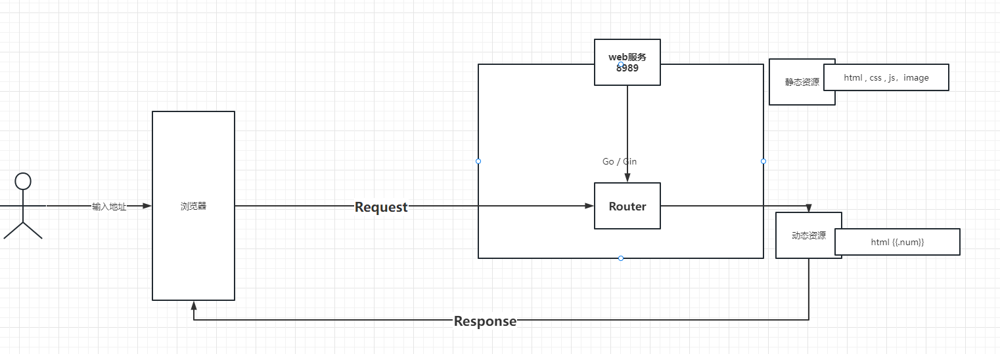
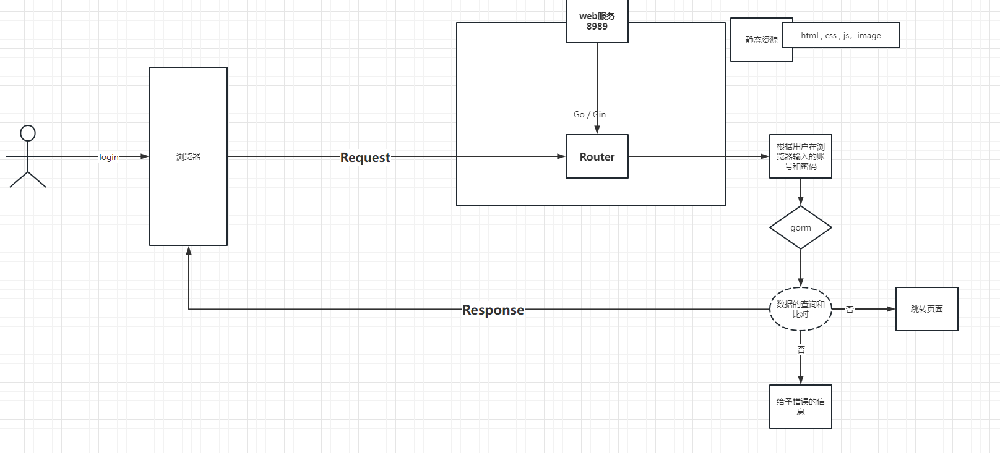
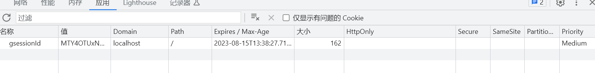

# Go如何整合JWT


## 为什么要学习jwt

在早起的项目开发，大部分情况下都是单体架构


### 何谓单体架构

说白了，就是把所有的数据的管理和处理都交由服务端来完成。

把路由的处理和资源访问都由服务端来定义和规范，用户只需要按照服务端定义的路由，可以找到服务端的资源（数据库数据，文件）。

接下来就就会出现一个问题，请求和请求之间的数据共享的问题。

发起一个请求和响应一个请求，整个过程是无状态（一个请求：go语言会开辟一个线程（协程）去执行请求）。如果request到response结束了。线程肯定要么回收，要么就是被销毁。在整个请求线程数据是无状态就不会任何的保留。比如登录：

用户输入账号和密码，点击登录按钮，请求服务端，把用户查询数据查询出来，显示到页面。那么这里查询出来的用户数据，是不可能维持状态，也就说这个用户信息只能在当前登录请求才会看的到。别人请求是获取不到该用户信息的。那么就出现一个问题。请求和请求的数据共享。你怎么实现？

### 如果不解决会出现什么情况

- 小维—-thread01———-登录—request–response—用户信息是可以拿到—-也可以在浏览器显示出来。—–进入首页（显示当前用户信息）
- 小维—首页—-课程商品—购买———-thread02—–执行购买的服务方法——-这个时候我们必须要知道是谁在操作购买需要？–那么你必须要获取登录的用户信息。

如果不想办法解决这个，你肯定在登录后续的所有的请求中你肯定是拿不到用户信息。那么你必须：

- 每次请求都执行一次登录。那这样的话肯定是不显示

- 可以把用户信息返回浏览器，使用浏览器的存储技术（cookie）然后把登录用户信息放入cookie。然后在每次请求的时候把userId携带上(如果其他人也携带这个userId的话，前提是得先登陆，哈哈哈)。但是这个出现安全问题。 http://www.xxxx.com/course/buy/100?userId=100


1. pinia: 路由和路由的之间的数据共享机制。（客户端session )

2. session: 服务端的请求和请求之间的数据共享机制

### 服务端的技术存储技术—session

session其实就是一种服务端存储技术，主要就是用来解决，请求和请求之间数据共享的一种机制。所以上面问题很明显。userId=100 存在在浏览器（B客户端）肯定不现实。客户端自然不行。那就服务端来完成这个事情。而且服务端是把数据写到操作系统的内容中的。除非你能把服务器攻破。并且对go操作内存你才能攻破，所以存在在服务端是非常安全的。那么如何完成的呢？

session的底层原理就是: map[string]map[string]any{}

#### 为什么是map的map[string]interface{}

userId=100&id=1&name=zhangsan——map/struct—user{userid:100, {id:1, name:zhangsan}}—-

session机制：它必须可以存储一切, 所以map的值必须interface{} (any)

假设用户登录执行，登录接口

```go
package login

import (
	"github.com/gin-contrib/sessions"
	"github.com/gin-gonic/gin"
	"net/http"
)

type LoginApi struct {
}

func (e *LoginApi) Login(c *gin.Context) {
	// session ---- 是一种所有请求之间的数据共享机制，为什么会出现session，是因为http请求是一种无状态。
	// 什么叫无状态：就是指，用户在浏览器输入方位地址的时候，地址请求到服务区，到响应服务，并不会存储任何数据在客户端或者服务端，
	// 也是就：一次request---response就意味着内存消亡，也就以为整个过程请求和响应过程结束。
	// 但是往往在开发中，我们可能要存存储一些信息，让各个请求之间进行共享。所有就出现了session会话机制
	// session会话机制其实是一种服务端存储技术，底层原理是一个map
	// 比如：我登录的时候，要把用户信息存储session中，然后给 map[key]any =
	// key = sdf365454klsdflsd --sessionid

	// 初始化session对象
	session := sessions.Default(c)
	// 存放用户信息到session
	session.Set("user", "feige") //map[sessionid] == map[user][feige]
	// 记住一定调用save方法，否则内存不会写入进去
	session.Save()
	c.JSON(http.StatusOK, "我是gin")
}

```

#### 会话的数据如何隔离和找到？

- A—xiaowei—–session.Set("user", "xiaowei")
- B—feige—–session.Set("user", "feige")
- C—kele—–session.Set("user", "kele")

你们难道不奇怪吗？大家的map的key都是user。为什么不覆盖。因为底层把整个用户数据map用另外一个map来映射的。- map[string]map[string]interface{} 

- map[“session.ID() 1”] = map[“user”]{id:100,username:”xiaowei”}
- map[“session.ID() 2”] = map[“user”]{id:200,username:”feige”}
- map[“session.ID() 3”] = map[“user”]{id:300,username:”kele”}


然后存储以后，在在放入session会话的接口，把sessionId要传递给客户端。传递的方式就两种：

- 直接显示传递 response的api传递给浏览器，然后浏览器使用js来cookie来存储。
- 直接在服务端写入cookie，操作cookie把sessionid写入到客户端浏览器里去。


### 如何解决请求和请求之间数据真正共享问题？

 http://www.xxxx.com/course/buy/100?gsessionId=MTY4OTUxMjk5NXxEdi1CQkFFQ180SUFBUkFCRUFBQUlfLUNBQUVHYzNSeWFXNW5EQVlBQkhWelpYSUdjM1J5YVc1bkRBY0FCV1psYVdkbHwr14ifzz

 http://www.xxxx.com/updateuser/100?gsessionId=MTY4OTUxMjk5NXxEdi1CQkFFQ180SUFBUkFCRUFBQUlfLUNBQUVHYzNSeWFXNW5EQVlBQkhWelpYSUdjM1J5YVc1bkRBY0FCV1psYVdkbHwr14ifzz

我什么现在我根本看不到你说这样请求，因为这样请求会给请求地址造成臃肿而且非常的不方便。所以必须要想一般法来接这个问题。就是使用header技术。

说白了：你只要在服务端把一些数据信息写入http的响应头中，未来你只要发起新的请求，就会把部分的响应头header响应头中，未来其他的任何请求都会把响应头的这部分header信息，当前请求又传递给服务端。

## 什么是header技术

header其实就另外一种request和response直接参数传递一种机制，而机制在请求会自动把你在header存放的参数全部会携带给服务端。

从而解决sessionid传递的问题。就不需要使用参数的方式来暴露出来，从而转变成了一种隐式传递参数的一种方式。

- 为什么如果你想把一些数据不想用参数传递，你也可以使用header来传递
- 换句话：服务端也可以把一些信息写入header，然后用js的来获取header信息。


## Session架构适合前后端分离架构吗？

不适合

- session技术毕竟是一个服务端的存在技术，消耗的go内存，那么如果用户量很小的情况，确实没有什么毛病。但是如果你用户暴增，那么你把用户信息放入服务端来存储，肯定是出现内存问题。

  比如：一个用户session占用的内存大小：50K  —- 100000个用户=5000M ，

  如何解决？

  - 加内存，调大内存
  - 集群，必须使用session共享  A—-1（user）, 2，3
  - 集群就面临着一个问题吗，session共享或者使用第三方共享。无论你用那种：其实都是未来成本的问题和维护问题。

- session为什么不能适用于前后端分类的结构呢？

  - cookie什么：是一种本地客户端本地存储技术，它的生成和创建既可以通过服务端维护（创建，修改，删除），也可以通过js来完成（创建，修改，删除）

  - cookie是通过什么来维持它的唯一性的呢？

    

​				cookie隔离是通过：domain/path来完成。不同的域名是访问不到cookie  、localhost:8088

- vite —web服务 http://localhost:8777 —gsessionid=ssbsbfbsjkdbfjsfskdhfkshf    拿不到下面server生成的sessionId  (测试的时候可以用跨域让所有的路由可进解决，但是实际开发中不能这样做)

- server服务 http://localhost:8088/api/video/111===—gsessionid=xxxxxxxxxxxxxxxxxxxxx 

  

  


## 面临的问题

- session存储问题，过大
- session 失效问题


## 如何解决–token技术

- server让生产的sessionid赋予数据信息，其实也就是：token  ，比如：userid=1 —–加密算法—sdfs.232jsndfnskfhkshd.3224235f—返回客户端—后面所有的请求带着token就可以—-然后解析token—-userid=1
- 服务端就做两个事情—-生成token/解析token/校验token


token里面数据的组成：

- token的建议不要放太敏感的信息。（放一个业务id即可。因为通过id还可以继续查询相关信息）
- token必须是安全，token必须对称加密（会在服务端生成唯一秘钥串）或者非对称加密（公钥和私钥）
- token必须要有时效性 （token时效问题。根据你当前公司的业务来决定）
- token续期问题 （token 1个小时）(自行解决)—就生成一个新token把时间给续上。

## 什么是jwt

jwt其实就是一个token技术，主要用于解决如下问题：

- Authorization(授权): 典型场景，用户请求的token中包含了该令牌允许的路由，服务和资源。单点登录其实就是现在广泛使用JWT的一个特性（接口的安全性）
- Information Exchange(信息交换): 对于安全的在各方之间传输信息而言，JSON Web Tokens无疑是一种很好的方式.因为JWTs可以被签名，例如，用公钥/私钥对，你可以确定发送人就是它们所说的那个人。另外，由于签名是使用头和有效负载计算的，您还可以验证内容没有被篡改

## go如何整合jwt

1：  下载jwt组件

```go
go get -u github.com/golang-jwt/jwt/v5
```

2:  新建一个jwtgo目录

**jwt数据载体：Claims** 

```go
// 自定义有效载荷(这里采用自定义的Name和Email作为有效载荷的一部分)
type CustomClaims struct {
	UserId   uint   `json:"userId"`
	Username string `json:"username"`
	jwt.StandardClaims
}
```

为什么不用StandardClaims。因为不具有业务性，可能会把内部属性破坏掉。所以自定义更加灵活。


**1:  生成token**

```go
// 调用jwt-go库生成token
// 指定编码的算法为jwt.SigningMethodHS256
func (j *JWT) CreateToken(claims CustomClaims) (string, error) {
	// https://gowalker.org/github.com/dgrijalva/jwt-go#Token
	// 返回一个token的结构体指针
	token := jwt.NewWithClaims(jwt.SigningMethodHS256, claims)
	return token.SignedString(j.SigningKey)
}

```

2: 解析token & 校验token

```go

// token解码
func (j *JWT) ParserToken(tokenString string) (*CustomClaims, error) {
	// https://gowalker.org/github.com/dgrijalva/jwt-go#ParseWithClaims
	// 输入用户自定义的Claims结构体对象,token,以及自定义函数来解析token字符串为jwt的Token结构体指针
	// Keyfunc是匿名函数类型: type Keyfunc func(*Token) (interface{}, error)
	// func ParseWithClaims(tokenString string, claims Claims, keyFunc Keyfunc) (*Token, error) {}
	token, err := jwt.ParseWithClaims(tokenString, &CustomClaims{}, func(token *jwt.Token) (interface{}, error) {
		return j.SigningKey, nil
	})

	if err != nil {
		// https://gowalker.org/github.com/dgrijalva/jwt-go#ValidationError
		// jwtgo.ValidationError 是一个无效token的错误结构
		if ve, ok := err.(*jwt.ValidationError); ok {
			// ValidationErrorMalformed是一个uint常量，表示token不可用
			if ve.Errors&jwt.ValidationErrorMalformed != 0 {
				return nil, TokenMalformed
				// ValidationErrorExpired表示Token过期
			} else if ve.Errors&jwt.ValidationErrorExpired != 0 {
				return nil, TokenExpired
				// ValidationErrorNotValidYet表示无效token
			} else if ve.Errors&jwt.ValidationErrorNotValidYet != 0 {
				return nil, TokenNotValidYet
			} else {
				return nil, TokenInvalid
			}
		}
	}

	// 将token中的claims信息解析出来并断言成用户自定义的有效载荷结构
	if claims, ok := token.Claims.(*CustomClaims); ok && token.Valid {
		return claims, nil
	}

	return nil, fmt.Errorf("token无效")

}
```

登录代码生成token返回

```go
package login

import (
	"fmt"
	"github.com/dgrijalva/jwt-go"
	"github.com/gin-gonic/gin"
	"github.com/mojocn/base64Captcha"
	"time"
	"xkginweb/commons/jwtgo"
	"xkginweb/commons/response"
	service "xkginweb/service/user"
)

// 登录业务
type LoginApi struct{}

// 1: 定义验证的store --默认是存储在go内存中
var store = base64Captcha.DefaultMemStore

// 登录的接口处理
func (api *LoginApi) ToLogined(c *gin.Context) {

	type LoginParam struct {
		Account  string
		Code     string
		CodeId   string
		Password string
	}

	// 1：获取用户在页面上输入的账号和密码开始和数据库里数据进行校验
	userService := service.UserService{}
	param := LoginParam{}
	err2 := c.ShouldBindJSON(&param)
	if err2 != nil {
		response.Fail(60002, "参数绑定有误", c)
		return
	}

	//if len(param.Code) == 0 {
	//	response.Fail(60002, "请输入验证码", c)
	//	return
	//}
	//
	//if len(param.CodeId) == 0 {
	//	response.Fail(60002, "验证码获取失败", c)
	//	return
	//}
	//
	//// 开始校验验证码是否正确
	//verify := store.Verify(param.CodeId, param.Code, true)
	//if !verify {
	//	response.Fail(60002, "你输入的验证码有误!!", c)
	//	return
	//}

	inputAccount := param.Account
	inputPassword := param.Password

	if len(inputAccount) == 0 {
		response.Fail(60002, "请输入账号", c)
		return
	}

	if len(inputPassword) == 0 {
		response.Fail(60002, "请输入密码", c)
		return
	}

	dbUser, err := userService.GetUserByAccount(inputAccount)
	if err != nil {
		response.Fail(60002, "你输入的账号和密码有误", c)
		return
	}

	// 这个时候就判断用户输入密码和数据库的密码是否一致
	if dbUser != nil && dbUser.Password == inputPassword {

		// 1: jwt生成token
		myJwt := jwtgo.NewJWT()
		// 2: 生成token
		token, err2 := myJwt.CreateToken(jwtgo.CustomClaims{
			dbUser.ID,
			dbUser.Name,
			int64(1545),
			jwt.StandardClaims{
				Audience:  "KSD",                                                     // 受众
				Issuer:    "KSD-ADMIN",                                               // 签发者
				IssuedAt:  time.Now().Unix(),                                         // 签发时间
				NotBefore: time.Now().Add(-10 * time.Second).Unix(),                  // 生效时间
				ExpiresAt: time.Now().Add(1 * time.Second * 60 * 60 * 24 * 7).Unix(), // 过期时间
			},
		})

		fmt.Println("当前时间是：", time.Now().Unix())
		fmt.Println("签发时间：" + time.Now().Format("2006-01-02 15:04:05"))
		fmt.Println("生效时间：" + time.Now().Add(-10*time.Second).Format("2006-01-02 15:04:05"))
		fmt.Println("过期时间：" + time.Now().Add(1*time.Second*60*60*24*7).Format("2006-01-02 15:04:05"))

		if err2 != nil {
			response.Fail(60002, "登录失败，token颁发不成功!", c)
		}

		response.Ok(map[string]any{"user": dbUser, "token": token}, c)
	} else {
		response.Fail(60002, "你输入的账号和密码有误", c)
	}
}

```

## 如何使用jwt解决接口的安全性

```go
package middle

import (
	"github.com/gin-gonic/gin"
	"xkginweb/commons/jwtgo"
	"xkginweb/commons/response"
)

// 定义一个JWTAuth的中间件
func JWTAuth() gin.HandlerFunc {
	return func(c *gin.Context) {
		// 通过http header中的token解析来认证
		// 获取token
		token := c.GetHeader("Authorization")
		if token == "" {
			response.Fail(701, "请求未携带token，无权限访问", c)
			c.Abort()
			return
		}
		// 生成jwt的对象
		myJwt := jwtgo.NewJWT()
		// 解析token
		customClaims, err := myJwt.ParserToken(token)
		// 如果解析失败就出现异常
		if err != nil {
			response.Fail(60001, "token失效了", c)
			c.Abort()
			return
		}
		// 让后续的路由方法可以直接通过c.Get("claims")
		c.Set("claims", customClaims)
		c.Next()
	}
}

```

使用中间件

```go
package initilization

import (
	"fmt"
	"github.com/gin-gonic/gin"
	"net/http"
	"time"
	"xkginweb/commons/filter"
	"xkginweb/commons/middle"
	"xkginweb/global"
	"xkginweb/router"
	"xkginweb/router/code"
	"xkginweb/router/login"
)

func InitGinRouter() *gin.Engine {
	// 创建gin服务
	ginServer := gin.Default()
	// 提供服务组
	courseRouter := router.RouterWebGroupApp.Course.CourseRouter
	videoRouter := router.RouterWebGroupApp.Video.VideoRouter

	// 解决接口的跨域问题
	ginServer.Use(filter.Cors())

	loginRouter := login.LoginRouter{}
	codeRouter := code.CodeRouter{}
	// 接口隔离，比如登录，健康检查都不需要拦截和做任何的处理
	loginRouter.InitLoginRouter(ginServer)
	codeRouter.InitCodeRouter(ginServer)
	// 业务模块接口，
	publicGroup := ginServer.Group("/api")
	// 只要接口全部使用jwt拦截
	publicGroup.Use(middle.JWTAuth())
	{
		videoRouter.InitVideoRouter(publicGroup)
		courseRouter.InitCourseRouter(publicGroup)
	}

	fmt.Println("router register success")
	return ginServer
}

func RunServer() {
	// 初始化路由
	Router := InitGinRouter()
	// 为用户头像和文件提供静态地址
	Router.StaticFS("/static", http.Dir("/static"))
	address := fmt.Sprintf(":%d", global.Yaml["server.port"])
	// 启动HTTP服务,courseController
	s := initServer(address, Router)
	// 保证文本顺序输出
	// In order to ensure that the text order output can be deleted
	time.Sleep(10 * time.Microsecond)

	s2 := s.ListenAndServe().Error()
	fmt.Println("服务启动完毕 ", s2)
}

```


后面的内容在后面的部分


## 如何实现退出，销毁jwt


## 如何完成jwt续期问题


## 如何实现挤下线功能


## token的时效问题(时间戳)


## 为什么前端后端分离不用session


