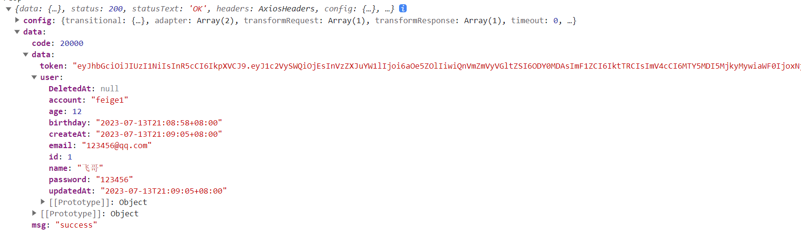

# Go如何整合JWT


前面的内容在前面的部分


## 如何完成jwt续期问题

续期的原理：你只要在有效内的一个时间点，进行续期接口。续期其实就指：重新生成一个新的token。用新的token来替换旧的token。旧的token必须拉入黑名单。设置过期时间 

一句话：新老更替。

- 首先，创建一个token , 有效期：1分钟 60
- 在有效时间点上比如：50秒的时候，我就重新创建一个新的token .来替换旧的token即可。
- 然后在旧的token拉入黑名单，然后写入可以定时删除的内存中（redis）


### 方案1： 在指定的某个时间点上进行续期

-

### 方案2：利用缓存时间 86400秒

- 如果：过期时间 - 当前时间 < 缓冲时间
  - 我就重新创建一个新的token .来替换旧的token即可。
  - 然后在旧的token拉入黑名单，然后写入可以定时删除的内存中（redis）


login.go

```go
package login

import (
	"fmt"
	"github.com/dgrijalva/jwt-go"
	"github.com/gin-gonic/gin"
	"github.com/mojocn/base64Captcha"
	"time"
	"xkginweb/commons/jwtgo"
	"xkginweb/commons/response"
	"xkginweb/model/user"
	service "xkginweb/service/user"
	"xkginweb/utils"
)

// 登录业务
type LoginApi struct{}

// 1: 定义验证的store --默认是存储在go内存中
var store = base64Captcha.DefaultMemStore

// 登录的接口处理
func (api *LoginApi) ToLogined(c *gin.Context) {

	type LoginParam struct {
		Account  string
		Code     string
		CodeId   string
		Password string
	}

	// 1：获取用户在页面上输入的账号和密码开始和数据库里数据进行校验
	userService := service.UserService{}
	param := LoginParam{}
	err2 := c.ShouldBindJSON(&param)
	if err2 != nil {
		response.Fail(60002, "参数绑定有误", c)
		return
	}

	//if len(param.Code) == 0 {
	//	response.Fail(60002, "请输入验证码", c)
	//	return
	//}
	//
	//if len(param.CodeId) == 0 {
	//	response.Fail(60002, "验证码获取失败", c)
	//	return
	//}
	//
	//// 开始校验验证码是否正确
	//verify := store.Verify(param.CodeId, param.Code, true)
	//if !verify {
	//	response.Fail(60002, "你输入的验证码有误!!", c)
	//	return
	//}

	inputAccount := param.Account
	inputPassword := param.Password

	if len(inputAccount) == 0 {
		response.Fail(60002, "请输入账号", c)
		return
	}

	if len(inputPassword) == 0 {
		response.Fail(60002, "请输入密码", c)
		return
	}

	dbUser, err := userService.GetUserByAccount(inputAccount)
	if err != nil {
		response.Fail(60002, "你输入的账号和密码有误", c)
		return
	}

	// 这个时候就判断用户输入密码和数据库的密码是否一致
	if dbUser != nil && dbUser.Password == inputPassword {
		token := api.generaterToken(c, dbUser)
		response.Ok(map[string]any{"user": dbUser, "token": token}, c)
	} else {
		response.Fail(60002, "你输入的账号和密码有误", c)
	}
}

/*
*
根据用户信息创建一个token
*/
func (api *LoginApi) generaterToken(c *gin.Context, dbUser *user.User) string {

	// 设置token续期的缓冲时间
	bf, _ := utils.ParseDuration("1d")
	ep, _ := utils.ParseDuration("7d")

	// 1: jwt生成token
	myJwt := jwtgo.NewJWT()
	// 2: 生成token
	token, err2 := myJwt.CreateToken(jwtgo.CustomClaims{
		dbUser.ID,
		dbUser.Name,
		int64(bf / time.Second),
		jwt.StandardClaims{
			Audience:  "KSD",                        // 受众
			Issuer:    "KSD-ADMIN",                  // 签发者
			IssuedAt:  time.Now().Unix(),            // 签发时间
			NotBefore: time.Now().Add(-1000).Unix(), // 生效时间
			ExpiresAt: time.Now().Add(ep).Unix(),    // 过期时间

		},
	})

	fmt.Println("当前时间是：", time.Now().Unix())
	fmt.Println("缓冲时间：", int64(bf/time.Second))
	fmt.Println("签发时间：" + time.Now().Format("2006-01-02 15:04:05"))
	fmt.Println("生效时间：" + time.Now().Add(-1000).Format("2006-01-02 15:04:05"))
	fmt.Println("过期时间：" + time.Now().Add(ep).Format("2006-01-02 15:04:05"))

	if err2 != nil {
		response.Fail(60002, "登录失败，token颁发不成功!", c)
	}

	return token
}

```

中间件

```go
package middle

import (
	"fmt"
	"github.com/gin-gonic/gin"
	"strconv"
	"time"
	"xkginweb/commons/jwtgo"
	"xkginweb/commons/response"
	"xkginweb/model/jwt"
	"xkginweb/utils"
)

var jwtService = jwtgo.JwtService{}

// 定义一个JWTAuth的中间件
func JWTAuth() gin.HandlerFunc {
	return func(c *gin.Context) {
		// 通过http header中的token解析来认证
		// 获取token
		token := c.GetHeader("Authorization")
		if token == "" {
			response.Fail(701, "请求未携带token，无权限访问", c)
			c.Abort()
			return
		}

		blacklist := jwtService.IsBlacklist(token)
		if blacklist {
			response.Fail(701, "黑名单提醒：你的token已经失效了，", c)
			c.Abort()
			return
		}

		// 生成jwt的对象
		myJwt := jwtgo.NewJWT()
		// 解析token
		customClaims, err := myJwt.ParserToken(token)
		// 如果解析失败就出现异常
		if err != nil {
			response.Fail(60001, "token失效了", c)
			c.Abort()
			return
		}

		// 判断过期时间 - now  < buffertime 就开始续期 ep 1d -- no
		fmt.Println("customClaims.ExpiresAt", customClaims.ExpiresAt)
		fmt.Println("time.Now().Unix()", time.Now().Unix())
		fmt.Println("customClaims.ExpiresAt - time.Now().Unix()", customClaims.ExpiresAt-time.Now().Unix())
		fmt.Println("customClaims.BufferTime", customClaims.BufferTime)

		if customClaims.ExpiresAt-time.Now().Unix() < customClaims.BufferTime {
			// 1: 生成一个新的token
			// 2: 用c把新的token返回页面
			fmt.Println("开始续期.....")
			// 获取7天的过期时间
			eptime, _ := utils.ParseDuration("7d")
			// 用当前时间+eptime 就是 新的token过期时间
			customClaims.ExpiresAt = time.Now().Add(eptime).Unix()
			// 生成新的token
			newToken, _ := myJwt.CreateTokenByOldToken(token, *customClaims)
			// 输出给浏览器
			c.Header("new-authorization", newToken)
			c.Header("new-expires-at", strconv.FormatInt(customClaims.ExpiresAt, 10))
			// 如果生成新token了，旧的token怎么办？ jwt没有提供一个机制让旧token失效。
			_ = jwtService.JsonInBlacklist(jwt.JwtBlacklist{Jwt: token})
		}

		// 让后续的路由方法可以直接通过c.Get("claims")
		c.Set("claims", customClaims)
		c.Next()
	}
}

```


## 如何在前端获取到jwt的token

在login.vue通过axios异步请求调用登录业务，可以很清楚的看到token和用户信息可以获取到。如下：

```vue
<template>
    <div class="login-box">
        <div class="loginbox">
            <div class="login-wrap">
                <h1 class="header">{{ title }}</h1>
                <form action="#">
                    <div class="ksd-el-items"><input type="text" v-model="loginUser.account" class="ksd-login-input"  placeholder="请输入账号"></div>
                    <div class="ksd-el-items"><input type="password" v-model="loginUser.password" class="ksd-login-input" placeholder="请输入密码"></div>
                    <div class="ksd-el-items pr">
                        <input type="text" class="ksd-login-input" maxlength="6" v-model="loginUser.code" placeholder="请输入验证码">
                        
                    </div>
                    <div class="ksd-el-items"><input type="button" @click.prevent="handleSubmit" class="ksd-login-btn" value="登录"></div>            
                </form>
            </div>
        </div>
        <div class="imgbox">
                
        </div>
    </div>
</template>

<script setup>
import { onMounted, reactive, ref } from 'vue';
import axios from 'axios'
const title = ref("我是一个登录页面")
// 准备接受图像验证码
const codeURL = ref("");
// 获取用户输入账号和验证码信息
const loginUser = reactive({
    code:"",
    account:"feige1",
    password:"123456",
    codeId:""
})


// 根据axios官方文档开始调用生成验证码的接口
const handleGetCapatcha = async () => {
    const resp = await axios.get("http://localhost:8989/code/get")
    const {baseURL,id} = resp.data.data
    codeURL.value = baseURL
    loginUser.codeId = id
}


// 提交表单
const  handleSubmit = async () => {
    // axios.post ---application/json---gin-request.body
    if(!loginUser.code){
        alert("请输入验证码")
        return;
    }
    if(!loginUser.account){
        alert("请输入账号")
        return;
    }
    if(!loginUser.password){
        alert("请输入密码")
        return;
    }

    const resp = await axios.post("http://localhost:8989/login/toLogin", loginUser)
    if (resp.data.code === 20000) {
        console.log("resp",resp)
        //router.push({ path: '/', replace: true })
    } else {
        if (e.data.code === 60002) {
            alert(e.data.msg);
            loginUser.code = "";
            handleGetCapatcha();//重新激活生成新的验证码
            return;
        }
    }
}
// 用生命周期去加载生成验证码
onMounted(() => {
    handleGetCapatcha()
})

</script>

<style scoped lang="scss">
    .pr{position: relative;}
    .codeurl{position: absolute;top:5px;right:5px;width: 120px;}
    .ksd-el-items{margin: 15px 0;}
    .ksd-login-input{border:1px solid #eee;padding:12px 8px;width: 100%;box-sizing: border-box;outline: none;border-radius: 4px;}
    .ksd-login-btn{border:1px solid #eee;padding:12px 8px;width: 100%;box-sizing: border-box;
        background:#2196F3;color:#fff;border-radius:4px;cursor: pointer;}
        .ksd-login-btn:hover{background:#1789e7;}
    .login-box{
        display: flex;
        flex-wrap: wrap;
        background: url("../assets/imgs/login_background.jpg");
        background-size:cover;
        .loginbox{
            width: 50%;height: 100vh;
            display: flex;
            align-items: center;
            justify-content: center;
            .header{margin-bottom: 10px;}
            .login-wrap{
                width: 500px;
                height: 444px;
                padding:20px 100px;
                box-sizing: border-box;
                border-radius: 8px;
                box-shadow: 0 0 10px #fafafa;
                background: rgba(255,255,255,0.6);
                text-align: center;
                display: flex;
                flex-direction: column;
                justify-content: center;
            }
        }
        .imgbox{
            width: 50%;
            height: 100vh;
            display: flex;
            align-items: center;
        }
    }
</style>
```



### **如果跳转到别的路由页面**

官方网站：https://router.vuejs.org/zh/

安装

```js
npm install vue-router@4
pnpm install vue-router@4
yarn add vue-router@4
```

然后再在main.js注册vuerouter

```js
import './assets/base.css'
import { createApp } from 'vue'
import router from './router'
const app = createApp(App)
app.use(router)
app.mount('#app')

```

如果是vue2
$router和$route

```js
# $router用做js跳转路由页面
this.$router.push("/path")
this.$router.push({name:"name"})
# $route是用来获取路由信息（路径，参数，域名等）
console.log(this.$route)
```

如果是vue3

```js
import {useRouter,useRoute} from 'vue-router'
//用做js跳转路由页面
var router = useRouter()
// 是用来获取路由信息（路径，参数，域名等）
var route = useRoute()
```

登录跳转到首页

```vue
<template>
    <div class="login-box">
        <div class="loginbox">
            <div class="login-wrap">
                <h1 class="header">{{ title }}</h1>
                <form action="#">
                    <div class="ksd-el-items"><input type="text" v-model="loginUser.account" class="ksd-login-input"  placeholder="请输入账号"></div>
                    <div class="ksd-el-items"><input type="password" v-model="loginUser.password" class="ksd-login-input" placeholder="请输入密码"></div>
                    <div class="ksd-el-items pr">
                        <input type="text" class="ksd-login-input" maxlength="6" v-model="loginUser.code" placeholder="请输入验证码">
                        
                    </div>
                    <div class="ksd-el-items"><input type="button" @click.prevent="handleSubmit" class="ksd-login-btn" value="登录"></div>            
                </form>
            </div>
        </div>
        <div class="imgbox">
                
        </div>
    </div>
</template>

<script setup>
import { onMounted, reactive, ref } from 'vue';
import axios from 'axios'
import {useRouter} from 'vue-router'
// 定义一个路由对象
const router = useRouter()
const title = ref("我是一个登录页面")
// 准备接受图像验证码
const codeURL = ref("");
// 获取用户输入账号和验证码信息
const loginUser = reactive({
    code:"",
    account:"feige1",
    password:"123456",
    codeId:""
})


// 根据axios官方文档开始调用生成验证码的接口
const handleGetCapatcha = async () => {
    const resp = await axios.get("http://localhost:8989/code/get")
    const {baseURL,id} = resp.data.data
    codeURL.value = baseURL
    loginUser.codeId = id
}


// 提交表单
const  handleSubmit = async () => {
    // axios.post ---application/json---gin-request.body
    if(!loginUser.code){
        alert("请输入验证码")
        return;
    }
    if(!loginUser.account){
        alert("请输入账号")
        return;
    }
    if(!loginUser.password){
        alert("请输入密码")
        return;
    }

    const resp = await axios.post("http://localhost:8989/login/toLogin", loginUser)
    if (resp.data.code === 20000) {
        console.log("resp",resp)
        // 这个会回退，回退登录页
        router.push("/")
        // 重定向，浏览器回退按钮不会到登录
        //router.push({ path: '/', replace: true })
    } else {
        if (e.data.code === 60002) {
            alert(e.data.msg);
            loginUser.code = "";
            handleGetCapatcha();//重新激活生成新的验证码
            return;
        }
    }
}
// 用生命周期去加载生成验证码
onMounted(() => {
    handleGetCapatcha()
})

</script>

<style scoped lang="scss">
    .pr{position: relative;}
    .codeurl{position: absolute;top:5px;right:5px;width: 120px;}
    .ksd-el-items{margin: 15px 0;}
    .ksd-login-input{border:1px solid #eee;padding:12px 8px;width: 100%;box-sizing: border-box;outline: none;border-radius: 4px;}
    .ksd-login-btn{border:1px solid #eee;padding:12px 8px;width: 100%;box-sizing: border-box;
        background:#2196F3;color:#fff;border-radius:4px;cursor: pointer;}
        .ksd-login-btn:hover{background:#1789e7;}
    .login-box{
        display: flex;
        flex-wrap: wrap;
        background: url("../assets/imgs/login_background.jpg");
        background-size:cover;
        .loginbox{
            width: 50%;height: 100vh;
            display: flex;
            align-items: center;
            justify-content: center;
            .header{margin-bottom: 10px;}
            .login-wrap{
                width: 500px;
                height: 444px;
                padding:20px 100px;
                box-sizing: border-box;
                border-radius: 8px;
                box-shadow: 0 0 10px #fafafa;
                background: rgba(255,255,255,0.6);
                text-align: center;
                display: flex;
                flex-direction: column;
                justify-content: center;
            }
        }
        .imgbox{
            width: 50%;
            height: 100vh;
            display: flex;
            align-items: center;
        }
    }
</style>
```


### 如何维持数据状态

1： 登录用户你拿到，token也拿到了。你怎么把登录的用户方到index页面上。

2：/login(路由) ——/(首页路由)


### 为什么要使用pinia

在前端的路由跳转过程中，路由和路由直接如果要实现数据共享，除了通过参数的层层传递以外。也可以使用状态共享一种机制来完成。这个就所谓：路由与路由数据共享的机制，这个避免了传递问题，响应式的问题。

因为路由通过传递参数确实可以解决一些问题，但是参数 不具备响应式的。如果有数据更改要立即生效。

在早期vue生态其实：vuex  

第一步安装：

```js
yarn add pinia
# 或者使用 npm
npm install pinia
```

第二步：开始定义stores*目录新建一个index.js*

```js
import { ref, computed } from 'vue'
import { defineStore } from 'pinia'

// vue3的版本
export const useCounterStore = defineStore('counter', () => {
  const count = ref(0)
  const doubleCount = computed(() => count.value * 2)
  function increment() {
    count.value++
  }

  return { count, doubleCount, increment }
})

```

第三步：注册到vue

```js
import './assets/base.css'
import { createApp } from 'vue'
import App from './App.vue'
const pinia = createPinia();
app.use(pinia)
app.mount('#app')

```

第四步：新建一个user.js的模块

```js
import { defineStore } from 'pinia'

// 你可以对 `defineStore()` 的返回值进行任意命名，但最好使用 store 的名字，同时以 `use` 开头且以 `Store` 结尾。(比如 `useUserStore`，`useCartStore`，`useProductStore`)
// 第一个参数是你的应用中 Store 的唯一 ID。
export const useUserStore = defineStore('userStore', {
  // 其他配置...
})
```

第五步：使用

```js
import {useUserStore} from '@/stores/user.js'
const userStore = useUserStore();
```

接下来userStore对象，就可以调用方法所以得：state/getters/actions

```js
import { defineStore } from 'pinia'
import axios from 'axios'

//https://blog.csdn.net/weixin_62897746/article/details/129124364
//https://prazdevs.github.io/pinia-plugin-persistedstate/guide/
export const userStore = defineStore('user', {
  // 定义状态
  state: () => ({
    user: {},
    username: '',
    userId: '',
    token: ''
  }),

  // 定义动作
  actions: {
    toLogin(loginUser){
      this.user = {id:100}
      this.userId = 100
      this.username = "feige"
      this.token = 324234234
    }
  }
})

```

## Pinia状态管理

选项式的定义

```js
import { defineStore } from 'pinia'
import axios from 'axios'

//https://blog.csdn.net/weixin_62897746/article/details/129124364
//https://prazdevs.github.io/pinia-plugin-persistedstate/guide/
export const useUserStore = defineStore('user', {
  // 定义状态
  state: () => ({
    user: {},
    username: '',
    userId: '',
    token: '',
    male:1,
    roles:[],
    permissions:[]
  }),

  // 就是一种计算属性的机制，定义的是函数，使用的是属性就相当于computed
  getters:{

    malestr(state){
      if(state.male==1)return "男"
      if(state.male==0)return "女"
      if(state.male==1)return "保密"
    },

    roleName(state){
      return state.roles.map(r=>r.name).join(",")
    },

    permissionCode(state){
      return state.permissions.map(r=>r.code).join(",")
    }
  },

  // 定义动作
  actions: {
   async toLogin(loginUser){
      const resp = await axios.post("http://localhost:8989/login/toLogin", loginUser)
      if (resp.data.code === 20000) {
          // 这个会回退，回退登录页
          var { user ,token,roles,permissions } = resp.data.data
          // 把数据放入到状态管理中
          this.user = user
          this.userId = user.id
          this.username = user.name
          this.token = token
          this.roles = roles
          this.permissions = permissions
          return Promise.resolve(resp)
      } else {
        return Promise.reject(resp)
      }
    }
  },
  
  persist: {
    key: 'pinia-userstore',
    storage: localStorage,
  }
})
```

组合式方式

```js
import { defineStore } from 'pinia'
import axios from 'axios'
import { ref,computed } from 'vue'

//https://blog.csdn.net/weixin_62897746/article/details/129124364
//https://prazdevs.github.io/pinia-plugin-persistedstate/guide/
export const useUserStore = defineStore('user', ()=>{
   
   // 相当于  state
   const user = ref({})
   const username = ref('')
   const userId = ref('')
   const token = ref('')
   const roles = ref([])
   const permissions = ref([])

   
  // 使用计算属性处理状态数据
  const roleName = computed(()=>{
    return roles.value.map(r=>r.name).join(",")
  })

  const permissionCode = computed(()=>{
    return permissions.value.map(r=>r.code).join(",")
  })


   // 定义函数---actions
   const toLogin = async (loginUser) => {
      const resp = await axios.post("http://localhost:8989/login/toLogin", loginUser)
      if (resp.data.code === 20000) {
          // 这个会回退，回退登录页
          var  result = resp.data.data
          console.log("result",result)
          // 把数据放入到状态管理中
          user.value = result.user
          userId.value = result.user.id
          username.value = result.user.name
          token.value = result.token
          roles.value = result.roles
          permissions.value = result.permissions
          return Promise.resolve(resp)
      } else {
        return Promise.reject(resp)
      }
    }

    return {
      user,userId,username,token,toLogin,roles,permissions,roleName,permissionCode
    }
  })
```

使用

```js
import {useUserStore} from '@/stores/user.js'
const userStore = useUserStore();

// 获取状态属性
userStore.user = ""
// 获取getter属性
userStore.roleName
userStore.permissionCode
// 调用actions的方法
userStore.toLogin(xxxx)
```

关于mapGetter 、mapState、mapActions 的用法

```vue
<!-- <template>
    我是一个首页
   <div> {{ store.token }}</div>
    <div>{{ store.userId }}</div>
    <div>{{ store.username }}</div>
    <div><button @click="handleChangeStore">改变</button></div>
    <div><button @click="handleResetStore">重置</button></div>
</template>

<script setup>
    import { userStore } from '@/stores/user.js'
    const store = userStore()

    const  handleChangeStore = () => {
        store.username = 'feifei'
    }
    const  handleResetStore = () => {
        store.$reset()
    }
</script> -->

<!-- 
<template>
    我是一个首页
    <div>{{ userStore.userId }}</div>
    <div>{{ userStore.username }}</div>
    <div>{{ userStore.roles }}</div>
    <div>{{ userStore.roleName }}</div>
    <div>{{ userStore.permissions }}</div>
    <div>{{ userStore.permissionCode }}</div>
</template>

<script setup>
import {useUserStore} from '@/stores/user.js'
const userStore = useUserStore(); -->
<!-- </script> -->


<!-- <template>
    我是一个首页
    <div>{{ userStore.userId }}</div>
    <div>{{ userStore.roles }}</div>
    <div>{{ userStore.roleName }}</div>
    <div>{{ userStore.permissions }}</div>
    <div>{{ userStore.permissionCode }}</div>
    <hr>
    <div>{{ userStore.username }}</div>
    <div>{{ userStore.token }}</div>
    <hr>
    <div>{{ username }}</div>
    <div>{{ token }}</div>
</template>

<script setup>
import {useUserStore} from '@/stores/user.js'
import { computed } from 'vue';
const userStore = useUserStore();
const username =computed(()=>userStore.username)
const token =computed(()=>userStore.token)

</script> -->


<!-- <template>
    我是一个首页
    <div>{{ username }}</div>
    <div>{{ token }}</div>
</template>

<script>
import {useUserStore} from '@/stores/user.js'
const userStore = useUserStore();
//选项式
export default {
    computed: {
        username(){
            return userStore.username
        },
        token(){
            return userStore.token
        }
    }
}

</script> -->


<template>
    我是一个首页
    <div>{{ username }}</div>
    <div>{{ token }}</div>

    <button @click="toLogin">去登录</button>
</template>

<script>
import { mapState,mapActions } from 'pinia'
import {useUserStore} from '@/stores/user.js'
// mapState
// mapGetter 就是一种简化在计算属性中的一种状态管理获取状态属性或者getter属性的一种简化机制。

//选项式
export default {
    computed: {
        ...mapState(useUserStore,["username","token"]),
    },
    methods:{
        ...mapActions(useUserStore,["toLogin"]),
    }
}
</script>
```


## 初始化页面布局

- 搭建项目工程

  nodejs = 16.x

- 原生样式重置

  默认情况下，项目工程中，我们html元素很多都自带样式的信息，而样式信息可能会影响布局，所以为了后续页面的布局我们都把元素的默认样式信息进行清除。一般的做法

  ```css
  *{padding:0;margin:0;}
  ```

  这种同配置的方式，会遍历页面上所以得标签进行充值，当网站的标签非常的多的时候会增加网页运行的速度和增大网页渲染的时间，因此可以推荐使用：Normalize.css 来解决

  ```sh
  pnpm install --save normalize.css
  &
  npm install --save normalize.css
  &
  yarn add  normalize.css
  ```

- element-plus的引入

  官网 https://element-plus.gitee.io/zh-CN/guide/installation.html

  ```sh
  # NPM
  $ npm install element-plus --save
  
  # Yarn
  $ yarn add element-plus
  
  # pnpm
  $ pnpm install element-plus
  ```

  在main.js中进行注册element-plus

  ```js
  import 'normalize.css/normalize.css'
  import './assets/base.css'
  import { createApp } from 'vue'
  import { createPinia } from 'pinia'
  import piniaPluginPersistedstate from 'pinia-plugin-persistedstate'
  import App from './App.vue'
  import router from './router'
  import ElementPlus from 'element-plus'
  import 'element-plus/dist/index.css'
  
  
  const pinia = createPinia();
  const app = createApp(App)
  pinia.use(piniaPluginPersistedstate)
  app.use(pinia)
  app.use(router)
  app.use(ElementPlus)
  
  app.mount('#app')
  
  ```

  

- element-plus图标库的导入

  ```js
  <el-icon :size="size" :color="color">
    <Edit />
  </el-icon>
  <!-- 或者独立使用它，不从父级获取属性 -->
  <Edit />
  ```

  你会发现没生效，原因是没有安装

  ```sh
  # 选择一个你喜欢的包管理器
  
  # NPM
  $ npm install @element-plus/icons-vue
  # Yarn
  $ yarn add @element-plus/icons-vue
  # pnpm
  $ pnpm install @element-plus/icons-vue
  ```

  然后在main.js中进行注册

  ```js
  import * as ElementPlusIconsVue from '@element-plus/icons-vue'
  
  const app = createApp(App)
  for (const [key, component] of Object.entries(ElementPlusIconsVue)) {
    app.component(key, component)
  }
  ```


## 如何实现进场动画

在很多后台管理系统中，经常会出现刷新就有进场的动画效果。这样在网页还没加载出来的，有一个过度的效果。这样不会造成空白。因为vue项目在进行渲染的页面总会有等待过程，这个过程中造成空白页。就有点不友好，很多人做法就在index.html中增加一个动画效果，然后等vue渲染完毕以后，旧替换这个效果。

原理

1：index.html是所有的vue路由访问的落脚点。

2：里面定义个id=“app”。

3:  未来动态编译以后，所有的页面都会放入到id=“app”范围内。在id=“app“范围写一段动画，然后如果路由加载成功以后，就会把id=“app”里面动画内容替换掉。

整体代码如下：

```html
<!DOCTYPE html>
<html lang="en">
  <head>
    <meta charset="UTF-8">
    <link rel="icon" href="/favicon.ico">
    <meta name="viewport" content="width=device-width, initial-scale=1.0">
    <title>Vite App</title>
    <style>
      html,
			body,
			#app {
				height: 100%;
			}

			* {
				margin: 0;
				padding: 0;
				font-family: "Helvetica Neue", Helvetica, "PingFang SC", "Hiragino Sans GB",
					"Microsoft YaHei", "微软雅黑", Arial, sans-serif;
			}

			.preload__wrap {
				display: flex;
				flex-direction: column;
				height: 100%;
				letter-spacing: 1px;
				background-color: #2f3447;
				position: fixed;
				left: 0;
				top: 0;
				height: 100%;
				width: 100%;
				z-index: 9999;
			}

			.preload__container {
				display: flex;
				justify-content: center;
				align-items: center;
				flex-direction: column;
				width: 100%;
				user-select: none;
				flex-grow: 1;
			}

			.preload__name {
				font-size: 30px;
				color: #fff;
				letter-spacing: 5px;
				font-weight: bold;
				margin-bottom: 30px;
			}

			.preload__title {
				color: #fff;
				font-size: 14px;
				margin: 30px 0 20px 0;
			}

			.preload__sub-title {
				color: #ababab;
				font-size: 12px;
			}

			.preload__footer {
				text-align: center;
				padding: 10px 0 20px 0;
			}

			.preload__footer a {
				font-size: 12px;
				color: #ababab;
				text-decoration: none;
			}

			.preload__loading {
				height: 30px;
				width: 30px;
				border-radius: 30px;
				border: 7px solid currentColor;
				border-bottom-color: #2f3447 !important;
				position: relative;
				animation: r 1s infinite cubic-bezier(0.17, 0.67, 0.83, 0.67),
					bc 2s infinite ease-in;
				transform: rotate(0deg);
			}

			@keyframes r {
				from {
					transform: rotate(0deg);
				}
				to {
					transform: rotate(360deg);
				}
			}

			.preload__loading::after,
			.preload__loading::before {
				content: "";
				display: inline-block;
				position: absolute;
				bottom: -2px;
				height: 7px;
				width: 7px;
				border-radius: 10px;
				background-color: currentColor;
			}

			.preload__loading::after {
				left: -1px;
			}

			.preload__loading::before {
				right: -1px;
			}

			@keyframes bc {
				0% {
					color: #689cc5;
				}

				25% {
					color: #b3b7e2;
				}

				50% {
					color: #93dbe9;
				}

				75% {
					color: #abbd81;
				}

				100% {
					color: #689cc5;
				}
			}
    </style>
  </head>
  <body>
    <div id="app">
      <div class="preload__wrap" id="Loading">
        <div class="preload__container">
          <p class="preload__name">欢迎使用</p>
          <div class="preload__loading"></div>
          <p class="preload__title">正在加载资源...</p>
          <p class="preload__sub-title">初次加载资源可能需要较多时间 请耐心等待</p>
        </div>
        <div class="preload__footer">
          <a href="#" target="_blank">KVA后台管理系统-学相伴</a>
        </div>
    </div>
    <script type="module" src="/src/main.js"></script>
  </body>
</html>

```


## 如何实现头部nprogress动画

1：安装NProgress组件

```sh
npm install nprogress
yarn add nprogress
pnpm install nprogress
```

并在src/main.js 中加入相关的 .css 文件

```js
import 'nprogress/nprogress.css' // 实现头部nprogress动画
```

2：使用nprogress

```js
import NProgress from 'nprogress'
// 显示右上角螺旋加载提示
NProgress.configure({ showSpinner: true })
//开启进度条
NProgress.start()
//完成进度条
NProgress.done()
```

3： 结合业务

**登录的时候使用：**

login.vue

```js
import NProgress from 'nprogress'
// 显示右上角螺旋加载提示
NProgress.configure({ showSpinner: true })
// 提交表单
const  handleSubmit = async () => {
    // axios.post ---application/json---gin-request.body
    if(!loginUser.code){
        alert("请输入验证码")
        return;
    }
    if(!loginUser.account){
        alert("请输入账号")
        return;
    }
    if(!loginUser.password){
        alert("请输入密码")
        return;
    }

    //开启进度条
    NProgress.start()
    // 把数据放入到状态管理中
    const resp = await userStore.toLogin(loginUser)
    if (resp.data.code === 20000) {
        router.push("/")
        //完成进度条
        NProgress.done()
    } else {
        //完成进度条
        NProgress.done()
        if (resp.data.code === 60002) {
            alert(e.data.msg);
            loginUser.code = "";
            handleGetCapatcha();//重新激活生成新的验证码
        }
    }
}
```


加载路由登录的场景 

类似与中间件的效果，不用像上面login.vue以后每一个页面都要写一次

src/router/index.js

```js
import { createRouter, createWebHistory } from 'vue-router'
import NProgress from 'nprogress'
// 获取状态管理的token
import { useUserStore } from '@/stores/user.js'
// 显示右上角螺旋加载提示
NProgress.configure({ showSpinner: true })

const router = createRouter({
  history: createWebHistory(import.meta.env.BASE_URL),
  routes: [
    {
      path: '/',
      name: 'index',
      meta: { title: "index" },
      component: () => import('@/views/index.vue')
    },
    {
      path: '/login',
      name: 'login',
      meta: { title: "login" },
      component: () => import('@/views/login.vue')
    },
    {
      path:'/:pathMatch(.*)*',
      name:'NotFound',
      component: () => import('@/views/NotFound.vue')
    }
  ]
})


router.beforeEach((to, from, next) => {
  //开启进度条
  NProgress.start()
  next()
})

router.afterEach(() => {
  //完成进度条
  NProgress.done()
})


export default router

```


## 如何实现数字动画

参考：https://blog.csdn.net/weixin_44439675/article/details/121117468

参考：http://www.manongjc.com/detail/42-ftlenknixxjlktb.html


**vue2**

1 安装插件

```sh
npm install vue-animate-number
```

2 在main.js中引入

```js
import Vue from 'vue'
import VueAnimateNumber from 'vue-animate-number'
Vue.use(VueAnimateNumber)
```

3: 使用

```vue
<template>
<div>

<animate-number
from="1"
to="10"
duration="1000"
easing="easeOutQuad"
:formatter="formatter"
></animate-number>

<!-- 最简单的案例，from是开始值，to是结束值 -->
<animate-number from="1" to="10"></animate-number>

<animate-number ref="myNum" from="0" to="10" mode="manual" :formatter="formatter"></animate-number><br>

<!-- 也可以通过按钮去触发-->
<button type="button" @click="startAnimate()"> animate! </button>
</div>
</template>
<script>
export default {
methods: {
formatter: function (num) {
return num.toFixed(2)
},

startAnimate: function () {
this.$refs.myNum.start()
}
}
}
</script>
```

 **vue3**

1.安装

```sh
npm install animated-number-vue3
yarn add animated-number-vue3
pnpm add animated-number-vue3
```

2.在src/main.js中引入

```js
import AnimatedNumber from 'animated-number-vue3'
app.use(AnimatedNumber)
```

3：使用

```vue
<animated-number from="0" :to="toNum" :key="toNum" duration="2000"></animated-number>
```

```vue
<template>
    <div>
        <animated-number from="0" :to="toNum1" :key="toNum"></animated-number>
        <animated-number from="0" :to="toNum2" :key="toNum"></animated-number>
        <animated-number from="0" :to="toNum3" :key="toNum"></animated-number>
    </div>
</template>
<script setup>
import { ref } from 'vue'
const toNum1 = ref(4654)
const toNum2 = ref(1152)
const toNum3 = ref(5486) 
</script>
```


## 如何实现国际化处理

这个未来如果你们公司在跨国公司一般都要做国际化处理。就把页面中的信息保存两份语言，一个zh-cn.js和en.js。然后把平台中所有的你能看文本，菜单，按钮，提示等等，都会存两份。然后通过vue-i18n组件就实现国际化切换。

1：安装

```js
npm install vue-i18n
yarn add vue-i18n
pnpm install vue-i18n
```

2: 在src下新建一个i18n/lang文件夹，然后在这里定义en.js和zh.js

en.js

```js
export default {
  ksdAdminManage: 'ksdAdminManage',
  loginButton: 'Login' 
}
```

zh.js

```js
export default {
  ksdAdminManage: 'KVA后台管理',
  loginButton: '登录' 
}
```

3: 在src/i18n新建一个index.js 用来初始化国际化的配置信息

```js
// 国际化组件
import { createI18n } from 'vue-i18n'
// 保存语言切换。 Cookies是本地存储技术
import Cookies from 'js-cookie'
// 导入中文和英文国际化文件
import zhLocale from './lang/zh.js'
import enLocale from './lang/en.js'

// 初始国际化组件的实例
const i18n = createI18n({
  legacy:false,
  fallbackLocale:'zh',
  locale:  Cookies.get("ksd-kva-language") || 'zh-cn', // 设置地区
  messages: {
      en: {
        ...enLocale,
      },
      'zh-cn': {
        ...zhLocale
      }
    }
})


export default i18n

```

4： 在main.js种进行注册

```js
import App from './App.vue'
import i18n from '@/i18n'
const app = createApp(App)
app.use(i18n)
app.mount('#app')
```

5: 如何使用国际化

```js
import { useI18n } from 'vue-i18n'

const { locale, t } = useI18n()
<div>{{ t('ksdAdminManage') }}</div>
<div>{{ t('loginButton') }}</div>
<hr>
<div>{{ useI18n().t('welcome') }}</div>
<hr>
<div>{{ useI18n().t('login.userName') }}</div>
<div>{{ useI18n().t('login.pwd') }}</div>
<hr>
```

6: 如何实现国际化切换

安装cookie

```sh
npm install js-cookie
yarn add js-cookie
pnpm install js-cookie
```

使用

```vue
<template>
    <div>
        <div>{{ t('ksdAdminManage') }}</div>
        <div>{{ t('loginButton') }}</div>
        <hr>
        <button @click="handleChangeLang('zh-cn')">切换成中文</button>
        <button @click="handleChangeLang('en')">切换成英文</button>
    </div>
</template>

<script setup>
import { useI18n } from 'vue-i18n'
import Cookies from 'js-cookie'

const { locale, t } = useI18n()
// 语言切换
const handleChangeLang = (lang) => {
    locale.value = lang
    Cookies.set("ksd-kva-language", lang)
}
</script>
```

也可以使用localStorage来替代cookie

## 如何封装axios异步请求 封装request.js

异步请求：XMLHttpRequest ，而axios其实就是对它的封装而已。它可以完成服务端数据请求和响应（交互）也俗称接口的调用。

官网：https://www.axios-http.cn/

1：下载

```sh
npm install axios
yarn add axios
pnpm install axios
```

2: 使用

```js
const axios = require('axios');
```

get请求

```js


// 向给定ID的用户发起请求
axios.get('/user?ID=12345')
  .then(function (response) {
    // 处理成功情况
    console.log(response);
  })
  .catch(function (error) {
    // 处理错误情况
    console.log(error);
  })
  .then(function () {
    // 总是会执行
  });

// 上述请求也可以按以下方式完成（可选）
axios.get('/user', {
    params: {
      ID: 12345
    }
  })
  .then(function (response) {
    console.log(response);
  })
  .catch(function (error) {
    console.log(error);
  })
  .then(function () {
    // 总是会执行
  });  

// 支持async/await用法
async function getUser() {
  try {
    const response = await axios.get('/user?ID=12345');
    console.log(response);
  } catch (error) {
    console.error(error);
  }
}
```

post请求

```js
// 发起一个post请求
axios({
  method: 'post',
  url: '/user/12345',
  data: {
    firstName: 'Fred',
    lastName: 'Flintstone'
  }
});
```

请求必须是有认识路径的问题：

```js
// 肯定没问题
const resp = await axios.post("http://45.85.69.125/login/toLogin", loginUser)
// a能 b不能
const resp = await axios.post("/login/toLogin", loginUser)
```

不论你调用的get/post/delete/put等。第一个参数：都是URL。 

什么是URL：统一资源定位符 （一种能够方式能够快速在电脑定位的资源（图片，文件，音频，视频。数据（文本，json,.xml）））

但是URL得组成：协议（tcp/ucp） + ip+port+资源访问路径？参数，锚点-

- ip + port 找你你访问的资源在哪里（在那台电脑上的那个服务）


###  封装思考

```js

// 查询视频信息
const  handleLoadData = async () => {
 const resp = await  axios.post("/video/find",{},{
    headers: {'Authorization': userStore.token}
 })
 console.log('resp', resp)
}
```

- post/get请求传递header时候位置不一样。能不能像办法规避这个问题
- 能不能自动取拼接  `http://localhost:8989/api` ，这样我上面代码中就直接写想对路径
- header是信息能不能统一管理。
- 请求错误，超时，能不能监听
- 后端返回的状态很多，但是有一些状态是要做集中处理，比如：登录，服务器错误，404错误等等


## 实现登录拦截处理

request/index.js

```js
import axios from 'axios'
import { useUserStore } from '@/stores/user.js'
const userStore = useUserStore()
const instance = axios.create({
    // 基础路径，如果你在使用过程URL过程是相对路径。就自动把baseURL+URL
    // 基础路径，如果你在使用过程URL过程是绝对路径。直接使用URL
    baseURL: 'http://localhost:8989/api',
    timeout: 3000,// 如果一个接口超过10秒。那么就说明你接口要优化了。
    headers: {
        'Authorization': userStore.token,
        'Content-Type': 'application/json;charset=UTF-8'
    },
    // 返回数据类型
    responseType: 'json'
})

// 添加请求拦截器
instance.interceptors.request.use(function(config){
    console.log("config",config)
    // 在发送请求之前做些什么
    return config;
  }, function(error){ 
    return Promise.reject(error);
  });

// 添加响应拦截器
instance.interceptors.response.use(response=>{
    // 2xx 范围内的状态码都会触发该函数。
    // 对响应数据做点什么
    return response;
}, err => {
    // 这里还要返回含义是：告诉你可以继续在接口的调用为止来做判断和处理
    // 如果是.then.catch 这里error就会进入到catch
    // 如果是async/await的写法，请使用try/catch去捕捉error
    if(err.code === "ECONNABORTED" && err.message.indexOf('timeout') !==-1){
        alert("222接口请求超时....")
        return;
    }
    if (err && err.response) {
        switch (err.response.status) {
          case 400:
            err.message = "请求错误";
            break;
          case 401:
            err.message = "未授权，请登录";
            break;
          case 403:
            err.message = "拒绝访问";
            break;
          case 404:
            err.message = `请求地址出错: ${err.response.config.url}`;
            break;
          case 408:
            err.message = "请求超时";
            break;
          case 500:
            err.message = "服务器内部错误";
            break;
          case 501:
            err.message = "服务未实现";
            break;
          case 502:
            err.message = "网关错误";
            break;
          case 503:
            err.message = "服务不可用";
            break;
          case 504:
            err.message = "网关超时";
            break;
          case 505:
            err.message = "HTTP版本不受支持";
            break;
          default:
        }
      }

      if (err.message) {
        alert(err.message);
      }

      return Promise.reject(err); // 返回接口返回的错误信息
});

export default instance
```


## 请求接口和请求路由

- 请求接口—都是服务端定义好路由接口—这些接口都要通过axios请求（封装request）来进行调用—-在request

```js
// 1: 导入axios异步请求组件
import axios from "axios";
// 2: 把axios请求的配置剥离成一个config/index.js的文件
import config from "./config";
// 3: 获取路由对象--原因是：在加载的过程中先加载的pinia所以不能useRouter机制。
import router from '@/router'
// 4: elementplus消息框
import { ElMessage } from "element-plus";
// 5: 获取登录的token信息
import { useUserStore } from '@/stores/user.js'
// 6: 然后创建一个axios的实例
const request = axios.create({ ...config })

// request request请求拦截器
request.interceptors.request.use(
    function(config){
        // 这个判断就是为了那些不需要token接口做开关处理，比如：登录，检测等
        if(!config.noToken){
             // 如果 token为空，说明没有登录。你就要去登录了
            const userStore = useUserStore()
            const isLogin = userStore.isLogin
            if(!isLogin){
                router.push("/login")
                return
            }else{
                config.headers.Authorization = userStore.getToken()
            }
        }
        return config;
    },function(error){
        // 判断请求超时
        if ( error.code === "ECONNABORTED" && error.message.indexOf("timeout") !== -1) {
            ElMessage({ message: "请求超时", type: "error", showClose: true });
            // 这里为啥不写return
            //return;
        }
        return Promise.reject(error);
    }
);

// request response 响应拦截器
request.interceptors.response.use((response) => {
    return response;
},(err) => {
    return Promise.reject(err); // 返回接口返回的错误信息
})
  
export default request
```

- 请求路由—都是客户端定义使用vue-router机制来完成。—-守卫机制来进行判断和拦截

登录拦截代码

```js
// 类似与中间件的效果，不用在login.vue等等以后的每一个页面都要写一次
router.beforeEach((to, from, next) => {
  //开启进度条
  NProgress.start()
  const useStore = useUserStore()

  // 判断是否登录
  if (!useStore.isLogin && to.name !== 'login') {
    // (UseStore.isLogin === false)不是登陆状态 && (to.name !== '/login')当前不是登陆页面 ---> 拦截直接去登陆

    // 注意：下面是使用 next 的哦，而不是使用 return 什么的

    // 这里的query就是为了记录用户最后一次访问的路径，这个路径是通过to的参数获取。后续在登录成功以后，就可以根据这个path的参数，然后调整到你最后一次访问的路径
    next({ name: 'login', query: { path: to.path } }) // 修改当前的 path 参数去登陆
  } else {
    next()
  }
})
```

如何测试路由拦截测试：

1：先登录成功一次，然后随便找一个路由地址比如：http://127.0.0.1:8777/sys/user

2： 然后调试工具，把浏览器的登录信息去掉。然后刷新，就调整登录

3：然后访问：http://127.0.0.1:8777/sys/user看看是否会跳转到登录页面，同时会在登录路由增加:path=/sys/user

4:  然后在登录,看看是否会跳转到/sys/user


## 404错误页面处理

找到router/index.js配置如下：

```js

const router = createRouter({
  history: createWebHistory(import.meta.env.BASE_URL),
  routes: [
    {
      path:'/:pathMatch(.*)*',
      name:'NotFound',
      component: () => import('@/views/NotFound.vue')
    }
  ]
})
```

NotFound.vue如下：

```vue
<template>
    <div class="kva-notfound">
       <div>
            <h1 style="">oops !!! Not Found</h1>
            
            <p>页面被神秘力量吸走了（如果您是开源版请联系我们修复）</p>
            <p>常见问题为当前此角色无当前路由，如果确定要使用本路由，请到角色管理进行分配</p>
       </div>
    </div>
</template>

<style>
    .kva-notfound{display: flex;height:100vh;justify-content: center;text-align: center;align-items: center;}
</style>
```

然后你随便访问一个不存在的路由页面都会自动调整到这个页面，就说明配置正确了。


## 如何实现续期处理

如何在前端把旧的token替换成新的token

续期的后端代码

```go
package middle

import (
	"fmt"
	"github.com/gin-gonic/gin"
	"strconv"
	"time"
	"xkginweb/commons/jwtgo"
	"xkginweb/commons/response"
	"xkginweb/model/jwt"
	"xkginweb/utils"
)

var jwtService = jwtgo.JwtService{}

// 定义一个JWTAuth的中间件
func JWTAuth() gin.HandlerFunc {
	return func(c *gin.Context) {
		// 通过http header中的token解析来认证
		// 获取token
		token := c.GetHeader("Authorization")
		if token == "" {
			response.Fail(401, "请求未携带token，无权限访问", c)
			c.Abort()
			return
		}

		blacklist := jwtService.IsBlacklist(token)
		if blacklist {
			response.Fail(401, "黑名单提醒：你的token已经失效了，", c)
			c.Abort()
			return
		}

		// 生成jwt的对象
		myJwt := jwtgo.NewJWT()
		// 解析token
		customClaims, err := myJwt.ParserToken(token)
		// 如果解析失败就出现异常
		if err != nil {
			response.Fail(60001, "token失效了", c)
			c.Abort()
			return
		}

		// 判断过期时间 - now  < buffertime 就开始续期 ep 1d -- no
		fmt.Println("customClaims.ExpiresAt", customClaims.ExpiresAt)
		fmt.Println("time.Now().Unix()", time.Now().Unix())
		fmt.Println("customClaims.ExpiresAt - time.Now().Unix()", customClaims.ExpiresAt-time.Now().Unix())
		fmt.Println("customClaims.BufferTime", customClaims.BufferTime)

		if customClaims.ExpiresAt-time.Now().Unix() < customClaims.BufferTime {
			// 1: 生成一个新的token
			// 2: 用c把新的token返回页面
			fmt.Println("开始续期.....")
			// 获取7天的过期时间
			eptime, _ := utils.ParseDuration("7d")
			// 用当前时间+eptime 就是 新的token过期时间
			customClaims.ExpiresAt = time.Now().Add(eptime).Unix()
			// 生成新的token
			newToken, _ := myJwt.CreateTokenByOldToken(token, *customClaims)
			// 输出给浏览器
			c.Header("new-authorization", newToken)
			c.Header("new-expires-at", strconv.FormatInt(customClaims.ExpiresAt, 10))
			// 如果生成新token了，旧的token怎么办？ jwt没有提供一个机制让旧token失效。
			_ = jwtService.JsonInBlacklist(jwt.JwtBlacklist{Jwt: token})
		}

		// 让后续的路由方法可以直接通过c.Get("claims")
		c.Set("claims", customClaims)
		c.Next()
	}
}

```

- 把新的token返回给浏览器，替换旧token
- 然后旧token放入黑名单，然后继续查看是否是用新的token来进行请求了
- 为什么要旧的token放黑名单：有了新欢旧要忘记旧爱。（redis）
  - 思考题：那么这个旧token会不很多，答案是的，所以你要定时或者人工的去处理和清除token表
  - 解决方案：可以考虑使用redis。因为redis有自动删除和设定时间的能力。


## 刷新会丢失状态或者打开新的浏览器会丢失状态

在原来的代码中加上：persist

```js
import { defineStore } from 'pinia'
import axios from 'axios'

//https://blog.csdn.net/weixin_62897746/article/details/129124364
//https://prazdevs.github.io/pinia-plugin-persistedstate/guide/
export const userStore = defineStore('user', {
  // 定义状态
  state: () => ({
    user: {},
    username: '',
    userId: '',
    token: ''
  }),

  // 定义动作
  actions: {
    toLogin(loginUser){
      this.user = {id:100}
      this.userId = 100
      this.username = "feige"
      this.token = 324234234
    }
  },

  persist: {
    key: 'pinia-userstore',
    storage: localStorage,
  }
})
```


第二种方案：

pinia 本地存储了，刷新不会丢失

安装 `npm i pinia-plugin-persist` pinia 的本地存储插件。

在 src/main.js 中注册：

```js
import { createApp } from "vue";
import { createPinia } from "pinia"; // pinia 路由/页面间的数据共享
import piniaPersist from "pinia-plugin-persist";
import App from "./App.vue";

const app = createApp(App);

app.use(router);

const pinia = createPinia();
pinia.use(piniaPersist);
app.use(pinia);

app.mount("#app");
```

在 src/stores/user.js 中加上 persist：

```js
export const useUserStore = defineStore("user", {
  // 解决问题：刷新会丢失状态数据或者打开新的浏览器会丢失状态数据(pinia 的本地存储)
  persist: {
    enabled: true, //开启数据持久化
    strategies: [
      {
        key: "user", //给一个要保存的名称
        storage: localStorage, //sessionStorage / localStorage 存储方式
      },
    ],
  },
});
```

这一步是非常关键的哦，不然下面刷新页面/从首页到其他的页面就会清空 pinia 中的状态 state 中的数据，使得都是去 login 页面登陆。

不成功的话，可以百度其他方式的哦。


