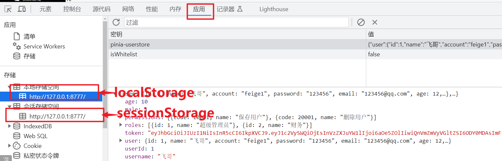

## 1. 环境隔离env

在开发中，我项目会分为几个阶段：

- 生成阶段
- 测试阶段
- 开发阶段

每个阶段都会有不同的环境。那么不同环境旧有不同配置和服务信息比如：

- 数据库信息
- 中间件服务信息
- 接口服务信息

所以如果做到无缝的切换的服务，便于开发就变得非常重要了。不论在前端还是在后端都有这种机制来完成响应操作。大部分理念相同。就环境隔离，大部分都是通过配置来完成

- 服务端—nacos(统一配置中心)
- 客户端：.env环境配置


**具体实现步骤：**

1：打开https://cn.vitejs.dev/guide/env-and-mode.html

2：在项目的跟目录下新建一个

```js
.env                # 所有情况下都会加载
.env.[mode]         # 只在指定模式下加载
```

3:在根目录下 新建如下三个环境隔离文件

- .env

  ```
  VITE_APP_TITLE=KVA后台管理系统-学相伴111
  ```

- .env.devepoment

  ```
  ENV = 'development'
  
  # 前端服务的端口
  VITE_CLI_PORT = 8777
  # 服务接口的前缀
  VITE_BASE_API = /api
  # 服务的基础路径
  VITE_BASE_PATH = http://127.0.0.1:8989
  
  ```

  

- .env.production

  ```
  ENV = 'production'
  
  # 前端vite项目的端口
  VITE_CLI_PORT = 8777
  # 服务前缀
  VITE_BASE_API = /api
  #下方修改为你的线上ip
  VITE_BASE_PATH = https://xxx.com
  
  ```

==定义的时候：注意一下细节：必须以VITE_开头才可以被后续的`import.meta.env`获取到==。

4： 配置以后如何使用————–js【/vue页面】使用

查看：https://cn.vitejs.dev/guide/env-and-mode.html#env-variables

在你需要的js模块中【或者vue页面】中如果你要读取配置信息就直接使用：读取的方式：`import.meta.env.配置文件中的key的名字`

```js

console.log("import.meta.env.VITE_BASE_PATH",import.meta.env.VITE_BASE_PATH)
console.log("import.meta.env.VITE_CLI_PORT",import.meta.env.VITE_CLI_PORT)
console.log("import.meta.env.VITE_BASE_API",import.meta.env.VITE_BASE_API)
```

比如：request.js

```
export default {
    method: 'get',
    // 基础url前缀
    baseURL: import.meta.env.VITE_BASE_PATH,
    // 请求头信息
    headers: {
      'Content-Type': 'application/json;charset=UTF-8'
    },
    // 设置超时时间
    timeout: 30000,
    // 返回数据类型
    responseType: 'json'
}
```

5: html引入环境配置信息

`%VITE_APP_TITLE%-%VITE_APP_STITLE%`

```html
<!DOCTYPE html>
<html lang="en">
  <head>
    <meta charset="UTF-8">
    <link rel="icon" href="/favicon.ico">
    <meta name="viewport" content="width=device-width, initial-scale=1.0">
    <title>%VITE_APP_TITLE%-%VITE_APP_STITLE%</title>
    <link rel="stylesheet" href="/css/loading.css">
  </head>
  <body>
    <div id="app">
      <div class="preload__wrap" id="Loading">
        <div class="preload__container">
          <p class="preload__name">欢迎使用</p>
          <div class="preload__loading"></div>
          <p class="preload__title">正在加载资源...</p>
          <p class="preload__sub-title">初次加载资源可能需要较多时间 请耐心等待</p>
        </div>
        <div class="preload__footer">
          <a href="#" target="_blank">KVA后台管理系统-学相伴</a>
        </div>
    </div>
    <script type="module" src="/src/main.js"></script>
  </body>
</html>

```


5： 指定模式启动

查看：https://cn.vitejs.dev/guide/env-and-mode.html

默认情况下，开发服务器 (`dev` 命令) 运行在 `development` (开发) 模式，而 `build` 命令则运行在 `production` (生产) 模式。

也就是说：

```json
npm run dev其实就是等价于：vite --mode development
npm run build 其实就是等价于：vite --mode production
```

6： 注意事项

==修改了配置文件一定要重启才会生效==


## 2. 关于路由接口统一问题

- 现有开发中存在两种接口定义
  - 一种是无/api
    - 登录
    - 注册
    - 验证码
  - 一种是有/api
    - 所有的业务接口都有api


如何做到统一呢？在后端处理: 登陆和code都加 /api，但是不加middle.JWTAuth()

```go
	// 业务模块接口，
	privaeGroup := ginServer.Group("/api")
	// 不需要拦截就放注册中间间的前面,需要拦截的就放后面
	loginRouter.InitLoginRouter(privaeGroup)
	codeRouter.InitCodeRouter(privaeGroup)
	// 只要接口全部使用jwt拦截
	privaeGroup.Use(middle.JWTAuth())
	{
		videoRouter.InitVideoRouter(privaeGroup)
		courseRouter.InitCourseRouter(privaeGroup)
	}
```


```go
package initilization

import (
	"fmt"
	"github.com/gin-gonic/gin"
	"net/http"
	"time"
	"xkginweb/commons/filter"
	"xkginweb/commons/middle"
	"xkginweb/global"
	"xkginweb/router"
	"xkginweb/router/code"
	"xkginweb/router/login"
)

func InitGinRouter() *gin.Engine {
	// 创建gin服务
	ginServer := gin.Default()
	// 提供服务组
	courseRouter := router.RouterWebGroupApp.Course.CourseRouter
	videoRouter := router.RouterWebGroupApp.Video.VideoRouter

	// 解决接口的跨域问题
	ginServer.Use(filter.Cors())

	loginRouter := login.LoginRouter{}
	codeRouter := code.CodeRouter{}
	// 接口隔离，比如登录，健康检查都不需要拦截和做任何的处理
	// 业务模块接口，
	privaeGroup := ginServer.Group("/api")
	// 不需要拦截就放注册中间间的前面,需要拦截的就放后面
	loginRouter.InitLoginRouter(privaeGroup)
	codeRouter.InitCodeRouter(privaeGroup)
	// 只要接口全部使用jwt拦截
	privaeGroup.Use(middle.JWTAuth())
	{
		videoRouter.InitVideoRouter(privaeGroup)
		courseRouter.InitCourseRouter(privaeGroup)
	}

	fmt.Println("router register success")
	return ginServer
}

func RunServer() {
	// 初始化路由
	Router := InitGinRouter()
	// 为用户头像和文件提供静态地址
	Router.StaticFS("/static", http.Dir("/static"))
	address := fmt.Sprintf(":%d", global.Yaml["server.port"])
	// 启动HTTP服务,courseController
	s := initServer(address, Router)
	// 保证文本顺序输出
	// In order to ensure that the text order output can be deleted
	time.Sleep(10 * time.Microsecond)

	s2 := s.ListenAndServe().Error()
	fmt.Println("服务启动完毕 ", s2)
}

```

在前端修改如下：

```js
export default {
    method: 'get',
    // 基础url前缀
    baseURL: import.meta.env.VITE_BASE_PATH,
    // 请求头信息
    headers: {
      'Content-Type': 'application/json;charset=UTF-8'
    },
    // 设置超时时间
    timeout: 30000,
    // 返回数据类型
    responseType: 'json'
}

```

```js
ENV = 'production'

# 前端vite项目的端口
VITE_CLI_PORT = 5173
#下方修改为你的线上ip
VITE_BASE_PATH = http://127.0.0.1:9899/api

```

开发环境同理


## 3. 关于vite项目中要不要配置服务代理的问题

`vite.config.js配置服务端代理如下：

```js
import { fileURLToPath, URL } from 'node:url'
import { defineConfig,loadEnv } from 'vite'
import vue from '@vitejs/plugin-vue'
import AutoImport from 'unplugin-auto-import/vite'
import Components from 'unplugin-vue-components/vite'
import { ElementPlusResolver } from 'unplugin-vue-components/resolvers'

// https://vitejs.dev/config/
export default defineConfig(({ command, mode }) => {
  // 根据当前工作目录中的 `mode` 加载 .env 文件
  // 设置第三个参数为 '' 来加载所有环境变量，而不管是否有 `VITE_` 前缀。
  const env = loadEnv(mode, process.cwd(), '')
  return {
    // vite 配置
    plugins: [
      vue(),
      AutoImport({
        imports: ['vue', 'vue-router', 'vuex', 'vue-i18n'],
        resolvers: [ElementPlusResolver()],
      }),
      Components({
        resolvers: [ElementPlusResolver()],
      })
    ],
    server:{
      // 如果使用docker-compose开发模式，设置为false
      open: true,
      port: 5173,
      proxy: {
        // 把key的路径代理到target位置
        [env.VITE_BASE_API]: { // 需要代理的路径   例如 '/api'
          target: `${env.VITE_BASE_PATH}:${env.VITE_SERVER_PORT}/`, // 代理到 目标路径
          changeOrigin: true,
          //rewrite: path => path.replace(new RegExp('^' + env.VITE_BASE_API), ''),
        }
      },
    },
    resolve: {
      alias: {
        '@': fileURLToPath(new URL('./src', import.meta.url))
      }
    }
  }
})


```

核心代码块

```js
proxy: {
        // 把key的路径代理到target位置
        [env.VITE_BASE_API]: { // 需要代理的路径   例如 '/api'
          target: `${env.VITE_BASE_PATH}`, // 代理到 目标路径
          changeOrigin: true,
          //rewrite: path => path.replace(new RegExp('^' + env.VITE_BASE_API), ''),
        }
      },
```

还原如下：

```js
proxy: {
        // 把key的路径代理到target位置
        '/api': { // 需要代理的路径   例如 '/api'
          target: `http://127.0.0.1:9899`, // 代理到 目标路径
          changeOrigin: true,
          rewrite: path => path.replace(new RegExp('^' + env.VITE_BASE_API), ''),
        }
  },
```

request.post(“/code/get”)—-baseURL—-url==/api/code/get—127.0.01:8777/api/code/get—–proxy—/http://127.0.0.1:8989/api/code/get

request.post(“/login”)—-baseURL—-url==/api/login—127.0.01:8777/api/login—–proxy—/http://127.0.0.1:8989/api/code/get

request.post(“/video/index”)—-baseURL—-url==/api/video/index—127.0.01:8777/api/video/index—–proxy—/http://127.0.0.1:8989/api/code/get

上面代码到底要不要配置呢，答案是不可以不用。但是如果配置又如何理解呢

浏览器用的是 127.0.01:5173/api/video/find，但是内部代理变成了 http://127.0.0.1:9899/api/video/find (中转了一下，保护server的ip和port不暴露)


## 4. 刷新会丢失状态或者打开新的浏览器会丢失状态

默认情况，状态管理是写入内存中，如果浏览器刷新就直接把放到内存中的数据直接丢失。就是说，如果你登录以后其实信息确实已经放在状态管理中。如果你不刷新浏览器是不会又任何问题。但是你刷新以后因为js会重新架加载你的状态管理，就把原来全部清空了。就出现刚才的问题，登录，刷新又会退出登录。怎么办呢？持久化处理状态管理。

- 所谓的持久化状态管理就是把状态的数据同步一份到本地存储中（sessionStorage/localstrorage），这个知识点是H5。是一种本地存储技术。

  

- 如果你是用localStorage。就算你关闭了浏览器下次在进来依然会继续把本地存储中的数据同步一次到状态管理中，继续维持数据的关系。除非你把浏览器历史记录清空，或者认为通过调试工具删除或者js的removeItem或者clear，或者卸载浏览器才可以把localStorage给清除掉

- 如果使用sessionStorage。那么关闭浏览器就自动丢失。如果不关闭你刷新就维持关系。

- 核心api

  - setItem(key,value)
  - getItem(key)
  - removeItem(key)
  - clear

如果自己写保存和同步就非常麻烦，又没有组件帮我们自动取完成呢。答案：有

官方推荐：https://prazdevs.github.io/pinia-plugin-persistedstate/guide/

1: 安装

```js
pnpm i pinia-plugin-persistedstate
```

2: 将插件添加到 pinia 实例上

```js
import { createPinia } from 'pinia'
import piniaPluginPersistedstate from 'pinia-plugin-persistedstate'

const pinia = createPinia()
pinia.use(piniaPluginPersistedstate)
```

3: 创建 Store 时，将 `persist` 选项设置为 `true`。

```js
使用选项式 Store 语法：

ts
import { defineStore } from 'pinia'

export const useStore = defineStore('main', {
  state: () => {
    return {
      someState: '你好 pinia',
    }
  },
  persist: true,
})
或者使用组合式 Store 语法：

ts
import { defineStore } from 'pinia'

export const useStore = defineStore(
  'main',
  () => {
    const someState = ref('你好 pinia')
    return { someState }
  },
  {
    persist: true,
  }
)

```

现在，你的整个 Store 将使用默认持久化配置保存。

4：关于持久化的配置和位置更改

https://prazdevs.github.io/pinia-plugin-persistedstate/zh/guide/config.html


## 

## 5. vue3使用screenfull实现全屏

1： 安装

```js
pnpm install screenfull --save
yarn add  screenfull --save
npm install screenfull --save
```

2：在使用.vue文件中 引入

```js
import screenfull from 'screenfull'
```


3：在按钮方法中调用方法可以双向切换全屏与非全屏
screenfull.toggle()

还可以

- 检测全屏状态
  screenfull.isFullscreen
- 测试浏览器是否支持全screenfull
  screenfull.isEnabled


API

screenfull 插件常用方法：

- .request(ele) 全屏
- .exit() 退出全屏
- .toggle() 切换全屏
- .on(event, function) ： event为 ‘change’ | ‘error’ 注册事件
- .off(event, function) ： 移除前面已经注册的事件
- .element： 返回一个全屏的dom节点，如果没有就为 null
- .isFullscreen : 是否是全屏状态
- .isEnabled ： 判断是否支持全屏

示例1

```html
<template>
    <el-button @click="toggleFullscreen">全屏</el-button>
</template>

<script lang="ts">
import screenfull from 'screenfull'

export default {
  name: 'Home',
  setup() {
    function toggleFullscreen() {
      if (screenfull.isEnabled) {
        screenfull.toggle()
      }
    }

    return {
      toggleFullscreen
    }
  }
}
</script>
```

示例2

```vue
<template>
  <el-button @click="toggleFullscreen">全屏</el-button>
</template>

<script setup>
import screenfull from 'screenfull'

// 全屏切换函数：toggleFullscreen
const toggleFullscreen = () => {
  if (screenfull.isEnabled) {
    screenfull.toggle()
  }
}

</script>
```

