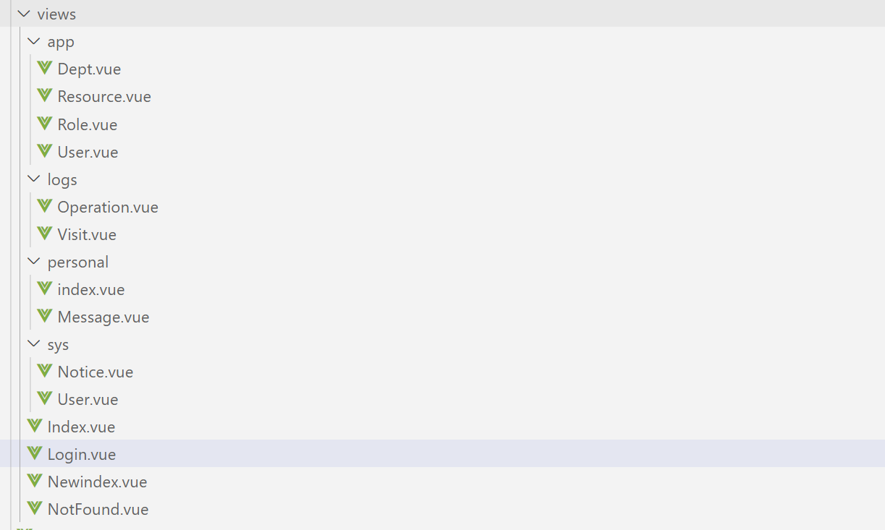
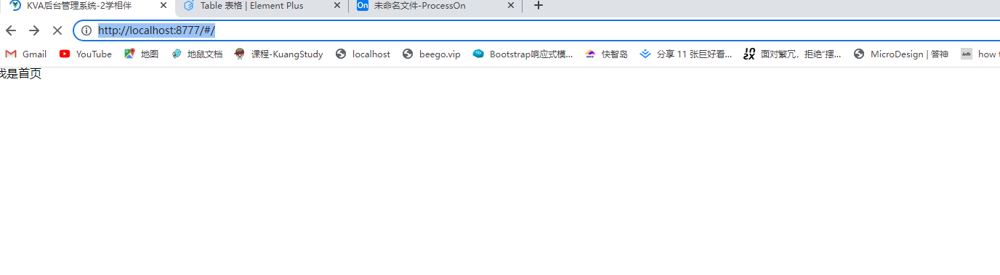
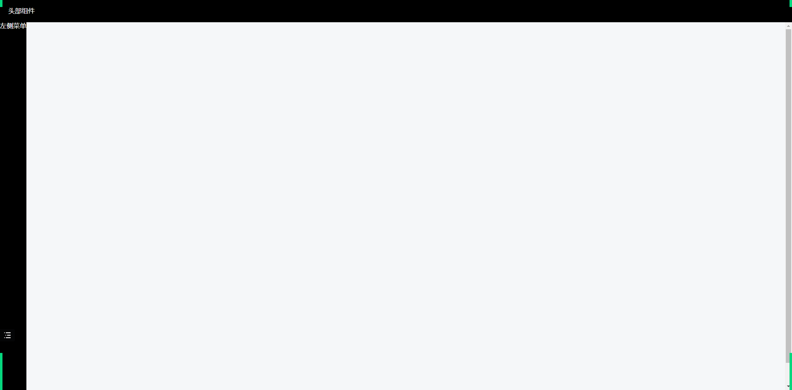
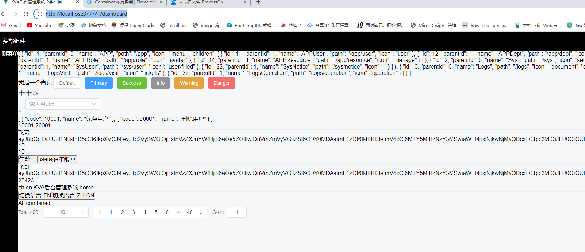

# 页面的布局处理 1


## 1. 官网参考

https://element-plus.gitee.io/zh-CN/component/table.html#%E5%B8%A6%E8%BE%B9%E6%A1%86%E8%A1%A8%E6%A0%BC

## 2. 后台管理系统

- 登录
- 首页
  - 控制面板
  - 应用管理
  - 系统管理
  - 订单管理
  - 设计管理
  - 用户管理
  - 角色权限
  - 评论管理
  - 等等等
- 404错误页面


## 3. 前端路由设计

- 延后到beego

## 4. 大布局

- 登录
- 首页
  - 上–头部信息
  - 下
    - 左边（菜单）
    - 右边 （点击菜单具体内容）
- 404错误页面


实现的方式就是：vue-router

### 1：安装vue-router@next

```js
npm install vue-router@next
pnpm install vue-router@next
yarn add vue-router@next
```

### 2: 在src下定义src/router目录并新建index.js

```js
import { createRouter, createWebHashHistory } from 'vue-router'
import NProgress from 'nprogress'
// 获取状态管理的token
import { useUserStore } from '@/stores/user.js'
import Layout from "@/layout/index.vue";
import PageFrame from "@/layout/components/PageFrame.vue";
// 显示右上角螺旋加载提示
NProgress.configure({ showSpinner: true })

const router = createRouter({
  history: createWebHashHistory(import.meta.env.BASE_URL),
  routes: [
    {
      path: "/",
      name: "Home",
      component: Layout
  ]
})

export default router

```

### 3：  注册路由，在main.js中如下：

```js
import { createApp } from 'vue'
import App from './App.vue'
import router from './router'
const app = createApp(App)
app.use(router)
app.mount('#app')
```

### 4： 开始定义路由页面SPA

这页面都定义在views目录下, 除非是大页面或者公共页面，我们可以直接放入到views目录下。比如：404，login.vue，index.vue。如果是页面的模块建议建设模块的目录然后在里面定义的路由页面。比如：/logs/Operation.vue, /sys/User.vue,/sys/Role.vue




**==而且注意：页面路由的命名尽量用大写开头。==**

### 5:  静态路由注册

给每个SPA页面进行注册路由。找到router/index.js开始进行静态配置如下：

如果报错请安装：

```js
pnpm install nprogress
npm install nprogress
yarn add nprogress
```

```js
import { createRouter, createWebHashHistory } from 'vue-router'
import NProgress from 'nprogress'
// 获取状态管理的token
import { useUserStore } from '@/stores/user.js'
// 显示右上角螺旋加载提示
NProgress.configure({ showSpinner: true })

const router = createRouter({
  history: createWebHashHistory(import.meta.env.BASE_URL),
  routes: [
    {
      path: "/",
      name: "Home",
      component: () => import('@/views/Index.vue')
    },
    {
      path: '/newindex',
      name: 'Newindex',
      meta: { title: "newindex" },
      component: () => import('@/views/NewIndex.vue')
    },
    {
      path: '/login',
      name: 'Login',
      meta: { title: "login" },
      component: () => import('@/views/Login.vue')
    },
    {
      path: '/:pathMatch(.*)*',
      name: 'NotFound',
      component: () => import('@/views/NotFound.vue')
    }
  ]
})


router.beforeEach(async (to) => {
  //开启进度条
  NProgress.start()
  const useStore = useUserStore();
  // 判断是否登录
  if (!useStore.isLogin && to.name !== 'Login') {
    // 这里的query就是为了记录用户最后一次访问的路径，这个路径是通过to的参数获取
    // 后续在登录成功以后，就可以根据这个path的参数，然后调整到你最后一次访问的路径
    return { name: 'Login', query: { "path": to.path } }
  } 
  return true
})

router.afterEach(() => {
  //完成进度条
  NProgress.done()
})


export default router

```

###  设置页面的落脚点router-view的位置

这个落脚点就是：App.vue 其实是入口页面。我准备准备一个空白页面

```vue
<template>
    <router-view></router-view>
</template>
```

关键代码：`   <router-view></router-view>`

router-路由，view-视图。你通过vue-router访问所有的路由，都会在路由视图位置进行渲染和加载

路由的加载又两种方式：

-  异步加载：component: () => import('@/views/NotFound.vue')

-  静态加载：

  - import Home from "@/views/Index.vue";

  - ```JS
    const router = createRouter({
      history: createWebHashHistory(import.meta.env.BASE_URL),
      routes: [
        {
          path: "/",
          name: "Home",
          component: Home
        }
      ]
    })
    ```

### 6: 启动项目

- http://127.0.0.1:8777/#/login
- http://127.0.0.1:8777/#/
- http://127.0.0.1:8777/#/newindex
- http://127.0.0.1:8777/#/loginxxxx—-进入404错误页面


## 5. 大布局设计Layout

- 登录—设计完毕
- 首页
  - 上–头部信息
  - 下
    - 左边（菜单）
    - 右边 （点击菜单具体内容）
- 404错误页面——设计完毕

首页如何设计，其实在很多后台系统，都使用布局来命名layout. 在目录下新建一个layout目录。然后新建一个index.vue如下：


layout/index.vue如下：

```vue
<template>
  <div>我是首页</div>
</template>
```

开始在router/index.js去进行配置首页路由：

```js
import { createRouter, createWebHashHistory } from 'vue-router'
import NProgress from 'nprogress'
// 获取状态管理的token
import { useUserStore } from '@/stores/user.js'
// 显示右上角螺旋加载提示
NProgress.configure({ showSpinner: true })
import Layout from "@/layout/Index.vue";

const router = createRouter({
  history: createWebHashHistory(import.meta.env.BASE_URL),
  routes: [
    {
      path: "/",
      name: "Home",
      component: Layout
    },
    {
      path: '/newindex',
      name: 'Newindex',
      meta: { title: "newindex" },
      component: () => import('@/views/NewIndex.vue')
    },

    {
      path: '/login',
      name: 'Login',
      meta: { title: "login" },
      component: () => import('@/views/Login.vue')
    },
    {
      path: '/:pathMatch(.*)*',
      name: 'NotFound',
      component: () => import('@/views/NotFound.vue')
    }
  ]
})


router.beforeEach(async (to) => {
  //开启进度条
  NProgress.start()
  const useStore = useUserStore();
  // 判断是否登录
  if (!useStore.isLogin && to.name !== 'Login') {
    // 这里的query就是为了记录用户最后一次访问的路径，这个路径是通过to的参数获取
    // 后续在登录成功以后，就可以根据这个path的参数，然后调整到你最后一次访问的路径
    return { name: 'Login', query: { "path": to.path } }
  } 
  return true
})

router.afterEach(() => {
  //完成进度条
  NProgress.done()
})


export default router

```

重新启动：`npm run dev` 关闭上次启按多次：ctrl+c 即可。

启动访问：http://localhost:8777/#/



在layout/Index.vue页面中开始进行布局，因为如果把头部，菜单，内容的展示区域都放在一起的话，其实是没问题。但是后续的维护是变得困难和臃肿，所以要进行组件化，（其实就是把布局首页进行分割成若干子组件，然后在Index.vue汇合）如下：

1: 头部组件 PageHeader.vue

```vue
<template>
  <div class="header-cont">
   头部组件
  </div>
</template>
<script setup>


</script>
<style lang="scss">
.header-cont {
  display: flex;
  align-items: center;
  justify-content: space-between;
  height: 100%;
  padding:0 20px;
  a {
    color: inherit;
    text-decoration: none;
  }
  h1 {
    margin: 0;
    font-size: 20px;
  }
  .gap {
    margin-right: 20px;
  }
  .right {
    .lang {
      font-size: 14px;
      .item {
        cursor: pointer;
        &.active {
          font-size: 18px;
          font-weight: bold;
        }
      }
    }
  }
  .el-dropdown {
    color: inherit;
  }
}
</style>
```

2：菜单组件 PageSilder.vue

```vue
<template>
<div class="page-sidebar">
   左侧菜单
</div>
</template>

<script  setup>
</script>

<style lang="scss">
$side-width: 200px;
.page-sidebar {
  height: 100vh;
  background: #000;
  .sidemenu.el-menu,
  .sidemenu .el-sub-menu > .el-menu {
    --el-menu-text-color: #ccc;
    --el-menu-hover-bg-color: #060251;
    --el-menu-border-color: transparent;
    --el-menu-bg-color: #000;
    .el-menu-item {
      &.is-active {
        background-color: var(--el-menu-hover-bg-color);
      }
    }
  }
  .sidemenu.el-menu:not(.el-menu--collapse) {
    width: $side-width;
  }
  .collape-bar {
    color: #fff;
    font-size: 16px;
    line-height: 36px;
    text-align: center;

    .c-icon {
      cursor: pointer;
    }
  }
}
</style>
```

3：内容区域组件 PageMain.vue

```vue
<template>
  <router-view></router-view>
</template>
<script>
export default {
  
}
</script>
<style lang="">
  
</style>

```

然后访问首页如下：http://localhost:8777/#/



假设在开发中我们有一个控制面板菜单，而这个菜单的内容必须渲染到layout的右侧内容区域也就是pagemain.vue的位置，如何实现呢？

1： 在page-main组件设定一个router-view标记

2： 然后把 dashboard路由设置成为layout的在子路由如下：

```js
import { createRouter, createWebHashHistory } from 'vue-router'
import NProgress from 'nprogress'
// 获取状态管理的token
import { useUserStore } from '@/stores/user.js'
// 显示右上角螺旋加载提示
NProgress.configure({ showSpinner: true })
import Layout from "@/layout/Index.vue";

const router = createRouter({
  history: createWebHashHistory(import.meta.env.BASE_URL),
  routes: [
    {
      path: "/",
      name: "Home",
      component: Layout,
      children:[
        {
          path: '/dashboard',
          name: 'Dashboard',
          meta: { title: "dashboard" },
          component: () => import('@/views/Dashboard.vue')
        }    
      ]
    },    
    {
      path: '/login',
      name: 'Login',
      meta: { title: "login" },
      component: () => import('@/views/Login.vue')
    },
    {
      path: '/:pathMatch(.*)*',
      name: 'NotFound',
      component: () => import('@/views/NotFound.vue')
    }
  ]
})


router.beforeEach(async (to) => {
  //开启进度条
  NProgress.start()
  const useStore = useUserStore();
  // 判断是否登录
  if (!useStore.isLogin && to.name !== 'Login') {
    // 这里的query就是为了记录用户最后一次访问的路径，这个路径是通过to的参数获取
    // 后续在登录成功以后，就可以根据这个path的参数，然后调整到你最后一次访问的路径
    return { name: 'Login', query: { "path": to.path } }
  } 
  return true
})

router.afterEach(() => {
  //完成进度条
  NProgress.done()
})


export default router

```

当访问http://localhost:8777/#/dashboard 的时候就会把dashborad路由对应的spa页面/views/DashBoard.vue的页面内容渲染到layout/page-main.vue的router-view的位置。从而实现点击菜单展示到右侧，后续的业务菜单原理是一样的。如下：




## 6. 静态菜单–不查数据库

其实通过上面的案例其实就已经很清晰了。你需要自己去定义一个列表或者使用组件来形成一个菜单组件。从而给每个菜单项绑定一个路由地址，你就可以实现了所有的菜单结构。

### 自定义菜单

router/index.js把所有的模块都注册进来

```js
import { createRouter, createWebHashHistory } from 'vue-router'
import NProgress from 'nprogress'
// 获取状态管理的token
import { useUserStore } from '@/stores/user.js'
// 显示右上角螺旋加载提示
NProgress.configure({ showSpinner: true })
import Layout from "@/layout/Index.vue";
import PageMain from "@/layout/components/PageMain.vue";

const router = createRouter({
  history: createWebHashHistory(import.meta.env.BASE_URL),
  routes: [
    {
      path: "/",
      name: "Home",
      component: Layout,
      children:[
        {
          path: 'dashboard',
          name: 'Dashboard',
          meta: { title: "dashboard" },
          component: () => import('@/views/Dashboard.vue')
        },
        {
          path: "app",
          name: "App",
          meta: {title:"app"},
          redirect: '/app/user',
          component: PageMain,
          children: [
            {
              path: "user",
              name: "AppUser",
              meta: {title:"AppUser"},
              component: () => import("@/views/app/User.vue"),
            },
            {
              path: "dept",
              name: "AppDept",
              meta: {title:"AppDept"},
              component: () => import("@/views/app/Dept.vue"),
            },
            {
              path: "role",
              name: "AppRole",
              meta: {title:"AppRole"},
              component: () => import("@/views/app/Role.vue"),
            },
            {
              path: "resource",
              name: "AppResource",
              meta: {title:"AppResource"},
              component: () => import("@/views/app/Resource.vue"),
            }
          ],
        },
        {
          path: 'sys',
          meta: {title:"sys"},
          redirect: '/sys/user',
          component: PageMain,
          children: [
            {
              path: "user",
              name: "SysUser",
              meta: {title:"SysUser"},
              component: () => import("@/views/sys/User.vue"),
            },
            {
              path: "notice",
              name: "SysNotice",
              meta: {title:"SysNotice"},
              component: () => import("@/views/sys/Notice.vue"),
            }
          ],
        },
        {
          path: "logs",
          name: "LogsManagement",
          meta: {title:"logs"},
          component: PageMain,
          redirect: '/logs/visit',
          children: [
            {
              path: "visit",
              name: "VisitsLog",
              meta: {title:"VisitsLog"},
              component: () => import("@/views/logs/Visit.vue"),
            },
            {
              path: "operation",
              name: "OprationsLog",
              meta: {title:"OprationsLog"},
              component: () => import("@/views/logs/Operation.vue"),
            }
          ],
        },       
        ]
      },    
    {
      path: '/login',
      name: 'Login',
      meta: { title: "login" },
      component: () => import('@/views/Login.vue')
    },
    {
      path: '/:pathMatch(.*)*',
      name: 'NotFound',
      component: () => import('@/views/NotFound.vue')
    }
  ]
})


router.beforeEach(async (to) => {
  //开启进度条
  NProgress.start()
  const useStore = useUserStore();
  // 判断是否登录
  if (!useStore.isLogin && to.name !== 'Login') {
    // 这里的query就是为了记录用户最后一次访问的路径，这个路径是通过to的参数获取
    // 后续在登录成功以后，就可以根据这个path的参数，然后调整到你最后一次访问的路径
    return { name: 'Login', query: { "path": to.path } }
  } 
  return true
})

router.afterEach(() => {
  //完成进度条
  NProgress.done()
})


export default router

```

自定义菜单-PageSilder.vue

```vue
<template>
<div class="page-sidebar">
   <ul>
      <li><a style="color:#fff" href="/#/dashboard">控制面板</a></li>
      <li><a style="color:#fff" href="/#/app/user">用户</a></li>
      <li><a style="color:#fff" href="/#/app/role">角色</a></li>
      <li><a style="color:#fff" href="/#/app/dept">部门</a></li>
      <li><a style="color:#fff" href="/#/app/resource">资源</a></li>
   </ul>
   <ul>
      <li><a style="color:#fff" href="/#/logs/visit">日志访问</a></li>
      <li><a style="color:#fff" href="/#/logs/operation">日志operation</a></li>
   </ul>
   <ul>
      <li><a style="color:#fff" href="/#/sys/user">系统用户</a></li>
      <li><a style="color:#fff" href="/#/sys/notice">系统通知</a></li>
   </ul>
</div>
</template>

<script  setup>
</script>

<style lang="scss">
$side-width: 200px;
.page-sidebar {
  height: 100vh;
  background: #000;
  .sidemenu.el-menu,
  .sidemenu .el-sub-menu > .el-menu {
    --el-menu-text-color: #ccc;
    --el-menu-hover-bg-color: #060251;
    --el-menu-border-color: transparent;
    --el-menu-bg-color: #000;
    .el-menu-item {
      &.is-active {
        background-color: var(--el-menu-hover-bg-color);
      }
    }
  }
  .sidemenu.el-menu:not(.el-menu--collapse) {
    width: $side-width;
  }
  .collape-bar {
    color: #fff;
    font-size: 16px;
    line-height: 36px;
    text-align: center;

    .c-icon {
      cursor: pointer;
    }
  }
}
</style>
```

然后点击访问各个模块就可以在右侧进行展示和显示了。如下：


未来如果你要添加系统角色如下：步骤如下：

1： 在views/sys/Role.vue

2:  然后在sys路由下继续添加一个路由子项:

```js
import { createRouter, createWebHashHistory } from 'vue-router'
import NProgress from 'nprogress'
// 获取状态管理的token
import { useUserStore } from '@/stores/user.js'
// 显示右上角螺旋加载提示
NProgress.configure({ showSpinner: true })
import Layout from "@/layout/Index.vue";
import PageMain from "@/layout/components/PageMain.vue";

const router = createRouter({
  history: createWebHashHistory(import.meta.env.BASE_URL),
  routes: [
    {
      path: "/",
      name: "Home",
      component: Layout,
      children:[
        {
          path: 'dashboard',
          name: 'Dashboard',
          meta: { title: "dashboard" },
          component: () => import('@/views/Dashboard.vue')
        },
        {
          path: "app",
          name: "App",
          meta: {title:"app"},
          redirect: '/app/user', // 重定向
          component: PageMain,
          children: [
            {
              path: "user",
              name: "AppUser",
              meta: {title:"AppUser"},
              component: () => import("@/views/app/User.vue"),
            },
            {
              path: "dept",
              name: "AppDept",
              meta: {title:"AppDept"},
              component: () => import("@/views/app/Dept.vue"),
            },
            {
              path: "role",
              name: "AppRole",
              meta: {title:"AppRole"},
              component: () => import("@/views/app/Role.vue"),
            },
            {
              path: "resource",
              name: "AppResource",
              meta: {title:"AppResource"},
              component: () => import("@/views/app/Resource.vue"),
            }
          ],
        },
        {
          path: 'sys',
          meta: {title:"sys"},
          redirect: '/sys/user',
          component: PageMain,
          children: [
            {
              path: "user",
              name: "SysUser",
              meta: {title:"SysUser"},
              component: () => import("@/views/sys/User.vue"),
            },
            {
              path: "notice",
              name: "SysNotice",
              meta: {title:"SysNotice"},
              component: () => import("@/views/sys/Notice.vue"),
            },
            {
              path: "role",
              name: "SysRole",
              meta: {title:"SysRole"},
              component: () => import("@/views/sys/Role.vue"),
            }
          ],
        },
        {
          path: "logs",
          name: "LogsManagement",
          meta: {title:"logs"},
          component: PageMain,
          redirect: '/logs/visit',
          children: [
            {
              path: "visit",
              name: "VisitsLog",
              meta: {title:"VisitsLog"},
              component: () => import("@/views/logs/Visit.vue"),
            },
            {
              path: "operation",
              name: "OprationsLog",
              meta: {title:"OprationsLog"},
              component: () => import("@/views/logs/Operation.vue"),
            }
          ],
        },       
        ]
      },    
    {
      path: '/login',
      name: 'Login',
      meta: { title: "login" },
      component: () => import('@/views/Login.vue')
    },
    {
      path: '/:pathMatch(.*)*',
      name: 'NotFound',
      component: () => import('@/views/NotFound.vue')
    }
  ]
})


router.beforeEach(async (to) => {
  //开启进度条
  NProgress.start()
  const useStore = useUserStore();
  // 判断是否登录
  if (!useStore.isLogin && to.name !== 'Login') {
    // 这里的query就是为了记录用户最后一次访问的路径，这个路径是通过to的参数获取
    // 后续在登录成功以后，就可以根据这个path的参数，然后调整到你最后一次访问的路径
    return { name: 'Login', query: { "path": to.path } }
  } 
  return true
})

router.afterEach(() => {
  //完成进度条
  NProgress.done()
})


export default router

```

然后在page-silder.vue去增加一个菜单

```vue
<template>
<div class="page-sidebar">
   <ul>
      <li><a style="color:#fff" href="/#/dashboard">控制面板</a></li>
      <li><a style="color:#fff" href="/#/app/user">用户</a></li>
      <li><a style="color:#fff" href="/#/app/role">角色</a></li>
      <li><a style="color:#fff" href="/#/app/dept">部门</a></li>
      <li><a style="color:#fff" href="/#/app/resource">资源</a></li>
   </ul>
   <ul>
      <li><a style="color:#fff" href="/#/logs/visit">日志访问</a></li>
      <li><a style="color:#fff" href="/#/logs/operation">日志operation</a></li>
   </ul>
   <ul>
      <li><a style="color:#fff" href="/#/sys/user">系统用户</a></li>
      <li><a style="color:#fff" href="/#/sys/notice">系统通知</a></li>
      <li><a style="color:#fff" href="/#/sys/role">系统角色</a></li>
   </ul>
</div>
</template>

<script  setup>
</script>

<style lang="scss">
$side-width: 200px;
.page-sidebar {
  height: 100vh;
  background: #000;
  .sidemenu.el-menu,
  .sidemenu .el-sub-menu > .el-menu {
    --el-menu-text-color: #ccc;
    --el-menu-hover-bg-color: #060251;
    --el-menu-border-color: transparent;
    --el-menu-bg-color: #000;
    .el-menu-item {
      &.is-active {
        background-color: var(--el-menu-hover-bg-color);
      }
    }
  }
  .sidemenu.el-menu:not(.el-menu--collapse) {
    width: $side-width;
  }
  .collape-bar {
    color: #fff;
    font-size: 16px;
    line-height: 36px;
    text-align: center;

    .c-icon {
      cursor: pointer;
    }
  }
}
</style>
```

http://localhost:8777/#/sys/role


这种静态配置有利也有弊端，利：比较清晰和简单，一个页面一个路由一个菜单。然后访问，刷新也会自动定位。

### 配置思维

新建一个js

```js
export const menuTreeData = [
    {
        id:1,
        parentId:0,
        name:'App',
        path:'/app',
        icon:'menu',
        children:[
            {
                id:11,
                parentId:1,
                name:'AppUser',
                path:'/app/user',
                icon:'user',
            },
            {
                id:12,
                parentId:1,
                name:'AppDept',
                path:'/app/dept',
                icon:'office-building',
            },
            {
                id:13,
                parentId:1,
                name:'AppRole',
                path:'/app/role',
                icon:'avatar',
            },
            {
                id:14,
                parentId:1,
                name:'AppResource',
                path:'/app/resource',
                icon:'manage',
            }
        ]
    },
    {
        id:2,
        parentId:0,
        name:'Sys',
        path:'/sys',
        icon:'setting',
        children:[
            {
                id:21,
                parentId:1,
                name:'SysUser',
                path:'/sys/user',
                icon:'user-filled',
            },
            {
                id:22,
                parentId:1,
                name:'SysNotice',
                path:'/sys/notice',
                icon:'',
            }
        ]
    },
    {
        id:3,
        parentId:0,
        name:'Logs',
        path:'/logs',
        icon:'document',
        children:[
            {
                id:31,
                parentId:1,
                name:'LogsVisit',
                path:'/logs/visit',
                icon:'tickets',
            },
            {
                id:32,
                parentId:1,
                name:'LogsOperation',
                path:'/logs/operation',
                icon:'operation',
            }
        ]
    }
]


```

然后读取js的数据信息，进行处理，同时还可以进行国际化处理。你只要菜单名字使用国际化配置的key的名字然后使用{{ t(key)}} 就可以读取国际化的内容。如下：

```VUE
<template>
  <div class="page-sidebar">
    <div class="collape-bar">
      <el-icon class="cursor" @click="isCollapse = !isCollapse">
        <expand v-if="isCollapse" />
        <fold v-else />
      </el-icon>
    </div>
    <el-menu
      active-text-color="#ffd04b"
      background-color="#000000"
      text-color="#fff"
      router
      :default-active="defaultActive"
      class="sidemenu"
      :collapse="isCollapse"
      @open="handleOpen"
      @close="handleClose"
    >
      <el-sub-menu v-for="(item, i) in menuTree" :key="i" :index="item.path">
        <template #title>
          <el-icon v-if="item.icon"><component :is="item.icon"></component></el-icon>
          <span>{{ t(`menu.${item.name}`) }}</span>
        </template>
        <template v-for="(child, ci) in item.children" :key="ci">
            <el-menu-item :index="child.path">
              <el-icon><component :is="child.icon"></component></el-icon>
              {{ t(`menu.${child.name}`) }}
            </el-menu-item>
          </template>
      </el-sub-menu>
    </el-menu>
  </div>
  </template>
  
  <script  setup>
  const route = useRoute();
  const { t } = useI18n();
  const isCollapse = ref(false)
  const menuTree = ref([
    {
      id: 1,
      parentId: 0,
      name: 'App',
      path: "/app",
      icon: "location",
      children: [
        {
          id: 11,
          parentId: 1,
          name: 'AppUser',
          path: "/app/user",
          icon: "user",
        },
        {
          id: 12,
          parentId: 1,
          name: 'AppDept',
          path: "/app/dept",
          icon: "office-building",
        },
        {
          id: 13,
          parentId: 1,
          name: 'AppRole',
          path: "/app/role",
          icon: "avatar",
        },
        {
          id: 14,
          parentId: 1,
          name: 'AppResource',
          path: "/app/resource",
          icon: "management",
        },
      ],
    },
    {
      id: 2,
      parentId: 0,
      name: 'Sys',
      path: "/sys",
      icon: "setting",
      children: [
        {
          id: 21,
          parentId: 2,
          name: 'SysUser',
          path: "/sys/user",
          icon: "user-filled",
        },
        {
          id: 22,
          parentId: 2,
          name: 'SysNotice',
          path: "/sys/notice",
          icon: "chat-dot-round",
        },
      ],
    },
    {
      id: 3,
      parentId: 0,
      name: 'Logs',
      path: "/logs",
      icon: "document",
      children: [
        {
          id: 31,
          parentId: 3,
          name: 'LogsVisit',
          path: "/logs/visit",
          icon: "tickets",
        },
        {
          id: 32,
          parentId: 3,
          name: 'LogsOperation',
          path: "/logs/operation",
          icon: "operation",
        },
      ],
    },
  ])
  
  const defaultActive = computed(() => route.path || menuTree.value[0].path)
  const handleOpen = (key, keyPath) => {
    console.log(key, keyPath)
  }
  const handleClose = (key, keyPath) => {
    console.log(key, keyPath)
  }
  </script>
  
  <style lang="scss">
  $side-width: 200px;
  .page-sidebar {
    .sidemenu.el-menu,
    .sidemenu .el-sub-menu > .el-menu {
      --el-menu-text-color: #ccc;
      --el-menu-hover-bg-color: #060251;
      --el-menu-border-color: transparent;
      --el-menu-bg-color: #000;
      .el-menu-item {
        &.is-active {
          background-color: var(--el-menu-hover-bg-color);
        }
      }
    }
    .sidemenu.el-menu:not(.el-menu--collapse) {
      width: $side-width;
    }

    .collape-bar {
      color: #fff;
      font-size: 16px;
      line-height: 36px;
      text-align: center;
  
      .c-icon {
        cursor: pointer;
      }
    }
  }
  </style>
```


## 7. 菜单的路由访问和选中的问题

通过上节课的处理我们使用el-menu的菜单组件，那么菜单组件你发现并没有编写的。如何完成el-menu菜单定位路由同事又可以选择和激活（选中）呢？方式如下：

- index 

  - 把index设置成路由地址，

  - 同时增加router属性true

  - 

    

- default-active

  这个激活的当前当前，也就说如果你设定的default-active和某个index的值的一致，那么就自动激活这个菜单，并且选中。其实在开发中我们更多希望达到的效果当前访问路径是什么。那么就选择什么。并且刷新以后也会自动定位到当前访问路由的菜单处。

如何获取到当前访问的路由路径呢？

```js
import {useRoute} from 'vue-router'
// 这个是用来获取当前访问的路由信息,
const route = useRoute();
// 根据当前路由来激活菜单
const defaultActive = computed(()=>(route.path))

```


## 8. 选中菜单颜色改变

使用属性来激活你选中的菜单的文本颜色

```vue
 <el-menu active-text-color="#ffd04b">
```

也通过css来覆盖它

```html
<div class="page-siderbar">
<el-menu active-text-color="#ffd04b" class="sidemenu">
```

```css
.page-sidebar {
  .sidemenu.el-menu,
  .sidemenu .el-sub-menu>.el-menu {
    --el-menu-text-color: #ccc;
    --el-menu-hover-bg-color: #060251;
    --el-menu-border-color: transparent;
    --el-menu-bg-color: #000;

    .el-menu-item {
      &.is-active {
        background-color: var(--el-menu-hover-bg-color);
        color: #42d51d
      }
    }
  }
```

## 9. 菜单的折叠的问题

```vue
<template>
	<el-menu 
      active-text-color="#ffd04b" 
      background-color="#000000" 
      text-color="#fff" 
      router
      :default-active="defaultActive" 
      class="sidemenu" 
      :collapse="isCollapse" 
      @open="handleOpen" 
      @close="handleClose">
....
    
</template>
 <script>
     // 默认情况下不折叠
    const isCollapse = ref(false)
 </script>
<style>
	/* elmenu菜单的折叠效果是通过属性：
  :collapse="isCollapse"  原理就在控制在不停切换elmenu="el-menu--collapse"样式信息
  1：ture 就折叠，就会使用图标宽度+padding作为菜单宽度
  2: false 就不折叠，那么就使用默认宽度：200px

  下面这行css是什么意思：
  如果菜单上存在el-menu--collapse样式就说明是折叠状态，就使用图标宽度+padding作为菜单宽度
  否则：就用我的width:200作为菜单宽度
*/
.sidemenu.el-menu:not(.el-menu--collapse) {
width: 200px;
}

</style>
```

## 10. 菜单的国际化问题

1: 准备国际化的组件安装，看前面课程

2: 先准备国际化的配置信息

menu.js是中文：

```js
export default {
  menu: {
    DashBoard:"控制面板",
    App: "应用管理",
    AppUser: "用户管理",
    AppDept: "机构管理",
    AppRole: "角色管理",
    AppResource: "资源管理",
    AppPermission: "授权管理",
    Sys: "系统管理",
    SysUser: "用户管理",
    SysNotice: "公告管理",
    Logs: "审计管理",
    LogsVisit: "访问日志",
    LogsOperation: "操作日志",
  }
}

```

menuEn.js

```js
export default {
  menu: {
    DashBoard:"DashBoard",
    App: "Website",
    AppUser: "User",
    AppDept: "Department",
    AppRole: "Role",
    AppResource: "Resource",
    AppPermission: "Permission",
    Sys: "System",
    SysUser: "User",
    SysNotice: "Notice",
    Logs: "Logs",
    LogsVisit: "Visits",
    LogsOperation: "Operations",
  }
}

```

3：定义菜单的数据

```js
const menuTree = ref([
  {
    id: 4,
    parentId: 0,
    name: 'DashBoard',
    path: "/dashboard",
    icon: "home",
    children:[]
  },
  {
    id: 1,
    parentId: 0,
    name: 'App',
    path: "/app",
    icon: "location",
    children: [
      {
        id: 11,
        parentId: 1,
        name: 'AppUser',
        path: "/app/user",
        icon: "user",
      },
      {
        id: 12,
        parentId: 1,
        name: 'AppDept',
        path: "/app/dept",
        icon: "office-building",
      },
      {
        id: 13,
        parentId: 1,
        name: 'AppRole',
        path: "/app/role",
        icon: "avatar",
      },
      {
        id: 14,
        parentId: 1,
        name: 'AppResource',
        path: "/app/resource",
        icon: "management",
      },
    ],
  },
  {
    id: 2,
    parentId: 0,
    name: 'Sys',
    path: "/sys",
    icon: "setting",
    children: [
      {
        id: 21,
        parentId: 2,
        name: 'SysUser',
        path: "/sys/user",
        icon: "user-filled",
      },
      {
        id: 22,
        parentId: 2,
        name: 'SysNotice',
        path: "/sys/notice",
        icon: "chat-dot-round",
      },
    ],
  },
  {
    id: 3,
    parentId: 0,
    name: 'Logs',
    path: "/logs",
    icon: "document",
    children: [
      {
        id: 31,
        parentId: 3,
        name: 'LogsVisit',
        path: "/logs/visit",
        icon: "tickets",
      },
      {
        id: 32,
        parentId: 3,
        name: 'LogsOperation',
        path: "/logs/operation",
        icon: "operation",
      },
    ],
  }
])
```

注意这里菜单的name并不是明文，而是国际化的key的名字，你只要保持一致，然后在菜单显示的时候使用国际化的api方法t方法就可以把国际化中与之对应的语言的菜单信息显示出来。

```js
<template>  
    <span>{{ t('menu.AppUser') }}</span>
</template>
<script setup>
const { t } = useI18n();
</script>

```

## 11. 关于项目中vue、vue-router、pinia、vuex自动导入的问题

在项目的vite.config.js文件中配置自动导入插件如下：

```js
import { fileURLToPath, URL } from 'node:url'
import { defineConfig,loadEnv } from 'vite'
import vue from '@vitejs/plugin-vue'
import AutoImport from 'unplugin-auto-import/vite'
import Components from 'unplugin-vue-components/vite'
import { ElementPlusResolver } from 'unplugin-vue-components/resolvers'

// https://vitejs.dev/config/
export default defineConfig(({ command, mode }) => {
  return {
    // vite 配置
    plugins: [
      vue(),
      AutoImport({
        imports: ['vue', 'vue-router', 'pinia', 'vue-i18n'],
        resolvers: [ElementPlusResolver()],
      }),
      Components({
        resolvers: [ElementPlusResolver()],
      })
    ]
  }
})


```

这样配置以后，在后续的SPA(单页)或者SFC(组件)页面中，你可以省去vue,vue-router vuex ,vue-i18n的导入过程

```js
import { useI18n } from "vue-i18n";
import { ref,computed } from "vue";
import { useRoute } from "vue-router";

// 这个是用来获取当前访问的路由信息,
const route = useRoute();
const { t } = useI18n();
const isCollapse = ref(false)
// 根据当前路由来激活菜单
const defaultActive = computed(()=>(route.path))
```

配置以后你可以简化如下：

```js
// 这个是用来获取当前访问的路由信息,
const route = useRoute();
const { t } = useI18n();
const isCollapse = ref(false)
// 根据当前路由来激活菜单
const defaultActive = computed(()=>(route.path))
```

## 12. 动态菜单—查数据库

关于动态菜单的数据获取的问题。一般有如下方式

1： 在登录的时候 （推荐）

2：路由的beforeEach 前置守卫中获取(不推荐，因为每次访问前都会查数据库，性能相对低了)

在登录时候，我们会直接把用户对应角色，角色对应菜单和权限会全部查询出来。如下：

因为暂时还没有和真正数据库打交道。可以使用mock数据进行测试如下：

```js
export const users = [
    {
        name:"visitor",
        roleId:"visitor",
        password:"visitor"
    },
    {
        name:"master",
        roleId:"master",
        password:"master"
    },
    {
        name:"admin",
        roleId:"admin",
        password:"admin"
    }
]

// 模拟服务端角色对应菜单信息--超级管理员
export const menuTreeData = [
    {
        id:4,
        parentId:0,
        name:'DashBoard',
        path:'/dashboard',
        icon:'home',
        children:[]
    },
    {
        id:1,
        parentId:0,
        name:'App',
        path:'/app',
        icon:'menu',
        children:[
            {
                id:11,
                parentId:1,
                name:'AppUser',
                path:'/app/user',
                icon:'user',
            },
            {
                id:12,
                parentId:1,
                name:'AppDept',
                path:'/app/dept',
                icon:'office-building',
            },
            {
                id:13,
                parentId:1,
                name:'AppRole',
                path:'/app/role',
                icon:'avatar',
            },
            {
                id:14,
                parentId:1,
                name:'AppResource',
                path:'/app/resource',
                icon:'avatar',
            }
        ]
    },
    {
        id:2,
        parentId:0,
        name:'Sys',
        path:'/sys',
        icon:'setting',
        children:[
            {
                id:21,
                parentId:1,
                name:'SysUser',
                path:'/sys/user',
                icon:'user-filled',
            },
            {
                id:22,
                parentId:1,
                name:'SysNotice',
                path:'/sys/notice',
                icon:'user-filled',
            }
        ]
    },
    {
        id:3,
        parentId:0,
        name:'Logs',
        path:'/logs',
        icon:'document',
        children:[
            {
                id:31,
                parentId:1,
                name:'LogsVisit',
                path:'/logs/visit',
                icon:'tickets',
            },
            {
                id:32,
                parentId:1,
                name:'LogsOperation',
                path:'/logs/operation',
                icon:'operation',
            }
        ]
    }
]
```

然后在store/user.js中开始引入mock数据、同时定义menuTree的数据用于接收服务端或者mock的测试数据如下：

`this.menuTree = menuTreeData`

```js
import { defineStore } from 'pinia'
import request from '@/request'
import router from '@/router'
import { menuTreeData } from '@/mock/data.js'

//https://blog.csdn.net/weixin_62897746/article/details/129124364
//https://prazdevs.github.io/pinia-plugin-persistedstate/guide/
export const useUserStore = defineStore('user', {
  // 定义状态
  state: () => ({
    user: {},
    username: '',
    userId: '',
    token: '',
    age:10,
    male:1,
    role:[],
    permissions:[],
    // 路由菜单，用来接收服务端传递过来的菜单数据
    menuTree:[]
  }),

  // 就是一种计算属性的机制，定义的是函数，使用的是属性就相当于computed
  getters:{

    malestr(state){
      if(state.male==1)return "男"
      if(state.male==0)return "女"
      if(state.male==1)return "保密"
    },

    isLogin(state){
      return state.token ? true : false
    },

    roleName(state){
      return state.roles && state.roles.map(r=>r.name).join(",")
    },

    permissionCode(state){
      return state.permissions &&  state.permissions.map(r=>r.code).join(",")
    }
  },

  // 定义动作
  actions: {
   setToken(newtoken){
      this.token = newtoken
   },

   getToken(){
    return this.token
   },
   
   /* 登出*/
   async LoginOut (){
      this.token = ''
      this.user = {}
      this.username = ''
      this.userId = ''
      sessionStorage.clear()
      localStorage.clear()
      router.push({ name: 'Login', replace: true })
      window.location.reload()
  },
  
   async toLogin(loginUser){

      // 查询用户信息，角色，权限，角色对应菜单
      const resp = await request.post("login/toLogin", loginUser,{noToken:true})
      // 这个会回退，回退登录页
      var { user ,token,roles,permissions } = resp.data
      // 登录成功以后获取到菜单信息, 这里要调用一
      this.menuTree = menuTreeData
      // 把数据放入到状态管理中
      this.user = user
      this.userId = user.id
      this.username = user.name
      this.token = token
      this.roles = roles
      this.permissions = permissions
      return Promise.resolve(resp)
    }
  },
  persist: {
    key: 'kva-pinia-userstore',
    storage: localStorage,//sessionStorage
  }
})
```

然后你在PageSider.vue中可以读取到菜单信息如下：

```vue
<template>
  <div class="page-sidebar">
    <div class="collape-bar">
      <el-icon class="cursor" @click="isCollapse = !isCollapse">
        <expand v-if="isCollapse" />
        <fold v-else />
      </el-icon>
    </div>
    <el-menu 
      active-text-color="#ffd04b" 
      background-color="#000000" 
      text-color="#fff" 
      router
      :default-active="defaultActive" 
      class="sidemenu" 
      :collapse="isCollapse">
      <template v-for="(item, i) in menuTree" :key="i">
        <template v-if="item.children && item.children.length">
          <el-sub-menu :index="item.path">
            <template #title>
              <el-icon v-if="item.icon">
                <component :is="item.icon"></component>
              </el-icon>
              <span>{{ t(`menu.${item.name}`) }}</span>
            </template>
              <template v-for="(child, ci) in item.children" :key="ci">
                <el-menu-item :index="child.path">
                  <el-icon>
                    <component :is="child.icon"></component>
                  </el-icon>
                  {{ t(`menu.${child.name}`) }}
                </el-menu-item>
            </template>
          </el-sub-menu>
        </template>
        <template v-else>
          <el-menu-item :index="item.path">
            <el-icon v-if="item.icon">
              <component :is="item.icon"></component>
            </el-icon>
            <span>{{ t(`menu.${item.name}`) }}</span>
          </el-menu-item>
        </template>
      </template>
    </el-menu>
  </div>
</template>
  
<script  setup>
import { useUserStore } from '@/stores/user.js'
// 这个是用来获取当前访问的路由信息,
const route = useRoute();
const { t } = useI18n();
// 默认情况下不折叠
const isCollapse = ref(false)
// 根据当前路由来激活菜单
const defaultActive = computed(()=>(route.path))
// 获取状态管理的菜单信息
const userStore = useUserStore();
// 如何获取菜单数据呢？
const menuTree = computed(()=>userStore.menuTree)

</script>
<style lang="scss">
.page-sidebar {
  .sidemenu.el-menu,
  .sidemenu .el-sub-menu>.el-menu {
    --el-menu-text-color: #ccc;
    --el-menu-hover-bg-color: #060251;
    --el-menu-border-color: transparent;
    --el-menu-bg-color: #000;

    .el-menu-item {
      &.is-active {
        background-color: var(--el-menu-hover-bg-color);
        color: #42d51d
      }
    }
  }

   /* elmenu菜单的折叠效果是通过属性：
      :collapse="isCollapse"  原理就在控制在不停切换elmenu="el-menu--collapse"样式信息
      1：ture 就折叠，就会使用图标宽度+padding作为菜单宽度
      2: false 就不折叠，那么就使用默认宽度：200px

      下面这行css是什么意思：
      如果菜单上存在el-menu--collapse样式就说明是折叠状态，就使用图标宽度+padding作为菜单宽度
      否则：就用我的width:200作为菜单宽度
   */
  .sidemenu.el-menu:not(.el-menu--collapse) {
    width: 200px;
  }

  .collape-bar {
    color: #fff;
    font-size: 16px;
    line-height: 36px;
    text-align: center;

    .c-icon {
      cursor: pointer;
    }
  }
}
</style>
```

然后刷新访问，如果无效可以关闭服务器重新启动把缓存全部清空在登录在尝试如下：


## 13. 动态菜单的思考

你觉得上面之所以可以，是因为现在数据库里的菜单和vue-router/index.js配置的路由菜单以及在views的定义菜单对应路由的spa都存在。所以你能够一个非常正常效果。

- views/mode/spa
- vue-router/index.js也配置spa的路由对应访问路径
- 数据库里刚好和他们一致。

但是往往开发中，你觉得会出现什么问题。比如：

- 一个添加了菜单，但是没有添加spa也没有添加vue-router肯定不可以访问。

如果你按照正常流程你应该是怎么做：

- 第一步：先定义spa
- 第二步：配置一个路由来调整spa页面 
- 第三步：在数据库在配置一个菜单


**所谓的动态菜单：其实就简化后续模块的新增和变化，不需要在vue-router/index.js配置路由，然后在数据库中添加一个菜单，然后在views添加一个页面，你就访问到对应的菜单。**

具体实现步骤：

1: 把所有home首页子路由全部去掉如下：

```js
import { createRouter, createWebHashHistory } from 'vue-router'
import NProgress from 'nprogress'
// 获取状态管理的token
import { useUserStore } from '@/stores/user.js'
// 显示右上角螺旋加载提示
NProgress.configure({ showSpinner: true })
import Layout from "@/layout/Index.vue";
import PageMain from "@/layout/components/PageMain.vue";

const router = createRouter({
  history: createWebHashHistory(import.meta.env.BASE_URL),
  routes: [
    {
      path: "/",
      name: "Home",
      component: Layout,
      redirect:"/dashboard"
    },    
    {
      path: '/login',
      name: 'Login',
      meta: { title: "login" },
      component: () => import('@/views/Login.vue')
    },
    {
      path: '/:pathMatch(.*)*',
      name: 'NotFound',
      component: () => import('@/views/NotFound.vue')
    }
  ]
})


router.beforeEach(async (to) => {
  //开启进度条
  NProgress.start()
  const useStore = useUserStore();
  // 判断是否登录
  if (!useStore.isLogin && to.name !== 'Login') {
    // 这里的query就是为了记录用户最后一次访问的路径，这个路径是通过to的参数获取
    // 后续在登录成功以后，就可以根据这个path的参数，然后调整到你最后一次访问的路径
    return { name: 'Login', query: { "path": to.path } }
  } 
  return true
})

router.afterEach(() => {
  //完成进度条
  NProgress.done()
})


export default router

```

2: 然后通过vue-router的js方法完成动态路由的创建，

一句话：就使用js的方法来完成首页children的拼接和处理。

而这个children的数据是通过：服务端返回的菜单数据和views定义路由页面组合而成的。

```js
children = [
    {
       // 这些从复服务端返回的菜单数据来
      path: 'dashboard',
      name: 'Dashboard',
      meta: { title: "dashboard" },
      // 这个从views里而来 ，这里命名就非常关键
      component: () => import('@/views/Dashboard.vue')
    }
]
```

```js
router.addRoute(“Home”,children)
```


## 14. vue-router

https://router.vuejs.org/zh/guide/advanced/dynamic-routing.html

### 为什么要配置动态路由

- 因为菜单是由数据库来管理的
  - 如果在数据库里添加一个菜单，你必须要做两个事情你添加到数据库路由才会由意义
  - 第一个条件：必须在router/index.js的routes进行定义和配置
  - 第二个条件：你必须还为路由配置路由页面/views/xxx/xxxx.vue
- 因为后续开发我们的菜单是根据用户的角色来决定和显示的。我们如果去写死的话，就不灵活
- 你思考如果你角色由10个，那么你必须配置10不同的菜单，而10个菜单数据，其实就可能有些多了一些菜单，有些少了一些菜单，那么为什么不把他们存在数据库，来进行一种关联映射，然后定义接口。根据用户查询对应角色，然后根据角色查询对应菜单。然后在返回菜单数据。那么不完美了么。
- 我们唯独在后台中要去开发的就如果还把菜单添加，然后动态绑定给角色。然后又如何把角色绑定给用户。


## 15. 动态路由又什么好处呢？

-  简化的前端路由的注册的过程，其实就完成了手动静态注册的过程。如果实在不喜欢，你可以考虑还原成静态注册方式。


## 16. 关于elementplus中的dialog,message,messagebox的认识和使用


### messageBox

https://element-plus.gitee.io/zh-CN/component/message-box.html

从设计上来说，MessageBox 的作用是美化系统自带的 `alert`、`confirm` 和 `prompt`，因此适合展示较为简单的内容。 如果需要弹出较为复杂的内容，请使用 Dialog。

```js
import { ElMessage, ElMessageBox } from 'element-plus'
```

alert

```js
ElMessageBox.alert('This is a message', 'Title', {
    // if you want to disable its autofocus
    // autofocus: false,
    confirmButtonText: 'OK',
    callback: (action: Action) => {
      ElMessage({
        type: 'info',
        message: `action: ${action}`,
      })
    },
  })
```

confirm

```js
ElMessageBox.confirm(
    'proxy will permanently delete the file. Continue?',
    'Warning',
    {
      confirmButtonText: 'OK',
      cancelButtonText: 'Cancel',
      type: 'warning',
    }
  )
    .then(() => {
      ElMessage({
        type: 'success',
        message: 'Delete completed',
      })
    })
    .catch(() => {
      ElMessage({
        type: 'info',
        message: 'Delete canceled',
      })
    })
```

prompt

```js
ElMessageBox.prompt('Please input your e-mail', 'Tip', {
    confirmButtonText: 'OK',
    cancelButtonText: 'Cancel',
    inputPattern:
      /[\w!#$%&'*+/=?^_`{|}~-]+(?:\.[\w!#$%&'*+/=?^_`{|}~-]+)*@(?:[\w](?:[\w-]*[\w])?\.)+[\w](?:[\w-]*[\w])?/,
    inputErrorMessage: 'Invalid Email',
  })
    .then(({ value }) => {
      ElMessage({
        type: 'success',
        message: `Your email is:${value}`,
      })
    })
    .catch(() => {
      ElMessage({
        type: 'info',
        message: 'Input canceled',
      })
    })
```

使用 HTML 片段

```js
 ElMessageBox.alert(
    '<strong>proxy is <i>HTML</i> string</strong>',
    'HTML String',
    {
      dangerouslyUseHTMLString: true,
    }
  )
```

自己封装的处理

```js
const KVA = {
    alert(title,content,options){
        // 默认值
        var defaultOptions = {icon:"warning",confirmButtonText:"确定",cancelButtonText:"取消"}
        // 用户传递和默认值就行覆盖处理
        var opts = {...defaultOptions,...options}
        return ElMessageBox.alert(content, title,{
            //确定按钮文本
            confirmButtonText: opts.confirmButtonText,
            // 内容支持html
            dangerouslyUseHTMLString: true,
            // 是否支持拖拽
            draggable: true,
            // 修改图标
            type: opts.icon
        })
    },
    confirm(title,content,options){
        // 默认值
        var defaultOptions = {icon:"warning",confirmButtonText:"确定",cancelButtonText:"取消"}
        // 用户传递和默认值就行覆盖处理
        var opts = {...defaultOptions,...options}
        // 然后提示
        return ElMessageBox.confirm(content, title, {
           //确定按钮文本
           confirmButtonText: opts.confirmButtonText,
           //取消按钮文本
           cancelButtonText: opts.cancelButtonText,
           // 内容支持html
           dangerouslyUseHTMLString: true,
           // 是否支持拖拽
           draggable: true,
           // 修改图标
           type: opts.icon,
        })
    },
    prompt(title,content,options){
        // 默认值
        var defaultOptions = {confirmButtonText:"确定",cancelButtonText:"取消"}
        // 用户传递和默认值就行覆盖处理
        var opts = {...defaultOptions,...options}
        return ElMessageBox.prompt(content, title, {
            //确定按钮文本
            confirmButtonText: opts.confirmButtonText,
            //取消按钮文本
            cancelButtonText: opts.cancelButtonText,
            // 内容支持html
            dangerouslyUseHTMLString: true,
            // 是否支持拖拽
            draggable: true,
            // 输入框的正则验证
            inputPattern: opts.pattern,
            // 验证的提示内容
            inputErrorMessage: opts.message||'请输入正确的内容',
          })
    }
}

export default  KVA
```

其实在elementplus注册到vue的时候如下：

```js
import ElementPlus from 'element-plus'
app.use(ElementPlus)
```

就会常用message,messagebox,dialog等都注册一份挂载到`app.config.globalProperties` 下。添加如下全局方法：`$msgbox`、 `$alert`、 `$confirm` 和 `$prompt`。 因此在 Vue 实例中可以采用本页面中的方式来调用`MessageBox`。 参数如下：

- `$msgbox(options)`
- `$alert(message, title, options)` 或 `$alert(message, options)`
- `$confirm(message, title, options)` 或 `$confirm(message, options)`
- `$prompt(message, title, options)` 或 `$prompt(message, options)`


那么如何拿到这个app.config.globalProperties对象。步骤如下：

```js
import {getCurrentInstance} from 'vue'
const {proxy} = getCurrentInstance();

proxy.$alert(message, title, options)
proxy.$confirm(message, title, options)
proxy.$prompt(message, title, options)
```

如果是vue2的话

```js
this.$alert(message, title, options)
this.$confirm(message, title, options)
this.$prompt(message, title, options)
```

## 17. 样式调整问题

base.css

```css
html,
body {
  height: 100%;
}
#app {
  height: 100%;
  overflow: hidden;
}
.flex-center {
  display: flex;
  align-items: center;
  justify-content: center;
}
.cursor {
  cursor: pointer;
}
.txt-c {
  text-align: center;
}
.w100p {
  width: 100%;
}

::-webkit-scrollbar {
  width: 6px;
  height: 6px;
  background-color: #f5f5f5;
}

::-webkit-scrollbar-button {
  background-color: rgba(0, 0, 0, 0.1);
}

::-webkit-scrollbar-track {
  background-color: #f5f5f5;
  border-radius: 5px;
}

::-webkit-scrollbar-thumb {
  background-color: #c9c9c9;
  border-radius: 5px;
}

.kva-container{padding:5px;overflow: hidden;}
.kva-contentbox{background:#fff;padding:15px;}
.kva-pagination-box{margin-top: 15px;display: flex;}
.kva-pagination-box.left{justify-content: flex-start;}
.kva-pagination-box.center{justify-content: center;}
.kva-pagination-box.right{justify-content: flex-end;}
.kva-form-search{border-bottom: 1px solid #e7e7e7;}
```

pagesilder.vue

```vue
<template>
  <div class="page-sidebar">
    <div class="collape-bar">
      <el-icon class="cursor" @click="isCollapse = !isCollapse">
        <expand v-if="isCollapse" />
        <fold v-else />
      </el-icon>
    </div>
    <el-menu 
      active-text-color="#333" 
      background-color="#ffffff" 
      text-color="#333" 
      router
      :default-active="defaultActive" 
      class="sidemenu" 
      :collapse="isCollapse">
      <template v-for="(item, i) in menuTree" :key="i">
        <template v-if="item.children && item.children.length">
          <el-sub-menu :index="item.path">
            <template #title>
              <el-icon v-if="item.icon">
                <component :is="item.icon"></component>
              </el-icon>
              <span>{{ t(`menu.${item.name}`) }}</span>
            </template>
              <template v-for="(child, ci) in item.children" :key="ci">
                <el-menu-item :index="child.path">
                  <el-icon>
                    <component :is="child.icon"></component>
                  </el-icon>
                  {{ t(`menu.${child.name}`) }}
                </el-menu-item>
            </template>
          </el-sub-menu>
        </template>
        <template v-else>
          <el-menu-item :index="item.path">
            <el-icon v-if="item.icon">
              <component :is="item.icon"></component>
            </el-icon>
            <span>{{ t(`menu.${item.name}`) }}</span>
          </el-menu-item>
        </template>
      </template>
    </el-menu>
  </div>
</template>
  
<script  setup>
import { useUserStore } from '@/stores/user.js'
// 这个是用来获取当前访问的路由信息,
const route = useRoute();
const { t } = useI18n();
// 默认情况下不折叠
const isCollapse = ref(false)
// 根据当前路由来激活菜单
const defaultActive = computed(()=>(route.path))
// 获取状态管理的菜单信息
const userStore = useUserStore();
// 如何获取菜单数据呢？
const menuTree = computed(()=>userStore.menuTree)

</script>
<style lang="scss">
$slider-width: 180px;
.page-sidebar {
  height: calc(100vh - 90px);
  overflow: hidden auto;
  .sidemenu.el-menu,
  .sidemenu .el-sub-menu>.el-menu {
    --el-menu-text-color: #ccc;
    --el-menu-hover-bg-color: #060251;
    --el-menu-border-color: transparent;
    --el-menu-bg-color: #001529;

    .el-menu-item {
      &.is-active {
        background-color: #e6f7ff;
        color: #1890ff
      }
    }
  }

   /* elmenu菜单的折叠效果是通过属性：
      :collapse="isCollapse"  原理就在控制在不停切换elmenu="el-menu--collapse"样式信息
      1：ture 就折叠，就会使用图标宽度+padding作为菜单宽度
      2: false 就不折叠，那么就使用默认宽度：200px

      下面这行css是什么意思：
      如果菜单上存在el-menu--collapse样式就说明是折叠状态，就使用图标宽度+padding作为菜单宽度
      否则：就用我的width:200作为菜单宽度
   */
  .sidemenu.el-menu:not(.el-menu--collapse) {
    width: $slider-width;
  }

  .collape-bar {
    color: #333;
    font-size: 16px;
    line-height: 36px;
    position: fixed;
    z-index: 2;
    width: 100%;
    left:20px;
    bottom: 0;
    .c-icon {
      cursor: pointer;
    }
  }
}
</style>
```


