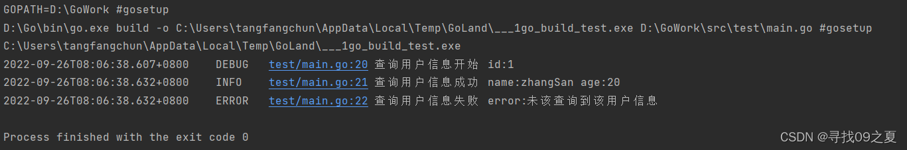
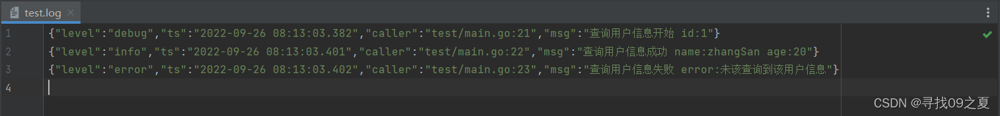
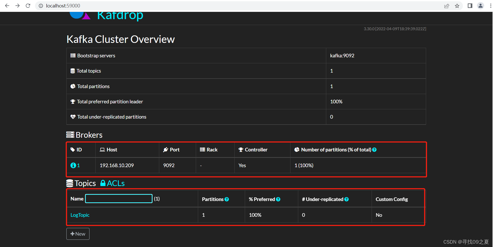
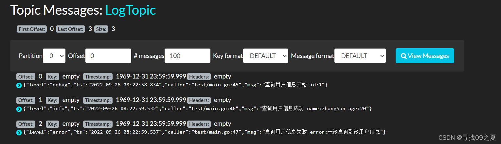

## 前言
日志对于项目的重要性不言而喻，之前项目线上的日志都是zap输出到文件，再由filebeat读取输出到kafka，文件服务器保留了大量的日志文件，而且有时filebeat服务重启，可能会导致日志消费重复的问题。所以后面就考虑直接输出到kafka，这样可以减少filebeat的处理过程，且不会出现日志重复消费的问题。

## 一、Kafka服务
部署服务这里采用docker部署，毕竟部署过程不是重点；这里一共部署3个服务，zookeeper、kafka、kafdrop（kafka管理）。
```yaml
version: "3"
services:
  zookeeper:
    image: 'bitnami/zookeeper:3.7'
    ports:
      - '2181:2181'
    environment:
      - ALLOW_ANONYMOUS_LOGIN=yes
  kafka:
    image: 'bitnami/kafka:3.2.0'
    ports:
      - '9092:9092'
    environment:
      - KAFKA_BROKER_ID=1
      - KAFKA_CFG_LISTENERS=PLAINTEXT://:9092
      - KAFKA_CFG_ADVERTISED_LISTENERS=PLAINTEXT://127.0.0.1:9092
      - KAFKA_CFG_ZOOKEEPER_CONNECT=zookeeper:2181
      - ALLOW_PLAINTEXT_LISTENER=yes
    depends_on:
      - zookeeper
  kafdrop:
    image: 'obsidiandynamics/kafdrop:3.30.0'
    restart: always
    ports:
      - "9000:9000"
    environment:
      - KAFKA_BROKERCONNECT=kafka:9092
    depends_on:
      - zookeeper
      - kafka
```
将上述代码放入"docker-compose.yml"文件，然后在该文件下执行"docker-compose up -d zookeeper kafka kafdrop"，等待镜像下载和服务器，这个该过程可能需要点时间。若安装成功，访问"http://localhost:59000/"，就可以进入kafka管理界面。

## 二Zap日志输出

### 1.输出console
```go
package main
 
import (
	"go.uber.org/zap"
	"go.uber.org/zap/zapcore"
	"os"
	"time"
)
 
var (
	logger *zap.Logger
	sugar  *zap.SugaredLogger
)
 
func main() {
	// mode == debug 日志console数据，其他不输出
	InitLogger("debug")
 
	// 输出日志
	sugar.Debugf("查询用户信息开始 id:%d", 1)
	sugar.Infof("查询用户信息成功 name:%s age:%d", "zhangSan", 20)
	sugar.Errorf("查询用户信息失败 error:%v", "未该查询到该用户信息")
}
 
func InitLogger(mode string) {
	var (
		allCore []zapcore.Core
		core    zapcore.Core
	)
 
	// 进入debug模式，日志输出到终端
	if mode == "debug" {
		consoleEncoder := zapcore.NewConsoleEncoder(zap.NewDevelopmentEncoderConfig())
		allCore = append(allCore, zapcore.NewCore(consoleEncoder, zapcore.Lock(os.Stdout), zapcore.DebugLevel))
	}
 
	core = zapcore.NewTee(allCore...)
	logger = zap.New(core, zap.AddCaller())
	defer logger.Sync()
	sugar = logger.Sugar()
}
 
func customTimeEncoder(t time.Time, enc zapcore.PrimitiveArrayEncoder) {
	enc.AppendString(t.Format("2006-01-02 15:04:05.000"))
}
```
运行上述代码输出结果如下：


### 2.输出file

```go
func InitLogger(mode string) {
	var (
		allCore []zapcore.Core
		core    zapcore.Core
	)
 
	// 日志是输出终端
	if mode == "debug" {
		consoleEncoder := zapcore.NewConsoleEncoder(zap.NewDevelopmentEncoderConfig())
		allCore = append(allCore, zapcore.NewCore(consoleEncoder, zapcore.Lock(os.Stdout), zapcore.DebugLevel))
	}
 
	// 日志输出文件
	encoder := getEncoder()
	writeSyncer := getLumberJackWriter()
	allCore = append(allCore, zapcore.NewCore(encoder, writeSyncer, zapcore.DebugLevel))
 
	core = zapcore.NewTee(allCore...)
	logger = zap.New(core, zap.AddCaller())
	defer logger.Sync()
	sugar = logger.Sugar()
}
 
func getLumberJackWriter() zapcore.WriteSyncer {
	lumberJackLogger := &lumberjack.Logger{
		Filename:   "./test.log", // 日志文件位置
		MaxSize:    1,            // 进行切割之前，日志文件最大值(单位：MB)，默认100MB
		MaxBackups: 5,            // 保留旧文件的最大个数
		MaxAge:     1,            // 保留旧文件的最大天数
		Compress:   false,        // 是否压缩/归档旧文件
	}
 
	return zapcore.NewMultiWriteSyncer(zapcore.AddSync(os.Stdout), zapcore.AddSync(lumberJackLogger))
}
 
func getEncoder() zapcore.Encoder {
	encoderConfig := zap.NewProductionEncoderConfig()
	encoderConfig.EncodeTime = customTimeEncoder
	return zapcore.NewJSONEncoder(encoderConfig)
}
```
运行上述代码，会生成test.log， 如果日志大于1MB，会进行自动分割，大家可以自己尝试；test.log内容如下：


###  3.输出kafka
```go
package main
 
import (
	"fmt"
	"github.com/Shopify/sarama"
	"github.com/natefinch/lumberjack"
	"go.uber.org/zap"
	"go.uber.org/zap/zapcore"
	"os"
	"time"
)
 
var (
	logger *zap.Logger
	sugar  *zap.SugaredLogger
)
 
type LogKafka struct {
	Topic     string
	Producer  sarama.SyncProducer
	Partition int32
}
 
func (lk *LogKafka) Write(p []byte) (n int, err error) {
	// 构建消息
	msg := &sarama.ProducerMessage{
		Topic:     lk.Topic,
		Value:     sarama.ByteEncoder(p),
		Partition: lk.Partition,
	}
	// 发现消息
	_, _, err = lk.Producer.SendMessage(msg)
	if err != nil {
		return
	}
 
	return
}
 
func main() {
	// mode == debug 日志console输出，其他不输出；kafkaSwitch == false 默认输出到文件，kafkaSwitch == true 输出到kafka
	InitLogger("debug", true)
 
	// 输出日志
	sugar.Debugf("查询用户信息开始 id:%d", 1)
	sugar.Infof("查询用户信息成功 name:%s age:%d", "zhangSan", 20)
	sugar.Errorf("查询用户信息失败 error:%v", "未该查询到该用户信息")
 
	time.Sleep(time.Second * 1)
}
 
func InitLogger(mode string, kafkaSwitch bool) {
	var (
		err     error
		allCore []zapcore.Core
		core    zapcore.Core
	)
 
	// 日志是输出终端
	if mode == "debug" {
		consoleEncoder := zapcore.NewConsoleEncoder(zap.NewDevelopmentEncoderConfig())
		allCore = append(allCore, zapcore.NewCore(consoleEncoder, zapcore.Lock(os.Stdout), zapcore.DebugLevel))
	}
 
	if kafkaSwitch { // 日志输出kafka
		// kafka配置
		config := sarama.NewConfig()                     // 设置日志输入到Kafka的配置
		config.Producer.RequiredAcks = sarama.WaitForAll // 等待服务器所有副本都保存成功后的响应
		//config.Producer.Partitioner = sarama.NewRandomPartitioner // 随机的分区类型
		config.Producer.Return.Successes = true // 是否等待成功后的响应,只有上面的RequiredAcks设置不是NoReponse这里才有用.
		config.Producer.Return.Errors = true    // 是否等待失败后的响应,只有上面的RequireAcks设置不是NoReponse这里才有用.
 
		// kafka连接
		var kl LogKafka
		kl.Topic = "LogTopic" // Topic(话题)：Kafka中用于区分不同类别信息的类别名称。由producer指定
		kl.Partition = 1      // Partition(分区)：Topic物理上的分组，一个topic可以分为多个partition，每个partition是一个有序的队列。partition中的每条消息都会被分配一个有序的id（offset）
		kl.Producer, err = sarama.NewSyncProducer([]string{"127.0.0.1:9092"}, config)
		if err != nil {
			panic(fmt.Sprintf("connect kafka failed: %+v\n", err))
		}
		encoder := getEncoder()
		writeSyncer := zapcore.AddSync(&kl)
		allCore = append(allCore, zapcore.NewCore(encoder, writeSyncer, zapcore.DebugLevel))
	} else { // 日志输出file
		encoder := getEncoder()
		writeSyncer := getLumberJackWriter()
		allCore = append(allCore, zapcore.NewCore(encoder, writeSyncer, zapcore.DebugLevel))
	}
 
	core = zapcore.NewTee(allCore...)
	logger = zap.New(core, zap.AddCaller())
	defer logger.Sync()
	sugar = logger.Sugar()
}
 
func getLumberJackWriter() zapcore.WriteSyncer {
	lumberJackLogger := &lumberjack.Logger{
		Filename:   "./test.log", // 日志文件位置
		MaxSize:    1,            // 进行切割之前，日志文件最大值(单位：MB)，默认100MB
		MaxBackups: 5,            // 保留旧文件的最大个数
		MaxAge:     1,            // 保留旧文件的最大天数
		Compress:   false,        // 是否压缩/归档旧文件
	}
 
	return zapcore.NewMultiWriteSyncer(zapcore.AddSync(os.Stdout), zapcore.AddSync(lumberJackLogger))
}
 
func getEncoder() zapcore.Encoder {
	encoderConfig := zap.NewProductionEncoderConfig()
	encoderConfig.EncodeTime = customTimeEncoder
	return zapcore.NewJSONEncoder(encoderConfig)
}
 
func customTimeEncoder(t time.Time, enc zapcore.PrimitiveArrayEncoder) {
	enc.AppendString(t.Format("2006-01-02 15:04:05.000"))
}
```
上述代码通过"kafkaSwitch"控制日志输出到file还是kafka，这里输出到kafka，结果如下：



### 总结
通过上述列子，我们可以轻松在项目中实现日志输出，自由选择cosole、file、kafka，方便项目开发和问题排查。