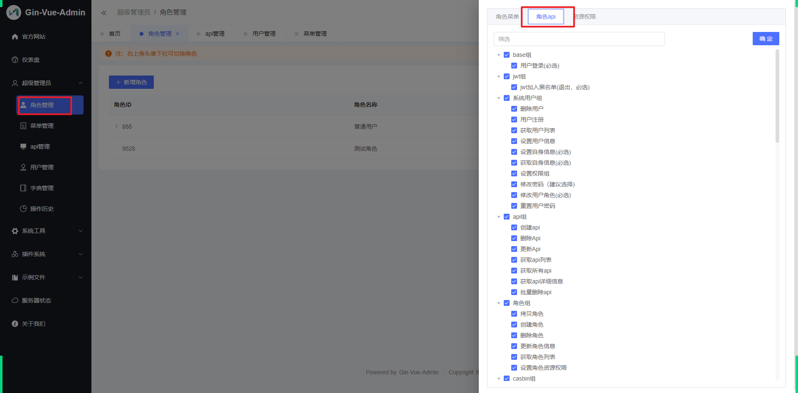

# 01、实现系统用户表的管理


## 1.1、系统后台相关表的业务对照

- sys_user —后台用户表

  

- sys_apis — 权限表 

  

- sys_roles—角色表

  

- sys_menus – 菜单表

  

- sys_role_apis—角色权限 

  

- sys_role_menus — 角色菜单

  

- sys_user_roles —- 用户角色

  


## 1.2 后台用户管理

### 1.2.1、 概述

系统用户，是不注册，一般都是 由超级管理员在后台添加和分配，然后给账号和初始密码给予小伙伴，然后在登录。

### 1.2.2、对应的表

```sql
CREATE TABLE `sys_users` (
  `id` bigint(20) unsigned NOT NULL AUTO_INCREMENT COMMENT '主键ID',
  `created_at` datetime DEFAULT NULL COMMENT '创建时间',
  `updated_at` datetime DEFAULT NULL COMMENT '更新时间',
  `uuid` varchar(191) COLLATE utf8mb4_unicode_ci DEFAULT NULL COMMENT '用户UUID',
  `account` varchar(191) COLLATE utf8mb4_unicode_ci DEFAULT NULL COMMENT '用户登录名',
  `password` varchar(191) COLLATE utf8mb4_unicode_ci DEFAULT NULL COMMENT '用户登录密码',
  `username` varchar(191) COLLATE utf8mb4_unicode_ci DEFAULT '系统用户' COMMENT '用户昵称',
  `avatar` varchar(191) COLLATE utf8mb4_unicode_ci DEFAULT 'https://qmplusimg.henrongyi.top/gva_header.jpg' COMMENT '用户头像',
  `phone` varchar(191) COLLATE utf8mb4_unicode_ci DEFAULT NULL COMMENT '用户手机号',
  `email` varchar(191) COLLATE utf8mb4_unicode_ci DEFAULT NULL COMMENT '用户邮箱',
  `enable` bigint(20) DEFAULT '1' COMMENT '用户是否被冻结 1正常 2冻结',
  `is_deleted` bigint(20) unsigned DEFAULT '0',
  PRIMARY KEY (`id`) USING BTREE,
  KEY `idx_sys_users_uuid` (`uuid`) USING BTREE,
  KEY `idx_sys_users_username` (`account`) USING BTREE,
  KEY `idx_sys_users_account` (`account`)
) ENGINE=InnoDB AUTO_INCREMENT=3 DEFAULT CHARSET=utf8mb4 COLLATE=utf8mb4_unicode_ci ROW_FORMAT=DYNAMIC;
```

### 1.2.3、实现步骤

- model

  ```go
  package sys
  
  import (
  	uuid "github.com/satori/go.uuid"
  	"xkginweb/global"
  )
  
  type SysUser struct {
  	global.GVA_MODEL
  	UUID     uuid.UUID `json:"uuid" gorm:"index;comment:用户UUID"`                                                  // 用户UUID
  	Account  string    `json:"account" gorm:"index;comment:用户登录名"`                                                // 用户登录名
  	Password string    `json:"-"  gorm:"comment:用户登录密码"`                                                          // 用户登录密码
  	Username string    `json:"username" gorm:"default:系统用户;comment:用户昵称"`                                         // 用户昵称
  	Avatar   string    `json:"avatar" gorm:"default:https://qmplusimg.henrongyi.top/gva_header.jpg;comment:用户头像"` // 用户头像
  	Phone    string    `json:"phone"  gorm:"comment:用户手机号"`                                                       // 用户手机号
  	Email    string    `json:"email"  gorm:"comment:用户邮箱"`                                                        // 用户邮箱
  	Enable   int       `json:"enable" gorm:"default:1;comment:用户是否被冻结 1正常 2冻结"`                                   //用户是否被冻结 1正常 2冻结
  }
  
  func (s *SysUser) TableName() string {
  	return "sys_users"
  }
  
  ```

- model init

  ```
  package orm
  
  import (
  	"xkginweb/global"
  	"xkginweb/model/bbs"
  	"xkginweb/model/jwt"
  	"xkginweb/model/sys"
  	"xkginweb/model/user"
  	"xkginweb/model/video"
  )
  
  func RegisterTable() {
  	db := global.KSD_DB
  	// 注册和声明model
  	db.AutoMigrate(user.XkUser{})
  	db.AutoMigrate(user.XkUserAuthor{})
  	// 系统用户，角色，权限表
  	db.AutoMigrate(sys.SysApi{})
  	db.AutoMigrate(sys.SysMenus{})
  	db.AutoMigrate(sys.SysRoleApis{})
  	db.AutoMigrate(sys.SysRoleMenus{})
  	db.AutoMigrate(sys.SysRoles{})
  	db.AutoMigrate(sys.SysUserRoles{})
  	db.AutoMigrate(sys.SysUser{}) //-----------------新增代码
  	// 视频表
  	db.AutoMigrate(video.XkVideo{})
  	db.AutoMigrate(video.XkVideoCategory{})
  	db.AutoMigrate(video.XkVideoChapterLesson{})
  	// 社区
  	db.AutoMigrate(bbs.XkBbs{})
  	db.AutoMigrate(bbs.BbsCategory{})
  
  	// 声明一下jwt模型
  	db.AutoMigrate(jwt.JwtBlacklist{})
  }
  
  ```

- service

  ```go
  package sys
  
  import (
  	"xkginweb/global"
  	"xkginweb/model/comms/request"
  	"xkginweb/model/sys"
  )
  
  // 对用户表的数据层处理
  type SysUserService struct{}
  
  // 用于登录
  func (service *SysUserService) GetUserByAccount(account string) (sysUser *sys.SysUser, err error) {
  	// 根据account进行查询
  	err = global.KSD_DB.Where("account = ?", account).First(&sysUser).Error
  	if err != nil {
  		return nil, err
  	}
  	return sysUser, nil
  }
  
  // 添加
  func (service *SysUserService) SaveSysUser(sysUser *sys.SysUser) (err error) {
  	err = global.KSD_DB.Create(sysUser).Error
  	return err
  }
  
  // 修改
  func (menu *SysMenusService) UpdateSysUser(sysUser *sys.SysUser) (err error) {
  	err = global.KSD_DB.Model(sysUser).Updates(sysUser).Error
  	return err
  }
  
  // 删除
  func (menu *SysMenusService) DelSysUserById(id uint) (err error) {
  	var sysUser sys.SysUser
  	err = global.KSD_DB.Where("id = ?", id).Delete(&sysUser).Error
  	return err
  }
  
  // 批量删除
  func (menu *SysMenusService) DeleteSysUsersByIds(sysUsers []sys.SysUser) (err error) {
  	err = global.KSD_DB.Delete(&sysUsers).Error
  	return err
  }
  
  // 根据id查询信息
  func (menu *SysMenusService) GetSysUserByID(id uint) (sysUsers *sys.SysUser, err error) {
  	err = global.KSD_DB.Where("id = ?", id).First(&sysUsers).Error
  	return
  }
  
  // 查询分页
  func (menu *SysMenusService) LoadSysUserPage(info request.PageInfo) (list interface{}, total int64, err error) {
  	// 获取分页的参数信息
  	limit := info.PageSize
  	offset := info.PageSize * (info.Page - 1)
  
  	// 准备查询那个数据库表
  	db := global.KSD_DB.Model(&sys.SysUser{})
  
  	// 准备切片帖子数组
  	var sysUserList []sys.SysUser
  
  	// 加条件
  	if info.Keyword != "" {
  		db = db.Where("(username like ? or account like ? )", "%"+info.Keyword+"%", "%"+info.Keyword+"%")
  	}
  
  	// 排序默时间降序降序
  	db = db.Order("created_at desc")
  
  	// 查询中枢
  	err = db.Count(&total).Error
  	if err != nil {
  		return sysUserList, total, err
  	} else {
  		// 执行查询
  		err = db.Limit(limit).Offset(offset).Find(&sysUserList).Error
  	}
  
  	// 结果返回
  	return sysUserList, total, err
  }
  
  ```

  

- api

  ```go
  package sys
  
  import (
  	"github.com/gin-gonic/gin"
  	"strconv"
  	"xkginweb/commons/response"
  	"xkginweb/global"
  	req "xkginweb/model/comms/request"
  	resp "xkginweb/model/comms/response"
  )
  
  type SysUsersApi struct{}
  
  /* 根据id查询用户信息 */
  func (api *SysUsersApi) GetById(c *gin.Context) {
  	// 根据id查询方法
  	id := c.Param("id")
  	// 根据id查询方法
  	parseUint, _ := strconv.ParseUint(id, 10, 64)
  	sysUser, err := sysUserService.GetSysUserByID(uint(parseUint))
  	if err != nil {
  		global.SugarLog.Errorf("查询用户: %s 失败", id)
  		response.FailWithMessage("查询用户失败", c)
  		return
  	}
  
  	response.Ok(sysUser, c)
  }
  
  /* 分页查询用户信息*/
  func (api *SysUsersApi) LoadSysUserPage(c *gin.Context) {
  	// 创建一个分页对象
  	var pageInfo req.PageInfo
  	// 把前端json的参数传入给PageInfo
  	err := c.ShouldBindJSON(&pageInfo)
  	if err != nil {
  		response.FailWithMessage(err.Error(), c)
  		return
  	}
  
  	xkBbsPage, total, err := sysUserService.LoadSysUserPage(pageInfo)
  	if err != nil {
  		response.FailWithMessage("获取失败"+err.Error(), c)
  		return
  	}
  	response.Ok(resp.PageResult{
  		List:     xkBbsPage,
  		Total:    total,
  		Page:     pageInfo.Page,
  		PageSize: pageInfo.PageSize,
  	}, c)
  }
  
  ```

  

- router

  ```go
  package sys
  
  import (
  	"github.com/gin-gonic/gin"
  	"xkginweb/api/v1/sys"
  )
  
  // 登录路由
  type SysUsersRouter struct{}
  
  func (router *SysUsersRouter) InitSysUsersRouter(Router *gin.RouterGroup) {
  	sysUsersApi := sys.SysUsersApi{}
  	// 用组定义--（推荐）
  	sysMenusRouter := Router.Group("/sys")
  	{
  		sysMenusRouter.GET("/user/get/:id", sysUsersApi.GetById)
  		sysMenusRouter.GET("/user/load", sysUsersApi.LoadSysUserPage)
  	}
  }
  
  ```

  

- router init

  ```go
  package initilization
  
  import (
  	"fmt"
  	"github.com/gin-gonic/gin"
  	"go.uber.org/zap"
  	"net/http"
  	"time"
  	"xkginweb/commons/filter"
  	"xkginweb/commons/middle"
  	"xkginweb/global"
  	"xkginweb/router"
  	"xkginweb/router/code"
  	"xkginweb/router/login"
  	"xkginweb/router/sys"
  )
  
  func InitGinRouter() *gin.Engine {
  	// 打印gin的时候日志是否用颜色标出
  	//gin.ForceConsoleColor()
  	//gin.DisableConsoleColor()
  	//f, _ := os.Create("gin.log")
  	//gin.DefaultWriter = io.MultiWriter(f)
  	// 如果需要同时将日志写入文件和控制台，请使用以下代码。
  	//gin.DefaultWriter = io.MultiWriter(f, os.Stdout)
  
  	// 创建gin服务
  	ginServer := gin.Default()
  	// 提供服务组
  	courseRouter := router.RouterWebGroupApp.Course.CourseRouter
  	videoRouter := router.RouterWebGroupApp.Video.VideoRouter
  	menusRouter := router.RouterWebGroupApp.SysMenu.SysMenusRouter
  
  	// 解决接口的跨域问题
  	ginServer.Use(filter.Cors())
  
  	loginRouter := login.LoginRouter{}
  	logoutRouter := login.LogoutRouter{}
  	codeRouter := code.CodeRouter{}
  	sysUserRouter := sys.SysUsersRouter{} // ------------------- 新增代码
  	// 接口隔离，比如登录，健康检查都不需要拦截和做任何的处理
  	// 业务模块接口，
  	privateGroup := ginServer.Group("/api")
  	// 不需要拦截就放注册中间间的前面,需要拦截的就放后面
  	loginRouter.InitLoginRouter(privateGroup)
  	codeRouter.InitCodeRouter(privateGroup)
  	// 只要接口全部使用jwt拦截
  	privateGroup.Use(middle.JWTAuth())
  	{
  		logoutRouter.InitLogoutRouter(privateGroup)
  		videoRouter.InitVideoRouter(privateGroup)
  		courseRouter.InitCourseRouter(privateGroup)
  		menusRouter.InitSysMenusRouter(privateGroup)
  		sysUserRouter.InitSysUsersRouter(privateGroup) // ------------------- 新增代码
  	}
  
  	fmt.Println("router register success")
  	return ginServer
  }
  
  func RunServer() {
  
  	// 初始化路由
  	Router := InitGinRouter()
  	// 为用户头像和文件提供静态地址
  	Router.StaticFS("/static", http.Dir("/static"))
  	address := fmt.Sprintf(":%d", global.Yaml["server.port"])
  	// 启动HTTP服务,courseController
  	s := initServer(address, Router)
  	global.Log.Debug("服务启动成功：端口是：", zap.String("port", "8088"))
  	// 保证文本顺序输出
  	// In order to ensure that the text order output can be deleted
  	time.Sleep(10 * time.Microsecond)
  
  	s2 := s.ListenAndServe().Error()
  	global.Log.Info("服务启动完毕", zap.Any("s2", s2))
  }
  
  ```

  

- 前端定义路由接口 

  ```js
  import request from '@/request/index.js'
  
  /**
   * 查询系统用户信息
   */
  export const LoadSysUser = ()=>{
     return request.get(`/sys/user/load`)
  }
  
  /**
   * 根据id查询系统用户信息
   */
  export const GetSysUserById = ( id )=>{
     return request.get(`/sys/user/${id}`)
  }
  ```


# 02、登录页面调整

Login.vue 页面的优化：调整布局，设置动画效果

你只需要把页面直接覆盖即可。包括背景图放置在src/assets/imgs目录下，直接在这里去找即可。

```vue
<template>
    <div class="login-box">
        <div class="imgbox">
            <div class="bgblue"></div> 
                <ul class="circles">
                    <li></li>
                    <li></li>
                    <li></li>
                    <li></li>
                    <li></li>
                    <li></li>
                    <li></li>
                    <li></li>
                    <li></li>
                    <li></li>
                </ul>
            <div class="w-full max-w-md">
                <div class="fz48 cof fw">欢迎光临</div>
                <div class="fz14 cof" style="margin-top:10px;line-height:24px;">欢迎来到好玩俱乐部，在这里和志同道合的朋友一起分享有趣的故事，一起组织有趣的活动...</div>
            </div>
        </div>
        <div class="loginbox">
            <div class="login-wrap">
                <h1 class="header fz32">{{ ctitle }}</h1>
                <form action="#">
                    <div class="ksd-el-items"><input type="text" v-model="loginUser.account" class="ksd-login-input"  placeholder="请输入账号"></div>
                    <div class="ksd-el-items"><input type="password" v-model="loginUser.password" class="ksd-login-input" placeholder="请输入密码" @keydown.enter="handleSubmit"></div>
                    <div class="ksd-el-items pr">
                        <input type="text" class="ksd-login-input" maxlength="6" v-model="loginUser.code" placeholder="请输入验证码"  @keydown.enter="handleSubmit">
                        
                    </div>
                    <div class="ksd-el-items"><input type="button" @click.prevent="handleSubmit" class="ksd-login-btn" value="登录"></div>            
                </form>
            </div>
        </div>
    </div>
</template>

<script setup>
import { onMounted, reactive, ref } from 'vue';
import {useRouter,useRoute} from 'vue-router'
import {useUserStore} from '@/stores/user.js'
import {getCapatcha} from '@/api/code.js'
import KVA from "@/utils/kva.js";
const userStore = useUserStore();
const ctitle = ref(import.meta.env.VITE_APP_TITLE)

// 定义一个路由对象
const router = useRouter()
// 获取当前路由信息，用于获取当前路径参数，路径，HASH等
const route = useRoute();
// 准备接受图像验证码
const codeURL = ref("");
// 获取用户输入账号和验证码信息
const loginUser = reactive({
    code:"",
    account:"admin",
    password:"123456",
    codeId:""
})


// 根据axios官方文档开始调用生成验证码的接口
const handleGetCapatcha = async () => {
    const resp = await getCapatcha()
    const {baseURL,id} = resp.data
    codeURL.value = baseURL
    loginUser.codeId = id
}


// 提交表单
const  handleSubmit = async () => {
    // axios.post ---application/json---gin-request.body
    if(!loginUser.code){
        KVA.notifyError("请输入验证码")
        return;
    }
    if(!loginUser.account){
        KVA.notifyError("请输入账号")
        return;
    }
    if(!loginUser.password){
        KVA.notifyError("请输入密码")
        return;
    }

    // 把数据放入到状态管理中
    try{
        await userStore.toLogin(loginUser)
        var path = route.query.path || "/"
        router.push(path)
    }catch(e){
        if(e.code === 60002){
            loginUser.code = ""
            handleGetCapatcha()
        }
    }
}
// 用生命周期去加载生成验证码
onMounted(() => {
    handleGetCapatcha()
})

</script>

<style scoped lang="scss">
    .pr{position: relative;}
    .codeurl{position: absolute;top:5px;right:5px;width: 140px;}
    .ksd-el-items{margin: 15px 0;}
    .ksd-login-input{border:1px solid #eee;padding:16px 8px;width: 100%;box-sizing: border-box;outline: none;border-radius: 4px;}
    .ksd-login-btn{border:1px solid #eee;padding:16px 8px;width: 100%;box-sizing: border-box;
        background:#2196F3;color:#fff;border-radius:6px;cursor: pointer;}
    .ksd-login-btn:hover{background:#1789e7;}
    .login-box{
        display: flex;
        flex-wrap: wrap;
        background:#fff;
        .loginbox{
            width: 35%;height: 100vh;
            display: flex;
            align-items: center;
            justify-content: center;
            .header{margin-bottom: 30px;}
            .login-wrap{
                width: 560px;
                height: 444px;
                padding:20px 100px;
                box-sizing: border-box;
                border-radius: 8px;
                box-shadow: 0 0 10px #fafafa;
                background: rgba(255,255,255,0.6);
                text-align: center;
                display: flex;
                flex-direction: column;
                justify-content: center;
            }
        }
        .imgbox{
            width: 65%;
            height: 100vh;
            display: flex;
            align-items: center;
            justify-content:center;
            position:relative;
            background: url("../assets/imgs/login_background.jpg");
            background-size:cover;
            background-repeat:no-repeat;

            .bgblue{
                background-image:linear-gradient(to bottom,#4f46e5,#3b82f6);
                position:absolute;
                top:0;
                left:0;
                bottom:0;
                right:0;
                opacity:0.75;
            }
        }
    }

    .circles {
    position: absolute;
    top: 0;
    left: 0;
    width: 100%;
    height: 100%;
    overflow: hidden;
}
.circles li {
    position: absolute;
    display: block;
    list-style: none;
    width: 20px;
    height: 20px;
    background: rgba(255, 255, 255, 0.2);
    animation: animate 25s linear infinite;
    bottom: -150px;
}
.circles li:nth-child(1) {
    left: 25%;
    width: 80px;
    height: 80px;
    animation-delay: 0s;
}
.circles li:nth-child(2) {
    left: 10%;
    width: 20px;
    height: 20px;
    animation-delay: 2s;
    animation-duration: 12s;
}
.circles li:nth-child(3) {
    left: 70%;
    width: 20px;
    height: 20px;
    animation-delay: 4s;
}
.circles li:nth-child(4) {
    left: 40%;
    width: 60px;
    height: 60px;
    animation-delay: 0s;
    animation-duration: 18s;
}
.circles li:nth-child(5) {
    left: 65%;
    width: 20px;
    height: 20px;
    animation-delay: 0s;
}
.circles li:nth-child(6) {
    left: 75%;
    width: 110px;
    height: 110px;
    animation-delay: 3s;
}
.circles li:nth-child(7) {
    left: 35%;
    width: 150px;
    height: 150px;
    animation-delay: 7s;
}
.circles li:nth-child(8) {
    left: 50%;
    width: 25px;
    height: 25px;
    animation-delay: 15s;
    animation-duration: 45s;
}
.circles li:nth-child(9) {
    left: 20%;
    width: 15px;
    height: 15px;
    animation-delay: 2s;
    animation-duration: 35s;
}
.circles li:nth-child(10) {
    left: 85%;
    width: 150px;
    height: 150px;
    animation-delay: 0s;
    animation-duration: 11s;
}
@keyframes animate {
    0% {
        transform: translateY(0) rotate(0deg);
        opacity: 1;
        border-radius: 0;
    }

    100% {
        transform: translateY(-1000px) rotate(720deg);
        opacity: 0;
        border-radius: 50%;
    }
}
.max-w-md {
    max-width: 28rem;
    position:relative;
    z-index:10;
}
</style>
```

# 03、关于message框修改notify框

封装了notify关于error和success封装如下：

```js
const KVA = {
    alert(title,content,options){
        // 默认值
        var defaultOptions = {icon:"warning",confirmButtonText:"确定",cancelButtonText:"取消"}
        // 用户传递和默认值就行覆盖处理
        var opts = {...defaultOptions,...options}
        return ElMessageBox.alert(content, title,{
            //确定按钮文本
            confirmButtonText: opts.confirmButtonText,
            // 内容支持html
            dangerouslyUseHTMLString: true,
            // 是否支持拖拽
            draggable: true,
            // 修改图标
            type: opts.icon
        })
    },
    confirm(title,content,options){
        // 默认值
        var defaultOptions = {icon:"warning",confirmButtonText:"确定",cancelButtonText:"取消"}
        // 用户传递和默认值就行覆盖处理
        var opts = {...defaultOptions,...options}
        // 然后提示
        return ElMessageBox.confirm(content, title, {
           //确定按钮文本
           confirmButtonText: opts.confirmButtonText,
           //取消按钮文本
           cancelButtonText: opts.cancelButtonText,
           // 内容支持html
           dangerouslyUseHTMLString: true,
           // 是否支持拖拽
           draggable: true,
           // 修改图标
           type: opts.icon,
        })
    },
    prompt(title,content,options){
        // 默认值
        var defaultOptions = {confirmButtonText:"确定",cancelButtonText:"取消"}
        // 用户传递和默认值就行覆盖处理
        var opts = {...defaultOptions,...options}
        return ElMessageBox.prompt(content, title, {
            //确定按钮文本
            confirmButtonText: opts.confirmButtonText,
            //取消按钮文本
            cancelButtonText: opts.cancelButtonText,
            // 内容支持html
            dangerouslyUseHTMLString: true,
            // 是否支持拖拽
            draggable: true,
            // 输入框的正则验证
            inputPattern: opts.pattern,
            // 验证的提示内容
            inputErrorMessage: opts.message||'请输入正确的内容',
          })
    },
    message(message,type,duration=3000){
        //永远保持只有一个打开状态
        ElMessage.closeAll()
        return ElMessage({
            showClose: true,
            dangerouslyUseHTMLString: true,
            message,
            duration,
            type,
        })
    },
    success(message){
        return this.message(message,"success")
    },
    warning(message){
        return this.message(message,"warning")
    },
    error(message){
        return this.message(message,"error")
    },
    notifyError(message){//-------------------------------------新增代码
        return this.notify("提示",message,3000,{type:"error",position:"tr"})
    },
    notifySuccess(message){//-------------------------------------新增代码
        return this.notify("提示",message,3000,{type:"success",position:"tr"})
    },
    notify(title,message,duration=3000,options){
        // 默认值
        var defaultOptions = {type:"info",position:"tr"}
        // 用户传递和默认值就行覆盖处理
        var opts = {...defaultOptions,...options}
        //永远保持只有一个打开状态
        ElNotification.closeAll()
        var positionMap = {
            "tr":"top-right",
            "tl":"top-left",
            "br":"bottom-right",
            "bl":"bottom-left"
        }
        return ElNotification({
            title,
            message,
            duration: duration,
            type:opts.type,
            position: positionMap[opts.position||"tr"],
            dangerouslyUseHTMLString:true
        })
    }
}

export default  KVA
```

现在已经把项目中所以的KVA.message替换成了KVA.notifyError。改动的位置：Login.vue 


# 04、Skeleton 骨架屏开发

## 1：认识

在需要等待加载内容的位置设置一个骨架屏，某些场景下比 Loading 的视觉效果更好。

## 2：应用

### 整体控制

```vue
 <el-skeleton :loading="loading" animated>
 	 <template #template>----------------animated=true
		这里就是骨架屏元素的设置
     </template>
     <template #default> ----------------animated=false
		这里就是原本的内容
     </template>>
 </el-skeleton>
```

- animated : 是否需要动画效果
- loading : true 显示骨架的效果，false，隐藏骨架的效果。

### 单个控制

```vue
<el-skeleton/>
```

默认情况：rows=“3” 其实会显示4个子项出来。

案例如下：

```vue
<div style="background: #fff;padding:10px;">
    <el-skeleton :loading="true" animated> 
        <template #template>
            <el-skeleton-item variant="h1" />
        </template>
        <template #default>
            <h1>我是一个标题</h1>
        </template>
    </el-skeleton> 
</div>
```


## 3：如何把控制面板的整体页面做成骨架屏幕

1: 局部控制

```vue
 <el-skeleton :loading="loading" animated>
 	 <template #template>----------------animated=true
		这里就是骨架屏元素的设置
     </template>
     <template #default> ----------------animated=false
		这里就是原本的内容
     </template>>
 </el-skeleton>


 <el-skeleton :loading="loading" animated>
 	 <template #template>----------------animated=true
		这里就是骨架屏元素的设置
     </template>
     <template #default> ----------------animated=false
		这里就是原本的内容
     </template>>
 </el-skeleton>


 <el-skeleton :loading="loading" animated>
 	 <template #template>----------------animated=true
		这里就是骨架屏元素的设置
     </template>
     <template #default> ----------------animated=false
		这里就是原本的内容
     </template>>
 </el-skeleton>

 <el-skeleton :loading="loading" animated>
 	 <template #template>----------------animated=true
		这里就是骨架屏元素的设置
     </template>
     <template #default> ----------------animated=false
		这里就是原本的内容
     </template>>
 </el-skeleton>
```


2：学会整体控制（推荐）

```
<el-skeleton :loading="loading" animated>
 	 <template #template>----------------animated=true
		<div></div>
        <div></div>
        <div></div>
        <div></div>
        <div></div>
     </template>
     <template #default> ----------------animated=false
		<div></div>
        <div></div>
        <div></div>
        <div></div>
        <div></div>
     </template>>
 </el-skeleton>
```

案例如下：

```vue
<template>
    <el-skeleton animated :loading="true">
        <template #template>
            <!--card的骨架屏-->
            <div class="gva-card-box statebox">
                <el-row :gutter="12">
                    <el-col :span="6" :xs="12" v-for="i in 4" :key="i">
                        <el-card shadow="hover">
                            <div class="tit"><el-skeleton-item variant="div" style="width: 40%;height: 20px" /></div>
                            <div class="num">
                                <el-skeleton-item variant="div" style="width: 60%;height:30px"/>
                            </div>
                            <div class="info">
                                <el-skeleton-item variant="div" style="width: 80%;height:20px"/>
                            </div>
                        </el-card>
                    </el-col>
                </el-row>
            </div> 
            
            <!--统计报表的骨架-->
            <div class="gva-card-box">
                <div class="gva-card">
                    <div class="card-header"><span ><el-skeleton-item variant="h3" style="width:6%;height:30px;" /></span></div>
                    <div class="echart-box">
                        <div class="el-row" style="margin-left: -10px; margin-right: -10px;">
                            <div class="el-col el-col-24 el-col-xs-24 el-col-sm-18 is-guttered">
                                <div class="dashboard-line-box">
                                    <el-skeleton-item variant="h3" style="height:400px;" />
                                </div>
                            </div>
                            <div class="el-col el-col-24 el-col-xs-24 el-col-sm-6 is-guttered"
                                style="padding-right: 10px; padding-left: 10px;">
                                <div class="commit-table">
                                    <div class="commit-table-title"><el-skeleton-item variant="h3" style="width:20%;height:30px;" /> </div>
                                    <div class="log">
                                        <div class="log-item" v-for="i in 10" :key="i">
                                            <el-skeleton-item variant="h3" style="height:22px;" />
                                        </div>
                                    </div>
                                </div>
                            </div>
                        </div>
                    </div>
                </div>
            </div>
        </template>
        <template #default>
            <slot></slot>
        </template>
    </el-skeleton>
</template>
<script setup>
import {useMenuTabStore} from '@/stores/menuTab.js'
const menuTabStore = useMenuTabStore()
const skLoading  = computed(()=>menuTabStore.skLoading)

onMounted(() => {
    setTimeout(() => {
        menuTabStore.skLoading = false;
    }, 1000)
})
</script>
```

如果未来你的骨架屏，不仅仅是一个地方进行设置，比如：控制面板，导航栏，菜单栏，头部栏，表格区域等等。那么如果你想用一个状态来控制他们所有的骨架屏的显示和隐藏。那么你就必须使用状态管理pinia来进行处理如下：

```js
import { defineStore } from 'pinia'

export const useSkeletonStore = defineStore('skeleton', {
  // 定义状态
  state: () => ({
    skLoading:true
  }),

  // 定义动作
  actions: {
   /* 设置loading */ 
   setLoading(loading){
      this.skLoading = loading
   }
  },
  persist: {
    key: 'kva-pinia-skeleton',
    storage: sessionStorage
  }
})
```


# 05、数字动画

1： 安装

```js
pnpm install animated-number-vue3
npm install animated-number-vue3
yarn add animated-number-vue3
```

2:在main.js中引入

```js
import AnimatedNumber from 'animated-number-vue3'
app.use(AnimatedNumber)
```

3: 使用

```js
<AnimatedNumber :from="0" :to="1000"></AnimatedNumber>
```

### 3.具体使用

> 3.1简单模式


```ruby
<AnimatedNumber :from="0" :to="1000"></AnimatedNumber>
```

> 3.2 slot模式


```jsx
//也可使用插槽来自定义界面等操作，option为整个动效包含内容的对象，
//item里面包含变动的数字，当from和to传的是一个数字时，为单数字动效，此时值必须为number
<AnimatedNumber :from="0" :to="1000">
  <template #default="{ option, item }">
    <h1>{{ item.number }}</h1>
  </template>
</AnimatedNumber>
```

> 3.3 复杂模式 如果想一次性为多个数字做动效，此插件也提供插槽来自定义，from和to的对象key必须为一样，一个开始一个结束的值


```xml
<AnimatedNumber :from="{
  number1:0,
  number2:0
}" :to="{
  number1:100,
  number2:100
}">
  <template #default="{ option, item }">
    <h1>{{ item.number1 }}</h1>
    <h1>{{ item.number2 }}</h1>
  </template>
</AnimatedNumber>
```

具体应用如下：

不用slot模式用简单模式的话，￥、日销售额：￥.......后面的数字会换行。<AnimatedNumber/> 是一个块标签

```vue
<template>
    <div class="gva-card-box statebox">
        <el-row :gutter="12">
            <el-col :span="6" :xs="12">
                <el-card shadow="hover">
                    <div class="tit">总销售额</div>
                    <div class="num">
                        <AnimatedNumber :from="0" :to="12560" duration="3000">
                            <template #default="{ option, item }">
                                <span>￥{{ item.number }}</span>
                            </template>
                        </AnimatedNumber>
                    </div>
                    <div class="info">
                        <AnimatedNumber :from="0" :to="8869" duration="3000">
                            <template #default="{ option, item }">
                                <span>日销售额：￥{{ item.number }}</span>
                            </template>
                        </AnimatedNumber>
                    </div>
                </el-card>
            </el-col>
            <el-col :span="6" :xs="12">
                <el-card shadow="hover">
                    <div class="tit">用户注册</div>
                    <div class="num">
                        <AnimatedNumber :from="0" :to="8846" duration="3000" />
                    </div>
                    <div class="info">
                        <AnimatedNumber :from="0" :to="1423" duration="3000">
                            <template #default="{ option, item }">
                                <span>日注册量：{{ item.number }}</span>
                            </template>
                        </AnimatedNumber>
                    </div>
                </el-card>
            </el-col>
            <el-col :span="6" :xs="12">
                <el-card shadow="hover">
                    <div class="tit">访问量</div>
                    <div class="num">
                        <AnimatedNumber :from="0" :to="6560" duration="3000" />
                    </div>
                    <div class="info">
                        <AnimatedNumber :from="0" :to="2423" duration="3000">
                            <template #default="{ option, item }">
                                <span>日访问量：{{ item.number }}</span>
                            </template>
                        </AnimatedNumber>
                    </div>
                </el-card>
            </el-col>
            <el-col :span="6" :xs="12">
                <el-card shadow="hover">
                    <div class="tit">支付笔数</div>
                    <div class="num">
                        <AnimatedNumber :from="0" :to="12589" duration="3000" />
                    </div>
                    <div class="info">
                        <AnimatedNumber :from="0" :to="80" duration="3000">
                            <template #default="{ option, item }">
                                <span>转化率：{{ item.number }} %</span>
                            </template>
                        </AnimatedNumber>
                    </div>
                </el-card>
            </el-col>
        </el-row>
    </div>
</template>
<script setup>
</script>
<style lang="scss" scoped>
.statebox {
    .el-card {
        padding: 10px;
        margin-bottom: 5px;
    }

    .tit {
        height: 22px;
        color: rgba(0, 0, 0, .45);
        font-size: 14px;
        line-height: 22px;
    }

    .num {
        height: 38px;
        margin-top: 10px;
        color: rgba(0, 0, 0, .75);
        font-size: 32px;
        line-height: 38px;
        white-space: nowrap;
        font-weight: bold;
        text-overflow: ellipsis;
        word-break: break-all;
    }

    .info {
        position: relative;
        width: 100%;
        margin-top: 20px;
    }
}</style>
```


# 06、如何开发保存

- 1： 先要确定你的id是不是数字，并且是不是自增的，如果不是：那就说你代码必须要手动方式去添加和维护。如果是自增，那么你程序是不需要去任何关于id的处理。
- 2：一定考虑那些字段是不为空，如果不为空的那么这列必须在代码用参数传递或者在项目写默认值
- 3：如果有些是又默认值。那么可以考虑不用传递。（status）
- 4： 创建和更新时间看看是否数据区维护还是框架维护了。


# 07、MD5加盐加密

```go
package utils

import (
	"crypto/md5"
	"encoding/hex"
)

// 参数：需要加密的字符串
func getMd5(str string) string {
	h := md5.New()
	h.Write([]byte(str))
	return hex.EncodeToString(h.Sum(nil))
}

// md5加密
func Md5(str string) string {
	return getMd5(getMd5(PWD_SALT + str + PWD_SALT))
}

//@author: [piexlmax](https://github.com/piexlmax)
//@function: MD5V
//@description: md5加密
//@param: str []byte
//@return: string

func MD5V(str []byte, b ...byte) string {
	h := md5.New()
	h.Write(str)
	return hex.EncodeToString(h.Sum(b))
}

```

注意加密以后，那么就必须考虑到login的时候要加密比对

```go
// 登录的接口处理
func (api *LoginApi) ToLogined(c *gin.Context) {
	type LoginParam struct {
		Account  string
		Code     string
		CodeId   string
		Password string
	}

	// 1：获取用户在页面上输入的账号和密码开始和数据库里数据进行校验
	param := LoginParam{}
	err2 := c.ShouldBindJSON(&param)
	if err2 != nil {
		response.Fail(60002, "参数绑定有误", c)
		return
	}

	if len(param.Code) == 0 {
		response.Fail(60002, "请输入验证码", c)
		return
	}

	if len(param.CodeId) == 0 {
		response.Fail(60002, "验证码获取失败", c)
		return
	}

	// 开始校验验证码是否正确
	verify := store.Verify(param.CodeId, param.Code, true)
	if !verify {
		response.Fail(60002, "你输入的验证码有误!!", c)
		return
	}

	inputAccount := param.Account
	inputPassword := param.Password

	if len(inputAccount) == 0 {
		response.Fail(60002, "请输入账号", c)
		return
	}

	if len(inputPassword) == 0 {
		response.Fail(60002, "请输入密码", c)
		return
	}

	dbUser, err := sysUserService.GetUserByAccount(inputAccount)
	if err != nil {
		response.Fail(60002, "你输入的账号和密码有误", c)
		return
	}

	// 这个时候就判断用户输入密码和数据库的密码是否一致
	// inputPassword = utils.Md5(123456) = 2ec9f77f1cde809e48fabac5ec2b8888
	// dbUser.Password = 2ec9f77f1cde809e48fabac5ec2b8888
	if dbUser != nil && dbUser.Password == utils.Md5(inputPassword) {//--=--------------这里是修改的代码
		token := api.generaterToken(c, dbUser)
		// 根据用户id查询用户的角色
		roles := [2]map[string]any{}
		m1 := map[string]any{"id": 1, "name": "超级管理员", "code": "admin"}
		m2 := map[string]any{"id": 2, "name": "财务", "code": "visitor"}
		roles[0] = m1
		roles[1] = m2
		// 根据用户id查询用户的角色的权限
		permissions := [2]map[string]any{}
		pm1 := map[string]any{"code": 10001, "name": "保存用户"}
		pm2 := map[string]any{"code": 20001, "name": "删除用户"}
		permissions[0] = pm1
		permissions[1] = pm2

		response.Ok(map[string]any{"user": dbUser, "token": token, "roles": roles, "permissions": permissions}, c)
	} else {
		response.Fail(60002, "你输入的账号和密码有误", c)
	}
}

```


# 08、数据载体

pojo

- model、entity、pojo
- po、context
- vo —-返回


