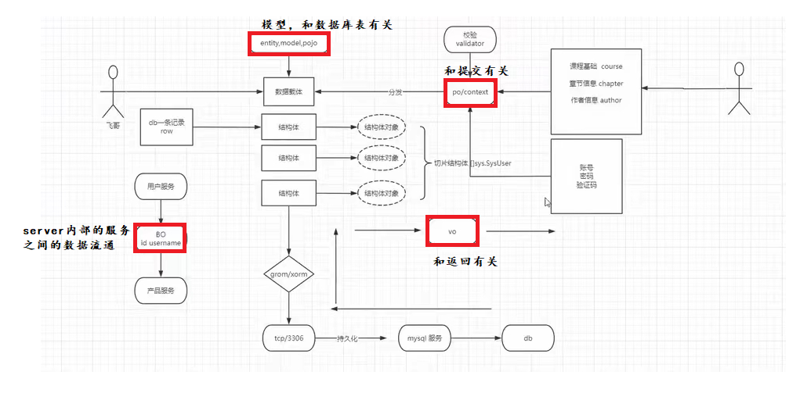

# 8、系统变更

1： 把前端移动项目 web目录

2： 新建一个sql目录

3： 读取表的信息

````sql
```sql
-- 1. 根据库名获取所有表的信息
-- 使用以下SQL语句来获取指定数据库中所有表的信息：
SELECT * FROM information_schema.`TABLES` WHERE TABLE_SCHEMA='kva-admin-db';
-- 其中，“your_database”是你要查询的数据库名称。这条语句将返回一个包含所有表信息的数据表。

-- 2. 根据库名获取所有表名称和表说明
-- 使用以下SQL语句来获取指定数据库中所有表的名称和注释：

SELECT TABLE_NAME, TABLE_COMMENT FROM information_schema.`TABLES` WHERE TABLE_SCHEMA='kva-admin-db';

-- 这条语句将返回一个包含表名和注释的数据表。
-- 3. 根据库名获取所有的字段信息
-- 使用以下SQL语句来获取指定数据库中所有表的所有字段信息：

SELECT 
	TABLE_SCHEMA AS 'schema',
	TABLE_NAME AS 'tablename',
	COLUMN_NAME AS 'cname',
	ORDINAL_POSITION AS 'position',
	COLUMN_DEFAULT AS 'cdefault',
	IS_NULLABLE AS 'nullname',
	DATA_TYPE AS 'dataType',
	CHARACTER_MAXIMUM_LENGTH AS 'maxLen',
	NUMERIC_PRECISION AS 'precision',
	NUMERIC_SCALE AS 'scalename',
	COLUMN_TYPE AS 'ctype',
	COLUMN_KEY AS 'ckey',
	EXTRA AS 'extra',
	COLUMN_COMMENT AS 'comment'
FROM information_schema.`COLUMNS`
WHERE TABLE_SCHEMA='kva-admin-db'
ORDER BY TABLE_NAME, ORDINAL_POSITION;

-- 这条语句将返回一个包含所有字段信息的数据表。
-- 4. 根据库名获取所有的库和表字段的基本信息
-- 使用以下SQL语句来获取指定数据库中所有表和字段的基本信息：

SELECT C.TABLE_SCHEMA AS 'schema',
T.TABLE_NAME AS 'tablename',
T.TABLE_COMMENT AS 'tablecomment',
C.COLUMN_NAME AS 'columnname',
C.COLUMN_COMMENT AS 'columncomment',
C.ORDINAL_POSITION AS 'position',
C.COLUMN_DEFAULT AS 'columndefault',
C.IS_NULLABLE AS 'nullname',
C.DATA_TYPE AS 'dataType',
C.CHARACTER_MAXIMUM_LENGTH AS 'maxlen',
C.NUMERIC_PRECISION AS 'precision',
C.NUMERIC_SCALE AS 'scale',
C.COLUMN_TYPE AS 'ctype',
C.COLUMN_KEY AS 'ckey',
C.EXTRA AS 'extra'
FROM information_schema.`TABLES` T
LEFT JOIN information_schema.`COLUMNS` C ON T.TABLE_NAME=C.TABLE_NAME AND T.TABLE_SCHEMA=C.TABLE_SCHEMA
WHERE T.TABLE_SCHEMA='kva-admin-db'
ORDER BY C.TABLE_NAME, C.ORDINAL_POSITION;
```
````

4: 在utils新建目录adr

 [AES.go](C:\Users\zxc\go\xkginweb\utils\adr\AES.go)  [BASE64.go](C:\Users\zxc\go\xkginweb\utils\adr\BASE64.go)  [DES.go](C:\Users\zxc\go\xkginweb\utils\adr\DES.go)  [MD5.go](C:\Users\zxc\go\xkginweb\utils\adr\MD5.go)  [RSA.go](C:\Users\zxc\go\xkginweb\utils\adr\RSA.go) 

5： 数据载体的划分

# 9、数据载体

pojo

- model、entity、pojo     模型层(一般是规定数据库表的字段的)
- po、context       必填的(后端给前端的文档，就不用前端再问要不要填，有没有默认值之类的无效交流......)
- vo —-返回      


为什么需要数据载体？

提高前后端程序员的交流效率。



# 10、校验

官网：更多请查看  https://github.com/gookit/validate

1: 安装验证框架

```go
go get github.com/gookit/validate
```

2:  验证三部曲

结构体可以实现 3 个接口方法，方便做一些自定义：

- `ConfigValidation(v *Validation)` 将在创建验证器实例后调用
- `Messages() map[string]string` 可以自定义==验证器==错误消息
- `Translates() map[string]string` 可以自定义字段映射/翻译

3: 验证

验证结构体增加验证器

```go
type UserForm struct {
  Name     string    `validate:"required|minLen:7"`
  Email    string    `validate:"email" message:"email is invalid"`
  Age      int       `validate:"required|int|min:1|max:99" message:"int:age must int| min: age min value is 1"`
  CreateAt int       `validate:"min:1"`
  Safe     int       `validate:"-"`
  UpdateAt time.Time `validate:"required"`
  Code     string    `validate:"customValidator"` // 使用自定义验证器
}
```

开始验证结构体

```go
// 创建 Validation 实例
v := validate.Struct(u)
 if v.Validate() { // 验证成功
    // do something ...
} else {
    fmt.Println(v.Errors) // 所有的错误消息
    fmt.Println(v.Errors.One()) // 返回随机一条错误消息
    fmt.Println(v.Errors.Field("Name")) // 返回该字段的错误消息
}
```


| 验证器/别名                               | 描述信息                                                     |
| :---------------------------------------- | :----------------------------------------------------------- |
| `required`                                | 字段为必填项，值不能为空                                     |
| `required_if/requiredIf`                  | `required_if:anotherfield,value,...` 如果其它字段 *anotherField* 为任一值 *value* ，则此验证字段必须存在且不为空。 |
| `required_unless/requiredUnless`          | `required_unless:anotherfield,value,...` 如果其它字段 *anotherField* 不等于任一值 *value* ，则此验证字段必须存在且不为空。 |
| `required_with/requiredWith`              | `required_with:foo,bar,...` 在其他任一指定字段出现时，验证的字段才必须存在且不为空 |
| `required_with_all/requiredWithAll`       | `required_with_all:foo,bar,...` 只有在其他指定字段全部出现时，验证的字段才必须存在且不为空 |
| `required_without/requiredWithout`        | `required_without:foo,bar,...` 在其他指定任一字段不出现时，验证的字段才必须存在且不为空 |
| `required_without_all/requiredWithoutAll` | `required_without_all:foo,bar,...` 只有在其他指定字段全部不出现时，验证的字段才必须存在且不为空 |
| `-/safe`                                  | 标记当前字段是安全的，无需验证                               |
| `int/integer/isInt`                       | 检查值是 `intX` `uintX` 类型，同时支持大小检查 `"int"` `"int:2"` `"int:2,12"` |
| `uint/isUint`                             | 检查值是 `uintX` 类型(`value >= 0`)                          |
| `bool/isBool`                             | 检查值是布尔字符串(`true`: "1", "on", "yes", "true", `false`: "0", "off", "no", "false"). |
| `string/isString`                         | 检查值是字符串类型，同时支持长度检查 `"string"` `"string:2"` `"string:2,12"` |
| `float/isFloat`                           | 检查值是 float(`floatX`) 类型                                |
| `slice/isSlice`                           | 检查值是 slice 类型(`[]intX` `[]uintX` `[]byte` `[]string` 等). |
| `in/enum`                                 | 检查值()是否在给定的枚举列表(`[]string`, `[]intX`, `[]uintX`)中 |
| `not_in/notIn`                            | 检查值不是在给定的枚举列表中                                 |
| `contains`                                | 检查输入值(`string` `array/slice` `map`)是否包含给定的值     |
| `not_contains/notContains`                | 检查输入值(`string` `array/slice` `map`)是否不包含给定值     |
| `string_contains/stringContains`          | 检查输入的 `string` 值是否不包含给定sub-string值             |
| `starts_with/startsWith`                  | 检查输入的 `string` 值是否以给定sub-string开始               |
| `ends_with/endsWith`                      | 检查输入的 `string` 值是否以给定sub-string结束               |
| `range/between`                           | 检查值是否为数字且在给定范围内                               |
| `max/lte`                                 | 检查输入值小于或等于给定值                                   |
| `min/gte`                                 | 检查输入值大于或等于给定值(for `intX` `uintX` `floatX`)      |
| `eq/equal/isEqual`                        | 检查输入值是否等于给定值                                     |
| `ne/notEq/notEqual`                       | 检查输入值是否不等于给定值                                   |
| `lt/lessThan`                             | 检查值小于给定大小(use for `intX` `uintX` `floatX`)          |
| `gt/greaterThan`                          | 检查值大于给定大小(use for `intX` `uintX` `floatX`)          |
| `int_eq/intEq/intEqual`                   | 检查值为int且等于给定值                                      |
| `len/length`                              | 检查值长度等于给定大小(use for `string` `array` `slice` `map`). |
| `min_len/minLen/minLength`                | 检查值的最小长度是给定大小                                   |
| `max_len/maxLen/maxLength`                | 检查值的最大长度是给定大小                                   |
| `email/isEmail`                           | 检查值是Email地址字符串                                      |
| `regex/regexp`                            | 检查该值是否可以通过正则验证                                 |
| `arr/array/isArray`                       | 检查值是数组`array`类型                                      |
| `map/isMap`                               | 检查值是 `map` 类型                                          |
| `strings/isStrings`                       | 检查值是字符串切片类型(`[]string`)                           |
| `ints/isInts`                             | 检查值是`int` slice类型(only allow `[]int`)                  |
| `eq_field/eqField`                        | 检查字段值是否等于另一个字段的值                             |
| `ne_field/neField`                        | 检查字段值是否不等于另一个字段的值                           |
| `gte_field/gtField`                       | 检查字段值是否大于另一个字段的值                             |
| `gt_field/gteField`                       | 检查字段值是否大于或等于另一个字段的值                       |
| `lt_field/ltField`                        | 检查字段值是否小于另一个字段的值                             |
| `lte_field/lteField`                      | 检查字段值是否小于或等于另一个字段的值                       |
| `file/isFile`                             | 验证是否是上传的文件                                         |
| `image/isImage`                           | 验证是否是上传的图片文件，支持后缀检查                       |
| `mime/mimeType/inMimeTypes`               | 验证是否是上传的文件，并且在指定的MIME类型中                 |
| `date/isDate`                             | 检查字段值是否为日期字符串。（只支持几种常用的格式） eg `2018-10-25` |
| `gt_date/gtDate/afterDate`                | 检查输入值是否大于给定的日期字符串                           |
| `lt_date/ltDate/beforeDate`               | 检查输入值是否小于给定的日期字符串                           |
| `gte_date/gteDate/afterOrEqualDate`       | 检查输入值是否大于或等于给定的日期字符串                     |
| `lte_date/lteDate/beforeOrEqualDate`      | 检查输入值是否小于或等于给定的日期字符串                     |
| `hasWhitespace`                           | 检查字符串值是否有空格                                       |
| `ascii/ASCII/isASCII`                     | 检查值是ASCII字符串                                          |
| `alpha/isAlpha`                           | 验证值是否仅包含字母字符                                     |
| `alpha_num/alphaNum/isAlphaNum`           | 验证是否仅包含字母、数字                                     |
| `alpha_dash/alphaDash/isAlphaDash`        | 验证是否仅包含字母、数字、破折号（ - ）以及下划线（ _ ）     |
| `multi_byte/multiByte/isMultiByte`        | 检查值是多字节字符串                                         |
| `base64/isBase64`                         | 检查值是Base64字符串                                         |
| `dns_name/dnsName/DNSName/isDNSName`      | 检查值是DNS名称字符串                                        |
| `data_uri/dataURI/isDataURI`              | Check value is DataURI string.                               |
| `empty/isEmpty`                           | 检查值是否为空                                               |
| `hex_color/hexColor/isHexColor`           | 检查值是16进制的颜色字符串                                   |
| `hexadecimal/isHexadecimal`               | 检查值是十六进制字符串                                       |
| `json/JSON/isJSON`                        | 检查值是JSON字符串。                                         |
| `lat/latitude/isLatitude`                 | 检查值是纬度坐标                                             |
| `lon/longitude/isLongitude`               | 检查值是经度坐标                                             |
| `mac/isMAC`                               | 检查值是MAC字符串                                            |
| `num/number/isNumber`                     | 检查值是数字字符串. `>= 0`                                   |
| `cn_mobile/cnMobile/isCnMobile`           | 检查值是中国11位手机号码字符串                               |
| `printableASCII/isPrintableASCII`         | Check value is PrintableASCII string.                        |
| `rgbColor/RGBColor/isRGBColor`            | 检查值是RGB颜色字符串                                        |
| `full_url/fullUrl/isFullURL`              | 检查值是完整的URL字符串(*必须以http,https开始的URL*).        |
| `url/URL/isURL`                           | 检查值是URL字符串                                            |
| `ip/IP/isIP`                              | 检查值是IP（v4或v6）字符串                                   |
| `ipv4/isIPv4`                             | 检查值是IPv4字符串                                           |
| `ipv6/isIPv6`                             | 检查值是IPv6字符串                                           |
| `cidr/CIDR/isCIDR`                        | 检查值是 CIDR 字符串                                         |
| `CIDRv4/isCIDRv4`                         | 检查值是 CIDR v4 字符串                                      |
| `CIDRv6/isCIDRv6`                         | 检查值是 CIDR v6 字符串                                      |
| `uuid/isUUID`                             | 检查值是UUID字符串                                           |
| `uuid3/isUUID3`                           | 检查值是UUID3字符串                                          |
| `uuid4/isUUID4`                           | 检查值是UUID4字符串                                          |
| `uuid5/isUUID5`                           | 检查值是UUID5字符串                                          |
| `filePath/isFilePath`                     | 检查值是一个存在的文件路径                                   |
| `unixPath/isUnixPath`                     | 检查值是Unix Path字符串                                      |
| `winPath/isWinPath`                       | 检查值是Windows路径字符串                                    |
| `isbn10/ISBN10/isISBN10`                  | 检查值是ISBN10字符串                                         |
| `isbn13/ISBN13/isISBN13`                  | 检查值是ISBN13字符串                                         |

# 11、数据加密

- aes go/js
- des go/js
- rsa go/js
- sha1
- md5—-密码加密 、 文件唯一标识

# 

