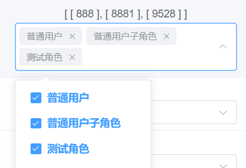
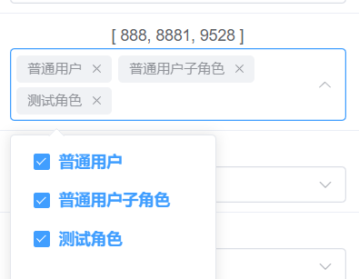

# 1、 关于逻辑(软)删除得问题和Unscoped处理

## 1.1、gorm默认机制

### 1.1.1 gorm.Model

GORM 定义一个 `gorm.Model` 结构体，其包括字段 `ID`、`CreatedAt`、`UpdatedAt`、`DeletedAt ` 。

- 其中这里得deletedAt就是用于逻辑删除控制得字段，如果null 就代表没有删除，如果有时间就说你执行过delete from 才会把删除时写入到数据库表中
- 如果有字段，未来做任何得查询都自动跟上条件 where is_deleted = 0（使得一些curd操作有问题）


### 1.1.2 修改逻辑删除的默认规则

如果你先修改默认的规则，从时间变成0/1这种方式，你必须如下执行

1: 先安装组件

```go
gorm.io/plugin/soft_delete
```

2: 把deletedAt删掉，修改如下：

IsDeleted soft_delete.DeletedAt `gorm:"softDelete:flag,DeletedAtField:DeletedAt;default:0" json:"is_deleted"`

```go
package global

import (
	"gorm.io/plugin/soft_delete"
	"time"
)

type GVA_MODEL struct {
	ID        uint      `gorm:"primarykey;comment:主键ID" json:"id"` // 主键ID
	CreatedAt time.Time `gorm:"type:datetime(0);autoCreateTime;comment:创建时间" json:"createdAt"`
	UpdatedAt time.Time `gorm:"type:datetime(0);autoUpdateTime;comment:更新时间" json:"updatedAt"`
	//DeletedAt gorm.DeletedAt `gorm:"index;comment:删除时间" json:"-"` // 删除时间
	IsDeleted soft_delete.DeletedAt `gorm:"softDelete:flag,DeletedAtField:DeletedAt;default:0" json:"is_deleted"`
}

```

前面的那些步骤和流程一个都不能省去，比如：注册表

```go
package orm

import (
	"xkginweb/global"
	bbs2 "xkginweb/model/entity/bbs"
	"xkginweb/model/entity/jwt"
	sys2 "xkginweb/model/entity/sys"
	user2 "xkginweb/model/entity/user"
	video2 "xkginweb/model/entity/video"
)

func RegisterTable() {
	db := global.KSD_DB
	// 注册和声明model
	db.AutoMigrate(user2.XkUser{})
	db.AutoMigrate(user2.XkUserAuthor{})
	// 系统用户，角色，权限表
	db.AutoMigrate(sys2.SysApis{})
	db.AutoMigrate(sys2.SysMenus{})
	db.AutoMigrate(sys2.SysRoleApis{})
	db.AutoMigrate(sys2.SysRoleMenus{})
	db.AutoMigrate(sys2.SysRoles{})
	db.AutoMigrate(sys2.SysUserRoles{})
	db.AutoMigrate(sys2.SysUser{})
	// 视频表
	db.AutoMigrate(video2.XkVideo{})
	db.AutoMigrate(video2.XkVideoCategory{})
	db.AutoMigrate(video2.XkVideoChapterLesson{})
	// 社区
	db.AutoMigrate(bbs2.XkBbs{})
	db.AutoMigrate(bbs2.BbsCategory{})

	// 声明一下jwt模型
	db.AutoMigrate(jwt.JwtBlacklist{})
}

```


3：然后重启查看效果即可。

- 其中这里得isDeleted就是用于逻辑删除控制得字段，如果0就代表没有删除，如果是1就是删除
- **未来你执行任何的*删除*操作就变成update table set is_deleted = 1,update_time = now() where id = 1**
- **未来做任何得*查询*都自动跟上条件is_deleted = 0（使得一些curd操作有问题，就可以加上 Unscoped() 把这个条件去掉）**


## 1.2、实例：只要不是删除都会加上where is_deleted = 0实战示例

### 1.2.1 我要把删除和未删除全部查询出来？

往往在做后台管理系统的时候，你就必须要把删除和未删除全部查询出来。那么你就必须加上：.Unscoped() 来进行处理这样会把默认机制打破。不在跟已删除过滤。如下：

```go
// 查询分页
func (service *SysUserService) LoadSysUserPage(info request.PageInfo) (list interface{}, total int64, err error) {
	// 获取分页的参数信息
	limit := info.PageSize
	offset := info.PageSize * (info.Page - 1)

	// 准备查询那个数据库表
	db := global.KSD_DB.Model(&sys.SysUser{})

	// 准备切片帖子数组
	var sysUserList []sys.SysUser

	// 加条件
	if info.Keyword != "" {
		db = db.Where("(username like ? or account like ? )", "%"+info.Keyword+"%", "%"+info.Keyword+"%")
	}

	// 排序默时间降序降序
	db = db.Order("created_at desc")

	// 查询中枢
    err = db.Unscoped().Count(&total).Error // 查询全部，删除的也要查询出来，Unscoped() 就很有必要了
	if err != nil {
		return sysUserList, total, err
	} else {
		// 执行查询
		err = db.Unscoped().Limit(limit).Offset(offset).Find(&sysUserList).Error
	}

	// 结果返回
	return sysUserList, total, err
}
```

### 1.2.2 更新操作

sys/User.vue 页面得显示所有的管理员用户信息(用到上面的分页查询接口，所以得加上 Unscoped() )

```vue
	  <el-table :data="tableData" @selection-change="handleSelectionChange" style="width: 100%" :height="settings.tableHeight()"> 
		<el-table-column label="否被启用" align="center" width="200">
            <template #default="scope">
              <el-switch v-model="scope.row.enable" @change="handleChangeEnable(scope.row)" active-text="启用中"
                inactive-text="禁止中" :active-value="1" :inactive-value="0" />
            </template>
          </el-table-column>
          <el-table-column label="删除状态" align="center" width="200">
            <template #default="scope">
              <el-switch v-model="scope.row.is_deleted" active-color="#ff0000" active-text="已删除" inactive-text="未删除"
                :active-value="1" :inactive-value="0" @change="handleDel(scope.row)" />
            </template>
          </el-table-column>
        </el-table>
```

但是下面的删除/未删除和启用/禁止的后端接口也是得加上Unscoped() 的，任何得*查询*都加上Unscoped()去掉 where is_deleted = 0 这个条件。

去加上的话是更新不成功的哦：UpdateStatusSysUser封装axios的异步请求

```js
// 先直接使用下面的结构体了，推荐后期改用context数据载体
// type Params struct {
// 	Id    uint   `json:"id"`
// 	Filed string `json:"field"`
// 	Value int    `json:"value"`
// }
// 启用和禁止的处理
const handleChangeEnable = async (row) => {
  // console.log('row', row)
  var params = {
    id: row.id,
    field: 'enable',
    value: row.enable
  }
  const resp = await UpdateStatusSysUser(params)
  console.log('resp', resp)
  if (resp.data.code === 20000) {
    KVA.notifySuccess("操作成功")
  }
}
// 已删除和未删除的处理
const handleDel = async (row) => {
  // console.log('row', row)
  var params = {
    id: row.id,
    field: 'is_deleted',
    value: row.is_deleted
  }
  const resp = await UpdateStatusSysUser(params)
  console.log('resp', resp)
  if (resp.data.code === 20000) {
    KVA.notifySuccess("操作成功")
  }
}
```

```js
import request from '@/request/index.js'

/**
 * 系统用户启用和未启用、删除和未删除
 */
export const UpdateStatusSysUser = (data) => {
  return request.post(`/sys/user/update/status`, data)
}
```

后端：加上Unscoped()

```golang
// (系统用户启用和未启用、删除和未删除)状态修改
func (service *SysUserService) UpdateStatus(id uint, field string, fieldValue int) (err error) {
	var sysUser sys.SysUser
	err = global.KSD_DB.Unscoped().Model(&sysUser).
		Where("id = ?", id).
		Update(field, fieldValue).Error
	return err
}
```


# 2、查询用户的角色

1：你要把所有的角色查询出来。

- 放入表格
- 放入下拉框

2：  查询用户的角色

3： 把查询用户角色和所有角色进行碰撞，如果一致就选中

​	

## 2.1 为什么用户角色喜欢弄一个中间表来维护

- 一对一的关系

| userid | username | roleid | roleName   |
| ------ | -------- | ------ | ---------- |
| 1      | 飞哥     | 1      | 超级管理员 |
| 2      | 小玉     | 2      | 财务       |

- 一对多的关系


| userid | username | roleid | roleName            |
| ------ | -------- | ------ | ------------------- |
| 1      | 飞哥     | 1,3    | 超级管理员,开发人员 |
| 2      | 小玉     | 2,3    | 财务,开发人员       |
| 3      | 小伟     | 3      | 开发人员            |

那为什么不用上面的方式来维护。因为如果我们变更角色名字的。那么就不方便角色用户数据的维护


### 真正的设计

| userId | userName |
| ------ | -------- |
| 1      | 飞哥     |
| 2      | 小玉     |
| 3      | 小伟     |

| roleId | roleName   |
| ------ | ---------- |
| 1      | 超级管理员 |
| 2      | 财务       |
| 3      | 开发人员   |

map概念

sys_user_roles 中间表

| userId | roleid |
| ------ | ------ |
| 1      | 3      |
| 1      | 1      |
| 2      | 2      |
| 2      | 3      |
| 3      | 3      |


## 2.2 授予用户角色

- 把roleids全部拿到
- 并且拿到用户的id
- 然后调用授予角色的接口
  - 根据用户id删除对应角色
  - 然后把新角色全部重新保存进sys_user_roles


## 2.3 注意el-cascader组件的:props="props"使用细节

```vue
          <el-table-column label="授予角色" align="center" width="320">
            <template #default="{ row, $index }">
              {{ row.roleIds }}
              <el-cascader style="width: 100%;" v-model="row.roleIds" :options="rolesData" @change="handleChangeRole(row)"
                :props="props" />
            </template>
          </el-table-column>
```

```js
// 查询所有的角色信息
const rolesData = ref([])
const props = ref({ multiple: true })
// 查询所有的角色信息
const handleFindRoles = async () => {
  const resp = await FindSysRoleData();
  rolesData.value = resp.data.data.map(r => ({ label: r.roleName, value: r.id }))
}
```

const props = ref({ multiple: true }) 的话上面 {{ row.roleIds }} 打印的是数组的数组，后面是不好处理的：



const props = ref({ multiple: true, emitPath: false }) 的话上面 {{ row.roleIds }} 打印的是数组，后面是比较好处理的：


