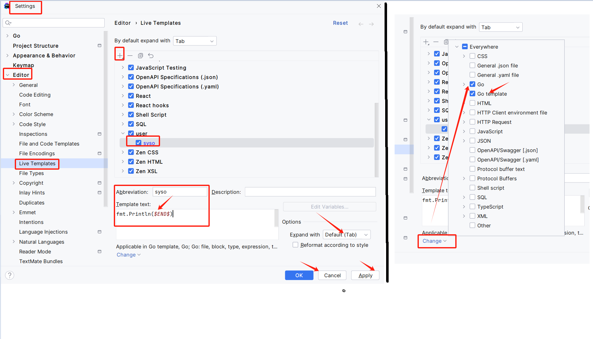

# 1. 泛型在Service上的应用

问题：在项目中，我们定义service其实你会发现基本单表的操作80%~90%的操作几乎一摸一样，只是更改结构体。其他并没变化。但是你在开发时候，如果你不考虑到封装，其实就必须每个表就对应结构体，对应service然后调用

- Create
- Updates
- Delete
- First
- Find

那么有有一种方式可以将其这些基本CURD单表操作全部进行封装，给与模块开发提供遍历。

在java有很多持久层框架，用最多的呢是mybati，这里的mybatis等价于gorm框架.

在java中有封装注著名的框架：mybatis-plus。它其实就在单表操作层面全部进行封装，单表操作基本全部进行封装和简化。

## 1. 封装知识点

- 继承
- 泛型
- 反射

## 2. 继承你的理解是什么？

- 继承其实就拥有父类方法和属性（必须大开头方法和属性名字，这种方法和属性就公开，也就可以被子类继承）
- 继承本质特点:   不劳而获，职责分担

## 3. 封装思维

- 方法封装 —————————–package
- 结构体封装（父类）————–自动

## 4. 什么时候用继承

如果在开发中存在多个结构体，有通用共用的方法的时候，可以考虑把这类方法用父类来进行封装。找每个结构方法中很多的代码片段会经常重复的编写，你可以把这些重复的代码片段用父类来完成。

注：编程的时候发现使用接口是有问题的，得使用struct继承的方式。后面的golang版本看接口的方式行不行。

# 2. golang 编辑器设置快捷键的方式

1. 在setting中设置：设置输入syso，再按tab键。即可输出 fmt.Println() 的效果。
2. 再点击change，选择在.go 和go template 文件中生效。

