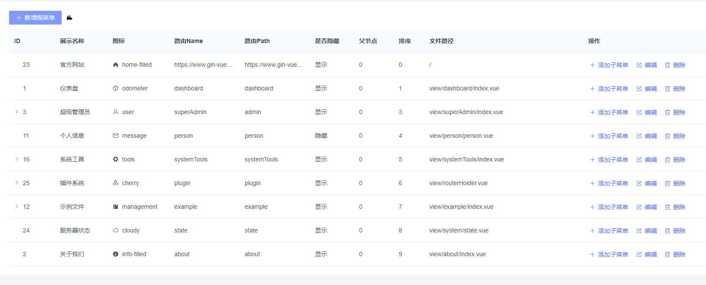
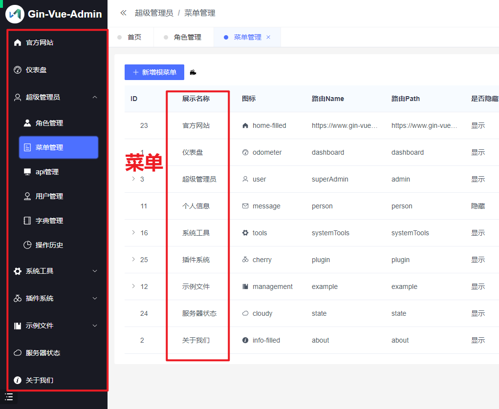

# 实现菜单管理和处理





1： 表的设计

```sql
CREATE TABLE `sys_menus` (
  `id` bigint unsigned NOT NULL AUTO_INCREMENT COMMENT '主键ID',
  `created_at` datetime DEFAULT NULL COMMENT '创建时间',
  `updated_at` datetime DEFAULT NULL COMMENT '更新时间',
  `parent_id` bigint DEFAULT NULL COMMENT '父菜单ID',
  `path` varchar(191) CHARACTER SET utf8mb4 COLLATE utf8mb4_unicode_ci DEFAULT NULL COMMENT '路由path',
  `name` varchar(191) CHARACTER SET utf8mb4 COLLATE utf8mb4_unicode_ci DEFAULT NULL COMMENT '路由name 用于国际化处理',
  `hidden` bigint DEFAULT NULL COMMENT '是否在列表隐藏',
  `sort` bigint DEFAULT NULL COMMENT '排序标记',
  `icon` varchar(191) CHARACTER SET utf8mb4 COLLATE utf8mb4_unicode_ci DEFAULT NULL COMMENT '对应前端文件路径',
  `is_deleted` bigint unsigned DEFAULT '0',
  `title` varchar(191) CHARACTER SET utf8mb4 COLLATE utf8mb4_unicode_ci DEFAULT NULL COMMENT '菜单名称',
  PRIMARY KEY (`id`) USING BTREE
) ENGINE=InnoDB AUTO_INCREMENT=39 DEFAULT CHARSET=utf8mb4 COLLATE=utf8mb4_unicode_ci ROW_FORMAT=DYNAMIC;
```

2: 写查询

- 先把根节点查询出来，然后在遍历查询对应子节点
- 把所有的数据都查询出来，然后在来进行数据遍历和分配（推荐）

3：定义结构体

```go
package sys

import (
	"xkginweb/global"
)

// 注意下面 structs 对应的是数据库表中的字段的哦
type SysMenus struct {
	global.GVA_MODEL `structs:"-"`
	ParentId         uint   `structs:"parent_id" json:"parentId" gorm:"comment:父菜单ID"` // 父菜单ID
	Path             string `structs:"path" json:"path" gorm:"comment:路由path"`         // 路由path
	Title            string `structs:"title" json:"title" gorm:"comment:菜单名称"`         // 菜单名称
	Name             string `structs:"name" json:"name" gorm:"comment:路由name 用于国际化处理"` // 路由name 用于国际化处理
	Hidden           int    `structs:"hidden" json:"hidden" gorm:"comment:是否在列表隐藏"`    // 是否在列表隐藏
	//Component string `structs:"-" json:"component" gorm:"comment:对应前端文件路径"`  // 对应前端文件路径
	Sort int    `structs:"sort" json:"sort" gorm:"comment:排序标记"`     // 排序标记
	Icon string `structs:"icon" json:"icon" gorm:"comment:对应前端文件路径"` // 对应前端文件路径
	// 忽略该字段，- 表示无读写，-:migration 表示无迁移权限，-:all 表示无读写迁移权限
	Children []*SysMenus `structs:"-" gorm:"-" json:"children"`
	//TopObj   *SysMenus   `structs:"-" gorm:"-" json:"-"`
}

func (s *SysMenus) TableName() string {
	return "sys_menus"
}

```

```go
package global

import (
	"gorm.io/plugin/soft_delete"
	"time"
)

// structs 属性的设置是为了：gorm框架更新多列中，更新0值失败的问题（因为修改了 is_deleted 软删除字段）
type GVA_MODEL struct {
	ID        uint      `gorm:"primarykey;comment:主键ID" json:"id" structs:"-"` // 主键ID
	CreatedAt time.Time `gorm:"type:datetime(0);autoCreateTime;comment:创建时间" json:"createdAt" structs:"-"`
	UpdatedAt time.Time `gorm:"type:datetime(0);autoUpdateTime;comment:更新时间" json:"updatedAt" structs:"-"`

	// 注意下面的 json:"isDeleted 是 isDeleted 不是 is_deleted 的哦
	IsDeleted soft_delete.DeletedAt `gorm:"softDelete:flag,DeletedAtField:DeletedAt;default:0" json:"isDeleted" structs:"is_deleted"`
}
```


4: 定义service

```go
package sys

import (
	"xkginweb/global"
	"xkginweb/model/entity/sys"
	"xkginweb/service/commons"
)

// 定义bbs的service提供BbsCategory的数据curd的操作

// 对用户表的数据层处理
type SysMenusService struct {
	commons.BaseService[uint, sys.SysMenus]
}

// 递归形成tree
func (service *SysMenusService) FindMenus(keyword string) (sysMenus []*sys.SysMenus, err error) {
	db := global.KSD_DB.Unscoped().Order("sort asc")
	if len(keyword) > 0 {
		db.Where("title like ?", "%"+keyword+"%")
	}
	err = db.Find(&sysMenus).Error
	return sysMenus, err
}

func (service *SysMenusService) Tree(allDbMenus []*sys.SysMenus, parentId uint) []*sys.SysMenus {
	var nodes []*sys.SysMenus //---------准备空教室
	// 开始遍历父类
	for _, dbMenu := range allDbMenus {
		if dbMenu.ParentId == parentId {
			dbMenu.Children = append(dbMenu.Children, service.Tree(allDbMenus, dbMenu.ID)...)
			nodes = append(nodes, dbMenu)
		}
	}
	return nodes
}

// 获取父级菜单(不加上 .Unscoped() 会自动加上 Where is_deleted = 0 的查找条件，是需要的 ---> 删除了的菜单就不用添加子菜单了)
func (service *SysMenusService) FindMenusRoot() (sysMenus []*sys.SysMenus, err error) {
	err = global.KSD_DB.Where("parent_id = ?", 0).Order("sort asc").Find(&sysMenus).Error
	return sysMenus, err
}

// 添加
func (service *SysMenusService) SaveSysMenus(sysMenus *sys.SysMenus) (err error) {
	err = global.KSD_DB.Create(sysMenus).Error
	return err
}

// 修改
func (service *SysMenusService) UpdateSysMenus(sysMenus *sys.SysMenus) (err error) {
	err = global.KSD_DB.Unscoped().Model(sysMenus).Updates(sysMenus).Error
	return err
}

// 按照map的方式过呢更新
func (service *SysMenusService) UpdateSysMenusMap(sysMenus *sys.SysMenus, sysMenusMap *map[string]any) (err error) {
	err = global.KSD_DB.Unscoped().Model(sysMenus).Updates(sysMenusMap).Error
	return err
}

// 处理启用和未启用
func (service *SysMenusService) UpdateStatus(id uint, field string, fieldValue int) (err error) {
	var sysMenus sys.SysMenus
	err = global.KSD_DB.Unscoped().Model(&sysMenus).
		Where("id = ?", id).
		Update(field, fieldValue).Error
	return err
}

// 删除
func (service *SysMenusService) DelSysMenusById(id uint) (err error) {
	var sysMenus sys.SysMenus
	err = global.KSD_DB.Where("id = ?", id).Delete(&sysMenus).Error
	return err
}

// 批量删除
func (service *SysMenusService) DeleteSysMenussByIds(sysMenuss []sys.SysMenus) (err error) {
	err = global.KSD_DB.Delete(&sysMenuss).Error
	return err
}

// 根据id查询信息
func (service *SysMenusService) GetSysMenusByID(id uint) (sysMenuss *sys.SysMenus, err error) {
	err = global.KSD_DB.Unscoped().Omit("created_at", "updated_at").Where("id = ?", id).First(&sysMenuss).Error
	return
}
```