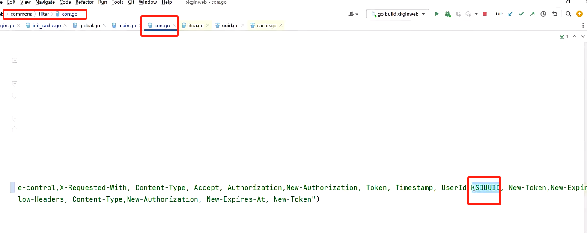
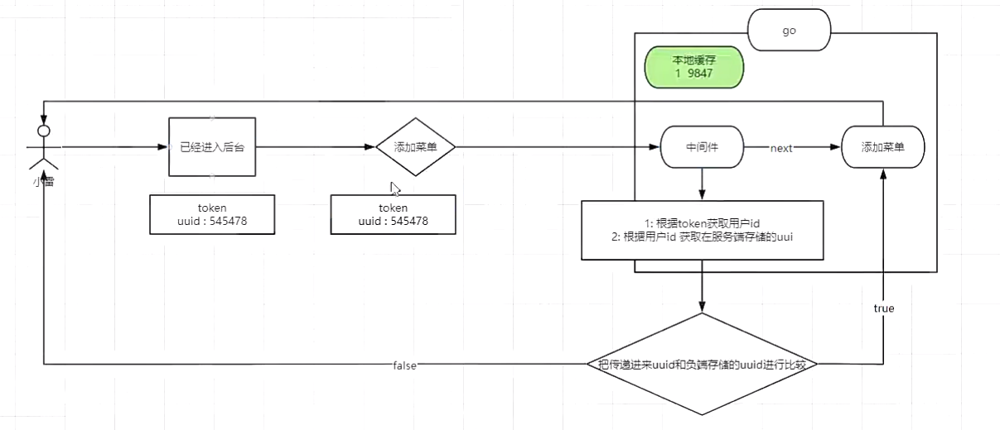
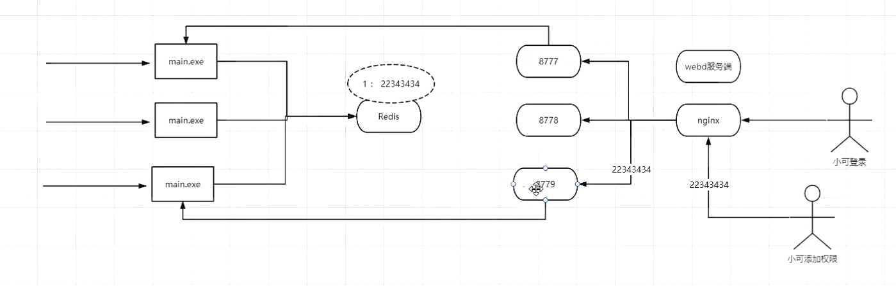

# 1. 账号挤下线（验证码）


## 01、需求

同一个账号，是不同地方登录。只能让一个有效（最后一次登录有效），之前全部会自动挤下去。

## 02、实现

1： 用户登录，会根据用户id生成一个唯一登录标识，然后放入到服务器，返回给客户端。

2：然后用户未来每个接口请求的时候，都会携带这个唯一标识和用户id

3：然后把用户携带的id和标识，和服务端存储的唯一标识进行比对。

## 03、本地缓存

go-cache

1：基于内存的 K/V 存储/缓存 : (类似于Memcached)，适用于单机应用程序。（在go的进程内存中，挖来一个空间出来用来存储数据，而这个数据可以让别线程进行数据共享。）

2：缓存数据，如果一直放的话，可能溢出。可能影响主进程的执行。所以大部分的缓存设计都会考虑到：淘汰策略

- Least Recently  Used (LRU)：最近最少使用策略，删除最近最少被使用的缓存项。
- First In First Out (FIFO)：先进先出策略，删除最早被加入到缓存中的缓存项。
- Least Frequently Used (LFU)：最不经常使用策略，删除使用频率最低的缓存项。
- Random Replacement (RR)：随机替换策略，根据一个随机算法选择要删除的缓存项。

3: 底层原理就是：全局Map (安全性，学习锁)


### 03-01、安装

```go
go get github.com/patrickmn/go-cache
```

### 03-02、使用

在global包下的 global.go增加缓存对象

```go
package global

import (
	"github.com/go-redis/redis/v8"
	"github.com/patrickmn/go-cache"
	"github.com/songzhibin97/gkit/cache/local_cache"
	"go.uber.org/zap"
	"gorm.io/gorm"
	"sync"
	"xkginweb/commons/parse"
)

var (
	Cache      *cache.Cache //-------------------新增代码
	Log        *zap.Logger
	SugarLog   *zap.SugaredLogger
	Lock       sync.RWMutex
	Yaml       map[string]interface{}
	Config     *parse.Config
	KSD_DB     *gorm.DB
	BlackCache local_cache.Cache
	REDIS      *redis.Client
)

```

然后初始化global.cache。在 [initilization](..\go\xkginweb\initilization) 下新建一个  [init_cache.go](..\go\xkginweb\initilization\init_cache.go) 文件如下：

```go
package initilization

import (
	"github.com/patrickmn/go-cache"
	"time"
	"xkginweb/global"
)

func InitCache() {
	c := cache.New(5*time.Minute, 24*60*time.Minute)
	global.Cache = c
}

```

然后在main.go初始化global.cache对象如下

```go
package main

import (
	"xkginweb/initilization"
)

func main() {
	// 解析配置文件
	initilization.InitViper()
	// 初始化日志 开发的时候建议设置成：debug ，发布的时候建议设置成：info/error
	// info --- console + file
	// error -- file
	initilization.InitLogger("debug")
	// 初始化中间 redis/mysql/mongodb
	initilization.InitMySQL()
	// 初始化缓存
	initilization.InitRedis()
	// 初始化本地缓存
	initilization.InitCache()//-------------------新增代码
	// 定时器
	// 并发问题解决方案
	// 异步编程
	// 初始化路由
	initilization.RunServer()
}

```

然后找到api/v1/login/login.go 在登录的时候，增加uuid写入缓存和返回的处理

```go

// 登录的接口处理
func (api *LoginApi) ToLogined(c *gin.Context) {
	type LoginParam struct {
		Account  string
		Code     string
		CodeId   string
		Password string
	}

	// 1：获取用户在页面上输入的账号和密码开始和数据库里数据进行校验
	param := LoginParam{}
	err2 := c.ShouldBindJSON(&param)
	if err2 != nil {
		response.Fail(60002, "参数绑定有误", c)
		return
	}

	if len(param.Code) == 0 {
		response.Fail(60002, "请输入验证码", c)
		return
	}

	if len(param.CodeId) == 0 {
		response.Fail(60002, "验证码获取失败", c)
		return
	}

	// 开始校验验证码是否正确
	verify := store.Verify(param.CodeId, param.Code, true)
	if !verify {
		response.Fail(60002, "你输入的验证码有误!!", c)
		return
	}

	inputAccount := param.Account
	inputPassword := param.Password

	if len(inputAccount) == 0 {
		response.Fail(60002, "请输入账号", c)
		return
	}

	if len(inputPassword) == 0 {
		response.Fail(60002, "请输入密码", c)
		return
	}

	dbUser, err := sysUserService.GetUserByAccount(inputAccount)
	if err != nil {
		response.Fail(60002, "你输入的账号和密码有误", c)
		return
	}

	// 这个时候就判断用户输入密码和数据库的密码是否一致
	// inputPassword = utils.Md5(123456) = 2ec9f77f1cde809e48fabac5ec2b8888
	// dbUser.Password = 2ec9f77f1cde809e48fabac5ec2b8888
	if dbUser != nil && dbUser.Password == adr.Md5Slat(inputPassword, dbUser.Slat) {
		// 根据用户id查询用户的角色
		userRoles, _ := sysUserRolesService.SelectUserRoles(dbUser.ID)
		if len(userRoles) > 0 {
			// 用户信息生成token -----把
			token := api.generaterToken(c, userRoles[0].RoleCode, userRoles[0].ID, dbUser)
			// 根据用户查询菜单信息
			roleMenus, _ := sysRoleMenusService.SelectRoleMenus(userRoles[0].ID)
			// 根据用户id查询用户的角色的权限
			permissions, _ := sysRoleApisService.SelectRoleApis(userRoles[0].ID)

			// 这个uuid是用于挤下线使用 ,//--------------------------增加代码
			uuid := utils.GetUUID()
			userIdStr := strconv.FormatUint(uint64(dbUser.ID), 10)
			global.Cache.Set("LocalCache:Login:"+userIdStr, uuid, cache.NoExpiration)

			// 查询返回
			response.Ok(map[string]any{
				"user":        dbUser,
				"token":       token,
				"roles":       userRoles,
				"uuid":        uuid, //-------------------增加代码
				"roleMenus":   sysMenuService.Tree(roleMenus, 0),
				"permissions": permissions}, c)
		} else {
			// 查询返回--
			response.Fail(80001, "你暂无授权信息", c)
		}
	} else {
		response.Fail(60002, "你输入的账号和密码有误", c)
	}
}
```

然后在前端的状态管理中增加uuid管理

```js
import { defineStore } from 'pinia'
import request from '@/request'
import router from '@/router'
import { handleLogout } from '../api/logout.js'
import { ChangeRoleIdMenus } from '../api/sysroles.js'
import {useSkeletonStore} from '@/stores/skeleton.js'
import {useMenuTabStore} from '@/stores/menuTab.js'


export const useUserStore = defineStore('user', {
  // 定义状态
  state: () => ({
    routerLoaded:true,
    // 登录用户
    user: {},
    username: '',
    userId: '',
    // 挤下线使用
    uuid:"",
    // 登录token
    token: '',
    // 当前角色
    currRoleName:"",
    currRoleCode:"",
    currRoleId:0,
    // 获取用户对应的角色列表
    roles:[],
    // 获取角色对应的权限
    permissions:[],
    // 获取角色对应的菜单
    menuTree:[]
  }),

  // 就是一种计算属性的机制，定义的是函数，使用的是属性就相当于computed
  getters:{
    isLogin(state){
      return state.token ? true : false
    },

    roleName(state){
      return state.roles && state.roles.map(r=>r.name).join(",")
    },

    permissionCode(state){
      return state.permissions &&  state.permissions.map(r=>r.code)
    },
    
    permissionPath(state){
      return state.permissions &&  state.permissions.map(r=>r.path)
    }
  },

  // 定义动作
  actions: {

   /* 设置token */ 
   setToken(newtoken){
      this.token = newtoken
   },

   /* 获取token*/
   getToken(){
    return this.token
   },

   // 改变用户角色的时候把对应菜单和权限查询出来，进行覆盖---更改
   async handlePianaRole(roleId,roleName,roleCode){
      if(roleId > 0 && roleId != this.currRoleId){
        this.currRoleId = roleId
        this.currRoleName = roleName;
        this.currRoleCode = roleCode
      }

      // 获取到导航菜单，切换以后直接全部清空掉
      const menuTabStore = useMenuTabStore();
      menuTabStore.clear()
      
      // 请求服务端--根据切换的角色找到角色对应的权限和菜单
      const resp = await ChangeRoleIdMenus({roleId:this.currRoleId})
      // 对应的权限和菜单进行覆盖
      this.permissions = resp.data.permissions
      this.menuTree = resp.data.roleMenus.sort((a,b)=>a.sort-b.sort)
      if(roleId > 0){
        // 激活菜单中的第一个路由
        router.push(this.menuTree[0].path)
      }
   },
   
   /* 登出*/
   async logout (){
      // 执行服务端退出
      await handleLogout()
      // 清除状态信息
      this.token = ''
      this.user = {}
      this.username = ''
      this.userId = ''
      this.uuid = ''
      this.roles = []
      this.permissions = []
      this.menuTree = []
      // 清除自身的本地存储
      localStorage.removeItem("ksd-kva-language")
      localStorage.removeItem("kva-pinia-userstore")
      sessionStorage.removeItem("kva-pinia-skeleton")
      // 把骨架屏的状态恢复到true的状态
      useSkeletonStore().setLoading(true)
      localStorage.removeItem("isWhitelist")
      location.reload()
      // 然后跳转到登录
      router.push({ name: 'Login', replace: true })
  },

  /* 登录*/
  async toLogin(loginUser){
      // 查询用户信息，角色，权限，角色对应菜单
      const resp = await request.post("login/toLogin", loginUser,{noToken:true})
      // 这个会回退，回退登录页
      var { user ,token,roles,permissions,roleMenus,uuid } = resp.data
      // 登录成功以后获取到菜单信息, 这里要调用一
      this.menuTree = roleMenus
      // 把数据放入到状态管理中
      this.user = user
      this.userId = user.id
      this.username = user.username
      this.token = token
      this.uuid = uuid
      this.roles = roles
      this.permissions = permissions
      // 把roles列表中的角色的第一个作为，当前角色
      this.currRoleId = roles && roles.length > 0 ? roles[0].id : 0
      this.currRoleName = roles && roles.length > 0 ? roles[0].roleName : ""
      this.currRoleCode = roles && roles.length > 0 ? roles[0].roleCode : ""

      return Promise.resolve(resp)
    }
  },
  persist: {
    key: 'kva-pinia-userstore',
    storage: localStorage,//sessionStorage
  }
})
```

然后在每次请求接口的时候把uuid携带上即可。修改“request/index.js即可，如下：

```js
// 1: 导入axios异步请求组件
import axios from "axios";
// 2: 把axios请求的配置剥离成一个config/index.js的文件
import axiosConfig from "./config";
// 3: 获取路由对象--原因是：在加载的过程中先加载的pinia所以不能useRouter机制。
import router from '@/router'
// 4: elementplus消息框
import KVA from "@/utils/kva.js";
// 5: 获取登录的token信息
import { useUserStore } from '@/stores/user.js'
// 6: 然后创建一个axios的实例
const request = axios.create({ ...axiosConfig })

// request request请求拦截器
request.interceptors.request.use(
    function(config){
        // 这个判断就是为了那些不需要token接口做开关处理，比如：登录，检测等
        if(!config.noToken){
             // 如果 token为空，说明没有登录。你就要去登录了
            const userStore = useUserStore()
            const isLogin = userStore.isLogin
            if(!isLogin){
                router.push("/login")
                return
            }else{
                // 90b7d374acc5476eb9beabe9373b2640
                // 这里给请求头增加参数.request--header，在服务端可以通过request的header可以获取到对应参数
                // 比如go: c.GetHeader("Authorization")
                // 比如java: request.getHeader("Authorization")
                config.headers.Authorization = userStore.getToken()
                config.headers.KsdUUID = userStore.uuid
            }
        }
        return config;
    },function(error){
        // 判断请求超时
        if ( error.code === "ECONNABORTED" && error.message.indexOf("timeout") !== -1) {
            KVA.notifyError('请求超时');
            // 这里为啥不写return
        }
        return Promise.reject(error);
    }
);

// request response 响应拦截器
request.interceptors.response.use(async (response) => {
    // 在这里应该可以获取服务端传递过来头部信息
    // 开始续期
    if(response.headers["new-authorization"]){
        const userStore = useUserStore()   
        userStore.setToken(response.headers["new-authorization"])  
    }

    // cashbin的权限拦截处理
    if(response.data?.code === 80001){
        KVA.notifyError(response.data.message);
        // 如果你想调整页面，就把下面注释打开
        //router.push("/nopermission")
        return     
    }

    if(response.data?.code === 20000){
        return response.data;
    }else{
        // 所有得服务端得错误提示，全部在这里进行处理
        if (response.data?.message) {
            KVA.notifyError(response.data.message);
        }

        // 包括: 没登录，黑名单，挤下线
        if(response.data.code === 4001 ){
            const userStore = useUserStore()   
            userStore.logout()
            return Promise.reject(response.data); 
        }   

        // 返回接口返回的错误信息
        return Promise.reject(response.data); 
    }
},(err) => {
    if (err && err.response) {
        switch (err.response.status) {
            case 400:
                err.message = "请求错误";
                break;
            case 401:
                err.message = "未授权，请登录";
                break;
            case 403:
                err.message = "拒绝访问";
                break;
            case 404:
                err.message = `请求地址出错: ${err.response.config.url}`;
                break;
            case 408:
                err.message = "请求超时";
                break;
            case 500:
                err.message = "服务器内部错误";
                break;
            case 501:
                err.message = "服务未实现";
                break;
            case 502:
                err.message = "网关错误";
                break;
            case 503:
                err.message = "服务不可用";
                break;
            case 504:
                err.message = "网关超时";
                break;
            case 505:
                err.message = "HTTP版本不受支持";
                break;
            default:
        }
    }
    if (err.message) {
        KVA.notifyError(err.message);
    }
     // 判断请求超时
    if ( err.code === "ECONNABORTED" && err.message.indexOf("timeout") !== -1) {
        KVA.notifyError('服务已经离开地球表面，刷新或者重试...');
    }
    // 返回接口返回的错误信息
    return Promise.reject(err); 
})
  
export default request
```

然后在jwt.go中进行比较即可

```go
package middle

import (
	"fmt"
	"github.com/gin-gonic/gin"
	"strconv"
	"time"
	"xkginweb/commons/jwtgo"
	"xkginweb/commons/response"
	"xkginweb/global"
	"xkginweb/model/entity/jwt"
	"xkginweb/utils"
)

// 使用是下面的 jwtService 的两个方法：IsBlacklist() 判断一个 token 是否过期了，JsonInBlacklist() 把需要放在黑名单中的 token 放入黑名单中
var jwtService = jwtgo.JwtService{}

// 定义一个JWTAuth的中间件
func JWTAuth() gin.HandlerFunc {
	return func(c *gin.Context) {
		// 通过http header中的token解析来认证
		// 获取token
		token := c.GetHeader("Authorization") // 参数中用的是其他的名字 Authorization 什么的，代替 token（安全性）
		if token == "" {
			response.Fail(60002, "请求未携带token，无权限访问", c)
			c.Abort()
			return
		}

		// 判断是否携带登录状态uuid
		KsdUUID := c.GetHeader("KsdUUID")
		if KsdUUID == "" {
			response.Fail(4001, "请求未携带登录标识，无权限访问", c)
			c.Abort()
			return
		}

		// 判断接收的 token 是否在黑名单中(判断 token 是否过期了)
		flagBlacklist := jwtService.IsBlacklist(token)
		if flagBlacklist == true {
			response.Fail(60002, "token 已经在黑名单中，已过期", c)
			c.Abort()
			return
		}

		// 生成jwt的对象
		myJwt := jwtgo.NewJWT()
		// 解析token
		customClaims, err := myJwt.ParserToken(token)
		// 如果解析失败就出现异常
		if err != nil {
			response.Fail(60002, "token失效了", c)
			c.Abort()
			return
		}

		// 从缓存中获取服务端用户uuid是否和用户传递进来的uuid是否一致，
		// 1:如果一致让操作，
		// 2:如果不一致直接提示你当前账号已经被挤下线了
		userIdStr := strconv.FormatUint(uint64(customClaims.UserId), 10)
		cacheUuid, _ := global.Cache.Get("LocalCache:Login:" + userIdStr)
		// 可能缓存被清理了
		if cacheUuid == "" {
			response.Fail(4001, "请求未携带登录标识，无权限访问", c)
			c.Abort()
			return
		}
		// 如果不相等，说明用户在别的地方登录了
		if cacheUuid != KsdUUID {
			response.Fail(4001, "你账号已被挤下线！", c)
			c.Abort()
			return
		}

		// 判断过期时间 - now  < buffertime 就开始续期 ep 1d -- no
		fmt.Println("customClaims.ExpiresAt", customClaims.ExpiresAt)
		fmt.Println("time.Now().Unix()", time.Now().Unix())
		fmt.Println("customClaims.ExpiresAt - time.Now().Unix()", customClaims.ExpiresAt-time.Now().Unix())
		fmt.Println("customClaims.BufferTime", customClaims.BufferTime)

		if customClaims.ExpiresAt-time.Now().Unix() < customClaims.BufferTime {
			// 1: 生成一个新的token
			// 2: 用c把新的token返回页面
			fmt.Println("开始续期.....")
			// 获取7天的过期时间
			eptime, _ := utils.ParseDuration("7d")
			// 用当前时间+eptime 就是 新的token过期时间
			customClaims.ExpiresAt = time.Now().Add(eptime).Unix()
			// 生成新的token
			newToken, _ := myJwt.CreateTokenByOldToken(token, *customClaims)
			// 输出给浏览器
			c.Header("new-authorization", newToken)
			c.Header("new-expires-at", strconv.FormatInt(customClaims.ExpiresAt, 10))
			// 如果生成新token了，旧的token怎么办？ jwt没有提供一个机制让旧token失效。（加入黑名单中）
			_ = jwtService.JsonInBlacklist(jwt.JwtBlacklist{Jwt: token})
		}

		// 让后续的路由方法可以直接通过c.Get("claims")
		c.Set("claims", customClaims)
		c.Set("userId", customClaims.UserId)

		// 上面把一些内容设置进 c 里面去了，所以后面的函数就可以通过 c 使用了
		c.Next() // 向下走
	}
}

```



## 退出的时候记得清楚缓存

api/v1/login/logout.go如下：

```go
package login

import (
	"github.com/gin-gonic/gin"
	"strconv"
	"xkginweb/commons/jwtgo"
	"xkginweb/commons/response"
	"xkginweb/global"
	"xkginweb/model/entity/jwt"
)

// 登录业务
type LogOutApi struct{}

// 退出接口
func (api *LogOutApi) ToLogout(c *gin.Context) {
	// 获取头部的token信息
	token := c.GetHeader("Authorization")
	if token == "" {
		response.Fail(401, "请求未携带token，无权限访问", c)
		return
	}

	// 同时删除缓存中的uuid的信息
	customClaims, _ := jwtgo.GetClaims(c)
	userIdStr := strconv.FormatUint(uint64(customClaims.UserId), 10)
	global.Cache.Delete("LocalCache:Login:" + userIdStr)

	// 退出的token,加入到黑名单中
	err := jwtService.JsonInBlacklist(jwt.JwtBlacklist{Jwt: token})
	// 保存失败会进到到错误
	if err != nil {
		response.Fail(401, "token作废失败", c)
		return
	}

	// 如果保存到黑名单中说明,已经可以告知前端可以进行执行清理动作了
	response.Ok("token作废成功!", c)
}

```


# 2. 指定用户下线

直接把用户的状态清空即可。


- 提下线逻辑




- redis在项目集群数据共享上的应用(为什么要使用redis？)：



