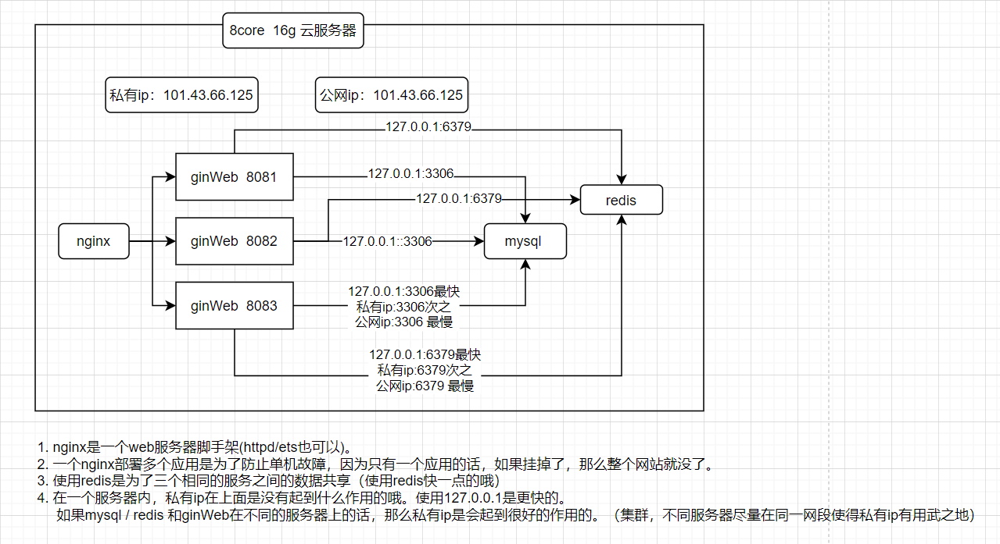
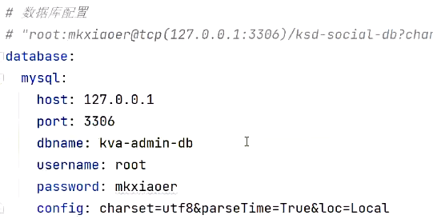
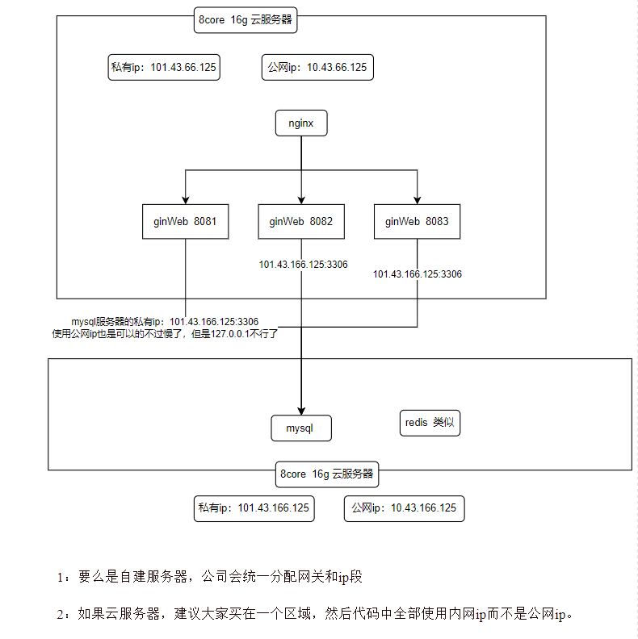
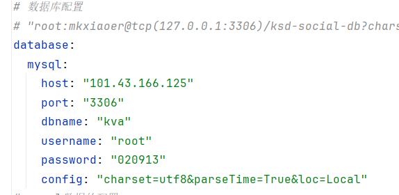
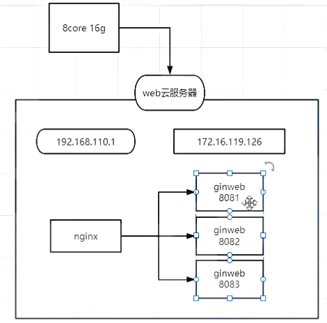
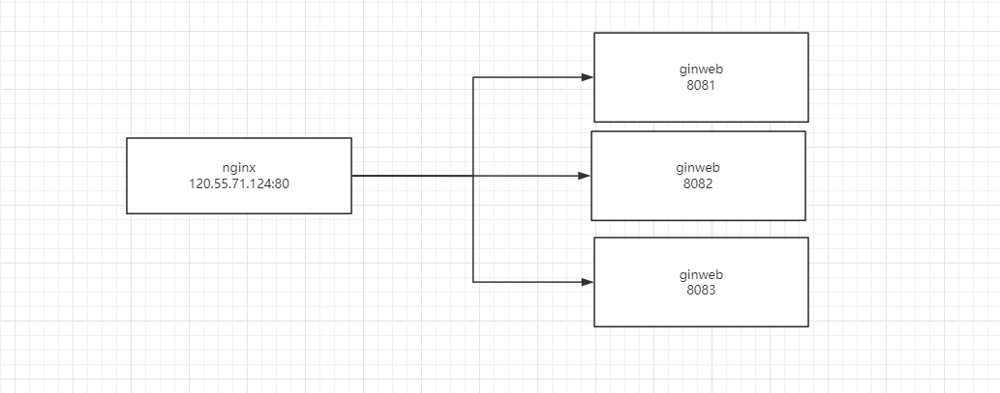

# 01、安装Nginx服务集群发布和部署

## 分析

在项目发布和部署，我们其实会把开发好的go的web项目打包成可执行文件，然后运行在linux系统。一旦运行就会在系统进程里生成一个对应服务。然后可以访问。但是你思考过一个这样的问题。如果你的服务突然之间挂了。那么你网站是其实就立即出现无法访问的状况。

所以在大部分的发布和部署的时候，我们都不会单节点运行，而是更多考虑使用集群的方式进行部署。

- 其实早期的发布和部署，其实都停服去进行发布和部署，然后给与网站停服的标识。
- 灰度交替的方式进行发布和部署（集群模式）
  - 比如三个节点：1 2 3  ，先把服务1停止掉，然后在更新到最新，如果服务1运行没有任何问题，然后在停止第二服务器，以此类推。但是你不能全部停掉在更新，这个不建议。
- jenkins进行发布和部署（开发阶段）（==即见即所得==）
- 面向容器化的发布和部署（docker + k8s）

## 01、准备工作

1：准备服务器资源（32G 、64G） （但是有一个前提：必须在同机房才又意义）

2： 准备web项目（单项目，微服务项目）

3：服务环境（mysql/redis/nginx）


## 02、单项目

没有服务拆分，比如：用户服务（登录，注册）、订单服务、广告服务、内容服务、分类服务、搜索服务等等。全部都在一个项目里。不分开，

**缺点：**

1：可执行文件很大，占用服务器资源很多

2：存在服务不隔离，如果一份服务出现了一次和故障，那么你整个体统就全部崩溃。

**好处**

1：发布方便，快捷


## 03、微服务项目

把服务全部进行拆分，独立成一个系统和服务来进行开发和部署。

缺点：

1：运维的难度增大，需求服务器资源也增多

2：成本上升

3：学习的成本也增大

4：数据一致性也要考虑(GRPC/RPC远程服务调用实现不同主机进程通信......)

优点 ：

1：服务直接是独立，出现异常和故障互补影响，


## 04、web集群怎么规划和部署

web集群：其实就把若个项目运行对外提供服务。要完成集群必须要找到：具有负载均衡的web中间件。这种中间件有如下：

- httpd
- etc
- nginx (推荐)


## 05、集群的规划和误区

集群其实就把服务部署多份，然后使用 web中间件来进行负责均衡管理。你就可以看到集群切换效果了。通杀也也可以解决单点故障的问题。

但是如何进行多服务的部署呢？

- 单机部署 （单机部署多应用）
- 多机部署 （交叉集群部署）

*但是不论单机部署多应用还是多机部署交叉的方式，你记住集群节点的部署和规划一定是在：同一个局域网（同一个ip段上的私有ip，使用公网ip最慢）才又意义，**才会快**。最快肯定是单机部署多应用（全部安装在一个机器上，127.0.0.1最快）。*

==也就是要解决和一个误区。未来我开发了项目。我想要我的项目支持集群，也让我们的项目能支持并发和高可用。我就买一堆的云服务器让后进行发布和部署。你就以为就很快了==

快就必须遵循几个规则：

1：要么是自建服务器，公司会统一分配网关和ip段

2：如果云服务器，建议大家买在一个区域，然后代码中全部使用内网ip而不是公网ip。


## 06、服务器私有ip的应用场景：集群中的数据访问

**1. 单机多应用（服务器的私有ip没有体现其作用）**



1. 所以打包前，下面的数据库的host配置是127.0.0.1是更好的哦（当然私有ip和公网ip也是可以的）
2. dbname和username和password得和服务器上的数据一致（这里我们配置和本地一样，所以就没有改动的哦）



**2. 多机多应用（服务器的私有ip体现了其作用）**



1. 所以打包前，下面的数据库的host配置是mysql所在服务器的私有ip是更好的哦（公网ip也是可以的，但是127.0.0.1不行，因为不在同一主机上）
2. dbname和username和password得和服务器上的数据一致（这里我们配置和本地一样，所以就没有改动的哦）



## 07、集群带来的问题和思考

1、集群部署的时候，一定是使用奇数节点，不要使用偶数。（成本、3个集群基本开端）

 

# 02、单机部署多应用的方式

## 单机部署多应用

1：什么情况下会使用单机部署多应用。

- 项目的早期
- 比较单一的系统
- ==其实就一个标准：你项目收入和单台服务器成本是合理的。你都可以考虑使用单机部署多应用。==
- 因为不需要考虑多服务器之间的沟通问题和维护问题。因为维护一个服务器比维护N个服务器要轻松很多。






## 1：准备工作

把现有的项目修改三个端口（8081，8082,8083），然后打包三次。生成对应的三个这种服务的可执行文件

```sh
go build -o build/ginweb-8081 main.go
go build -o build/ginweb-8082 main.go
go build -o build/ginweb-8083 main.go
```

但是注意打包之前，一定要把代码中或者配置中的端口改好以后在打包。


## 2：然后分别把这三个可执行文件，上传到服务器上。

然后赋予三个文件的可执行权限。

```sh
chmod +x /www/ginweb/ginweb-8081
chmod +x /www/ginweb/ginweb-8082
chmod +x /www/ginweb/ginweb-8083
```

## 3: 启动它们

窗口1：

```sh
cd /www/ginweb
./ginweb-8081
```

窗口2：

```sh
cd /www/ginweb
./ginweb-8082
```

窗口3：

```sh
cd /www/ginweb
./ginweb-8083
```

### **守护的方式(确定完毕以后，建议使用如下：)**

```sh
cd /www/ginweb
nohup ./ginweb-8081 &
nohup ./ginweb-8082 &
nohup ./ginweb-8083 &
```

## 4: 然后测试它们三个服务器是否正常

- http://120.55.71.124:8081

- http://120.55.71.124:8082

- http://120.55.71.124:8083

## 5:  开始安装nginx 

请看课件04、Nginx发布项目和部署.md 

```sh
# 启动
nginx 
# 重启
nginx -s reload
# 停止
nginx -s stop
# 检查配置是否正确
nginx -t
# 看安装目录
nginx -V
# 看帮助文档
nginx -h

```

## 6: 开始配置nginx的集群映射

默认配置：nginx 端口是：80

nginx.conf

```conf

#user  nobody;
worker_processes  1;

#error_log  logs/error.log;
#error_log  logs/error.log  notice;
#error_log  logs/error.log  info;

#pid        logs/nginx.pid;


events {
    worker_connections  1024;
}


http {
    include       mime.types;
    default_type  application/octet-stream;

    #log_format  main  '$remote_addr - $remote_user [$time_local] "$request" '
    #                  '$status $body_bytes_sent "$http_referer" '
    #                  '"$http_user_agent" "$http_x_forwarded_for"';

    #access_log  logs/access.log  main;

    sendfile        on;
    #tcp_nopush     on;

    #keepalive_timeout  0;
    keepalive_timeout  65;

    #gzip  on;
    # 建议使用外部包含，防止破坏nginx.conf文件而造成报错
    include web/*.conf;

}

```

web/ginweb.conf如下：

```json
# upstream 负载均衡
# weight 默认都是 1，轮询（未来配置高的服务器可以提高weight的权重）
# backup 表示的是一个备用机器，其他的挂掉了，backup就开启使用了
upstream goservers{
   server 127.0.0.1:8081 backup;
   server 127.0.0.1:8082 weight=2;
   server 127.0.0.1:8083 weight=1;
}

server {
   listen       80;
   server_name  localhost;

   # 主要是用来运行我们的web的后台项目
   location / {
       root   html;
       index  index.html index.htm;
   }
      
   #	 运行接口项目
   location /api {
        proxy_pass   http://127.0.0.1:8990/api;
   }


   location /web {
        proxy_pass   http://goservers/;
   }

   

#   error_page  404    /404.html;

   # redirect server error pages to the static page /50x.html
   #
#   error_page   500 502 503 504  /50x.html;
#   location = /50x.html {
#       root   html;
#   }

}
```


# 03、二级域名的配置实现共享80端口

如果端口被占用的情况nginx可以服用端口吗？

可以使用二级域名


http://120.55.71.124:80，80可以不加。80端口是唯一一个不需要指定的端口。


1： 因为一个端口一个服务默认情况，根访问只能是一个。如下：

```json

upstream goservers{
   server 127.0.0.1:8081;
   server 127.0.0.1:8082;
   server 127.0.0.1:8083;
}

server {
   listen       80;
   server_name  localhost;

   # 主要是用来运行我们的web的后台项目
   location / {
       root   html;
       index  index.html index.htm;
   }
      
   #	 运行接口项目
   location /api {
        proxy_pass   http://127.0.0.1:8990/api;
   }


   location /web {
        proxy_pass   http://goservers/;
   }

   

#   error_page  404    /404.html;

   # redirect server error pages to the static page /50x.html
   #
#   error_page   500 502 503 504  /50x.html;
#   location = /50x.html {
#       root   html;
#   }

}
```

这个时候如果去访问 http://120.55.71.124:80(**80可以不加，80是唯一一个不需要指定的端口。**为了443是https也不需要)， 所以后续如果你继续想用80端口来访问你的服务。你必须使用location(路径来隔离)，所以就会出现

- http://120.55.71.124 访问后台首页
- http://120.55.71.124/api 访问后台的api接口服务
- http://120.55.71.124/web 访问前台的web服务

但是往往很多初学者会一个这样想法，能不能做到继续使用80端口。但是不使用location来隔离。注意在同一个listen和server_name的情况下是不可能做到的。除非在买个服务器。也可以使用server_name不同来进行隔离，比如采用二级域名

```json

upstream goservers{
   server 127.0.0.1:8081;
   server 127.0.0.1:8082;
   server 127.0.0.1:8083;
}

server {
   listen       80;
   server_name  localhost;

   # 主要是用来运行我们的web的后台项目
   location / {
       root   html;
       index  index.html index.htm;
   }
      
   #	 运行接口项目
   location /api {
        proxy_pass   http://127.0.0.1:8990/api;
   }


   location /web {
        proxy_pass   http://goservers/;
   }


}


server {
   listen       80;
   server_name  web.haitang.com;

   # 主要是用来运行我们的web的后台项目
   location / {
       root   html;
         proxy_pass   http://goservers/;
   }
      

#   error_page  404    /404.html;

   # redirect server error pages to the static page /50x.html
   #
#   error_page   500 502 503 504  /50x.html;
#   location = /50x.html {
#       root   html;
#   }

}

server {
   listen       80;
   server_name  api.haitang.com;

   # 主要是用来运行我们的web的后台项目
   location / {
       root   html;
         proxy_pass   http://goservers/;
   } 
}

server {
   listen       80;
   server_name  upload.haitang.com;

   # 主要是用来运行我们的web的后台项目
   location / {
       root   html;
         proxy_pass   http://goservers/upload;
   } 
}
```

也使用端口（listen不同）隔离

```json

upstream goservers{
   server 127.0.0.1:8081;
   server 127.0.0.1:8082;
   server 127.0.0.1:8083;
}

server {
   listen       80;
   server_name  localhost;

   # 主要是用来运行我们的web的后台项目
   location / {
       root   html;
       index  index.html index.htm;
   }
      
   #	 运行接口项目
   location /api {
        proxy_pass   http://127.0.0.1:8990/api;
   }


   location /web {
        proxy_pass   http://goservers/;
   }


}


server {
   listen       81;
   server_name  localhost;

   # 主要是用来运行我们的web的后台项目
   location / {
       root   html;
         proxy_pass   http://goservers/;
   }
      

#   error_page  404    /404.html;

   # redirect server error pages to the static page /50x.html
   #
#   error_page   500 502 503 504  /50x.html;
#   location = /50x.html {
#       root   html;
#   }

}

server {
   listen       82;
   server_name  localhost;

   # 主要是用来运行我们的web的后台项目
   location / {
       root   html;
         proxy_pass   http://goservers/;
   } 
}

server {
   listen       83;
   server_name  localhost;

   # 主要是用来运行我们的web的后台项目
   location / {
       root   html;
         proxy_pass   http://goservers/upload;
   } 
}
```


# 04、使用shell的脚本的方式解决新老更替的问题

写一个start.sh脚本来简化启动

```sh
echo 'go 项目开始启动了'
# 杀掉原来的进程
# ps aux | grep -ai "ginweb" | grep -v grep | awk '{print $2}' | xargs kill -9 
echo '上传的服务全部关闭成功'
chmod +x /www/ginweb/ginweb-8081
chmod +x /www/ginweb/ginweb-8082
chmod +x /www/ginweb/ginweb-8083
echo '-----授权成功----开始启动'
nohup /www/ginweb/ginweb-8081 &
nohup /www/ginweb/ginweb-8082 &
nohup /www/ginweb/ginweb-8083 &
echo '启动完毕'
```

然后赋予start.sh的可执行权限

```sh
chmod +x start.sh
```

然后执行

```sh
cd /www/ginweb
./start.sh
```

==但是建议大家不在生产环境的时候，全部关停，可以写两个脚本，一个脚本关闭一部分，如果没问题在执行第二脚本，把其他的全部关闭在发布最新的。==

# 05、自建机房：多机多部署多应用

1: web服务节点

- 192.168.110.1: 8081
- 192.168.110.2: 8081
- 192.168.110.3: 8081
- 192.168.110.4: 8081

2: nginx服务节点

- 192.168.110.2: 80

3:   nginx.conf配置如下：

```

upstream goservers{
   server 192.168.110.1:8081;
   server 192.168.110.2:8081;
   server 192.168.110.3:8081;
   server 192.168.110.4:8081;
}

server {
   listen       80;
   server_name  localhost;

   # 主要是用来运行我们的web的后台项目
   location / {
       root   html;
       index  index.html index.htm;
   }
      
   #	 运行接口项目
   location /api {
        proxy_pass   http://127.0.0.1:8990/api;
   }


   location /web {
        proxy_pass   http://goservers/;
   }

   

#   error_page  404    /404.html;

   # redirect server error pages to the static page /50x.html
   #
#   error_page   500 502 503 504  /50x.html;
#   location = /50x.html {
#       root   html;
#   }

}
```


# 06、云服务器：多机多部署多应用

1: web服务节点

- 176.168.110.135: 8081
- 176.18.11.135: 8081
- 176.68.10.135: 8081
- 176.18.10.135: 8081

2: nginx服务节点

- 125.58.58.41:80

3:   nginx.conf配置如下：

```json
upstream goservers{
   server 176.168.110.135:8081;
   server 176.18.11.135:8081;
   server 176.68.10.135:8081;
   server 176.18.10.135:8081;
}

server {
   listen       80;
   server_name  localhost;

   # 主要是用来运行我们的web的后台项目
   location / {
       root   html;
       index  index.html index.htm;
   }
      
   #	 运行接口项目
   location /api {
        proxy_pass   http://127.0.0.1:8990/api;
   }


   location /web {
        proxy_pass   http://goservers/;
   }

  

#   error_page  404    /404.html;

   # redirect server error pages to the static page /50x.html
   #
#   error_page   500 502 503 504  /50x.html;
#   location = /50x.html {
#       root   html;
#   }

}
```

