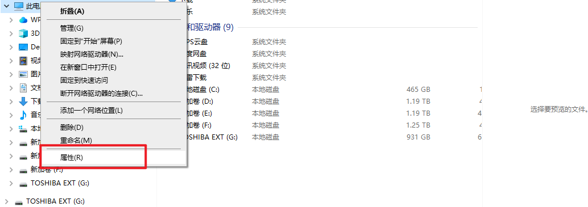
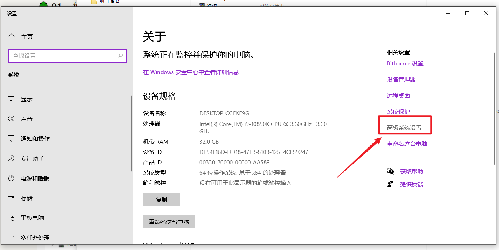

# 01、环境隔离


## 01、概述

正规的流程：开发环境（开人员）—————–测试环境（测试人员（功能测试，压测指标，服务参数））——-预发布环境（运维人员）—————生成环境

在前面发布的go项目。在发布过程中我们环境一般来说会分为开发环境、测试环境、和生产环境，不同环境都自己的配置信息，如果在项目我们都共用一个配置文件的话，可能会造成开发环境、测试环境、生产环境。三个环境的配置不不断的切换和变更。

比如：我们项目里其实就提供一个`application.yml`配置文件

开发环境：

```yaml
# 服务端口的配置
server:
  port: 8990
  context: /
# 数据库配置
# "root:mkxiaoer@tcp(127.0.0.1:3306)/ksd-social-db?charset=utf8&parseTime=True&loc=Local", // DSN data source name
database:
  mysql:
    host: 127.0.0.1
    port: 3306
    dbname: kva-admin-db
    username: root
    password: mkxiaoer
    config: charset=utf8&parseTime=True&loc=Local
# nosql数据的配置
nosql:
  redis:
    host: 127.0.0.1:6379
    password: 
    db: 0
  es:
    host: 127.0.0.1
    port: 9300
    password: 456
```

使用viper来进行解析的和生效的。

发布的流程：

- 修改application.yaml的配置信息改成测试环境或者生产环境
- 然后使用go build打包
- 然后把可执行文件放入到服务器
- 然后启动或者集群启动即可。

如果这个时候发布完了。我要继续开发。你必须要生产环境的配置改成开发环境配置，你才能够正常开发。所以这种使用单配置文件来属性的标记注释切换，是非常麻烦和不推荐的。假设我们能够实现可以通过环境的方式来加载他们对应的配置文件那么不完美了么？


## 02、根据环境来隔离配置信息

- 开发环境 development 简化的名字：application-dev.yaml

```yaml
# 服务端口的配置
server:
  port: 8990
  context: /
# 数据库配置
# "root:mkxiaoer@tcp(127.0.0.1:3306)/ksd-social-db?charset=utf8&parseTime=True&loc=Local", // DSN data source name
database:
  mysql:
    host: 127.0.0.1
    port: 3306
    dbname: kva-admin-db
    username: root
    password: mkxiaoer
    config: charset=utf8&parseTime=True&loc=Local
# nosql数据的配置
nosql:
  redis:
    host: 127.0.0.1:6379
    password:
    db: 0
  es:
    host: 127.0.0.1
    port: 9300
    password: 456
```

- 测试环境 test ：简化的名字：application-test.yaml

```yaml
# 服务端口的配置
server:
  port: 8991
  context: /
# 数据库配置
# "root:mkxiaoer@tcp(127.0.0.1:3306)/ksd-social-db?charset=utf8&parseTime=True&loc=Local", // DSN data source name
database:
  mysql:
    host: 127.0.0.1
    port: 3306
    dbname: kva-admin-db
    username: root
    password: mkxiaoer
    config: charset=utf8&parseTime=True&loc=Local
# nosql数据的配置
nosql:
  redis:
    host: 127.0.0.1:6379
    password: mkxiaoer1986.
    db: 0
  es:
    host: 127.0.0.1
    port: 9300
    password: 456
```

- 生成环境 production生产环境：简化的名字：application-prod.yaml

```yaml
# 服务端口的配置
server:
  port: 8992
  context: /
# 数据库配置
# "root:mkxiaoer@tcp(127.0.0.1:3306)/ksd-social-db?charset=utf8&parseTime=True&loc=Local", // DSN data source name
database:
  mysql:
    host: 127.0.0.1
    port: 3306
    dbname: kva-admin-db
    username: root
    password: mkxiaoer
    config: charset=utf8&parseTime=True&loc=Local
# nosql数据的配置
nosql:
  redis:
    host: 127.0.0.1:6379
    password: mkxiaoer1986.
    db: 0
  es:
    host: 127.0.0.1
    port: 9300
    password: 456
```


## 03、使用viper进行环境配置文件的加载


```go
package initilization

import (
	"fmt"
	"github.com/fsnotify/fsnotify"
	"github.com/spf13/viper"
	"os"
	"xkginweb/global"
)

func GetEnvInfo(env string) string {
	viper.AutomaticEnv()
	return viper.GetString(env)
}

func InitViper() {
	//获取项目的执行路径
	path, err := os.Getwd()
	if err != nil {
		panic(err)
	}
	config := viper.New()
	//config.AddConfigPath(path + "/conf") //设置读取的文件路径
	//config.SetConfigName("application")  //设置读取的文件名
	//config.SetConfigType("yaml")         //设置文件的类型
	//logs.Info("你激活的环境是：" + GetEnvInfo("env"))
	config.SetConfigFile(path + "/conf/application-dev.yaml") // 修改不同的配置文件来实现不同的配置
	//尝试进行配置读取
	if err := config.ReadInConfig(); err != nil {
		panic(err)
	}

	config.WatchConfig()
	config.OnConfigChange(func(e fsnotify.Event) {
		fmt.Println("config file changed:", e.Name)
		if err = config.Unmarshal(&global.Config); err != nil {
			fmt.Println(err)
		}
	})

	// 这里才是把yaml配置文件解析放入到Config对象的过程---map---config
	if err = config.Unmarshal(&global.Config); err != nil {
		fmt.Println(err)
	}

	// 打印文件读取出来的内容:
	keys := config.AllKeys()
	dataMap := make(map[string]interface{})
	for _, key := range keys {
		fmt.Println("yaml存在的key是: " + key)
		dataMap[key] = config.Get(key)
	}

	global.Yaml = dataMap

}

```

通过修改`InitViper` 然后不停的修改配置文件的环境，就得到不同环境的切换，这样解决在一个文件中来回注释切换的问题了。


# go程序去读取环境变量

在大部分的程序中，都可以读取到系统中设定环境变量的参数信息。通过参数系统你可以设定一些初始化值，可以让未来可执行程序不用把代码写死，而是直接通过环境变量的方式来进行配置。但是配置程序就必须有方案或者库区读取。

假设：环境变量配置的加载

1：如果我在系统环境变量设置一个env=prod

2:  go同os组件读取环境变量

3：然后在viper把读取到环境变量进行拼接

4：这样未来我们只需要去更改系统环境变量了。

就不需要在代码切换，更何况如果我们go build打包以后生成的可执行文件根本就不可以更改。如果更改就必须改源码在在打包。


## 01、如何在系统环境中设置参数呢?


#### windows

- 【我的电脑】–【属性】






然后使用代码读取即可

```go
package main

import (
	"fmt"
	"os"
)

func main() {

	//1:go程序去读取环境变量
	fmt.Println("ok")
	path := os.Getenv("GOPATH")
	root := os.Getenv("GOROOT")
	pathext := os.Getenv("PATHEXT")
	goenv := os.Getenv("goenv")
	fmt.Println(path)
	fmt.Println(root)
	fmt.Println(pathext)
	fmt.Println(goenv)

	//2:go程序去读取命令行参数
}

```

你可以在环境变量中自己定义一个属性比如：goenv = dev  ，如下：


==这个你去运行main.go发现读取不出来，是不是没生效，其实不是，你可以把golang工具全部关闭，然后重启，你会发现就读取到了。那就说明开发工具golang对环境变量进行缓存。所以你第一次读取不得原因也就在这里。当然如果你发布生产是不会有这种问题。==

（注意我们的linux是没有安装golang的开发环境的，所以是没有对环境变量进行缓存的哦）

## idea/golang开发工具如何配置环境变量

首先为什么开发工具要自己去同步缓存一份环境变量呢，==其实就告诉不要轻易在电脑中系统环境中去增加业务的属性，而是在开发工具去增加，这样也可以业务的属性增加和系统里进行分离。防止污染！==

如何完成在开发工具中去增加呢？

1：新建一个main.go，执行一下

2：然后找到main.go的执行编辑配置


3: 然后增加业务级别的环境配置参数


## 03、方式一：使用golang的环境配置读取环境变量参数

1： 定义读取的方法

```go
func GetEnvInfo(env string) string {
	viper.AutomaticEnv()
	return viper.GetString(env)
}

```

2: 在代码进行环境变量的配置


3: 根据环境来加载配配置信息

```go
package initilization

import (
	"fmt"
	"ginWeb/global"
	"github.com/fsnotify/fsnotify"
	"github.com/spf13/viper"
	"os"
)

func GetEnvInfo(env string) string { // -------- 新增代码
	viper.AutomaticEnv()
	return viper.GetString(env)
}

func InitViper() {
	//获取项目的执行路径
	path, err := os.Getwd()
	if err != nil {
		panic(err)
	}
	config := viper.New()
	//config.AddConfigPath(path + "/conf") //设置读取的文件路径
	//config.SetConfigName("application")  //设置读取的文件名
	//config.SetConfigType("yaml")         //设置文件的类型
	//config.SetConfigFile(path + "/conf/application-dev.yaml")
	fmt.Println("你激活的环境是：" + GetEnvInfo("env"))
	config.SetConfigFile(path + "/conf/application-" + GetEnvInfo("env") + ".yaml") // -------- 新增代码

	//尝试进行配置读取
	if err := config.ReadInConfig(); err != nil {
		panic(err)
	}

	config.WatchConfig()
	config.OnConfigChange(func(e fsnotify.Event) {
		fmt.Println("config file changed:", e.Name)
		if err = config.Unmarshal(&global.Config); err != nil {
			fmt.Println(err)
		}
	})

	// 这里才是把yaml配置文件解析放入到Config对象的过程---map---config
	if err = config.Unmarshal(&global.Config); err != nil {
		fmt.Println(err)
	}

	// 打印文件读取出来的内容:
	keys := config.AllKeys()
	dataMap := make(map[string]interface{})
	for _, key := range keys {
		fmt.Println("yaml存在的key是: " + key)
		dataMap[key] = config.Get(key)
	}

	global.Yaml = dataMap
}
```

然后运行

你在配置里不切换不同环境。你就可以看到不同环境的文件加载。


## 04、方式2：使用代码的方式完成环境变量参数设置

```go
package main

import (
	"github.com/spf13/viper"
	"xkginweb/initilization"
)

func main() {
	//// 设置环境变量
	viper.SetDefault("env", "prod")//修改这里即可
	// 解析配置文件
	initilization.InitViper()
	// 初始化日志 开发的时候建议设置成：debug ，发布的时候建议设置成：info/error
	// info --- console + file
	// error -- file
	initilization.InitLogger("debug")
	// 初始化中间 redis/mysql/mongodb
	initilization.InitMySQL()
	// 初始化缓存
	//initilization.InitRedis()
	// 初始化本地缓存
	initilization.InitCache()
	// 定时器
	// 并发问题解决方案
	// 异步编程
	// 初始化路由
	initilization.RunServer()
}

```

这样就替换golang的启动配置配置环境变量。更方便一些。


# 命令行参数的价值和意义（推进）

## 1：分析

通过上面你会发现可==设置参数到环境变量中==，然后通过os/viper提供的方法可以读取环境变量的参数，然后让程序代码可以跟随你设置环境变量的参数来加载不同的配置文件信息。确实可以解决加载不同环境的目录

但是同时也增加一个问题：你可能会把系统环境参数搞得乱七八糟。甚至搞坏。因为在真正得服务器上肯定没有golang项目环境配置隔离机制。在服务器上设定得环境变量参数都是共享得。

## 2：假设

如果我打了一个包，并且可以随时在启动可执行文件得时候来覆盖代码中变量参数，那么不完美么？

1：在代码我们先设定一个参数值，并且给默认值

```sh
viper.SetDefault("env", "prod")
```

2：如果在启动时候，增加一个参数，就默认值覆盖掉

```sh
# 使用默认值进行启动
./xinginweb
# 使用指定环境得方式进行启动
./xinginweb --env=test --xxxx=bbbb
```

```go
env := getEnv("env","dev") 第一个参数：env 是key名字，第二参数是：默认值
viper.SetDefault("env", env)
```

3：那么完美了


## 03、实现步骤

1:  使用flag组件

```go
package main

import (
	"flag"
	"fmt"
)

func main() {

	//2:go程序去读取命令行参数
	// --goenv=test
	var env string
	// 默认 --goenv=dev
	flag.StringVar(&env, "goenv", "dev", "环境标识")
    // 注意解析得在上面设置之后的哦
	flag.Parse() 
	fmt.Println(env)
}

```


上面代码得含义是指：如果未来我执行exe文件或者linux得可执行文件得时候，如果携带命令行参数，就会生效，如何指定呢？

```sh
./xkginweb.exe
./xkginweb
如果不指定：就使用默认值dev赋值给env这个变量

./xkginweb.exe --goenv=test
./xkginweb --goenv=prod
如果指定：就使用goenv指定值覆盖默认值，然后赋值给env这个变量
```

## 2：疑问

1：我怎么把上面得代码测试出来呢。难道为了学习就打个包。其实不需要，在golang开发工具下又一个配置也完成命令行参数得设定。


支持得写法如下：

通过以上两种方法定义命令行flag参数后，需要通过调用flag.Parse()来对命令行参数进行解析。
支持的命令行参数格式有一下几种：

- -flag xxx (使用空格，一个 - 符号）
- --flag xxx (使用空格，两个 - 符号)
- -flag=xxx （使用等号， 一个 - 符号）
- --flag = xxx (使用等号， 两个- 符号)

其中，布尔类型的参数必须用等号的方式指定。
flag在解析第一个非flag参数之前停止，或者在终止符"-"之后停止。


完整代码

```go
package main
import (
    "fmt"
    "flag"
    "time"
)
func main(){
    var name string
    var age int
    var married bool
    var delay time.Duration
    flag.StringVar(&name,"name","张三","姓名")
    flag.IntVar(&age,"age",18,"年龄")
    flag.BoolVar(&married,"married",false,"婚否")
    flag.DurationVar(&delay, "d", 0, "延迟的时间间隔")
    flag.Parse()
    fmt.Println(name,age,married,delay)
    fmt.Println(flag.Args())
    fmt.Println(flag.NArg())
    fmt.Println(flag.NFlag())

}
```

参考网站：https://studygolang.com/articles/20370


完整得代码


## 小结

os这个组件库，即可用读取到环境变量参数，也读取命令行参数


